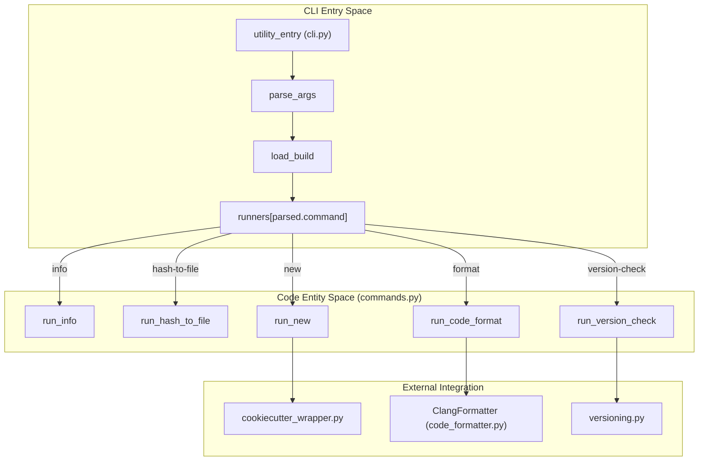
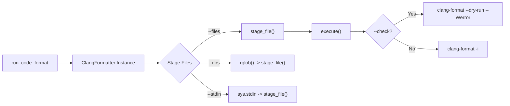

# Page: Utility Commands: info, hash-to-file, new, format, version-check

# Utility Commands: info, hash-to-file, new, format, version-check

Relevant source files

The following files were used as context for generating this wiki page:

- [src/fprime/fpp/cli.py](src/fprime/fpp/cli.py)
- [src/fprime/fpp/common.py](src/fprime/fpp/common.py)
- [src/fprime/fpp/visualize.py](src/fprime/fpp/visualize.py)
- [src/fprime/util/cli.py](src/fprime/util/cli.py)
- [src/fprime/util/code_formatter.py](src/fprime/util/code_formatter.py)
- [src/fprime/util/commands.py](src/fprime/util/commands.py)
- [src/fprime/util/file_util.py](src/fprime/util/file_util.py)
- [src/fprime/util/help_text.py](src/fprime/util/help_text.py)
- [src/fprime/util/versioning.py](src/fprime/util/versioning.py)
- [test/fprime/fbuild/test_new_deployment.py](test/fprime/fbuild/test_new_deployment.py)
- [test/fprime/util/commands_unit_test.py](test/fprime/util/commands_unit_test.py)
- [test/fprime/util/test_file_util.py](test/fprime/util/test_file_util.py)

The `fprime-util` command-line interface provides several utility commands that facilitate build introspection, project scaffolding, code maintenance, and environment diagnostics. These commands are dispatched by the `utility_entry` function in `src/fprime/util/cli.py` [src/fprime/util/cli.py:32-46](). Unlike build-heavy commands like `generate` or `build`, several of these utilities can bypass full build cache validation to improve performance [src/fprime/util/cli.py:69-81]().

## Command Dispatch Architecture

The utility commands are registered via `add_special_parsers` and mapped to specific runner functions defined in `src/fprime/util/commands.py`.

### Utility Command Registration and Flow
The following diagram illustrates how the CLI entry point dispatches to the various utility runners.

**Title: Utility Command Dispatch Pipeline**

**Sources:** [src/fprime/util/cli.py:32-46](), [src/fprime/util/commands.py:1-12]()

---

## Build Introspection: `run_info`

The `info` command provides a summary of the current build context, including available targets and build artifact locations [src/fprime/util/commands.py:35-49]().

### Implementation Details
- **Build Discovery**: It uses `Build.get_build_list` to iterate through all generated build types (e.g., native, cross-compiled, UT) [src/fprime/util/commands.py:57-57]().
- **Target Aggregation**: It harvests `local_targets` and `global_targets` from each build object's information block [src/fprime/util/commands.py:58-65]().
- **Artifact Mapping**: It identifies the `auto_location` (where binaries are placed) and the `build_dir` (the CMake cache directory) for every discovered build [src/fprime/util/commands.py:66-73]().

**Sources:** [src/fprime/util/commands.py:35-101]()

---

## Hash Lookup: `run_hash_to_file`

The `hash-to-file` command maps a 32-bit F´ assertion or telemetry hash back to the source file and line number where it was defined [src/fprime/util/commands.py:103-114]().

### Data Flow
1. **Input**: A hexadecimal or integer hash value [src/fprime/util/cli.py:105-109]().
2. **Lookup**: The command calls `build.find_hashed_file(parsed.hash)` [src/fprime/util/commands.py:115-115]().
3. **Source**: This looks into the `hashes.txt` file generated by the F´ build system inside the build cache [src/fprime/util/commands.py:115-120]().
4. **Output**: Prints the associated file path and line metadata [src/fprime/util/commands.py:121-124]().

**Sources:** [src/fprime/util/commands.py:103-125](), [src/fprime/util/cli.py:97-110]()

---

## Project Scaffolding: `run_new`

The `new` command acts as a dispatcher for the F´ cookiecutter scaffolding system. It allows users to create new architectural units within a project [src/fprime/util/commands.py:126-148]().

| Target | Function Called | Description |
| :--- | :--- | :--- |
| `--component` | `new_component` | Creates a new F´ component (Active, Passive, or Queued) |
| `--deployment` | `new_deployment` | Creates a new deployment (top-level binary project) |
| `--module` | `new_module` | Creates a standard C++ module |
| `--subtopology` | `new_subtopology` | Creates a reusable FPP subtopology |

**Sources:** [src/fprime/util/commands.py:138-145](), [src/fprime/util/cli.py:137-194]()

---

## Code Formatting: `run_code_format`

The `format` command provides a standardized wrapper around `clang-format`. It ensures that C++ code adheres to the project's `.clang-format` specification [src/fprime/util/commands.py:151-166]().

### ClangFormatter Class
The logic is encapsulated in the `ClangFormatter` class, which inherits from `ExecutableAction` [src/fprime/util/code_formatter.py:32-35]().

- **Style Resolution**: It automatically locates the `.clang-format` file by looking in the `framework_path` defined in `settings.ini` [src/fprime/util/commands.py:174-178]().
- **File Staging**: Files can be staged for formatting via direct file paths, directory recursion (`rglob`), or through `stdin` [src/fprime/util/commands.py:189-203]().
- **Validation**: By default, it only processes files with C/C++ extensions (`.cpp`, `.hpp`, `.c`, etc.) unless the `--force` flag is used [src/fprime/util/code_formatter.py:18-29](), [src/fprime/util/code_formatter.py:65-73]().
- **Execution**: It runs `clang-format -i --style=file` via `subprocess.run` [src/fprime/util/code_formatter.py:118-135]().

**Title: ClangFormatter Logic Flow**

**Sources:** [src/fprime/util/commands.py:151-213](), [src/fprime/util/code_formatter.py:32-135]()

---

## Environment Diagnostics: `run_version_check`

The `version-check` command is used for debugging the developer environment by printing the versions of installed F´ tools and their dependencies [src/fprime/util/commands.py:216-231]().

### Diagnostic Features
- **FPRIME_PIP_PACKAGES**: It checks for `fprime-tools`, `fprime-gds`, and `fprime-fpp` using `pkg_resources` [src/fprime/util/versioning.py:13-17](), [src/fprime/util/commands.py:235-238]().
- **System Info**: Reports the current OS, Python version, and executable path [src/fprime/util/commands.py:220-226]().
- **Submodule Tracking**: If git is available, it can list the current branch and hash of the F´ framework and (optionally) all submodules [src/fprime/util/commands.py:246-271]().

**Sources:** [src/fprime/util/commands.py:216-275](), [src/fprime/util/versioning.py:1-50]()
