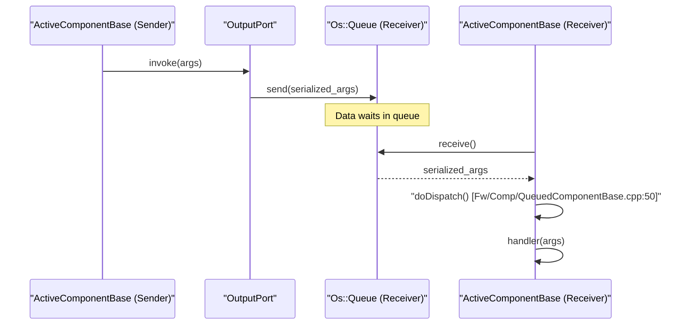

# Page: Architecture and Core Concepts

# Architecture and Core Concepts

<details>
<summary>Relevant source files</summary>

The following files were used as context for generating this wiki page:

- [.github/actions/spelling/README.md](.github/actions/spelling/README.md)
- [.pre-commit-config.yaml](.pre-commit-config.yaml)
- [Fpp/ToCpp.fpp](Fpp/ToCpp.fpp)
- [Fw/Comp/ActiveComponentBase.cpp](Fw/Comp/ActiveComponentBase.cpp)
- [Fw/Comp/ActiveComponentBase.hpp](Fw/Comp/ActiveComponentBase.hpp)
- [Fw/Comp/PassiveComponentBase.cpp](Fw/Comp/PassiveComponentBase.cpp)
- [Fw/Comp/PassiveComponentBase.hpp](Fw/Comp/PassiveComponentBase.hpp)
- [Fw/Comp/QueuedComponentBase.cpp](Fw/Comp/QueuedComponentBase.cpp)
- [Fw/Comp/QueuedComponentBase.hpp](Fw/Comp/QueuedComponentBase.hpp)
- [Fw/Fpy/StatementArgBuffer.hpp](Fw/Fpy/StatementArgBuffer.hpp)
- [Fw/Log/test/ut/LogTest.cpp](Fw/Log/test/ut/LogTest.cpp)
- [Fw/Obj/ObjBase.cpp](Fw/Obj/ObjBase.cpp)
- [Fw/Obj/SimpleObjRegistry.cpp](Fw/Obj/SimpleObjRegistry.cpp)
- [Fw/Port/InputPortBase.cpp](Fw/Port/InputPortBase.cpp)
- [Fw/Port/InputSerializePort.cpp](Fw/Port/InputSerializePort.cpp)
- [Fw/Port/OutputPortBase.cpp](Fw/Port/OutputPortBase.cpp)
- [Fw/Port/OutputSerializePort.cpp](Fw/Port/OutputSerializePort.cpp)
- [Fw/SerializableFile/SerializableFile.cpp](Fw/SerializableFile/SerializableFile.cpp)
- [Fw/SerializableFile/SerializableFile.hpp](Fw/SerializableFile/SerializableFile.hpp)
- [Fw/Tlm/TlmBuffer.hpp](Fw/Tlm/TlmBuffer.hpp)
- [Fw/Tlm/TlmPacket.hpp](Fw/Tlm/TlmPacket.hpp)
- [Fw/Tlm/test/ut/TlmTest.cpp](Fw/Tlm/test/ut/TlmTest.cpp)
- [Fw/Types/CAssert.h](Fw/Types/CAssert.h)
- [Fw/Types/test/ut/CAssertTest.cpp](Fw/Types/test/ut/CAssertTest.cpp)
- [Os/docs/sdd.md](Os/docs/sdd.md)
- [README.md](README.md)
- [Ref/README.md](Ref/README.md)
- [Ref/docs/TestCases.txt](Ref/docs/TestCases.txt)
- [Ref/docs/sdd.md](Ref/docs/sdd.md)
- [Svc/Ccsds/TmFramer/TmFramer.hpp](Svc/Ccsds/TmFramer/TmFramer.hpp)
- [cmake/test/data/test-fprime-library/TestLibrary/TestComponent/TestComponent.cpp](cmake/test/data/test-fprime-library/TestLibrary/TestComponent/TestComponent.cpp)
- [cmake/test/data/test-fprime-library/TestLibrary/TestComponent/TestComponent.hpp](cmake/test/data/test-fprime-library/TestLibrary/TestComponent/TestComponent.hpp)
- [cmake/test/data/test-fprime-library2/TestLibrary2/TestComponent/TestComponent.cpp](cmake/test/data/test-fprime-library2/TestLibrary2/TestComponent/TestComponent.cpp)
- [cmake/test/data/test-fprime-library2/TestLibrary2/TestComponent/TestComponent.hpp](cmake/test/data/test-fprime-library2/TestLibrary2/TestComponent/TestComponent.hpp)
- [docs/INSTALL.md](docs/INSTALL.md)
- [docs/how-to/develop-fprime-libraries.md](docs/how-to/develop-fprime-libraries.md)
- [docs/how-to/implement-osal.md](docs/how-to/implement-osal.md)
- [docs/how-to/porting-guide.md](docs/how-to/porting-guide.md)
- [docs/img/fprime-logo.png](docs/img/fprime-logo.png)
- [docs/img/fprime-logo.svg](docs/img/fprime-logo.svg)
- [docs/index.md](docs/index.md)
- [docs/reference/index.md](docs/reference/index.md)
- [docs/user-manual/framework/assert.md](docs/user-manual/framework/assert.md)
- [docs/user-manual/gds/gds-cli.md](docs/user-manual/gds/gds-cli.md)
- [docs/user-manual/gds/seqgen.md](docs/user-manual/gds/seqgen.md)
- [docs/user-manual/overview/development-practice.md](docs/user-manual/overview/development-practice.md)
- [docs/user-manual/overview/source-tree.md](docs/user-manual/overview/source-tree.md)

</details>


F´ (F Prime) is a component-driven framework designed for the rapid development and deployment of spaceflight and embedded software applications [README.md:7-14](). The architecture is built on the principle of decomposing complex flight software into discrete, reusable functional units called **Components**, which communicate through well-defined interfaces known as **Ports** [README.md:14-15]().

## 1. Component-Driven Design

The fundamental building block in F´ is the component. Components encapsulate specific functionality (e.g., a driver for a radio, a thermal control algorithm, or a file manager) and hide their internal implementation from the rest of the system.

### Component Types
Components are categorized by how they achieve execution and manage concurrency:

| Component Type | Base Class | Execution Model | Internal Queue |
| :--- | :--- | :--- | :--- |
| **Passive** | `Fw::PassiveComponentBase` | Executes on the thread of the caller (synchronous). | No |
| **Queued** | `Fw::QueuedComponentBase` | Stores incoming messages in a queue; processed when triggered. | Yes |
| **Active** | `Fw::ActiveComponentBase` | Owns a dedicated thread; processes messages from its own queue. | Yes |

### Implementation Details
- **Passive Components**: These are the simplest form, inheriting from `Fw::PassiveComponentBase` [Fw/Comp/PassiveComponentBase.hpp:10-10](). They provide immediate execution for any port call and can store an instance ID [Fw/Comp/PassiveComponentBase.cpp:37-40]().
- **Queued Components**: Inherit from `Fw::QueuedComponentBase` [Fw/Comp/QueuedComponentBase.hpp:20-20](). They contain an `Os::Queue` to store incoming port data [Fw/Comp/QueuedComponentBase.hpp:35-35](). They require an external trigger (like a `Sched` port) to call `dispatchAvailableMessages()` to process the queue [Fw/Comp/QueuedComponentBase.cpp:46-56]().
- **Active Components**: Inherit from `Fw::ActiveComponentBase` [Fw/Comp/ActiveComponentBase.cpp:21-21](). Upon calling `start()`, they spawn an `Os::Task` [Fw/Comp/ActiveComponentBase.cpp:35-52](). The task runs a loop (`s_taskLoop`) that continuously dispatches messages from the internal queue [Fw/Comp/ActiveComponentBase.cpp:106-114]().

### Component Lifecycle State Machine
Active components manage their thread through a lifecycle state machine implemented in `s_taskStateMachine` [Fw/Comp/ActiveComponentBase.cpp:69-104]().

```mermaid
graph TD
    "Lifecycle::CREATED"["Lifecycle::CREATED"] --> |"preamble()"| "Lifecycle::DISPATCHING"["Lifecycle::DISPATCHING"]
    "Lifecycle::DISPATCHING" --> |"dispatch()"| "Lifecycle::DISPATCHING"
    "Lifecycle::DISPATCHING" --> |"ACTIVE_COMPONENT_EXIT"| "Lifecycle::FINALIZING"["Lifecycle::FINALIZING"]
    "Lifecycle::FINALIZING" --> |"finalizer()"| "Lifecycle::DONE"["Lifecycle::DONE"]

    subgraph "Fw/Comp/ActiveComponentBase.cpp"
        "s_taskStateMachine[Line 69]"
        "doDispatch[Line 121]"
        "s_taskLoop[Line 106]"
    end
```
Sources: [Fw/Comp/ActiveComponentBase.cpp:69-114](), [Fw/Comp/ActiveComponentBase.cpp:116-122]()

## 2. Ports and Communication

Ports are the interfaces through which components interact. A port represents a specific function signature (arguments and return type).

### Port Types
F´ supports three primary invocation semantics for ports:

1.  **Synchronous**: The caller invokes the port and waits for the callee to finish execution. This is standard for `Passive` components.
2.  **Asynchronous**: The caller sends data to the callee's queue and returns immediately. The callee processes the data later on its own thread. This is used with `Active` or `Queued` components.
3.  **Guarded**: Similar to synchronous, but the framework automatically wraps the call in a mutex to ensure thread safety when multiple threads access a single passive component.

### Data Flow Implementation
The `Fw::PortBase` classes handle the connection logic.
- **Input Ports**: Receive data. In active components, the generated code for an input port serializes the arguments and pushes them into the component's `m_queue` [Fw/Comp/QueuedComponentBase.hpp:35-35]().
- **Output Ports**: Send data. They hold a pointer to the connected input port [Fw/Port/OutputPortBase.cpp]().


Sources: [Fw/Comp/ActiveComponentBase.cpp:116-122](), [Fw/Comp/QueuedComponentBase.cpp:46-56]()

## 3. Data Constructs

F´ standardizes how data is moved and recorded through four primary constructs:

*   **Commands (`Cmd`)**: Instructions sent from the ground or a sequencer to a component. Components register opcodes [Fw/Comp/PassiveComponentBase.hpp:32-32]() and implement handlers.
*   **Events (`Log`)**: Noteworthy occurrences or errors reported by a component (e.g., "Motor Started", "Sensor Timeout").
*   **Telemetry Channels (`Tlm`)**: Periodic or state-based data variables reported by a component (e.g., "Battery Voltage", "CPU Usage").
*   **Parameters (`Prm`)**: Configurable settings that persist across reboots, stored in a parameter database.

### Serialization
All data passed through ports or recorded as telemetry must be serializable. The `Fw::Serializable` base class defines the interface for converting objects to/from the `Fw::SerializeBufferBase`. The framework provides `Fw::SerializableFile` to handle loading and saving serializable objects to the filesystem [Fw/SerializableFile/SerializableFile.cpp:34-84]().

Sources: [Fw/SerializableFile/SerializableFile.cpp:19-90](), [Fw/Comp/PassiveComponentBase.hpp:32-33]()

## 4. Modeling and Topology

### FPP Modeling Language
F´ uses the **FPP (F Prime Prime)** modeling language to define the system structure. FPP allows developers to:
- Define data types (structs, enums, arrays).
- Define port signatures.
- Define component interfaces (ports, commands, telemetry).
- Define **Topologies**: the "wiring diagram" that connects component instances.

### Topology Composition
A topology is a collection of component instances and the connections between their ports. In a deployment (like `Ref`), the topology is defined in `.fpp` files and translated into C++ code that instantiates the components. The FPP-to-C++ translation covers various phases of the system lifecycle, including initialization, command registration, and task startup [Fpp/ToCpp.fpp:5-19]().

```mermaid
graph LR
    subgraph "Topology Composition (Logical)"
        "RateGroupDriver" -- "CycleOut" --> "ActiveRateGroup"
        "ActiveRateGroup" -- "RateGroupMemberOut" --> "CommandDispatcher"
        "CommandDispatcher" -- "CmdSend" --> "MathComponent"
    end

    subgraph "Code Entities (Implementation)"
        "Fw::ObjBase[Fw/Obj/ObjBase.cpp]"
        "Fw::PassiveComponentBase[Fw/Comp/PassiveComponentBase.cpp]"
        "Fw::ActiveComponentBase[Fw/Comp/ActiveComponentBase.cpp]"
    end
```
Sources: [Ref/README.md:34-40](), [Fpp/ToCpp.fpp:5-19](), [README.md:14-18]()

## 5. Deployment Lifecycle
The FPP modeling tool generates code that orchestrates the system through specific phases [Fpp/ToCpp.fpp:5-19]():
1. **initComponents**: Calling `init()` on all component instances [Fw/Comp/PassiveComponentBase.cpp:37-40]().
2. **regCommands**: Registering command opcodes with the dispatcher.
3. **loadParameters**: Retrieving saved parameters from the database.
4. **startTasks**: Spawning threads for all active components via `start()` [Fw/Comp/ActiveComponentBase.cpp:35-52]().
5. **tearDownComponents**: Cleaning up resources via `deinit()` [Fw/Comp/QueuedComponentBase.cpp:18-20]().

Sources: [Fpp/ToCpp.fpp:5-19](), [Fw/Comp/ActiveComponentBase.cpp:35-52](), [Fw/Comp/QueuedComponentBase.cpp:18-20]()
