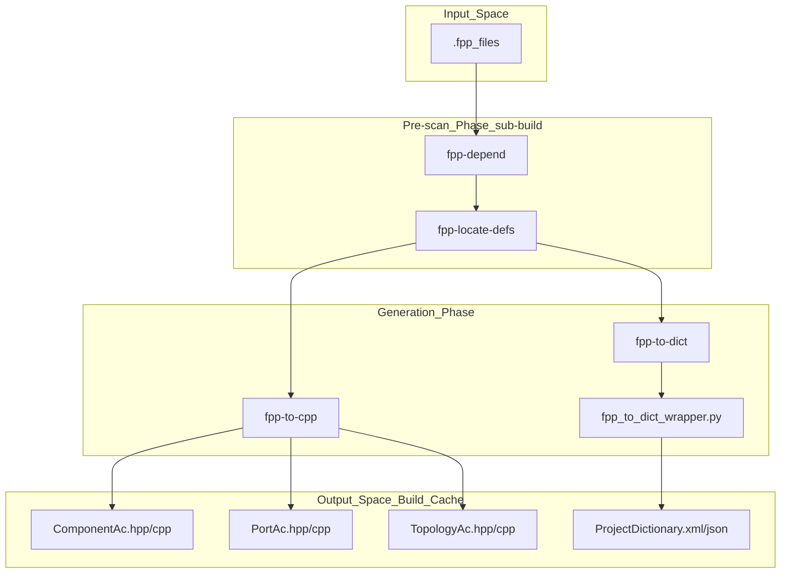
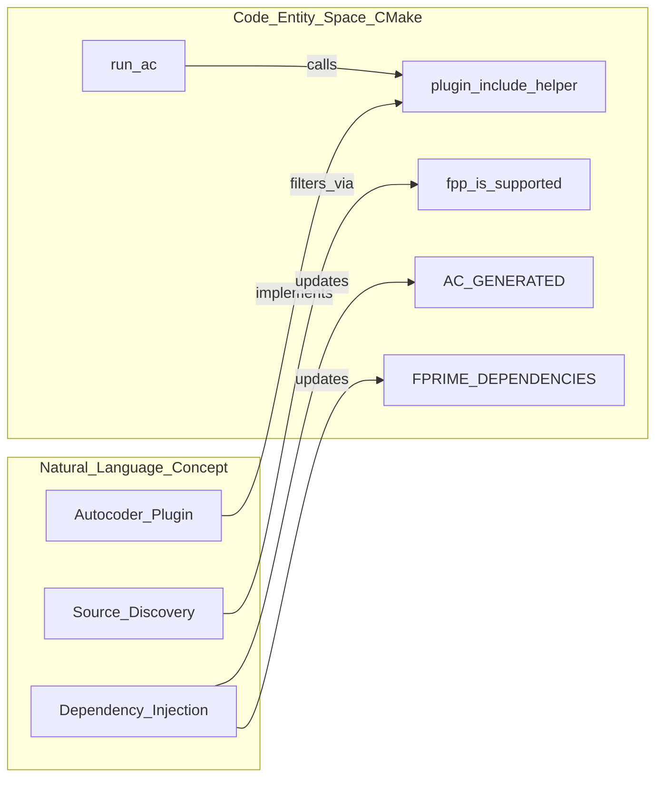

# Page: Autocoding Pipeline (FPP and AI-XML)

# Autocoding Pipeline (FPP and AI-XML)

Relevant source files

The following files were used as context for generating this wiki page:

- [Svc/CmdDispatcher/CMakeLists.txt](Svc/CmdDispatcher/CMakeLists.txt)
- [cmake/API.cmake](cmake/API.cmake)
- [cmake/FPrime-Code.cmake](cmake/FPrime-Code.cmake)
- [cmake/FPrime.cmake](cmake/FPrime.cmake)
- [cmake/autocoder/autocoder.cmake](cmake/autocoder/autocoder.cmake)
- [cmake/autocoder/fpp.cmake](cmake/autocoder/fpp.cmake)
- [cmake/autocoder/fpp_ut.cmake](cmake/autocoder/fpp_ut.cmake)
- [cmake/autocoder/helpers.cmake](cmake/autocoder/helpers.cmake)
- [cmake/module.cmake](cmake/module.cmake)
- [cmake/options.cmake](cmake/options.cmake)
- [cmake/platform/platform.cmake](cmake/platform/platform.cmake)
- [cmake/sanitizers.cmake](cmake/sanitizers.cmake)
- [cmake/target/build.cmake](cmake/target/build.cmake)
- [cmake/target/install.cmake](cmake/target/install.cmake)
- [cmake/target/target.cmake](cmake/target/target.cmake)
- [cmake/target/ut.cmake](cmake/target/ut.cmake)
- [cmake/test/data/test-fprime-library/cmake/autocoder/test.cmake](cmake/test/data/test-fprime-library/cmake/autocoder/test.cmake)
- [cmake/utilities.cmake](cmake/utilities.cmake)

The F´ autocoding pipeline is a multi-stage system integrated into the CMake build process that transforms modeling files (FPP or legacy AI-XML) into C++ implementation code and ground system dictionaries. The system supports modularity by allowing different autocoders to register themselves and participate in the build graph.

## Pipeline Architecture Overview

The pipeline operates in two primary phases: a **Pre-scan/Sub-build phase** and a **Target Generation phase**. This separation ensures that dependencies between FPP files across different modules are resolved before the main C++ compilation begins.

### Key Components
*   **FPP Autocoder**: The modern modeling suite (fpp-to-cpp, fpp-to-dict, fpp-depend) [cmake/autocoder/fpp.cmake:22]().
*   **Legacy AI-XML Autocoder**: Python-based tools for processing older XML-based component and port definitions.
*   **Autocoder Registry**: A mechanism in `cmake/autocoder/autocoder.cmake` that allows different generators to be registered via `register_fprime_build_autocoder` [cmake/FPrime.cmake:126]().

### Data Flow Diagram: FPP Pipeline
The following diagram illustrates how FPP files move through the tools to become build artifacts.

Title: FPP Autocoding Data Flow

Sources: [cmake/autocoder/fpp.cmake:10-22](), [cmake/autocoder/fpp.cmake:121-160]()

## The FPP Autocoder Implementation

The FPP autocoder is defined in `cmake/autocoder/fpp.cmake`. It wraps the FPP tool suite and integrates with the F´ CMake API.

### Tool Discovery and Validation
The function `locate_fpp_tools` is responsible for finding `FPP_DEPEND`, `FPP_TO_CPP`, `FPP_LOCATE_DEFS`, and `FPP_TO_DICT` on the system path [cmake/autocoder/fpp.cmake:19-32](). It performs a version check against the expected version defined in the framework requirements using `get_expected_tool_version` [cmake/autocoder/fpp.cmake:21-47]().

### Dependency Resolution (`fpp_info`)
Unlike standard C++ files, FPP files require a global view of the model to resolve types and port definitions. The `fpp_info` function:
1.  Runs `fpp-depend` to generate cache files in `${CMAKE_CURRENT_BINARY_DIR}/fpp-cache/` [cmake/autocoder/fpp.cmake:122-132]().
2.  Reads `direct.txt`, `include.txt`, and `generated.txt` to determine what files will be produced and what other modules must be built first [cmake/autocoder/fpp.cmake:135-142]().
3.  Calculates framework dependencies (e.g., `Fw_Types`) using `fpp_get_framework_dependency_helper` [cmake/autocoder/fpp.cmake:85-103]().

### Code Generation (`fpp_setup_autocode`)
The generation is handled by `fpp_setup_autocode`, which creates `add_custom_command` entries for the FPP tools [cmake/autocoder/fpp.cmake:174](). It uses the `-i` flag to provide the list of imported FPP files discovered during the dependency scan [cmake/autocoder/fpp.cmake:114-115]().

Sources: [cmake/autocoder/fpp.cmake:19-63](), [cmake/autocoder/fpp.cmake:121-165]()

## Integration with CMake Targets

The autocoding system is invoked during the registration of F´ modules and unit tests.

### Execution Flow in `build_add_module_target`
When `register_fprime_module()` is called, it eventually triggers `build_add_module_target` [cmake/target/build.cmake:113]().
1.  **Retrieve Autocoders**: It fetches the list of registered autocoders from the global property `FPRIME_AUTOCODER_TARGET_LIST` [cmake/target/build.cmake:114]().
2.  **Run AC Set**: The `run_ac_set` function iterates through each autocoder (e.g., FPP) [cmake/autocoder/autocoder.cmake:28-45]().
3.  **Source Injection**: Generated `.cpp` files are appended to the target's `SOURCES` property, and generated `.hpp` files are made available for inclusion via the `AC_GENERATED` property [cmake/autocoder/autocoder.cmake:56-63]().

### Mapping Code Entities to CMake Functions
The following diagram bridges the high-level autocoding concepts to the specific CMake functions and properties used in the implementation.

Title: Autocoder Implementation Mapping

Sources: [cmake/autocoder/autocoder.cmake:93-98](), [cmake/autocoder/autocoder.cmake:56-63](), [cmake/utilities.cmake:146-148]()

## Sub-build Pre-scan Phase

Because FPP requires a complete model to generate code, F´ uses a "sub-build" mechanism to perform a pre-scan of all FPP files in the project before the main build starts.

1.  **Initialization**: During `fprime_initialize_build_system`, the system checks if it is currently in a sub-build [cmake/FPrime.cmake:162]().
2.  **FPP Scan**: If not, it triggers a sub-build that runs `fpp-depend` across the entire project tree to populate cache files [cmake/autocoder/fpp.cmake:122-132]().
3.  **Cache Consumption**: This populates the `fpp-cache` directories with dependency information that the main build then consumes to parallelize the actual C++ generation [cmake/autocoder/fpp.cmake:126-132]().

## Legacy AI-XML Support

While FPP is the preferred modeling language, the system maintains support for legacy AI-XML files. This is handled by a separate autocoder registered in the pipeline.

| Feature | FPP Autocoder | AI-XML Autocoder (Legacy) |
| :--- | :--- | :--- |
| **Input Files** | `.fpp` [cmake/autocoder/fpp.cmake:72]() | `.xml` (Component, Port, etc.) |
| **Tools** | Scala-based (fpp-to-cpp) [cmake/autocoder/fpp.cmake:22]() | Python-based (codegen.py) |
| **Dependency Handling** | Global scan via `fpp-depend` [cmake/autocoder/fpp.cmake:122]() | Local file-based dependencies |
| **Dictionary Format** | JSON/XML [cmake/autocoder/fpp.cmake:22]() | XML |

Sources: [cmake/autocoder/fpp.cmake:71-73](), [cmake/autocoder/autocoder.cmake:14-17]()

## Unit Test Autocoding (`fpp_ut`)

Unit tests require additional generated code, such as GTest harnesses and "Tester" base classes. This is handled by the `autocoder/fpp_ut` plugin [cmake/target/ut.cmake:108]().

*   **Trigger**: Invoked when `register_fprime_ut()` is called [Svc/CmdDispatcher/CMakeLists.txt:22]().
*   **Artifacts**: Produces `TesterBase.hpp/cpp` and `GTestBase.hpp/cpp` through `ut_executable_build` [cmake/target/ut.cmake:106-120]().
*   **Include Paths**: The system automatically adds `${CMAKE_CURRENT_BINARY_DIR}` to the test target's include path so that the generated harness can be found by the hand-written `Tester.cpp` [cmake/target/ut.cmake:83-96]().

Sources: [cmake/target/ut.cmake:106-120](), [Svc/CmdDispatcher/CMakeLists.txt:17-22]()
