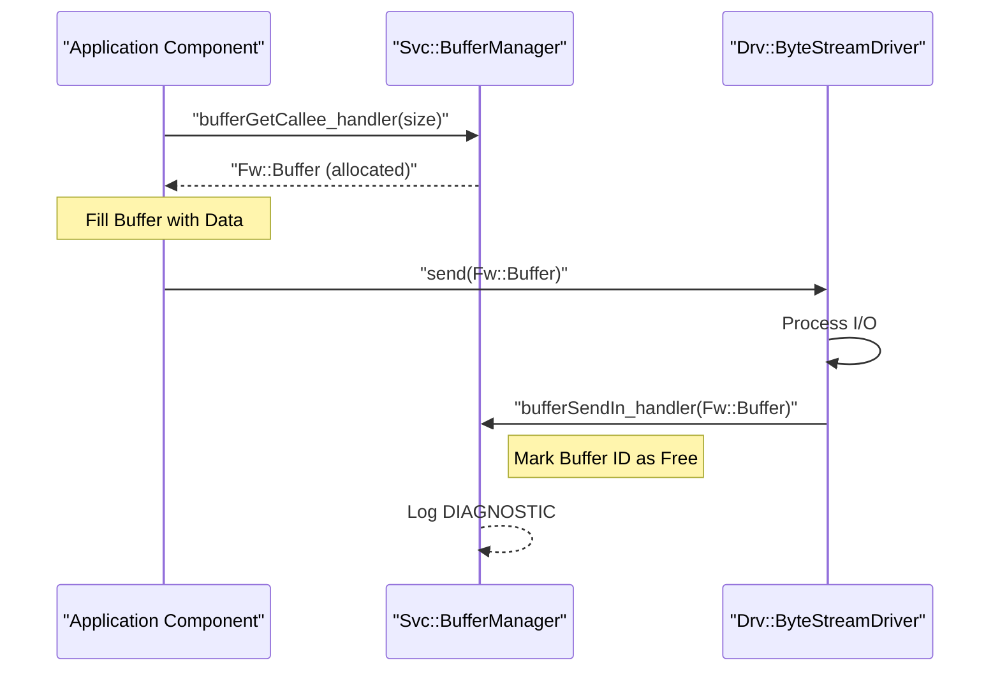
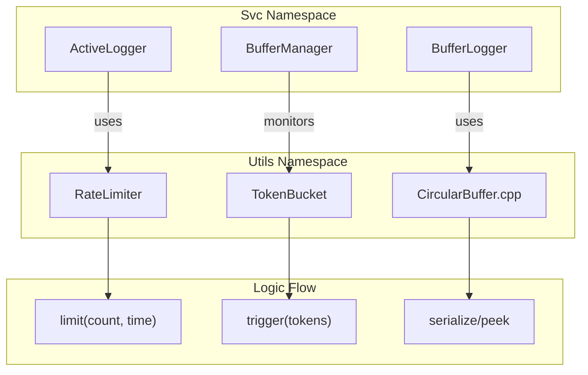

# Page: Buffer and Memory Management

# Buffer and Memory Management

Relevant source files

The following files were used as context for generating this wiki page:

- [Fw/Types/MallocAllocator.cpp](Fw/Types/MallocAllocator.cpp)
- [Fw/Types/MallocAllocator.hpp](Fw/Types/MallocAllocator.hpp)
- [Fw/Types/MemAllocator.cpp](Fw/Types/MemAllocator.cpp)
- [Fw/Types/MemAllocator.hpp](Fw/Types/MemAllocator.hpp)
- [Fw/Types/MmapAllocator.hpp](Fw/Types/MmapAllocator.hpp)
- [Fw/Types/test/ut/MmapAllocatorTest.cpp](Fw/Types/test/ut/MmapAllocatorTest.cpp)
- [STest/STest/Scenario/RandomScenario.hpp](STest/STest/Scenario/RandomScenario.hpp)
- [Svc/BufferAccumulator/ArrayFIFOBuffer.cpp](Svc/BufferAccumulator/ArrayFIFOBuffer.cpp)
- [Svc/BufferAccumulator/BufferAccumulator.cpp](Svc/BufferAccumulator/BufferAccumulator.cpp)
- [Svc/BufferAccumulator/BufferAccumulator.hpp](Svc/BufferAccumulator/BufferAccumulator.hpp)
- [Svc/BufferLogger/BufferLogger.cpp](Svc/BufferLogger/BufferLogger.cpp)
- [Svc/BufferLogger/BufferLogger.hpp](Svc/BufferLogger/BufferLogger.hpp)
- [Svc/BufferLogger/BufferLoggerFile.cpp](Svc/BufferLogger/BufferLoggerFile.cpp)
- [Svc/BufferLogger/test/ut/Errors.cpp](Svc/BufferLogger/test/ut/Errors.cpp)
- [Svc/BufferLogger/test/ut/Errors.hpp](Svc/BufferLogger/test/ut/Errors.hpp)
- [Svc/BufferLogger/test/ut/Logging.cpp](Svc/BufferLogger/test/ut/Logging.cpp)
- [Svc/BufferManager/test/ut/BufferManagerTester.cpp](Svc/BufferManager/test/ut/BufferManagerTester.cpp)
- [Svc/CmdSequencer/Sequence.cpp](Svc/CmdSequencer/Sequence.cpp)
- [Svc/GenericHub/GenericHub.cpp](Svc/GenericHub/GenericHub.cpp)
- [Svc/GenericHub/GenericHub.fpp](Svc/GenericHub/GenericHub.fpp)
- [Svc/GenericHub/GenericHub.hpp](Svc/GenericHub/GenericHub.hpp)
- [Svc/GenericHub/test/ut/GenericHubTestMain.cpp](Svc/GenericHub/test/ut/GenericHubTestMain.cpp)
- [Svc/GenericHub/test/ut/GenericHubTester.cpp](Svc/GenericHub/test/ut/GenericHubTester.cpp)
- [Svc/GenericHub/test/ut/GenericHubTester.hpp](Svc/GenericHub/test/ut/GenericHubTester.hpp)
- [Svc/GenericHub/test/ut/README.md](Svc/GenericHub/test/ut/README.md)
- [Svc/GenericHub/test/ut/img/command_dispatch.svg](Svc/GenericHub/test/ut/img/command_dispatch.svg)
- [Svc/GenericHub/test/ut/img/command_response.svg](Svc/GenericHub/test/ut/img/command_response.svg)
- [Utils/Hash/HashCommon.cpp](Utils/Hash/HashCommon.cpp)
- [Utils/Types/CMakeLists.txt](Utils/Types/CMakeLists.txt)
- [Utils/Types/CircularBuffer.cpp](Utils/Types/CircularBuffer.cpp)
- [Utils/Types/CircularBuffer.hpp](Utils/Types/CircularBuffer.hpp)
- [Utils/Types/Queue.cpp](Utils/Types/Queue.cpp)
- [Utils/Types/Queue.hpp](Utils/Types/Queue.hpp)
- [Utils/Types/test/ut/CircularBuffer/CircularRules.cpp](Utils/Types/test/ut/CircularBuffer/CircularRules.cpp)
- [Utils/Types/test/ut/CircularBuffer/CircularRules.hpp](Utils/Types/test/ut/CircularBuffer/CircularRules.hpp)
- [Utils/Types/test/ut/CircularBuffer/CircularState.cpp](Utils/Types/test/ut/CircularBuffer/CircularState.cpp)
- [Utils/Types/test/ut/CircularBuffer/CircularState.hpp](Utils/Types/test/ut/CircularBuffer/CircularState.hpp)
- [Utils/Types/test/ut/CircularBuffer/Main.cpp](Utils/Types/test/ut/CircularBuffer/Main.cpp)
- [default/config/MemoryAllocation.fpp](default/config/MemoryAllocation.fpp)

Buffer and memory management in F´ provides a robust framework for handling data persistence and transfer without the overhead of frequent deep copies. The system relies on a combination of pool-based allocation (`BufferManager`), standardized memory interfaces (`Fw::MemAllocator`), and specialized components for queuing and distributing data buffers.

## Fw::Buffer: The Primary Data Carrier

The `Fw::Buffer` class is the foundational type for moving variable-length data between components. It is a lightweight wrapper that stores a pointer to a data region, the size of that region, and a context ID used for memory tracking.

### Key Features
- **Zero-Copy Intent**: Designed to pass pointers through ports rather than copying the underlying data.
- **Serialization**: `Fw::Buffer` can serialize itself (pointer, size, and context) to move through ports, but it does not automatically serialize the data it points to.
- **Utility Methods**: Provides `getSerializer()` and `getDeserializer()` to easily wrap the managed memory in a `Fw::ExternalSerializeBuffer` for data manipulation.

### Code Entity Mapping: Buffer Structure
| Member | Type | Purpose |
| --- | --- | --- |
| `m_bufferData` | `U8*` | Pointer to the raw memory |
| `m_size` | `FwSizeType` | Total size of the buffer |
| `m_context` | `U32` | Identifier for the allocator/manager |

Sources: `Fw/Buffer/Buffer.hpp`, `Fw/Buffer/Buffer.cpp`

---

## Memory Allocation Interfaces

F´ abstracts memory allocation through the `Fw::MemAllocator` interface, allowing components to remain agnostic of whether memory comes from the heap, a static pool, or memory-mapped files.

### Fw::MemAllocator
This abstract base class defines the interface for requesting and returning memory blocks [Fw/Types/MemAllocator.hpp:46-132]().
- `allocate(const FwEnumStoreType identifier, FwSizeType& size, bool& recoverable, FwSizeType alignment)`: Requests a block of memory [Fw/Types/MemAllocator.hpp:63-66]().
- `deallocate(const FwEnumStoreType identifier, void* ptr)`: Returns memory to the allocator [Fw/Types/MemAllocator.hpp:75]().
- `checkedAllocate(...)`: A convenience method that asserts if the allocation fails or returns a size smaller than requested [Fw/Types/MemAllocator.hpp:103-106]().

### Standard Implementations
1. **MallocAllocator**: A wrapper around standard C `malloc` and `free`.
2. **MmapAllocator**: Uses the `mmap` system call to back memory with an anonymous memory-mapped region [Fw/Types/MmapAllocator.hpp:33-55](). It tracks allocation sizes in a `RedBlackTreeMap` to facilitate `munmap` during deallocation [Fw/Types/MmapAllocator.hpp:59]().
3. **StaticMemory**: Provides a fixed-size memory region allocated at initialization, preventing runtime fragmentation.

Sources: [Fw/Types/MemAllocator.hpp:46-132](), [Fw/Types/MmapAllocator.hpp:23-117](), [Fw/Types/MallocAllocator.hpp:1-30]()

---

## BufferManager: Pool-Based Allocation

`Svc::BufferManager` is a passive component that manages multiple "bins" of fixed-size buffers. It prevents heap fragmentation by pre-allocating memory using an `Fw::MemAllocator` during initialization.

### Allocation Logic
1. **Request**: A component calls `bufferGetCallee` with a requested size.
2. **Bin Selection**: The manager searches for the smallest bin that satisfies the requested size.
3. **Tracking**: It marks the buffer as allocated and returns an `Fw::Buffer` with a unique context (Manager ID + Buffer ID).
4. **Exhaustion**: If no buffers are available in the preferred bin, it may provide a larger buffer from another bin. If all bins are empty, it returns a buffer with size 0.

### Data Flow: Buffer Lifecycle
The following diagram illustrates the lifecycle of a buffer managed by `BufferManager`.

Sources: `Svc/BufferManager/docs/sdd.md`, [Svc/BufferManager/test/ut/BufferManagerTester.cpp:1-100]()

---

## Buffer Handling Components

Several service components are provided to manage the flow and storage of `Fw::Buffer` objects.

### BufferAccumulator
Acts as a FIFO queue for `Fw::Buffer` objects [Svc/BufferAccumulator/BufferAccumulator.hpp:34-40](). It decouples high-burst producers from steady-rate consumers.
- **Queuing**: Stores incoming buffers until the downstream component is ready [Svc/BufferAccumulator/BufferAccumulator.cpp:138-160]().
- **Throttling**: Can be configured to drop buffers or send alerts if the queue exceeds a threshold.

### BufferLogger
Writes the contents of `Fw::Buffer` or `Fw::ComBuffer` objects to files on disk [Svc/BufferLogger/BufferLogger.cpp:41-56]().
- **File Rotation**: Automatically creates new files when the current one reaches `m_maxSize` [Svc/BufferLogger/BufferLoggerFile.cpp:69-74]().
- **Integrity**: Generates a `.hash` file using `Os::ValidatedFile` for every log file closed to ensure data integrity [Svc/BufferLogger/BufferLoggerFile.cpp:164-172]().
- **Size Prefixing**: Each buffer is written with a configurable size field (e.g., 4 bytes) to allow parsing during playback [Svc/BufferLogger/BufferLoggerFile.cpp:135-145]().

### GenericHub
A multi-port component used to implement logical port connections that physically span two deployments [Svc/GenericHub/GenericHub.fpp:6-42]().
- **Multiplexing**: Serializes event, telemetry, and serial data into `Fw::Buffer` objects for transmission across a physical link [Svc/GenericHub/GenericHub.fpp:48-54]().
- **Demultiplexing**: Receives buffers from a driver, unpacks the message type and port number, and dispatches to the correct local port [Svc/GenericHub/GenericHub.fpp:134-143]().

### Utils::CircularBuffer
A non-component utility for efficiently storing data in a ring data structure using an externally supplied buffer [Utils/Types/CircularBuffer.hpp:25-35]().
- **Serialization**: Supports `serialize` and `peek` operations without moving the head index [Utils/Types/CircularBuffer.cpp:68-120]().
- **High Water Mark**: Tracks the maximum allocated size for telemetry reporting [Utils/Types/CircularBuffer.hpp:138-143]().

Sources: [Svc/BufferLogger/BufferLogger.hpp:35-155](), [Svc/BufferLogger/BufferLoggerFile.cpp:1-200](), [Svc/BufferAccumulator/BufferAccumulator.cpp:1-200](), [Svc/GenericHub/GenericHub.fpp:1-155](), [Utils/Types/CircularBuffer.hpp:25-164]()

---

## Throttling and Rate Limiting

To prevent memory exhaustion and CPU over-utilization, the `Utils` namespace provides mechanisms to throttle events and data production.

### TokenBucket and RateLimiter
- **TokenBucket**: Implements the token bucket algorithm to control burst sizes and sustained rates.
- **RateLimiter**: A simpler counter-based limiter that allows $N$ operations per $M$ time units [Utils/Types/Queue.hpp:1-50]().

### Code Entity Space: Utility Mapping
The following diagram bridges the utility logic to the service components that utilize them.

Sources: [Utils/Types/CircularBuffer.hpp:25-164](), [Svc/BufferLogger/BufferLogger.hpp:1-155](), [Svc/BufferManager/docs/sdd.md:50-55]()
