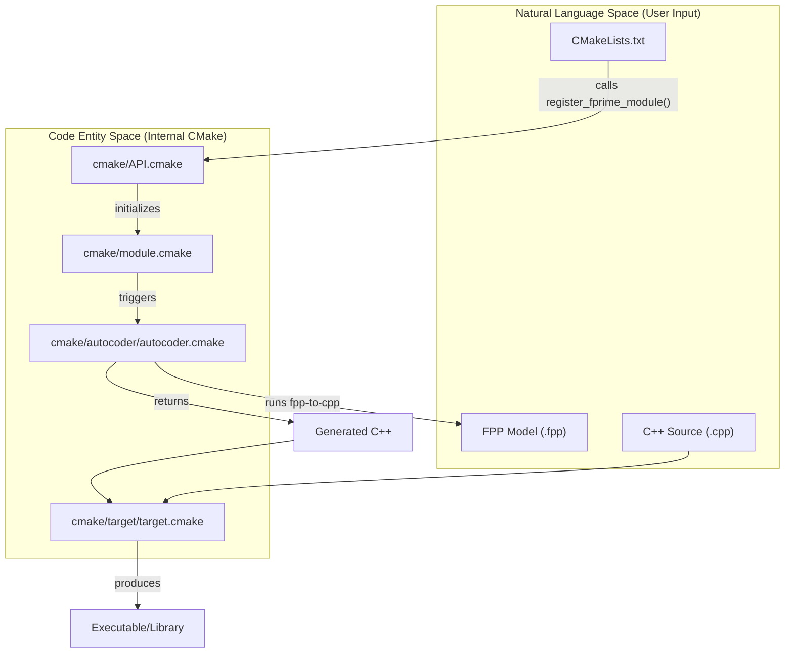
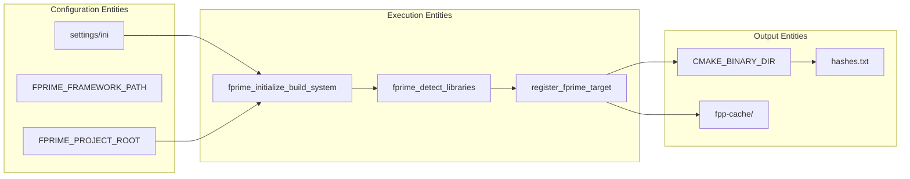

# Page: Build System

# Build System

Relevant source files

The following files were used as context for generating this wiki page:

- [Fw/Port/CMakeLists.txt](Fw/Port/CMakeLists.txt)
- [Ref/PingReceiver/CMakeLists.txt](Ref/PingReceiver/CMakeLists.txt)
- [Ref/SendBuffApp/CMakeLists.txt](Ref/SendBuffApp/CMakeLists.txt)
- [Svc/CmdDispatcher/CMakeLists.txt](Svc/CmdDispatcher/CMakeLists.txt)
- [Svc/FatalHandler/CMakeLists.txt](Svc/FatalHandler/CMakeLists.txt)
- [Svc/PassiveConsoleTextLogger/CMakeLists.txt](Svc/PassiveConsoleTextLogger/CMakeLists.txt)
- [cmake/API.cmake](cmake/API.cmake)
- [cmake/FPrime-Code.cmake](cmake/FPrime-Code.cmake)
- [cmake/FPrime.cmake](cmake/FPrime.cmake)
- [cmake/autocoder/autocoder.cmake](cmake/autocoder/autocoder.cmake)
- [cmake/autocoder/fpp.cmake](cmake/autocoder/fpp.cmake)
- [cmake/autocoder/fpp_ut.cmake](cmake/autocoder/fpp_ut.cmake)
- [cmake/autocoder/helpers.cmake](cmake/autocoder/helpers.cmake)
- [cmake/deployment-CMakeLists.txt.template](cmake/deployment-CMakeLists.txt.template)
- [cmake/docs/docs.py](cmake/docs/docs.py)
- [cmake/docs/img/CMake - Architecture.png](cmake/docs/img/CMake - Architecture.png)
- [cmake/docs/img/CMake File Organization.png](cmake/docs/img/CMake File Organization.png)
- [cmake/docs/img/CMake Lists Hierarchy.png](cmake/docs/img/CMake Lists Hierarchy.png)
- [cmake/docs/sdd.md](cmake/docs/sdd.md)
- [cmake/module.cmake](cmake/module.cmake)
- [cmake/options.cmake](cmake/options.cmake)
- [cmake/platform/README.md](cmake/platform/README.md)
- [cmake/platform/platform.cmake](cmake/platform/platform.cmake)
- [cmake/sanitizers.cmake](cmake/sanitizers.cmake)
- [cmake/target/build.cmake](cmake/target/build.cmake)
- [cmake/target/install.cmake](cmake/target/install.cmake)
- [cmake/target/target.cmake](cmake/target/target.cmake)
- [cmake/target/ut.cmake](cmake/target/ut.cmake)
- [cmake/test/data/test-fprime-library/cmake/autocoder/test.cmake](cmake/test/data/test-fprime-library/cmake/autocoder/test.cmake)
- [cmake/toolchain/toolchain.cmake.template](cmake/toolchain/toolchain.cmake.template)
- [cmake/utilities.cmake](cmake/utilities.cmake)

The F´ build system is a CMake-based infrastructure designed to handle the complexities of flight software development, including multi-platform cross-compilation, large-scale autocoding, and integrated unit testing. It uses a "two-pass" architecture where the first pass scans the topology and module dependencies to configure the environment, and the second pass executes the generation and compilation [cmake/docs/sdd.md:1-11]().

The entry point for the build system is `cmake/FPrime.cmake`, which initializes the framework environment and includes core modules for module registration, autocoding, and target management [cmake/FPrime.cmake:1-17]().

## Build System Architecture

The build system is organized into several functional layers that abstract the underlying CMake logic from the developer. It is designed to be "out-of-source," keeping build artifacts separate from the source code [cmake/docs/sdd.md:21-22]().

### High-Level Build Flow
The following diagram illustrates how a developer's `CMakeLists.txt` interacts with the internal CMake infrastructure to produce build artifacts.

**Build Logic Flow**

Sources: [cmake/API.cmake:1-13](), [cmake/autocoder/autocoder.cmake:1-8](), [cmake/FPrime.cmake:50-61]()

## Key Components

### 1. CMake API and Module Registration
F´ provides a domain-specific API to simplify the definition of components and deployments. Instead of standard CMake commands, developers use functions like `register_fprime_module` and `register_fprime_deployment`. These functions automatically handle dependency resolution, include paths, and link-time optimizations.
*   **Key Functions:** `register_fprime_module`, `add_fprime_subdirectory`, `register_fprime_ut`.
*   **For details, see [CMake API and Module Registration](#2.1).**

Sources: [cmake/API.cmake:91-116](), [cmake/API.cmake:117-144]()

### 2. Autocoding Pipeline
A core feature of F´ is the translation of high-level models (FPP or AI-XML) into C++ code. The build system manages an "autocoder set" that scans for `.fpp` files and invokes tools like `fpp-to-cpp` and `fpp-to-dict`. This process is integrated directly into the build graph via `run_ac_set`, ensuring that generated code is always up-to-date before compilation begins [cmake/autocoder/autocoder.cmake:19-28]().
*   **Key Files:** `cmake/autocoder/fpp.cmake`, `cmake/autocoder/autocoder.cmake`.
*   **For details, see [Autocoding Pipeline (FPP and AI-XML)](#2.2).**

Sources: [cmake/autocoder/fpp.cmake:19-63](), [cmake/autocoder/autocoder.cmake:28-45]()

### 3. Platforms and Toolchains
F´ is designed to run on diverse hardware, from embedded microcontrollers to Linux workstations. The build system uses "Platform Files" and "Toolchain Files" to abstract OS-specific features (like threading and file systems) and compiler-specific flags.
*   **Key Features:** `restrict_platforms` macro, sanitizer support (ASAN/UBSAN), and cross-compilation support.
*   **For details, see [Platforms, Toolchains, and Configuration](#2.3).**

Sources: [cmake/API.cmake:38-57](), [cmake/FPrime.cmake:48-49]()

### 4. Build Targets and Testing
Beyond simple compilation, the build system provides a suite of named targets for common development tasks. These include `dictionary` for dictionary generation, `ut` for unit test compilation, and `install` for deploying artifacts.
*   **Key Targets:** `build`, `ut`, `dictionary`, `install`, `version`.
*   **For details, see [Build Targets and Testing Integration](#2.4).**

Sources: [cmake/FPrime.cmake:116-134](), [cmake/target/install.cmake:45-70]()

## Build System Entities

The following diagram maps internal CMake variables and function names to their roles in the build lifecycle.

**Build Entity Mapping**

Sources: [cmake/FPrime.cmake:153-162](), [cmake/options.cmake:21-25](), [cmake/target/install.cmake:65-66]()

## Build Options and Configuration

The build system behavior can be modified using `-D` flags during the CMake generation phase. These options control features like:
*   `FPRIME_ENABLE_UT_COVERAGE`: Enables GCOV/LCOV reporting [cmake/options.cmake:137-148]().
*   `FPRIME_USE_BAREMETAL_SCHEDULER`: Configures the framework for non-OS environments [cmake/options.cmake:88-102]().
*   `CMAKE_DEBUG_OUTPUT`: Increases the verbosity of the F´ CMake internal logic [cmake/options.cmake:38-50]().
*   `FPRIME_USE_STUBBED_DRIVERS`: Directs the framework to use driver stubs [cmake/options.cmake:68-82]().

Sources: [cmake/options.cmake:1-18]()
