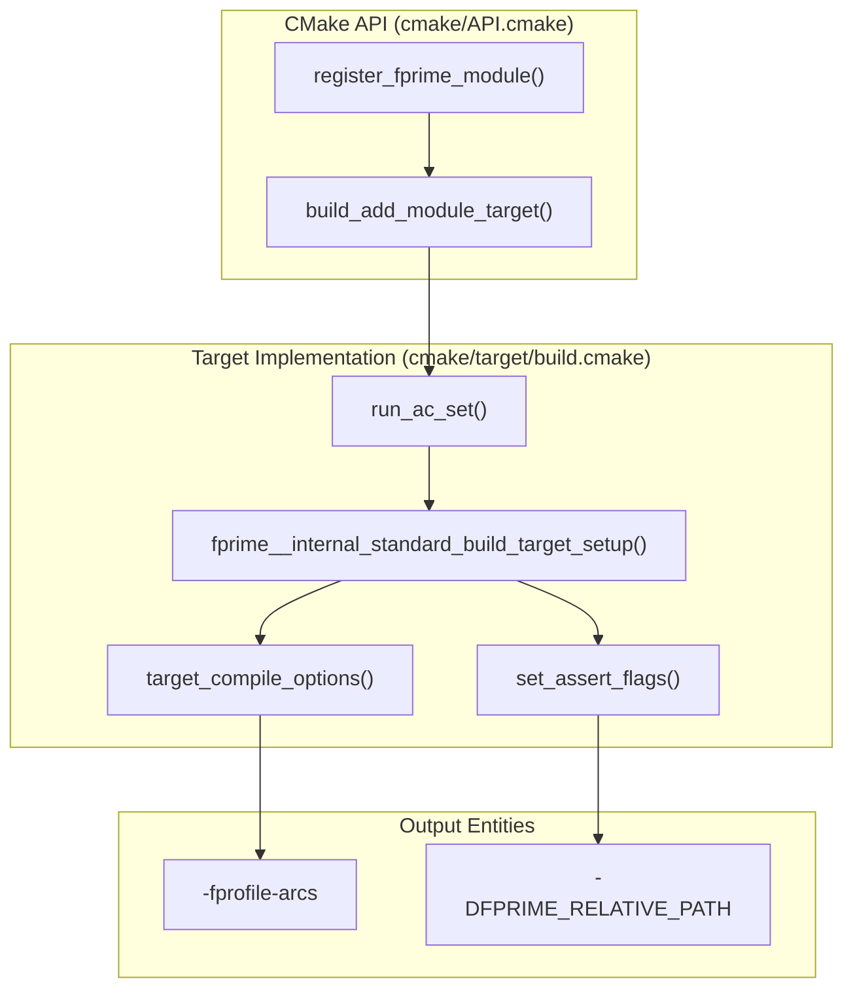
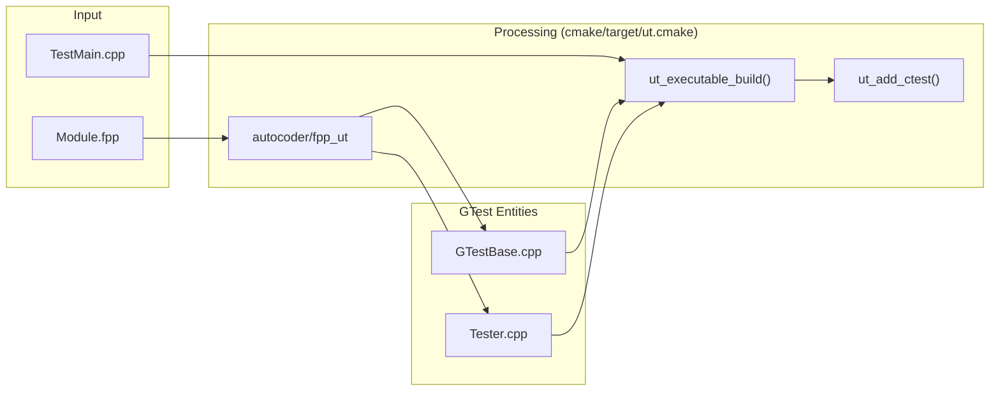

# Page: Build Targets and Testing Integration

# Build Targets and Testing Integration

Relevant source files

The following files were used as context for generating this wiki page:

- [Svc/CmdDispatcher/CMakeLists.txt](Svc/CmdDispatcher/CMakeLists.txt)
- [cmake/API.cmake](cmake/API.cmake)
- [cmake/FPrime-Code.cmake](cmake/FPrime-Code.cmake)
- [cmake/FPrime.cmake](cmake/FPrime.cmake)
- [cmake/autocoder/autocoder.cmake](cmake/autocoder/autocoder.cmake)
- [cmake/autocoder/fpp.cmake](cmake/autocoder/fpp.cmake)
- [cmake/autocoder/fpp_ut.cmake](cmake/autocoder/fpp_ut.cmake)
- [cmake/autocoder/helpers.cmake](cmake/autocoder/helpers.cmake)
- [cmake/module.cmake](cmake/module.cmake)
- [cmake/options.cmake](cmake/options.cmake)
- [cmake/platform/platform.cmake](cmake/platform/platform.cmake)
- [cmake/sanitizers.cmake](cmake/sanitizers.cmake)
- [cmake/target/build.cmake](cmake/target/build.cmake)
- [cmake/target/install.cmake](cmake/target/install.cmake)
- [cmake/target/target.cmake](cmake/target/target.cmake)
- [cmake/target/ut.cmake](cmake/target/ut.cmake)
- [cmake/test/data/test-fprime-library/cmake/autocoder/test.cmake](cmake/test/data/test-fprime-library/cmake/autocoder/test.cmake)
- [cmake/test/src/cmake.py](cmake/test/src/cmake.py)
- [cmake/test/src/test_basic.py](cmake/test/src/test_basic.py)
- [cmake/utilities.cmake](cmake/utilities.cmake)

The F´ build system defines a set of standard targets that manage the lifecycle of a flight software project, from code generation and compilation to unit testing and deployment installation. These targets are integrated into the CMake-based build system and are typically invoked via the `fprime-util` CLI.

## Standard Build Targets

F´ defines several "standard" targets that are registered during the build system initialization. These targets are registered in `cmake/FPrime.cmake` via the `fprime_setup_standard_targets` macro [cmake/FPrime.cmake:120-134]().

| Target | Description | Registration File |
|---|---|---|
| `build` | Compiles the module or deployment. | `cmake/target/build.cmake` |
| `ut` | Compiles and registers unit tests. | `cmake/target/ut.cmake` |
| `dictionary` | Generates GDS command/telemetry dictionaries. | `cmake/target/dictionary.cmake` |
| `install` | Stages binaries to the `build-artifacts` directory. | `cmake/target/install.cmake` |
| `version` | Generates version headers based on git/JSON. | `cmake/target/version.cmake` |
| `sbom` | Generates Software Bill of Materials. | `cmake/FPrime.cmake:131` |
| `check` | Runs the compiled unit tests via CTest. | N/A (fprime-util wrapper) |

### Target Registration Pipeline
The registration of these targets follows a plugin-like architecture. The `register_fprime_target` function (and `register_fprime_ut_target`) adds target definitions to global lists [cmake/API.cmake:20-22](). This allows the build system to remain modular, as targets like `build`, `dictionary`, and `install` are registered as plugins [cmake/FPrime.cmake:125-132]().

Sources: [cmake/FPrime.cmake:120-134](), [cmake/API.cmake:20-22]()

## Build Target Implementation

The `build` target is the primary compilation target. It handles both manual source files and the execution of the autocoding pipeline.

### Execution Flow
When a module is registered via `register_fprime_module()`, the `build_add_module_target` function is called [cmake/target/build.cmake:113-123]().

1.  **Autocode Execution**: The target first runs the set of registered autocoders (e.g., FPP) using `run_ac_set` [cmake/target/build.cmake:115](). This function aggregates generated files and dependencies into target properties like `AC_GENERATED` and `LINK_LIBRARIES` [cmake/autocoder/autocoder.cmake:55-67]().
2.  **Property Loading**: It retrieves properties such as `SOURCES`, `LINK_LIBRARIES`, and `AC_GENERATED` to prepare the final compilation unit [cmake/target/build.cmake:31-36]().
3.  **Assertion Flags**: It applies specific compile flags (like file path macros) to every source file to support framework assertions via `set_assert_flags` [cmake/target/build.cmake:68-70]().
4.  **Testing Flags**: If `BUILD_TESTING` is enabled, it appends coverage flags (`-fprofile-arcs -ftest-coverage`) and link flags (`--coverage`) if `FPRIME_ENABLE_UT_COVERAGE` is ON [cmake/target/build.cmake:17-20]().

### Build Target Entity Map
The following diagram shows how the CMake build functions map to the internal processing of a module.

"Natural Language Space" to "Code Entity Space" (Build)

Sources: [cmake/target/build.cmake:17-123](), [cmake/API.cmake:1-12](), [cmake/autocoder/autocoder.cmake:55-67]()

## Unit Testing Integration

Unit tests in F´ are built using **Google Test (GTest)** and managed by **CTest**. The build system automates the generation of test harnesses from FPP models and ensures that dependencies are correctly linked.

### Test Registration
Tests are registered using `register_fprime_ut()`, which triggers the `ut_add_module_target` function [cmake/target/ut.cmake:147-173]().

1.  **Harness Generation**: The target runs the `autocoder/fpp` and `autocoder/fpp_ut` autocoders to generate `Tester.hpp`, `Tester.cpp`, `GTestBase.hpp`, and `GTestBase.cpp` [cmake/target/ut.cmake:108]().
2.  **Executable Creation**: A GTest executable is created and linked against `gtest_main` [cmake/target/ut.cmake:110]().
3.  **Dependency Linking**: The unit test executable is automatically linked against the module it is testing if that module is a library [cmake/target/ut.cmake:113-116]().
4.  **CTest Registration**: The executable is added to the CTest suite via `add_test()` with the working directory set to the source directory [cmake/target/ut.cmake:133]().

### Coverage Reporting
Coverage is implemented using `gcov`. Before running tests, the build system clears previous coverage data (`*.gcda` files) using a generated `clean.cmake` script [cmake/target/ut.cmake:18-30](). This script is registered with CTest via the `TEST_INCLUDE_FILES` property [cmake/target/ut.cmake:27-29]().

### Testing Data Flow
"Natural Language Space" to "Code Entity Space" (Testing)

Sources: [cmake/target/ut.cmake:106-135](), [cmake/target/ut.cmake:147-173]()

## Installation and Artifact Management

The `install` target manages the staging of binaries for deployment. It uses CMake's standard `install` command but wraps it to handle F´ specific directory structures.

*   **Real Target Detection**: The system filters out interface libraries and metadata-only targets via `_install_real_helper`, ensuring only "real" compile artifacts (executables and libraries) are installed [cmake/target/install.cmake:17-29]().
*   **Destination Structure**: Artifacts are placed in `${CMAKE_INSTALL_PREFIX}/${TOOLCHAIN_NAME}/${MODULE}/bin` (for runtimes) and `/lib` (for libraries) [cmake/target/install.cmake:58-64]().
*   **Hash Tracking**: A `hashes.txt` file is installed from the binary directory to the installation prefix to track build integrity [cmake/target/install.cmake:65]().

Sources: [cmake/target/install.cmake:45-70]()

## Build System Self-Testing

The F´ build system includes a Python-based self-test suite located in `cmake/test/`. This suite ensures that CMake changes do not break the autocoding pipeline or target registration.

### Implementation Details
The self-test framework uses `pytest` and a `cmake.py` wrapper to programmatically invoke CMake and Make/Ninja.

*   **Subprocess Helper**: The `subprocess_helper` function "tees" CMake output to both the console and a capture buffer for analysis [cmake/test/src/cmake.py:27-66]().
*   **Fixture Generation**: The `get_build` function creates a temporary build directory, runs CMake generation via `run_cmake`, and executes specified make targets via `run_make`, returning the results as a pytest fixture [cmake/test/src/cmake.py:129-168]().
*   **Success Assertions**: The `assert_process_success` function validates return codes (expecting 0) and ensures that expected artifacts were produced [cmake/test/src/cmake.py:105-128]().

Sources: [cmake/test/src/cmake.py:1-168]()
