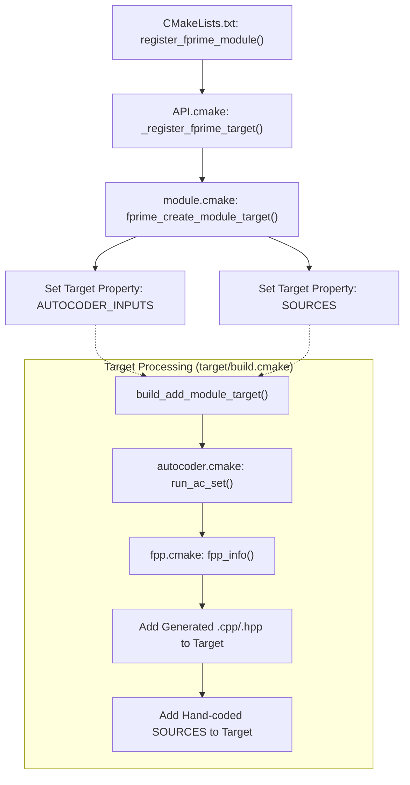
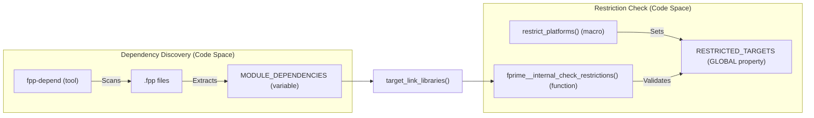

# Page: CMake API and Module Registration

# CMake API and Module Registration

Relevant source files

The following files were used as context for generating this wiki page:

- [CFDP/Checksum/GTest/CMakeLists.txt](CFDP/Checksum/GTest/CMakeLists.txt)
- [Fw/Comp/CMakeLists.txt](Fw/Comp/CMakeLists.txt)
- [Fw/FilePacket/CMakeLists.txt](Fw/FilePacket/CMakeLists.txt)
- [Fw/FilePacket/GTest/CMakeLists.txt](Fw/FilePacket/GTest/CMakeLists.txt)
- [Fw/Port/CMakeLists.txt](Fw/Port/CMakeLists.txt)
- [Fw/SerializableFile/CMakeLists.txt](Fw/SerializableFile/CMakeLists.txt)
- [Fw/Types/GTest/CMakeLists.txt](Fw/Types/GTest/CMakeLists.txt)
- [Ref/PingReceiver/CMakeLists.txt](Ref/PingReceiver/CMakeLists.txt)
- [Ref/RecvBuffApp/CMakeLists.txt](Ref/RecvBuffApp/CMakeLists.txt)
- [Ref/SendBuffApp/CMakeLists.txt](Ref/SendBuffApp/CMakeLists.txt)
- [Svc/CmdDispatcher/CMakeLists.txt](Svc/CmdDispatcher/CMakeLists.txt)
- [Svc/CmdSequencer/CMakeLists.txt](Svc/CmdSequencer/CMakeLists.txt)
- [Svc/FatalHandler/CMakeLists.txt](Svc/FatalHandler/CMakeLists.txt)
- [Svc/PassiveConsoleTextLogger/CMakeLists.txt](Svc/PassiveConsoleTextLogger/CMakeLists.txt)
- [cmake/API.cmake](cmake/API.cmake)
- [cmake/FPrime-Code.cmake](cmake/FPrime-Code.cmake)
- [cmake/FPrime.cmake](cmake/FPrime.cmake)
- [cmake/autocoder/autocoder.cmake](cmake/autocoder/autocoder.cmake)
- [cmake/autocoder/fpp.cmake](cmake/autocoder/fpp.cmake)
- [cmake/autocoder/fpp_ut.cmake](cmake/autocoder/fpp_ut.cmake)
- [cmake/autocoder/helpers.cmake](cmake/autocoder/helpers.cmake)
- [cmake/deployment-CMakeLists.txt.template](cmake/deployment-CMakeLists.txt.template)
- [cmake/docs/docs.py](cmake/docs/docs.py)
- [cmake/docs/img/CMake - Architecture.png](cmake/docs/img/CMake - Architecture.png)
- [cmake/docs/img/CMake File Organization.png](cmake/docs/img/CMake File Organization.png)
- [cmake/docs/img/CMake Lists Hierarchy.png](cmake/docs/img/CMake Lists Hierarchy.png)
- [cmake/docs/sdd.md](cmake/docs/sdd.md)
- [cmake/module.cmake](cmake/module.cmake)
- [cmake/options.cmake](cmake/options.cmake)
- [cmake/platform/README.md](cmake/platform/README.md)
- [cmake/platform/platform.cmake](cmake/platform/platform.cmake)
- [cmake/required.cmake](cmake/required.cmake)
- [cmake/sanitizers.cmake](cmake/sanitizers.cmake)
- [cmake/settings/ini-to-stdio.py](cmake/settings/ini-to-stdio.py)
- [cmake/settings/ini.cmake](cmake/settings/ini.cmake)
- [cmake/sub-build/sub-build-config.cmake](cmake/sub-build/sub-build-config.cmake)
- [cmake/sub-build/sub-build.cmake](cmake/sub-build/sub-build.cmake)
- [cmake/target/build.cmake](cmake/target/build.cmake)
- [cmake/target/install.cmake](cmake/target/install.cmake)
- [cmake/target/sbom.cmake](cmake/target/sbom.cmake)
- [cmake/target/target.cmake](cmake/target/target.cmake)
- [cmake/target/ut.cmake](cmake/target/ut.cmake)
- [cmake/test/data/TestDeployment/settings.ini](cmake/test/data/TestDeployment/settings.ini)
- [cmake/test/data/test-fprime-library/cmake/autocoder/test.cmake](cmake/test/data/test-fprime-library/cmake/autocoder/test.cmake)
- [cmake/test/src/test_symlink.py](cmake/test/src/test_symlink.py)
- [cmake/toolchain/helpers/arm-linux-base.cmake](cmake/toolchain/helpers/arm-linux-base.cmake)
- [cmake/toolchain/toolchain.cmake.template](cmake/toolchain/toolchain.cmake.template)
- [cmake/utilities.cmake](cmake/utilities.cmake)

The F´ build system is built on top of CMake and provides a high-level developer API to manage the complexities of autocoding, dependency resolution, and multi-platform support. This page details the functions used to register modules and deployments, and how the build system processes these registrations through its internal pipeline.

## Module Registration API

The primary interface for developers is a set of CMake functions defined in `cmake/API.cmake`. These functions replace standard CMake commands like `add_library` or `add_executable` with F´-specific versions that integrate with the autocoder and testing frameworks.

### register_fprime_module
The most common function used in F´ development. It registers a directory as an F´ module (component, port, or library).

| Argument | Description |
| --- | --- |
| `AUTOCODER_INPUTS` | List of FPP or XML files to be processed by autocoders. |
| `SOURCES` | Hand-coded C++ source files (`.cpp`, `.hpp`). |
| `DEPENDS` | List of other F´ modules this module depends on. |

**Implementation Flow:**
1. Calls `get_module_name` to determine the unique module identifier based on its path relative to the project root [cmake/API.cmake:118-119]().
2. Sets properties on a CMake target named after the module to store sources and dependencies [cmake/module.cmake:60-80]().
3. During the generation phase, the `build` target uses these properties to trigger the `run_ac_set` function, which executes the FPP/XML autocoders [cmake/target/build.cmake:113-115]().

### register_fprime_deployment
Used at the top level of an application (e.g., in `Ref/CMakeLists.txt`) to produce the final flight software executable.

**Implementation Flow:**
1. Identifies the deployment name (typically the CMake `PROJECT_NAME`) [cmake/API.cmake:230]().
2. Adds the deployment to the global list of executables to be built [cmake/API.cmake:260]().
3. Automatically includes standard framework dependencies if not explicitly excluded [cmake/API.cmake:265-270]().

### register_fprime_ut
Registers unit tests for a module. These targets are only built when the `ut` target is requested (e.g., `fprime-util check`).

**Implementation Flow:**
1. Creates a separate target suffixed with `_ut_exe` [cmake/API.cmake:310-315]().
2. Links against the base module and the GTest/STest libraries [cmake/target/ut.cmake:108-110]().
3. If `FPRIME_ENABLE_UT_COVERAGE` is ON, it injects `-fprofile-arcs` and `-ftest-coverage` flags [cmake/target/build.cmake:17-20]().

### add_fprime_subdirectory
A wrapper around CMake's `add_subdirectory`. It calculates the correct binary directory mapping to ensure that generated files do not collide and that `#include` paths remain consistent with the source tree [cmake/API.cmake:117-145]().

**Sources:** [cmake/API.cmake:1-350](), [cmake/module.cmake:1-100](), [cmake/target/build.cmake:1-124](), [cmake/target/ut.cmake:100-120]()

---

## Module Registration Pipeline

The F´ build system operates in a two-pass architecture. The first pass (Configuration) collects all module definitions, and the second pass (Generation) creates the actual build rules.

### Registration Data Flow
The following diagram shows how a call to `register_fprime_module` in a `CMakeLists.txt` file flows through the system to become a buildable C++ target.

**Module Processing Flow**

**Sources:** [cmake/API.cmake:170-200](), [cmake/module.cmake:45-85](), [cmake/autocoder/autocoder.cmake:28-81](), [cmake/target/build.cmake:104-123]()

---

## Dependency Resolution and Transitive Mechanism

F´ uses a custom dependency resolution mechanism to handle the relationship between hand-coded sources and autocoder-generated files.

### The TRANSITIVE_DEPENDENCIES Mechanism
When a module depends on another (via `DEPENDS`), it must not only link the compiled library but also ensure that any autocoded headers from the dependency are generated first.

1. **Direct Dependencies:** Listed in `register_fprime_module(DEPENDS ...)`. These are mapped to `target_link_libraries` [cmake/module.cmake:90-95]().
2. **Autocoder Dependencies:** The FPP autocoder uses `fpp-depend` to scan `.fpp` files and discover dependencies on other FPP models [cmake/autocoder/fpp.cmake:121-140]().
3. **Transitive Injection:** The build system recursively traverses the dependency tree. If an autocoder run adds new dependencies (e.g., a component depending on a port module), the `TRANSITIVE_DEPENDENCIES` property is invalidated and recalculated to ensure the build order is correct [cmake/autocoder/autocoder.cmake:64-67]().

### Platform Restrictions
The `restrict_platforms` macro allows modules to declare compatibility. If a module is restricted, it is added to the `RESTRICTED_TARGETS` global property [cmake/API.cmake:85](). Any attempt to depend on a restricted module on an unsupported platform will trigger a fatal error during the `fprime__internal_check_restrictions` phase [cmake/API.cmake:57-88](), [cmake/target/build.cmake:53-60]().

**Dependency and Restriction Logic**

**Sources:** [cmake/autocoder/fpp.cmake:121-160](), [cmake/API.cmake:57-88](), [cmake/target/build.cmake:53-60](), [cmake/autocoder/autocoder.cmake:49-67]()

---

## Summary of Key Functions

| Function | File | Role |
| --- | --- | --- |
| `fprime_initialize_build_system` | [cmake/FPrime.cmake:153]() | Entry point for the build system; detects libraries and registers standard targets. |
| `run_ac_set` | [cmake/autocoder/autocoder.cmake:28]() | Executes the suite of registered autocoders for a specific target. |
| `fpp_info` | [cmake/autocoder/fpp.cmake:121]() | Calls `fpp-depend` to determine generated files and module dependencies for FPP. |
| `add_fprime_subdirectory` | [cmake/API.cmake:117]() | Manages source-to-binary path mapping for the module graph. |
| `_install_real_helper` | [cmake/target/install.cmake:17]() | Filters out non-buildable targets (like interfaces) during the installation phase. |
| `locate_fpp_tools` | [cmake/autocoder/fpp.cmake:19]() | Finds the FPP tool suite and validates versions. |

**Sources:** [cmake/FPrime.cmake:153-170](), [cmake/autocoder/autocoder.cmake:28-81](), [cmake/autocoder/fpp.cmake:19-63](), [cmake/autocoder/fpp.cmake:121-160](), [cmake/API.cmake:117-145](), [cmake/target/install.cmake:17-29]()
