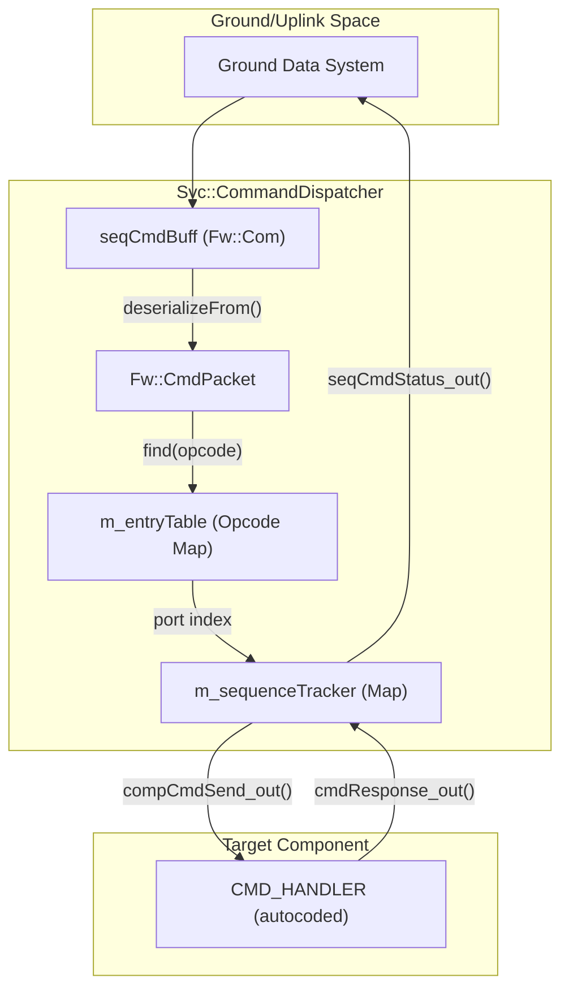
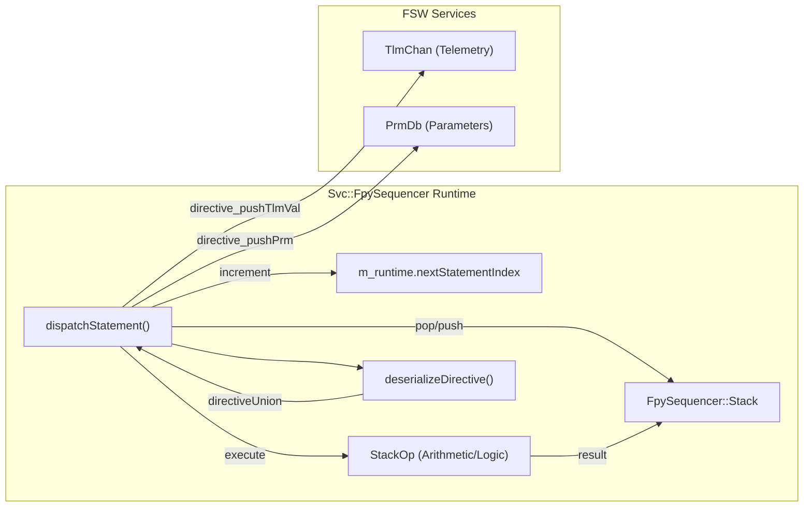

# Page: Commanding and Sequencing

# Commanding and Sequencing

Relevant source files

The following files were used as context for generating this wiki page:

- [Fw/Types/SerialBuffer.cpp](Fw/Types/SerialBuffer.cpp)
- [Svc/CmdDispatcher/CmdDispatcher.fpp](Svc/CmdDispatcher/CmdDispatcher.fpp)
- [Svc/CmdDispatcher/CommandDispatcherImpl.cpp](Svc/CmdDispatcher/CommandDispatcherImpl.cpp)
- [Svc/CmdDispatcher/CommandDispatcherImpl.hpp](Svc/CmdDispatcher/CommandDispatcherImpl.hpp)
- [Svc/CmdDispatcher/docs/sdd.md](Svc/CmdDispatcher/docs/sdd.md)
- [Svc/CmdDispatcher/test/ut/CommandDispatcherTestMain.cpp](Svc/CmdDispatcher/test/ut/CommandDispatcherTestMain.cpp)
- [Svc/CmdDispatcher/test/ut/CommandDispatcherTester.cpp](Svc/CmdDispatcher/test/ut/CommandDispatcherTester.cpp)
- [Svc/CmdDispatcher/test/ut/CommandDispatcherTester.hpp](Svc/CmdDispatcher/test/ut/CommandDispatcherTester.hpp)
- [Svc/CmdSequencer/CmdSequencer.fpp](Svc/CmdSequencer/CmdSequencer.fpp)
- [Svc/CmdSequencer/CmdSequencerImpl.cpp](Svc/CmdSequencer/CmdSequencerImpl.cpp)
- [Svc/CmdSequencer/CmdSequencerImpl.hpp](Svc/CmdSequencer/CmdSequencerImpl.hpp)
- [Svc/CmdSequencer/Events.cpp](Svc/CmdSequencer/Events.cpp)
- [Svc/CmdSequencer/Events.fppi](Svc/CmdSequencer/Events.fppi)
- [Svc/CmdSequencer/FPrimeSequence.cpp](Svc/CmdSequencer/FPrimeSequence.cpp)
- [Svc/CmdSequencer/changed-symbols.txt](Svc/CmdSequencer/changed-symbols.txt)
- [Svc/CmdSequencer/formats/AMPCSSequence.cpp](Svc/CmdSequencer/formats/AMPCSSequence.cpp)
- [Svc/CmdSequencer/test/ut/AMPCS.cpp](Svc/CmdSequencer/test/ut/AMPCS.cpp)
- [Svc/CmdSequencer/test/ut/CmdSequencerMain.cpp](Svc/CmdSequencer/test/ut/CmdSequencerMain.cpp)
- [Svc/CmdSequencer/test/ut/CmdSequencerTester.cpp](Svc/CmdSequencer/test/ut/CmdSequencerTester.cpp)
- [Svc/CmdSequencer/test/ut/CmdSequencerTester.hpp](Svc/CmdSequencer/test/ut/CmdSequencerTester.hpp)
- [Svc/CmdSequencer/test/ut/Immediate.cpp](Svc/CmdSequencer/test/ut/Immediate.cpp)
- [Svc/CmdSequencer/test/ut/Immediate.hpp](Svc/CmdSequencer/test/ut/Immediate.hpp)
- [Svc/CmdSequencer/test/ut/ImmediateBase.cpp](Svc/CmdSequencer/test/ut/ImmediateBase.cpp)
- [Svc/CmdSequencer/test/ut/ImmediateBase.hpp](Svc/CmdSequencer/test/ut/ImmediateBase.hpp)
- [Svc/CmdSequencer/test/ut/InvalidFiles.cpp](Svc/CmdSequencer/test/ut/InvalidFiles.cpp)
- [Svc/CmdSequencer/test/ut/Relative.hpp](Svc/CmdSequencer/test/ut/Relative.hpp)
- [Svc/CmdSequencer/test/ut/SequenceFiles/AMPCS/Records.cpp](Svc/CmdSequencer/test/ut/SequenceFiles/AMPCS/Records.cpp)
- [Svc/CmdSequencer/test/ut/SequenceFiles/FPrime/Records.cpp](Svc/CmdSequencer/test/ut/SequenceFiles/FPrime/Records.cpp)
- [Svc/FpySequencer/FpySequencer.cpp](Svc/FpySequencer/FpySequencer.cpp)
- [Svc/FpySequencer/FpySequencer.hpp](Svc/FpySequencer/FpySequencer.hpp)
- [Svc/FpySequencer/FpySequencerDirectives.cpp](Svc/FpySequencer/FpySequencerDirectives.cpp)
- [Svc/FpySequencer/FpySequencerDirectives.fppi](Svc/FpySequencer/FpySequencerDirectives.fppi)
- [Svc/FpySequencer/FpySequencerEvents.fppi](Svc/FpySequencer/FpySequencerEvents.fppi)
- [Svc/FpySequencer/FpySequencerRunState.cpp](Svc/FpySequencer/FpySequencerRunState.cpp)
- [Svc/FpySequencer/FpySequencerTelemetry.fppi](Svc/FpySequencer/FpySequencerTelemetry.fppi)
- [Svc/FpySequencer/FpySequencerTypes.fpp](Svc/FpySequencer/FpySequencerTypes.fpp)
- [Svc/FpySequencer/docs/directives.md](Svc/FpySequencer/docs/directives.md)
- [Svc/FpySequencer/docs/sdd.md](Svc/FpySequencer/docs/sdd.md)
- [Svc/FpySequencer/test/ut/FpySequencerTestMain.cpp](Svc/FpySequencer/test/ut/FpySequencerTestMain.cpp)
- [Svc/FpySequencer/test/ut/FpySequencerTestSequences.cpp](Svc/FpySequencer/test/ut/FpySequencerTestSequences.cpp)
- [Svc/FpySequencer/test/ut/FpySequencerTester.cpp](Svc/FpySequencer/test/ut/FpySequencerTester.cpp)
- [Svc/FpySequencer/test/ut/FpySequencerTester.hpp](Svc/FpySequencer/test/ut/FpySequencerTester.hpp)

The Commanding and Sequencing subsystem provides the infrastructure for routing, dispatching, and executing commands within an F´ deployment. It handles the lifecycle of a command from its reception as a serialized buffer to its execution by a destination component, as well as the autonomous execution of command sequences.

## Command Dispatcher (CmdDispatcher)

The `Svc::CommandDispatcher` is the central hub for command routing. It maintains a registry of opcodes and their corresponding component ports, ensuring that incoming commands are directed to the correct handler.

### Opcode Registration
Components register their commands during system initialization by sending their opcodes to the `compCmdReg` port [Svc/CmdDispatcher/CmdDispatcher.fpp:15](). The dispatcher stores these in `m_entryTable`, mapping each `FwOpcodeType` to a specific output port index [Svc/CmdDispatcher/CommandDispatcherImpl.cpp:33-36]().

### Command Routing and Tracking
When a command buffer is received via the `seqCmdBuff` port [Svc/CmdDispatcher/CmdDispatcher.fpp:24](), the dispatcher performs the following steps:
1.  **Deserialization**: The `Fw::ComBuffer` is deserialized into an `Fw::CmdPacket` [Svc/CmdDispatcher/CommandDispatcherImpl.cpp:72-73]().
2.  **Lookup**: The dispatcher searches `m_entryTable` for the opcode [Svc/CmdDispatcher/CommandDispatcherImpl.cpp:86]().
3.  **Tracking**: If the source requires a status response, the dispatcher assigns a sequence number (`m_seq`) and stores the command context in `m_sequenceTracker` [Svc/CmdDispatcher/CommandDispatcherImpl.cpp:89-95]().
4.  **Dispatch**: The command is forwarded to the component via the `compCmdSend` port [Svc/CmdDispatcher/CommandDispatcherImpl.cpp:107]().

### Status Reporting
Once a component completes a command, it returns a status via the `compCmdStat` port [Svc/CmdDispatcher/CmdDispatcher.fpp:18](). The dispatcher matches this response to the original caller using the sequence number in `m_sequenceTracker` and forwards the result to the `seqCmdStatus` port [Svc/CmdDispatcher/CommandDispatcherImpl.cpp:53-68]().

**Sources:** [Svc/CmdDispatcher/CmdDispatcher.fpp:1-210](), [Svc/CmdDispatcher/CommandDispatcherImpl.cpp:20-124]()

---

## Command Sequencer (CmdSequencer)

The `Svc::CmdSequencer` component enables autonomous execution of pre-recorded command sequences stored in files.

### Sequence Formats
The `CmdSequencer` supports multiple binary formats through a common `Sequence` interface [Svc/CmdSequencer/CmdSequencerImpl.hpp:73]():
*   **FPrimeSequence**: The standard F´ format, consisting of a header (file size, record count, time base), followed by command records [Svc/CmdSequencer/CmdSequencerImpl.hpp:143-173]().
*   **AMPCSSequence**: A format compatible with the Advanced Multi-Mission Operations System (AMMOS) [Svc/CmdSequencer/formats/AMPCSSequence.cpp]().

### Execution Logic
The sequencer operates in two primary modes: `AUTO` (continuous execution) and `MANUAL` (step-by-step) [Svc/CmdSequencer/CmdSequencerImpl.hpp:64]().
*   **Relative Timing**: Commands are executed after a delay relative to the previous command.
*   **Absolute Timing**: Commands are executed at a specific UTC/SCLK time.
*   **Validation**: The `VALIDATE` command checks file CRC and header integrity without executing the commands [Svc/CmdSequencer/CmdSequencerImpl.hpp:156-159]().

**Sources:** [Svc/CmdSequencer/CmdSequencerImpl.hpp:45-220](), [Svc/CmdSequencer/CmdSequencer.fpp:1-50]()

---

## FpySequencer (Bytecode Sequencer)

The `FpySequencer` is an advanced sequencer that executes bytecode compiled from the Fpy language. Unlike the standard `CmdSequencer`, it supports complex logic including arithmetic, branching, and direct access to telemetry and parameters.

### Runtime Environment and Stack
The sequencer utilizes a `Runtime` structure and a dedicated `Stack` for execution [Svc/FpySequencer/FpySequencer.hpp:83-127]().
*   **Stack**: Stores local variables, function arguments, and operands in a byte array [Svc/FpySequencer/FpySequencer.hpp:86](). It handles big-endian conversion for pushed/popped values [Svc/FpySequencer/FpySequencer.hpp:95-102]().
*   **Frame Pointer**: `currentFrameStart` tracks the base of the current function's local variables [Svc/FpySequencer/FpySequencer.hpp:91]().

### Instruction Set (Directives)
The `FpySequencer` executes "directives" which are equivalent to CPU instructions. Key directives include:

| Directive | Description |
| :--- | :--- |
| `WAIT_REL` / `WAIT_ABS` | Pause execution for a duration or until a time [Svc/FpySequencer/FpySequencerDirectives.fppi:2-11](). |
| `GOTO` / `IF` | Unconditional and conditional branching [Svc/FpySequencer/FpySequencerDirectives.fppi:14-25](). |
| `PUSH_TLM_VAL` | Fetch telemetry from `TlmChan` and push to stack [Svc/FpySequencer/FpySequencerDirectives.fppi:34-37](). |
| `STACK_CMD` | Pop an opcode and arguments from the stack to dispatch a command [Svc/FpySequencer/FpySequencerDirectives.fppi:115-118](). |
| `CALL` / `RETURN` | Subroutine execution with scoped variables [Svc/FpySequencer/FpySequencerDirectives.fppi:159-170](). |
| `STACK_OP` | Arithmetic (ADD, SUB, MUL) and logic (AND, OR, IEQ) operations [Svc/FpySequencer/FpySequencerTypes.fpp:37-98](). |

### State Machine
The component uses a state machine to manage the sequence lifecycle [Svc/FpySequencer/docs/sdd.md:49]():
1.  **IDLE**: Waiting for a command. Entry clears breakpoints [Svc/FpySequencer/docs/sdd.md:51]().
2.  **VALIDATING**: Checking bytecode integrity, schema version, and CRC [Svc/FpySequencer/docs/sdd.md:58]().
3.  **RUNNING**: Executing directives via `dispatchStatement()` [Svc/FpySequencer/FpySequencerRunState.cpp:16]().
4.  **SLEEPING**: Waiting for a timer to expire (e.g., during `WAIT_REL`) [Svc/FpySequencer/docs/sdd.md:104]().
5.  **PAUSED**: Execution stopped at a breakpoint or after a `cmd_STEP` [Svc/FpySequencer/docs/sdd.md:82]().

**Sources:** [Svc/FpySequencer/FpySequencer.hpp:44-127](), [Svc/FpySequencer/FpySequencerTypes.fpp:23-121](), [Svc/FpySequencer/FpySequencerDirectives.fppi:1-230](), [Svc/FpySequencer/docs/sdd.md:49-109]()

---

## Data Flow Diagrams

### Command Lifecycle: Uplink to Handler
This diagram bridges the conceptual "Uplink" to the specific code entities involved in dispatching a command.

**Sources:** [Svc/CmdDispatcher/CommandDispatcherImpl.cpp:71-124](), [Svc/CmdDispatcher/CmdDispatcher.fpp:12-24]()

### FpySequencer Runtime Execution
This diagram maps the internal logic of the `FpySequencer` runtime to its code components.

**Sources:** [Svc/FpySequencer/FpySequencerRunState.cpp:16-52](), [Svc/FpySequencer/FpySequencer.hpp:83-127](), [Svc/FpySequencer/FpySequencerDirectives.cpp:111-131]()
