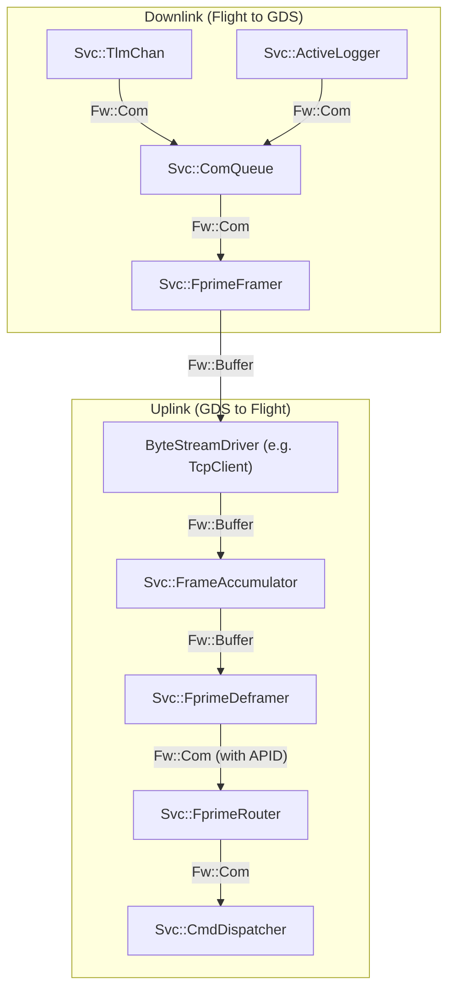
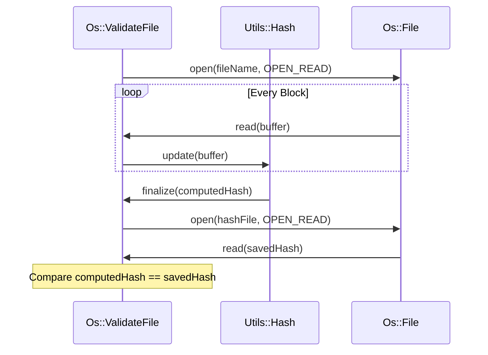

# Page: Communication and Framing

# Communication and Framing

Relevant source files

The following files were used as context for generating this wiki page:

- [.github/actions/spelling/expect.txt](.github/actions/spelling/expect.txt)
- [Fw/FilePacket/FilePacket.cpp](Fw/FilePacket/FilePacket.cpp)
- [Fw/Types/Serializable.cpp](Fw/Types/Serializable.cpp)
- [Fw/Types/Serializable.hpp](Fw/Types/Serializable.hpp)
- [Os/ValidateFileCommon.cpp](Os/ValidateFileCommon.cpp)
- [Svc/CMakeLists.txt](Svc/CMakeLists.txt)
- [Svc/Ccsds/SpacePacketDeframer/SpacePacketDeframer.cpp](Svc/Ccsds/SpacePacketDeframer/SpacePacketDeframer.cpp)
- [Svc/Ccsds/SpacePacketDeframer/SpacePacketDeframer.fpp](Svc/Ccsds/SpacePacketDeframer/SpacePacketDeframer.fpp)
- [Svc/Ccsds/TcDeframer/TcDeframer.cpp](Svc/Ccsds/TcDeframer/TcDeframer.cpp)
- [Svc/Ccsds/TcDeframer/TcDeframer.fpp](Svc/Ccsds/TcDeframer/TcDeframer.fpp)
- [Svc/Ccsds/Types/Types.fpp](Svc/Ccsds/Types/Types.fpp)
- [Svc/ComQueue/CMakeLists.txt](Svc/ComQueue/CMakeLists.txt)
- [Svc/ComQueue/ComQueue.cpp](Svc/ComQueue/ComQueue.cpp)
- [Svc/ComQueue/ComQueue.fpp](Svc/ComQueue/ComQueue.fpp)
- [Svc/ComQueue/ComQueue.hpp](Svc/ComQueue/ComQueue.hpp)
- [Svc/ComQueue/docs/sdd.md](Svc/ComQueue/docs/sdd.md)
- [Svc/ComQueue/test/ut/ComQueueTestMain.cpp](Svc/ComQueue/test/ut/ComQueueTestMain.cpp)
- [Svc/ComQueue/test/ut/ComQueueTester.cpp](Svc/ComQueue/test/ut/ComQueueTester.cpp)
- [Svc/ComQueue/test/ut/ComQueueTester.hpp](Svc/ComQueue/test/ut/ComQueueTester.hpp)
- [Svc/FprimeDeframer/FprimeDeframer.cpp](Svc/FprimeDeframer/FprimeDeframer.cpp)
- [Svc/FprimeDeframer/test/ut/FprimeDeframerTester.cpp](Svc/FprimeDeframer/test/ut/FprimeDeframerTester.cpp)
- [Svc/FrameAccumulator/CMakeLists.txt](Svc/FrameAccumulator/CMakeLists.txt)
- [Svc/FrameAccumulator/FrameDetector/CcsdsTcFrameDetector.cpp](Svc/FrameAccumulator/FrameDetector/CcsdsTcFrameDetector.cpp)
- [Svc/FrameAccumulator/FrameDetector/FprimeFrameDetector.cpp](Svc/FrameAccumulator/FrameDetector/FprimeFrameDetector.cpp)
- [Svc/FrameAccumulator/test/ut/detectors/FprimeFrameDetectorTestMain.cpp](Svc/FrameAccumulator/test/ut/detectors/FprimeFrameDetectorTestMain.cpp)
- [Svc/PassThroughRouter/CMakeLists.txt](Svc/PassThroughRouter/CMakeLists.txt)
- [Svc/PassThroughRouter/PassThroughRouter.cpp](Svc/PassThroughRouter/PassThroughRouter.cpp)
- [Svc/PassThroughRouter/PassThroughRouter.fpp](Svc/PassThroughRouter/PassThroughRouter.fpp)
- [Svc/PassThroughRouter/PassThroughRouter.hpp](Svc/PassThroughRouter/PassThroughRouter.hpp)
- [Svc/PassThroughRouter/docs/sdd.md](Svc/PassThroughRouter/docs/sdd.md)
- [Svc/PassThroughRouter/test/ut/PassThroughRouterTestMain.cpp](Svc/PassThroughRouter/test/ut/PassThroughRouterTestMain.cpp)
- [Svc/PassThroughRouter/test/ut/PassThroughRouterTester.cpp](Svc/PassThroughRouter/test/ut/PassThroughRouterTester.cpp)
- [Svc/PassThroughRouter/test/ut/PassThroughRouterTester.hpp](Svc/PassThroughRouter/test/ut/PassThroughRouterTester.hpp)
- [Svc/Ports/FilePorts/CMakeLists.txt](Svc/Ports/FilePorts/CMakeLists.txt)
- [Utils/CMakeLists.txt](Utils/CMakeLists.txt)
- [Utils/CRCChecker.cpp](Utils/CRCChecker.cpp)
- [Utils/CRCChecker.hpp](Utils/CRCChecker.hpp)
- [Utils/Hash/Hash.hpp](Utils/Hash/Hash.hpp)
- [Utils/Hash/HashBuffer.hpp](Utils/Hash/HashBuffer.hpp)
- [Utils/Hash/HashBufferCommon.cpp](Utils/Hash/HashBufferCommon.cpp)
- [Utils/Hash/README.md](Utils/Hash/README.md)
- [Utils/Hash/libcrc/CRC32.cpp](Utils/Hash/libcrc/CRC32.cpp)
- [Utils/Hash/openssl/SHA256.cpp](Utils/Hash/openssl/SHA256.cpp)
- [Utils/test/ut/RateLimiterTester.cpp](Utils/test/ut/RateLimiterTester.cpp)
- [Utils/test/ut/RateLimiterTester.hpp](Utils/test/ut/RateLimiterTester.hpp)
- [default/config/CRCCheckerConfig.hpp](default/config/CRCCheckerConfig.hpp)
- [docs/reference/communication-adapter-interface.md](docs/reference/communication-adapter-interface.md)

The F´ communication stack provides a modular architecture for transforming high-level F´ data structures (Commands, Telemetry, Events) into byte streams suitable for transmission over physical links (Radio, Ethernet, UART) and reconstructing them upon reception. This process involves framing, routing, queuing, and protocol-specific adaptation.

## Framing and Deframing Architecture

Framing is the process of encapsulating a payload with a header and trailer to ensure data integrity and identification during transit. F´ provides a standard framing protocol while allowing for custom implementations through standardized interfaces.

### FprimeFramer and FprimeDeframer
The `Svc::FprimeFramer` and `Svc::FprimeDeframer` components implement the standard F´ communication protocol. This protocol is lightweight and designed for direct compatibility with the F´ Ground Data System (GDS).

*   **Framer**: Encapsulates `Fw::Com` or `Fw::Buffer` data into a frame containing a start word, length field, and a CRC32 checksum for integrity [Svc/FprimeDeframer/FprimeDeframer.cpp:45-54]().
*   **Deframer**: Performs the inverse operation. It validates the start word, verifies the checksum, and extracts the payload [Svc/FprimeDeframer/FprimeDeframer.cpp:28-109](). A critical step in deframing is extracting the **APID** (Application ID) from the payload descriptor and setting it in the `FrameContext` so that downstream routers can correctly distribute the packet [Svc/FprimeDeframer/FprimeDeframer.cpp:62-77]().

### FramingProtocol and DeframingProtocol
These are C++ interfaces that allow developers to swap framing logic without changing the component topology.
*   **FrameDetector**: A helper class used by the `FrameAccumulator` to identify frame boundaries within a continuous byte stream (like a UART or TCP stream) where packet boundaries are not guaranteed.

### FrameAccumulator
The `Svc::FrameAccumulator` component is used when the underlying hardware driver provides data in chunks that do not align with frame boundaries. It accumulates bytes into an internal buffer and uses a `FrameDetector` (such as `FprimeFrameDetector` or `CcsdsTcFrameDetector`) to extract complete frames before passing them to the `Deframer` [Svc/CMakeLists.txt:49-49]().

## Data Flow and Routing

The communication stack uses a "Push" model where data is passed through ports from the source (e.g., `TlmChan`) to the hardware driver.

### FprimeRouter and PassThroughRouter
*   **FprimeRouter**: Routes incoming deframed packets to their respective destinations (Command Dispatcher, File Uplink, etc.) based on the APID found in the frame [Svc/CMakeLists.txt:48-48]().
*   **PassThroughRouter**: A simplified router that passes data through without complex logic, often used in simpler topologies or for debugging [Svc/PassThroughRouter/PassThroughRouter.cpp:1-10]().

### ComQueue
`Svc::ComQueue` provides priority-based queuing for outgoing communication packets. It allows the system to prioritize critical telemetry or events over bulk data (like file transfers) when bandwidth is limited [Svc/ComQueue/docs/sdd.md:1-11]().

**Implementation Details:**
*   **Priority Sorting**: The component is configured with a `QueueConfigurationTable` that defines the priority, depth, and overflow mode (e.g., `QUEUE_DROP_NEWEST`) for each input port [Svc/ComQueue/ComQueue.cpp:21-31]().
*   **Memory Allocation**: It uses an `Fw::MemAllocator` to allocate a single contiguous block of memory for all internal queues during initialization [Svc/ComQueue/ComQueue.cpp:108-111]().
*   **State Machine**: It maintains a state machine with `WAITING` and `READY` states to manage flow control with the downstream communication adapter [Svc/ComQueue/docs/sdd.md:67-82]().

### Communication Topology Entities
The following diagram bridges the natural language concepts to the specific C++ classes and FPP components used in a standard F´ communication stack.

**Communication Stack Entity Map**

Sources: [Svc/CMakeLists.txt:27-50](), [Svc/ComQueue/ComQueue.cpp:33-46](), [Svc/FprimeDeframer/FprimeDeframer.cpp:20-23]()

## CCSDS Subtopology

For missions requiring standard space protocols, F´ provides CCSDS-specific components in `Svc/Ccsds/`.

*   **TmFramer / AosFramer**: Frames Telemetry into CCSDS Transfer Frames (TM or AOS).
*   **SpacePacketFramer/Deframer**: Handles the encapsulation of data into CCSDS Space Packets [Svc/Ccsds/SpacePacketDeframer/SpacePacketDeframer.cpp:1-10]().
*   **TcDeframer**: Deframes incoming Telecommand (TC) frames. It validates the Spacecraft ID, Virtual Channel ID (VCID), and the Frame Error Control Field (FECF/CRC16) [Svc/Ccsds/TcDeframer/TcDeframer.cpp:35-118]().
*   **ApidManager**: Manages the mapping of F´ packet types to CCSDS Application Process Identifiers (APIDs).

## Utility Components

*   **ComSplitter**: Duplicates a `Fw::Com` stream to multiple outputs [Svc/CMakeLists.txt:28-28]().
*   **ComAggregator**: Merges multiple `Fw::Com` streams into a single stream [Svc/CMakeLists.txt:78-78]().
*   **ComRetry**: Automatically retries transmission of a packet if the downstream driver returns a failure status [Svc/CMakeLists.txt:79-79]().
*   **ComStub**: A "no-op" component used to terminate communication ports in topologies where certain links are not used [Svc/CMakeLists.txt:29-29]().

## Integrity and Validation

Data integrity is maintained throughout the stack using checksums and hashes.

### CFDP Checksum
The `CFDP::Checksum` utility implements the modular checksum defined in the CCSDS File Delivery Protocol (CFDP) standard, used primarily for verifying file integrity during uplink and downlink.

### CRC and Hashing
F´ utilizes several hashing mechanisms:
*   **Utils::Hash**: Provides a generic interface for SHA-256 (via OpenSSL) or CRC32 (via libcrc) [Utils/Hash/Hash.hpp:1-20]().
*   **CRC32 Implementation**: The `libcrc` backend for `Utils::Hash` computes the one's complement of the result as required by the CRC32 standard [Utils/Hash/libcrc/CRC32.cpp:25-39]().
*   **CRCChecker**: A utility class used to compute and verify CRC32 checksums for files on disk [Utils/CRCChecker.cpp:24-104](). It reads files in blocks (defined by `CRC_FILE_READ_BLOCK`) to minimize memory overhead [Utils/CRCChecker.cpp:53-63]().

**File Validation Logic**

Sources: [Os/ValidateFileCommon.cpp:8-60](), [Utils/CRCChecker.cpp:133-205]()

## Ground Interface

The `GroundInterface` component (often implemented as `Drv::TcpClient` or `Drv::TcpServer`) acts as the bridge between the flight software framing stack and the physical ground connection.

*   **Data Return**: To support asynchronous memory management, the deframing stack includes a `dataReturn` path. When a buffer is processed (or dropped due to error), it is returned via `dataReturnOut` to the original allocator [Svc/FprimeDeframer/FprimeDeframer.cpp:112-116]().

Sources:
- [Svc/CMakeLists.txt:27-80]()
- [Svc/ComQueue/ComQueue.cpp:21-131]()
- [Svc/FprimeDeframer/FprimeDeframer.cpp:28-109]()
- [Utils/CRCChecker.cpp:24-205]()
- [Os/ValidateFileCommon.cpp:8-217]()
- [Svc/Ccsds/TcDeframer/TcDeframer.cpp:35-118]()
- [Svc/ComQueue/docs/sdd.md:1-84]()
