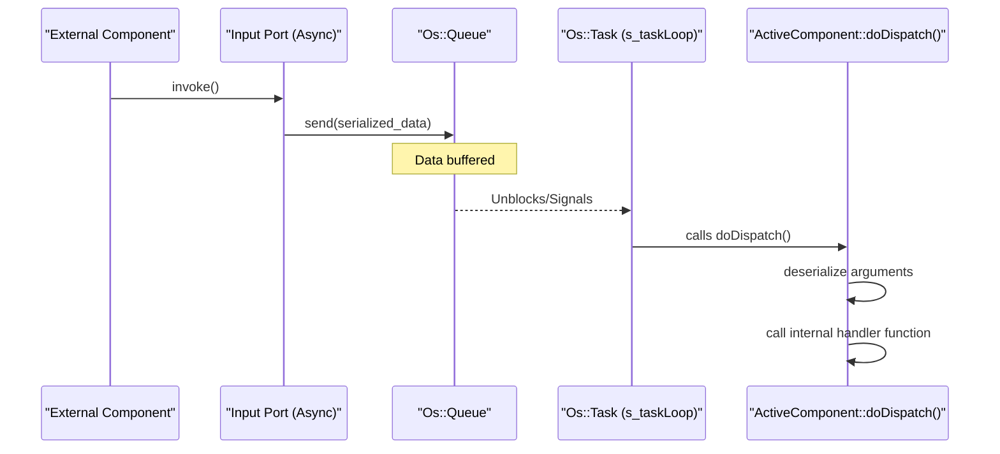
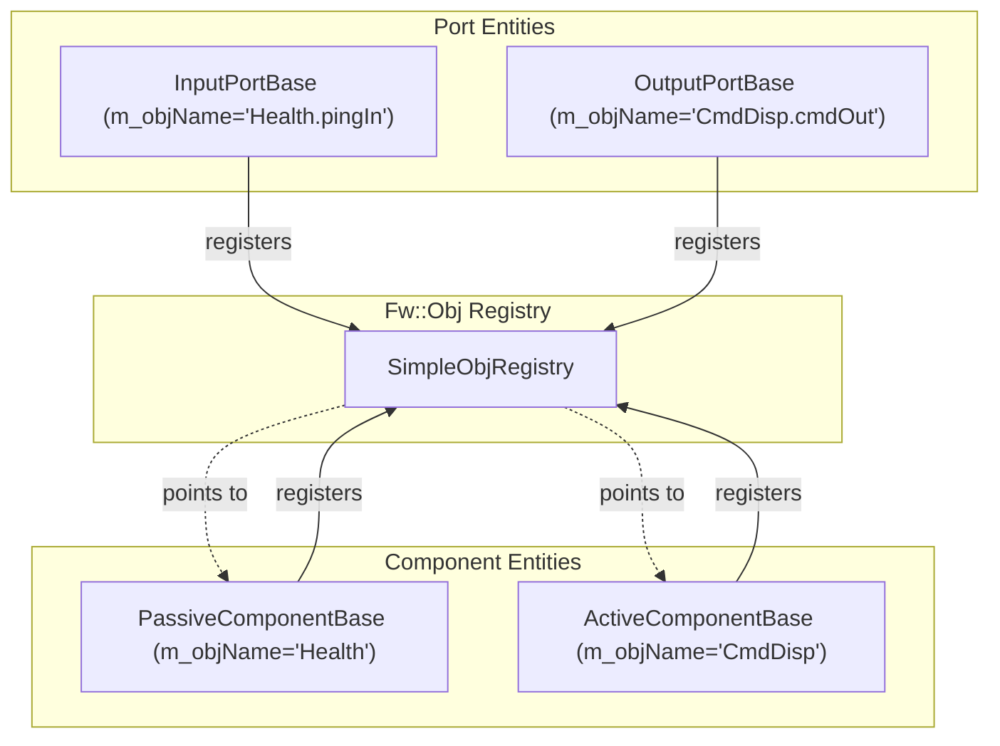

# Page: Component Base Classes and Ports

# Component Base Classes and Ports

<details>
<summary>Relevant source files</summary>

The following files were used as context for generating this wiki page:

- [CMakeLists.txt](CMakeLists.txt)
- [Drv/ByteStreamDriverModel/ByteStreamDriverModel.fpp](Drv/ByteStreamDriverModel/ByteStreamDriverModel.fpp)
- [Fpp/ToCpp.fpp](Fpp/ToCpp.fpp)
- [Fw/Buffer/Buffer.fpp](Fw/Buffer/Buffer.fpp)
- [Fw/Comp/ActiveComponentBase.cpp](Fw/Comp/ActiveComponentBase.cpp)
- [Fw/Comp/ActiveComponentBase.hpp](Fw/Comp/ActiveComponentBase.hpp)
- [Fw/Comp/PassiveComponentBase.cpp](Fw/Comp/PassiveComponentBase.cpp)
- [Fw/Comp/PassiveComponentBase.hpp](Fw/Comp/PassiveComponentBase.hpp)
- [Fw/Comp/QueuedComponentBase.cpp](Fw/Comp/QueuedComponentBase.cpp)
- [Fw/Comp/QueuedComponentBase.hpp](Fw/Comp/QueuedComponentBase.hpp)
- [Fw/Fpy/StatementArgBuffer.hpp](Fw/Fpy/StatementArgBuffer.hpp)
- [Fw/Log/Log.fpp](Fw/Log/Log.fpp)
- [Fw/Log/test/ut/LogTest.cpp](Fw/Log/test/ut/LogTest.cpp)
- [Fw/Obj/ObjBase.cpp](Fw/Obj/ObjBase.cpp)
- [Fw/Obj/SimpleObjRegistry.cpp](Fw/Obj/SimpleObjRegistry.cpp)
- [Fw/Port/InputPortBase.cpp](Fw/Port/InputPortBase.cpp)
- [Fw/Port/InputSerializePort.cpp](Fw/Port/InputSerializePort.cpp)
- [Fw/Port/OutputPortBase.cpp](Fw/Port/OutputPortBase.cpp)
- [Fw/Port/OutputSerializePort.cpp](Fw/Port/OutputSerializePort.cpp)
- [Fw/SerializableFile/SerializableFile.cpp](Fw/SerializableFile/SerializableFile.cpp)
- [Fw/SerializableFile/SerializableFile.hpp](Fw/SerializableFile/SerializableFile.hpp)
- [Fw/Tlm/TlmBuffer.hpp](Fw/Tlm/TlmBuffer.hpp)
- [Fw/Tlm/TlmPacket.hpp](Fw/Tlm/TlmPacket.hpp)
- [Fw/Tlm/test/ut/TlmTest.cpp](Fw/Tlm/test/ut/TlmTest.cpp)
- [Fw/Types/Types.fpp](Fw/Types/Types.fpp)
- [Ref/CMakeLists.txt](Ref/CMakeLists.txt)

</details>


In the F´ framework, the `Fw/Comp` and `Fw/Port` modules provide the foundational C++ classes that define how software units (Components) operate and communicate. Components are the primary units of execution, while Ports are the strongly-typed interfaces that connect them. This architecture enables a decoupled design where components only interact through defined interfaces, facilitating reuse and testability.

## Component Hierarchy and Base Classes

All F´ components inherit from a common hierarchy. This hierarchy defines three primary execution patterns: **Passive**, **Queued**, and **Active**.

### 1. PassiveComponentBase
The root of all component types is `Fw::PassiveComponentBase`. Passive components do not have their own thread or message queue. When an input port is invoked on a passive component, the logic executes immediately within the thread of the caller [Fw/Comp/PassiveComponentBase.hpp:10-34]().

*   **Instance ID**: Each component has a unique instance ID used for telemetry and command routing [Fw/Comp/PassiveComponentBase.cpp:37-40]().
*   **ID Base**: Provides a base offset for command opcodes, telemetry IDs, and event IDs to ensure uniqueness across the topology [Fw/Comp/PassiveComponentBase.cpp:46-52]().
*   **Object Registry**: Inherits from `Fw::ObjBase`, allowing it to be registered in the global object registry [Fw/Comp/PassiveComponentBase.hpp:10]().

### 2. QueuedComponentBase
Inheriting from `PassiveComponentBase`, the `Fw::QueuedComponentBase` adds an asynchronous message queue (`Os::Queue`). When an asynchronous input port is called, the data is serialized and placed into the queue rather than being executed immediately [Fw/Comp/QueuedComponentBase.hpp:20-52]().

*   **Message Dispatch**: It defines the `doDispatch()` pure virtual function, which is implemented by the autocoder to dequeue and route messages to handler functions [Fw/Comp/QueuedComponentBase.hpp:37]().
*   **Queue Management**: Provides `createQueue()` to initialize the underlying OS queue with a specific depth and message size [Fw/Comp/QueuedComponentBase.cpp:28-36]().
*   **Message Dropping**: Tracks messages dropped due to a full queue via `incNumMsgDropped()` and `getNumMsgsDropped()` [Fw/Comp/QueuedComponentBase.cpp:38-44]().

### 3. ActiveComponentBase
`Fw::ActiveComponentBase` inherits from `QueuedComponentBase` and adds an internal execution thread (`Os::Task`). This allows the component to autonomously process its queue [Fw/Comp/ActiveComponentBase.hpp:20-60]().

*   **Task Loop**: The component runs a continuous loop (`s_taskLoop`) that calls a state machine to handle its lifecycle [Fw/Comp/ActiveComponentBase.cpp:106-114]().
*   **Lifecycle Stages**: Components transition through `CREATED`, `DISPATCHING`, `FINALIZING`, and `DONE` via the `s_taskStateMachine` [Fw/Comp/ActiveComponentBase.cpp:69-104]().
*   **Preamble/Finalizer**: Provides virtual hooks for setup logic before the loop starts and cleanup logic after it exits [Fw/Comp/ActiveComponentBase.cpp:124-126]().
*   **Cooperative Tasks**: Supports cooperative threading where `dispatch()` returns `MSG_DISPATCH_EMPTY` instead of blocking if no messages are available [Fw/Comp/ActiveComponentBase.cpp:116-122]().

### Component Class Relationship
The following diagram illustrates the relationship between the base classes and the OS abstraction layer.

**Component Base Class Architecture**
```mermaid
classDiagram
    class ObjBase {
        <<Fw>>
        +init()
    }
    class PassiveComponentBase {
        <<Fw>>
        -m_idBase: FwIdType
        -m_instance: FwEnumStoreType
        +getIdBase()
        +getInstance()
    }
    class QueuedComponentBase {
        <<Fw>>
        #m_queue: Os::Queue
        #doDispatch()*
        +dispatchAvailableMessages()
    }
    class ActiveComponentBase {
        <<Fw>>
        -m_task: Os::Task
        -m_stage: Lifecycle
        +start()
        +exit()
        #preamble()
        #finalizer()
    }

    ObjBase <|-- PassiveComponentBase
    PassiveComponentBase <|-- QueuedComponentBase
    QueuedComponentBase <|-- ActiveComponentBase
    QueuedComponentBase ..> "Os::Queue" : uses
    ActiveComponentBase ..> "Os::Task" : uses
```
Sources: [Fw/Comp/PassiveComponentBase.hpp:10-34](), [Fw/Comp/QueuedComponentBase.hpp:20-52](), [Fw/Comp/ActiveComponentBase.hpp:20-60]()

---

## Ports and Component Wiring

Ports are the connectors between components. They come in two varieties: **Input Ports** (which receive data/calls) and **Output Ports** (which send data/calls).

### Port Base Classes
*   **InputPortBase**: Represents a port that receives a call. It stores a pointer to the component that owns it and a port number [Fw/Port/InputPortBase.cpp:8-13]().
*   **OutputPortBase**: Represents a port that initiates a call. It maintains a connection to an `InputPortBase` [Fw/Port/OutputPortBase.cpp:9-16]().
*   **Serialization Ports**: `InputSerializePort` and `OutputSerializePort` allow for generic data passing by treating port arguments as raw serialized buffers. This is used for routing messages through hubs or sequencers without knowing the specific port type [Fw/Port/OutputPortBase.cpp:23-34]().

### Message Dispatch Loop
For **Active Components**, the execution flow follows a specific dispatch loop. When a message arrives in the queue, the `Os::Task` wakes up and invokes the dispatcher.

**Active Component Dispatch Flow**

Sources: [Fw/Comp/ActiveComponentBase.cpp:86-90](), [Fw/Comp/ActiveComponentBase.cpp:116-122](), [Fw/Comp/QueuedComponentBase.cpp:46-56]()

---

## The Object Registry (`Fw::Obj`)

The framework maintains a global registry of all objects (Components and Ports) that inherit from `Fw::ObjBase`. This registry is used for system-wide introspection and discovery.

*   **Registration**: During initialization, components call `ObjBase::init()`, which adds the object to the registry if one is provided [Fw/Comp/PassiveComponentBase.cpp:37-40]().
*   **Naming**: If `FW_OBJECT_NAMES` is enabled, every component and port stores a string name, which is used for logging and debugging [Fw/Comp/ActiveComponentBase.cpp:41-45]().
*   **Introspection**: Tools can iterate through the registry to map out the topology at runtime via `Fw::SimpleObjRegistry` [Fw/Obj/SimpleObjRegistry.cpp]().

### System Initialization Phases
The setup of components and their registration follows a specific sequence, managed by the `Fpp::ToCpp` generated code:
1.  **instances**: Instantiate component objects [Fpp/ToCpp.fpp:8]().
2.  **initComponents**: Call `init()` on all components to register them and set instance IDs [Fpp/ToCpp.fpp:9]().
3.  **configComponents**: Set ID bases and other static configurations [Fpp/ToCpp.fpp:10]().
4.  **startTasks**: For active components, spawn the `Os::Task` [Fpp/ToCpp.fpp:14]().

**Object Registry Mapping**

Sources: [Fw/Comp/PassiveComponentBase.cpp:37-40](), [Fpp/ToCpp.fpp:5-19](), [Fw/Comp/ActiveComponentBase.cpp:41-45]()

---

## Specialized Buffers and Serialization

### State Machine and Sequencer Buffers
The framework includes specialized buffers for handling asynchronous transitions and arguments:
*   **Fw/Sm**: Provides signal buffers for state machine transitions.
*   **Fw/Fpy**: Includes `StatementArgBuffer` for `FpySequencer` argument passing [Fw/Fpy/StatementArgBuffer.hpp]().
*   **ActiveComponentExitSerializableBuffer**: A internal buffer used specifically to send an exit signal to an active component's queue [Fw/Comp/ActiveComponentBase.cpp:8-19]().

### Serializable File
The `Fw::SerializableFile` class provides a utility to save and load `Fw::Serializable` objects directly to/from the filesystem using a `MemAllocator` and `SerialBuffer` [Fw/SerializableFile/SerializableFile.hpp:23-41](). It ensures data integrity during persistence operations [Fw/SerializableFile/SerializableFile.cpp:34-84]().

---

## Summary of Key Functions

| Class | Function | Purpose |
| :--- | :--- | :--- |
| `ActiveComponentBase` | `start()` | Spawns the component's thread using `Os::Task` [Fw/Comp/ActiveComponentBase.cpp:35-52](). |
| `ActiveComponentBase` | `dispatch()` | Checks the queue and calls `doDispatch` to process messages [Fw/Comp/ActiveComponentBase.cpp:116-122](). |
| `ActiveComponentBase` | `exit()` | Sends a high-priority exit message to the internal queue [Fw/Comp/ActiveComponentBase.cpp:54-59](). |
| `QueuedComponentBase` | `createQueue()` | Initializes the `Os::Queue` with specific depth/size [Fw/Comp/QueuedComponentBase.cpp:28-36](). |
| `PassiveComponentBase` | `setIdBase()` | Sets the starting ID for the component's commands/telemetry [Fw/Comp/PassiveComponentBase.cpp:46-48](). |
| `OutputPortBase` | `invokeSerial()` | Sends a serialized buffer through a port connection [Fw/Port/OutputPortBase.cpp:30-33](). |

Sources: [Fw/Comp/ActiveComponentBase.cpp](), [Fw/Comp/QueuedComponentBase.cpp](), [Fw/Comp/PassiveComponentBase.cpp](), [Fw/Port/OutputPortBase.cpp](), [Fw/SerializableFile/SerializableFile.cpp]()
