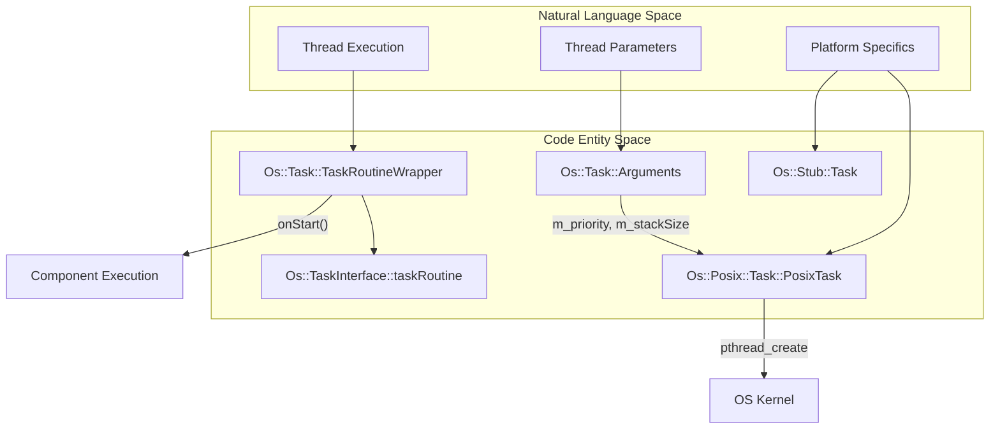
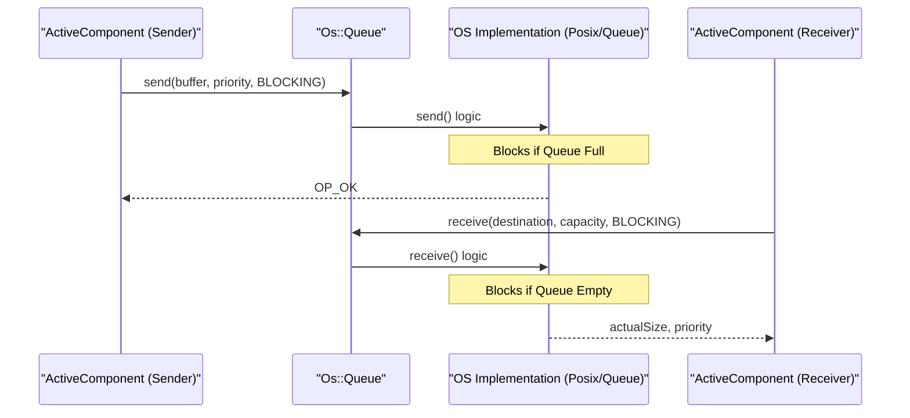

# Page: Concurrency Primitives: Tasks, Queues, and Mutexes

# Concurrency Primitives: Tasks, Queues, and Mutexes

Relevant source files

The following files were used as context for generating this wiki page:

- [Drv/Interfaces/AsyncByteStreamDriver.fpp](Drv/Interfaces/AsyncByteStreamDriver.fpp)
- [Drv/Interfaces/ByteStreamDriver.fpp](Drv/Interfaces/ByteStreamDriver.fpp)
- [Drv/Interfaces/CMakeLists.txt](Drv/Interfaces/CMakeLists.txt)
- [Fw/DataStructures/test/ut/ExternalArrayTest.cpp](Fw/DataStructures/test/ut/ExternalArrayTest.cpp)
- [Fw/Ports/SuccessCondition/CMakeLists.txt](Fw/Ports/SuccessCondition/CMakeLists.txt)
- [Fw/Ports/SuccessCondition/SuccessCondition.fpp](Fw/Ports/SuccessCondition/SuccessCondition.fpp)
- [Fw/Types/BasicTypes.h](Fw/Types/BasicTypes.h)
- [Fw/Types/ConstStringBase.cpp](Fw/Types/ConstStringBase.cpp)
- [Os/File.cpp](Os/File.cpp)
- [Os/FileSystem.cpp](Os/FileSystem.cpp)
- [Os/Generic/PriorityQueue.cpp](Os/Generic/PriorityQueue.cpp)
- [Os/Generic/PriorityQueue.hpp](Os/Generic/PriorityQueue.hpp)
- [Os/Generic/Types/test/ut/MaxHeap/MaxHeapTest.cpp](Os/Generic/Types/test/ut/MaxHeap/MaxHeapTest.cpp)
- [Os/Posix/DefaultTask.cpp](Os/Posix/DefaultTask.cpp)
- [Os/Posix/Task.cpp](Os/Posix/Task.cpp)
- [Os/Posix/Task.hpp](Os/Posix/Task.hpp)
- [Os/Queue.cpp](Os/Queue.cpp)
- [Os/Queue.hpp](Os/Queue.hpp)
- [Os/Stub/DefaultTask.cpp](Os/Stub/DefaultTask.cpp)
- [Os/Stub/Queue.cpp](Os/Stub/Queue.cpp)
- [Os/Stub/Queue.hpp](Os/Stub/Queue.hpp)
- [Os/Stub/Task.cpp](Os/Stub/Task.cpp)
- [Os/Stub/Task.hpp](Os/Stub/Task.hpp)
- [Os/Stub/test/DefaultTask.cpp](Os/Stub/test/DefaultTask.cpp)
- [Os/Stub/test/File.cpp](Os/Stub/test/File.cpp)
- [Os/Stub/test/Queue.cpp](Os/Stub/test/Queue.cpp)
- [Os/Stub/test/Queue.hpp](Os/Stub/test/Queue.hpp)
- [Os/Stub/test/Task.cpp](Os/Stub/test/Task.cpp)
- [Os/Stub/test/Task.hpp](Os/Stub/test/Task.hpp)
- [Os/Stub/test/ut/StubQueueTests.cpp](Os/Stub/test/ut/StubQueueTests.cpp)
- [Os/Task.cpp](Os/Task.cpp)
- [Os/Task.hpp](Os/Task.hpp)
- [Os/test/ut/directory/DirectoryRules.cpp](Os/test/ut/directory/DirectoryRules.cpp)
- [Os/test/ut/file/FileRules.cpp](Os/test/ut/file/FileRules.cpp)
- [Os/test/ut/file/SyntheticFileSystem.cpp](Os/test/ut/file/SyntheticFileSystem.cpp)
- [Os/test/ut/queue/CommonTests.cpp](Os/test/ut/queue/CommonTests.cpp)
- [Os/test/ut/queue/RulesHeaders.hpp](Os/test/ut/queue/RulesHeaders.hpp)
- [Svc/AssertFatalAdapter/test/ut/AssertFatalAdapterTester.cpp](Svc/AssertFatalAdapter/test/ut/AssertFatalAdapterTester.cpp)
- [Svc/CmdSplitter/test/ut/CmdSplitterTester.cpp](Svc/CmdSplitter/test/ut/CmdSplitterTester.cpp)
- [Svc/ComStub/CMakeLists.txt](Svc/ComStub/CMakeLists.txt)
- [Svc/ComStub/ComStub.cpp](Svc/ComStub/ComStub.cpp)
- [Svc/ComStub/ComStub.fpp](Svc/ComStub/ComStub.fpp)
- [Svc/ComStub/ComStub.hpp](Svc/ComStub/ComStub.hpp)
- [Svc/ComStub/docs/img/byte-stream.png](Svc/ComStub/docs/img/byte-stream.png)
- [Utils/TokenBucket.cpp](Utils/TokenBucket.cpp)
- [docs/how-to/implement-radio-manager.md](docs/how-to/implement-radio-manager.md)

The `Os` layer in F´ provides a platform-independent abstraction for core concurrency primitives. These abstractions allow the framework to run on diverse operating systems (Posix, FreeRTOS, RTEMS) or bare-metal environments by using a delegate pattern that separates the interface from the platform-specific implementation.

## Os::Task (Threads)

`Os::Task` represents an execution context or thread. It provides a standardized way to start, join, suspend, and delay execution across different operating systems.

### Task Lifecycle and Management
A task is initialized with `Os::Task::Arguments`, which defines the routine to execute, priority, stack size, and CPU affinity [Os/Task.hpp:72-102]().

*   **Start**: The `start()` method triggers the underlying OS thread creation. It uses an internal `TaskRoutineWrapper` to intercept the entry point, allowing the framework to perform setup (like calling `onStart()`) before executing the user-provided function [Os/Task.cpp:104-130]().
*   **Join**: Blocks the calling thread until the target task completes execution [Os/Task.cpp:141-156]().
*   **Delay**: Suspends the current task for a specified `Fw::TimeInterval`. In Posix, this maps to `nanosleep` or `usleep` logic [Os/Posix/Task.cpp:211-218]().
*   **Registry**: Tasks can be registered in a global `Os::TaskRegistry` to allow system-wide monitoring of thread health and states [Os/Task.cpp:65-68]().

### Platform Implementations
1.  **Posix**: Uses `pthread_create`. It supports advanced features like `pthread_setname_np` for debugging and `pthread_attr_setaffinity_np` for CPU pinning [Os/Posix/Task.cpp:108-141](). It handles stack size rounding to page size multiples [Os/Posix/Task.cpp:43-74]().
2.  **Baremetal/TaskRunner**: On systems without an OS, F´ uses a cooperative scheduler where "Tasks" are function pointers executed in a loop.
3.  **Stub**: Used for unit testing to simulate task behavior without actual threading, providing an injectable interface for state verification [Os/Stub/test/Task.cpp:25-36]().

**Task Data Flow and Entity Mapping**

Sources: [Os/Task.hpp:35-102](), [Os/Task.cpp:27-48](), [Os/Posix/Task.cpp:143-160]()

---

## Os::Queue (Inter-task Communication)

`Os::Queue` is the primary mechanism for asynchronous communication between active components. It provides a thread-safe FIFO or priority-based buffer for message passing.

### Key Features
*   **Blocking Modes**: Supports `BLOCKING` (caller waits for space/data) and `NONBLOCKING` (returns `FULL` or `EMPTY` immediately) [Os/Queue.hpp:46-49]().
*   **Priority Queuing**: Messages can be sent with a priority, allowing higher-priority commands or events to jump the queue [Os/Queue.hpp:99-102]().
*   **Serialization**: Queues typically store serialized F´ types (commands, telemetry, ports) using `Fw::SerializeBuffer` [Os/Queue.cpp:44-53]().

### Priority Queue Implementation
The `Os::Generic::PriorityQueue` provides a platform-agnostic priority queue using a Max-Heap [Os/Generic/PriorityQueue.cpp:115-133](). It uses an `Fw::MemAllocator` (specifically the `OS_GENERIC_PRIORITY_QUEUE` type) to manage internal buffers for indices, sizes, and raw data [Os/Generic/PriorityQueue.cpp:56-66]().

**Queue Interaction Diagram**

Sources: [Os/Queue.hpp:88-123](), [Os/Queue.cpp:44-72](), [Os/Stub/test/Queue.cpp:54-80](), [Os/Generic/PriorityQueue.cpp:45-155]()

---

## Mutexes and Synchronization

F´ provides wrappers for standard synchronization primitives to ensure thread safety within components (Guarded ports) and shared resources.

### Os::Mutex and ScopeLock
`Os::Mutex` provides a simple `lock()` and `unlock()` interface [Os/Mutex.hpp:26-35](). 
To prevent deadlock and ensure locks are released during exceptions or early returns, F´ heavily utilizes `Os::ScopeLock`.

*   **ScopeLock**: An RAII wrapper that locks a mutex upon construction and unlocks it upon destruction [Os/Task.cpp:178-180]().

### Os::ConditionVariable
Used for advanced signaling between threads. It allows a task to wait for a specific condition to become true while atomically releasing an associated mutex.

**Concurrency Entity Mapping**

| Concept | Code Entity | Role |
| :--- | :--- | :--- |
| Critical Section | `Os::Mutex` | Provides mutual exclusion [Os/Mutex.hpp:14-18]() |
| RAII Locking | `Os::ScopeLock` | Ensures safe lock release [Os/Task.cpp:178]() |
| Message Buffer | `Os::Queue` | Inter-thread data transfer [Os/Queue.hpp:27]() |
| Execution Unit | `Os::Task` | The thread of execution [Os/Task.hpp:35]() |

Sources: [Os/Mutex.hpp:14-35](), [Os/Task.cpp:177-185](), [Os/Posix/Task.cpp:34-36]()

---

## Baremetal Scheduling (TaskRunner)

In environments without a pre-emptive OS (Baremetal), concurrency is achieved through cooperative scheduling. 

*   **TaskRunner**: A specialized component that maintains a list of registered `Os::Task` objects.
*   **Cycle**: The `TaskRunner` is typically called within the main loop. It iterates through all tasks and executes their routines.
*   **Cooperation**: Tasks in this mode must be "cooperative," meaning they must return to the scheduler periodically rather than blocking indefinitely. The `isCooperative()` method identifies such tasks [Os/Task.cpp:58-60]().

Sources: [Os/Task.cpp:58-60](), [Os/Stub/DefaultTask.cpp:10-20](), [Os/Task.hpp:172-175]()
