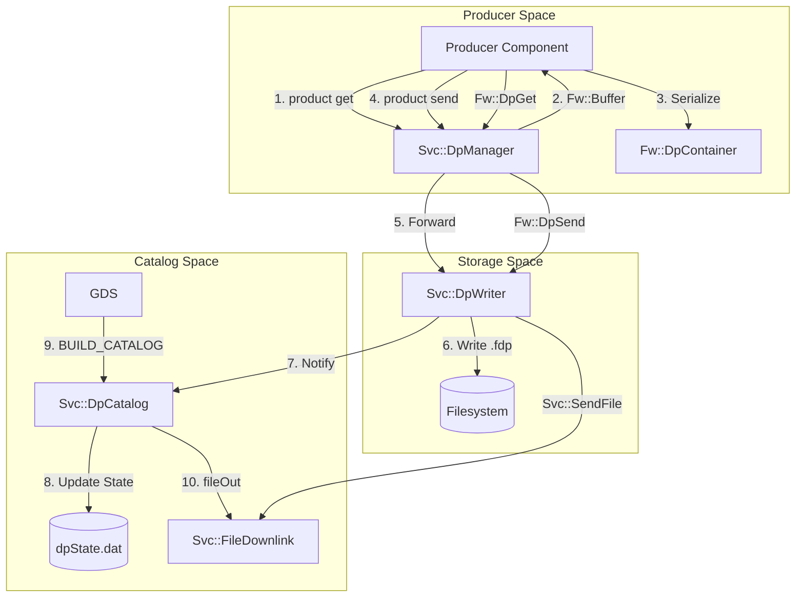

# Page: Data Products

# Data Products

<details>
<summary>Relevant source files</summary>

The following files were used as context for generating this wiki page:

- [FppTestProject/FppTest/array/main.cpp](FppTestProject/FppTest/array/main.cpp)
- [FppTestProject/FppTest/component/tests/CmdTests.hpp](FppTestProject/FppTest/component/tests/CmdTests.hpp)
- [FppTestProject/FppTest/component/tests/PortTests.hpp](FppTestProject/FppTest/component/tests/PortTests.hpp)
- [FppTestProject/FppTest/enum/EnumToStringTest.cpp](FppTestProject/FppTest/enum/EnumToStringTest.cpp)
- [FppTestProject/FppTest/enum/main.cpp](FppTestProject/FppTest/enum/main.cpp)
- [FppTestProject/FppTest/typed_tests/ArrayTest.hpp](FppTestProject/FppTest/typed_tests/ArrayTest.hpp)
- [FppTestProject/FppTest/typed_tests/EnumTest.hpp](FppTestProject/FppTest/typed_tests/EnumTest.hpp)
- [Fw/Dp/docs/sdd.md](Fw/Dp/docs/sdd.md)
- [Fw/Types/StringBase.cpp](Fw/Types/StringBase.cpp)
- [Fw/Types/StringBase.hpp](Fw/Types/StringBase.hpp)
- [Fw/Types/StringUtils.cpp](Fw/Types/StringUtils.cpp)
- [Fw/Types/StringUtils.hpp](Fw/Types/StringUtils.hpp)
- [Ref/DpDemo/CMakeLists.txt](Ref/DpDemo/CMakeLists.txt)
- [Ref/DpDemo/DpDemo.cpp](Ref/DpDemo/DpDemo.cpp)
- [Ref/DpDemo/DpDemo.hpp](Ref/DpDemo/DpDemo.hpp)
- [Ref/DpDemo/test/int/dp_demo_integration_test.py](Ref/DpDemo/test/int/dp_demo_integration_test.py)
- [Ref/DpDemo/test/int/dp_ref_output.json](Ref/DpDemo/test/int/dp_ref_output.json)
- [Ref/RecvBuffApp/docs/sdd.md](Ref/RecvBuffApp/docs/sdd.md)
- [Ref/SendBuffApp/docs/sdd.md](Ref/SendBuffApp/docs/sdd.md)
- [Ref/SignalGen/docs/sdd.md](Ref/SignalGen/docs/sdd.md)
- [Ref/Top/RefTopology.cpp](Ref/Top/RefTopology.cpp)
- [Ref/test/int/ref_integration_test.py](Ref/test/int/ref_integration_test.py)
- [Ref/test/int/test_seq.seq](Ref/test/int/test_seq.seq)
- [Svc/DpCatalog/.gitignore](Svc/DpCatalog/.gitignore)
- [Svc/DpCatalog/CMakeLists.txt](Svc/DpCatalog/CMakeLists.txt)
- [Svc/DpCatalog/DpCatalog.cpp](Svc/DpCatalog/DpCatalog.cpp)
- [Svc/DpCatalog/DpCatalog.fpp](Svc/DpCatalog/DpCatalog.fpp)
- [Svc/DpCatalog/DpCatalog.hpp](Svc/DpCatalog/DpCatalog.hpp)
- [Svc/DpCatalog/docs/sdd.md](Svc/DpCatalog/docs/sdd.md)
- [Svc/DpCatalog/test/ut/DpCatalogTestMain.cpp](Svc/DpCatalog/test/ut/DpCatalogTestMain.cpp)
- [Svc/DpCatalog/test/ut/DpCatalogTester.cpp](Svc/DpCatalog/test/ut/DpCatalogTester.cpp)
- [Svc/DpCatalog/test/ut/DpCatalogTester.hpp](Svc/DpCatalog/test/ut/DpCatalogTester.hpp)
- [Svc/Subtopologies/CdhCore/CdhCoreConfig/CdhCoreConfig.fpp](Svc/Subtopologies/CdhCore/CdhCoreConfig/CdhCoreConfig.fpp)
- [Svc/Subtopologies/ComCcsds/ComCcsdsConfig/ComCcsdsConfig.fpp](Svc/Subtopologies/ComCcsds/ComCcsdsConfig/ComCcsdsConfig.fpp)
- [Svc/Subtopologies/ComFprime/ComFprimeConfig/ComFprimeConfig.fpp](Svc/Subtopologies/ComFprime/ComFprimeConfig/ComFprimeConfig.fpp)
- [Svc/Subtopologies/ComLoggerTee/ComLoggerTeeConfig/ComLoggerTeeConfig.fpp](Svc/Subtopologies/ComLoggerTee/ComLoggerTeeConfig/ComLoggerTeeConfig.fpp)
- [Svc/Subtopologies/DataProducts/DataProductsConfig/DataProductsConfig.fpp](Svc/Subtopologies/DataProducts/DataProductsConfig/DataProductsConfig.fpp)
- [Svc/Subtopologies/FileHandling/FileHandlingConfig/FileHandlingConfig.fpp](Svc/Subtopologies/FileHandling/FileHandlingConfig/FileHandlingConfig.fpp)
- [docs/user-manual/framework/data-products.md](docs/user-manual/framework/data-products.md)

</details>


The F´ Data Product (DP) system provides a standardized mechanism for managing, storing, and downlinking large or structured data sets that are too large for standard telemetry channels. Unlike telemetry, which is typically sampled and pushed, Data Products are containerized, stored to non-volatile memory, and can be cataloged for reliable downlink.

## Overview and Core Concepts

The DP system is built around three primary constructs:
1.  **Records**: Individual data entries defined in FPP [docs/user-manual/framework/data-products.md:162-167]().
2.  **Containers**: Logical groupings of records that are serialized together with a header [docs/user-manual/framework/data-products.md:21-28]().
3.  **The Dictionary**: Metadata describing the structure of containers and records for ground-side decoding [docs/user-manual/framework/data-products.md:30-33]().

### Data Flow Architecture
The following diagram illustrates the lifecycle of a Data Product from generation in a component to downlink via the `DpCatalog`.

**Data Product System Flow**

Sources: [docs/user-manual/framework/data-products.md:59-72](), [docs/user-manual/framework/data-products.md:88-99]()

## Key Framework Classes

### Fw::DpContainer
The `Fw::DpContainer` is the base class for all data product containers. It wraps an `Fw::Buffer` and manages the DP header, which includes the DP ID, priority, and time tag [docs/user-manual/framework/data-products.md:25-28]().
*   **Header Serialization**: Handles the standardized header required for ground systems to identify the product.
*   **Buffer Management**: Acts as a wrapper around the raw memory allocated by a `BufferManager`.

### Svc::DpManager
The `DpManager` acts as the central hub for DP requests within a topology [docs/user-manual/framework/data-products.md:59-62]().
*   **Allocation**: It receives `product get` or `product request` calls and coordinates with a `BufferManager` to provide memory [docs/user-manual/framework/data-products.md:117-133]().
*   **Routing**: Once a component completes a container, it sends it back to `DpManager` via a `product send` port, which then routes it to the configured `DpWriter` [docs/user-manual/framework/data-products.md:145-150]().

### Svc::DpWriter
The `DpWriter` is responsible for persisting containers to disk [docs/user-manual/framework/data-products.md:64-67]().
*   **File Naming**: It generates unique filenames (typically with `.fdp` extension) based on the DP ID and timestamp.
*   **Serialization**: It writes the `Fw::DpContainer` (header + data) to the filesystem.
*   **Notification**: After a successful write, it emits a `FileWritten` event and can notify the `DpCatalog` [Ref/DpDemo/test/int/dp_demo_integration_test.py:19-22]().

### Svc::DpCatalog
The `DpCatalog` manages the inventory of stored data products [docs/user-manual/framework/data-products.md:69-72]().
*   **State Management**: It maintains a persistent state file (e.g., `dpState.dat`) to track which products have been downlinked [Svc/DpCatalog/test/ut/DpCatalogTester.cpp:48-49]().
*   **Prioritization**: It uses a binary tree to determine the order of downlink based on DP priority [Svc/DpCatalog/test/ut/DpCatalogTester.cpp:68-74]().
*   **Downlink Integration**: It interfaces with `Svc::FileDownlink` to move `.fdp` files to the ground via the `fileOut` port [Svc/DpCatalog/test/ut/DpCatalogTester.cpp:92-98]().

Sources: [Svc/DpCatalog/DpCatalog.hpp:11-30](), [Svc/DpCatalog/test/ut/DpCatalogTester.cpp:42-51](), [Svc/DpCatalog/test/ut/DpCatalogTester.cpp:142-150]()

## FPP Syntax for Data Products

Data Products are defined in FPP using `product record` and `product container` blocks. The FPP autocoder generates C++ classes that handle the type-safe serialization of these records into a container.

### Example Definition
```fpp
# A record containing a variable-size array
product record F32ArrayRecord: F32 array id 0x01

# A container grouping records
product container MyContainer {
  id 0x10
  priority 10
  default priority 20
}
```
Sources: [docs/user-manual/framework/data-products.md:181-190](), [docs/user-manual/framework/data-products.md:200-205]()

### Component Integration
A component using data products must define the appropriate ports in its FPP file:
```fpp
product get port productGetOut
product send port productSendOut
async product recv port productRecvIn # For async requests
product request port productRequestOut # For async requests
```
Sources: [docs/user-manual/framework/data-products.md:113-150]()

## Reference Implementation: DpDemo

The `DpDemo` component in the `Ref` deployment serves as the primary example for using the DP system.

| Action | Port / Command | Description |
| :--- | :--- | :--- |
| **Request** | `productGetOut` | Requests a buffer from `DpManager`. |
| **Process** | Internal | Serializes records into the container. |
| **Send** | `productSendOut` | Dispatches the filled container for writing. |
| **Command** | `Dp` | Triggers a demo DP generation in `dpDemo` [Ref/DpDemo/test/int/dp_demo_integration_test.py:11](). |

### Integration Testing
Integration tests verify that DPs are written to disk and can be decoded by the GDS.
*   **File Verification**: Tests check for the `FileWritten` event from `DataProducts.dpWriter` [Ref/DpDemo/test/int/dp_demo_integration_test.py:19-22]().
*   **Decoding**: The `DataProductDecoder` (part of `fprime-gds`) is used to convert binary `.fdp` files into human-readable JSON using the generated DP dictionary [Ref/DpDemo/test/int/dp_demo_integration_test.py:43-45]().

Sources: [Ref/DpDemo/test/int/dp_demo_integration_test.py:7-26](), [Ref/DpDemo/test/int/dp_demo_integration_test.py:28-46]()

## Data Product Dictionary

The Data Product Dictionary is a metadata file generated during the build process. It maps DP IDs to their structural definitions (records, types, and offsets).
*   **Generation**: Produced by the `fpp-to-dict` tool during the autocoding phase.
*   **Usage**: The Ground Data System (GDS) uses this dictionary to parse the raw bytes in an `.fdp` file back into individual records [Ref/DpDemo/test/int/dp_demo_integration_test.py:43-45]().

## Topology Integration

Subtopologies like `DataProducts` provide pre-configured bundles of the DP service components.

**Configuration Example (Ccsds Subtopology)**
```fpp
module ComCcsdsConfig {
    module QueueDepths {
        constant file = 100 # Queue depth for DP file downlink
    }
    module QueuePriorities {
        constant file = 1 # Priority for DP file downlink
    }
}
```
Sources: [Svc/Subtopologies/ComCcsds/ComCcsdsConfig/ComCcsdsConfig.fpp:21-31](), [Svc/Subtopologies/FileHandling/FileHandlingConfig/FileHandlingConfig.fpp:26-31]()
