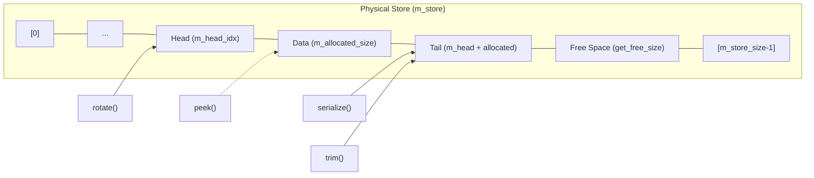
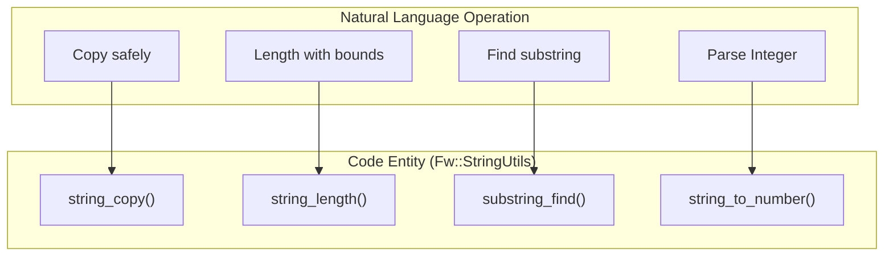
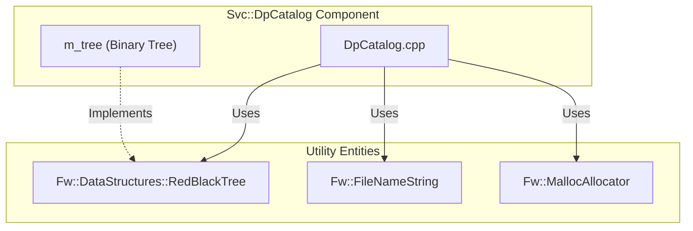

# Page: Data Structure Utilities

# Data Structure Utilities

Relevant source files

The following files were used as context for generating this wiki page:

- [Fw/Types/CMakeLists.txt](Fw/Types/CMakeLists.txt)
- [Fw/Types/format.hpp](Fw/Types/format.hpp)
- [Fw/Types/scan.hpp](Fw/Types/scan.hpp)
- [Fw/Types/sscanf_scan.cpp](Fw/Types/sscanf_scan.cpp)
- [Fw/Types/test/ut/ScanfScanTest.cpp](Fw/Types/test/ut/ScanfScanTest.cpp)
- [Ref/SignalGen/SignalGen.fpp](Ref/SignalGen/SignalGen.fpp)
- [STest/STest/Scenario/RandomScenario.hpp](STest/STest/Scenario/RandomScenario.hpp)
- [Utils/Types/CMakeLists.txt](Utils/Types/CMakeLists.txt)
- [Utils/Types/CircularBuffer.cpp](Utils/Types/CircularBuffer.cpp)
- [Utils/Types/CircularBuffer.hpp](Utils/Types/CircularBuffer.hpp)
- [Utils/Types/Queue.cpp](Utils/Types/Queue.cpp)
- [Utils/Types/Queue.hpp](Utils/Types/Queue.hpp)
- [Utils/Types/test/ut/CircularBuffer/CircularRules.cpp](Utils/Types/test/ut/CircularBuffer/CircularRules.cpp)
- [Utils/Types/test/ut/CircularBuffer/CircularRules.hpp](Utils/Types/test/ut/CircularBuffer/CircularRules.hpp)
- [Utils/Types/test/ut/CircularBuffer/CircularState.cpp](Utils/Types/test/ut/CircularBuffer/CircularState.cpp)
- [Utils/Types/test/ut/CircularBuffer/CircularState.hpp](Utils/Types/test/ut/CircularBuffer/CircularState.hpp)
- [Utils/Types/test/ut/CircularBuffer/Main.cpp](Utils/Types/test/ut/CircularBuffer/Main.cpp)
- [cmake/config_assembler.cmake](cmake/config_assembler.cmake)
- [cmake/implementation.cmake](cmake/implementation.cmake)
- [cmake/platform/unix/Platform/CMakeLists.txt](cmake/platform/unix/Platform/CMakeLists.txt)
- [cmake/test/data/TestDeployment/CMakeLists.txt](cmake/test/data/TestDeployment/CMakeLists.txt)
- [cmake/test/data/cmake/target/test_recursion.cmake](cmake/test/data/cmake/target/test_recursion.cmake)
- [cmake/test/data/test-fprime-library/cmake/toolchain/generic-native.cmake](cmake/test/data/test-fprime-library/cmake/toolchain/generic-native.cmake)
- [cmake/test/data/test-implementations/Deployment/CMakeLists.txt](cmake/test/data/test-implementations/Deployment/CMakeLists.txt)
- [cmake/test/src/test_feature.py](cmake/test/src/test_feature.py)
- [cmake/test/src/test_ref_shared.py](cmake/test/src/test_ref_shared.py)
- [cmake/test/src/test_unittests.py](cmake/test/src/test_unittests.py)

F´ provides a suite of data structure utilities designed for embedded flight software constraints, including memory safety, determinism, and performance. These are divided into two primary locations: `Utils/Types` for low-level byte-level manipulation and `Fw/DataStructures` for higher-level template-based containers.

## Circular Buffer

The `Utils::Types::CircularBuffer` is a ring buffer implementation designed to efficiently store and retrieve data from an externally supplied memory store [Utils/Types/CircularBuffer.hpp:4-6](). It is commonly used for byte-stream buffering, such as in communication drivers or telemetry framing.

### Key Characteristics
- **External Storage**: Does not allocate its own memory; it must be initialized with a pointer and size via the constructor or `setup()` [Utils/Types/CircularBuffer.cpp:29-40]().
- **Non-Overwriting**: By default, `serialize` calls will fail with `Fw::FW_SERIALIZE_NO_ROOM_LEFT` if the buffer is full, rather than overwriting old data [Utils/Types/CircularBuffer.cpp:61-63]().
- **Peeking**: Supports reading data without advancing the head index. It provides overloads for `char`, `U8`, `U32`, and raw `U8*` buffers [Utils/Types/CircularBuffer.cpp:77-127]().
- **High Water Mark**: Tracks the maximum amount of memory used (allocated size) since the last reset [Utils/Types/CircularBuffer.cpp:156-158]().

### Implementation Details
The buffer maintains a `m_head_idx` and `m_allocated_size` [Utils/Types/CircularBuffer.hpp:159-161](). The tail (write) index is calculated dynamically using `advance_idx(m_head_idx, m_allocated_size)` [Utils/Types/CircularBuffer.cpp:65]().

| Function | Description |
|---|---|
| `serialize` | Adds bytes to the back of the buffer. Returns `FW_SERIALIZE_OK` on success [Utils/Types/CircularBuffer.cpp:57-75](). |
| `peek` | Reads bytes from an `offset` relative to the head without moving the head [Utils/Types/CircularBuffer.cpp:112-127](). |
| `rotate` | Advances the head index by `amount`, effectively deleting data from the front [Utils/Types/CircularBuffer.cpp:129-138](). |
| `trim` | Reduces the `m_allocated_size` from the back (opposite of rotate) [Utils/Types/CircularBuffer.cpp:140-149](). |

**Circular Buffer Data Flow**
Title: Circular Buffer Index Management

Sources: [Utils/Types/CircularBuffer.hpp:154-164](), [Utils/Types/CircularBuffer.cpp:52-75]()

## Fw::DataStructures Library

The `Fw/DataStructures` library provides C++ templates for common collections. Many of these come in two flavors: standard (internal storage) and "External" (using caller-provided memory).

### Red-Black Tree
The `Fw::DataStructures::RedBlackTree` (and its Map/Set derivatives) provides a balanced binary search tree. This is used in the framework for tasks requiring ordered data with $O(\log n)$ lookup, such as the `Svc::DpCatalog` component which organizes Data Product records [Svc/DpCatalog/DpCatalog.cpp:68-73]().

### List of Core Structures
- **Array / ExternalArray**: Fixed-size or externally-backed contiguous storage.
- **Stack / ExternalStack**: LIFO (Last-In-First-Out) container.
- **FifoQueue / ExternalFifoQueue**: FIFO (First-In-First-Out) container.
- **RedBlackTreeMap / RedBlackTreeSet**: Balanced tree for key-value pairs or unique keys.
- **ArrayMap / ArraySet**: Map/Set implementations backed by a simple array for very small collections where $O(n)$ search is acceptable.
- **CircularIndex**: Utility for safe increment/decrement with wrapping.
- **Nil**: A sentinel type used to represent empty or null entries in template structures.

Sources: [Fw/Types/CMakeLists.txt:4-24](), [Ref/SignalGen/SignalGen.fpp:14-16]()

## String Utilities

F´ provides `Fw::StringUtils` to handle C-style strings safely, avoiding common pitfalls of standard library functions like `strncpy`.

### Key Functions
- **`string_copy`**: Guarantees null-termination of the destination buffer [Fw/Types/StringUtils.cpp:7-22]().
- **`string_length`**: Returns the length of a string bounded by a maximum buffer size to prevent memory overruns [Fw/Types/StringUtils.cpp:24-33]().
- **`substring_find` / `substring_find_last`**: Search for substrings within a bounded source [Fw/Types/StringUtils.cpp:35-128]().
- **`string_to_number`**: Converts strings to various integer types (U64, I64, U32, etc.) with support for multiple bases and range checking [Fw/Types/StringUtils.cpp:16]().

**String Logic to Code Mapping**
Title: String Utility Mapping

Sources: [Fw/Types/StringUtils.cpp:7-128](), [Fw/Types/StringBase.cpp:1-15]()

## Throttling Utilities

To prevent event or log floods, F´ provides utilities in the `Utils` namespace for rate limiting.

### Utils::RateLimiter
Provides a simple mechanism to allow an action only if a certain time interval has passed since the last action. It is frequently used in component `Sched` or `Log` handlers to throttle recurring error messages.

### Utils::TokenBucket
Implements a token bucket algorithm for bursty but rate-limited execution. It allows for a specific "burst" capacity of actions while maintaining a long-term average rate.

## Queue Utilities

The `Utils::Types::Queue` provides a lightweight wrapper around `Os::Queue` for components that need simple message passing without the full overhead of an Active Component [Utils/Types/Queue.hpp:14-20]().

### Usage in Svc::DpCatalog
The `Svc::DpCatalog` component utilizes these utilities to manage its internal state and command processing. It uses a binary tree to maintain an ordered list of data products for transmission.

**Component Utility Integration**
Title: DpCatalog Data Structure Usage

Sources: [Fw/Types/MallocAllocator.cpp:9](), [Utils/Types/Queue.cpp:10-20]()
