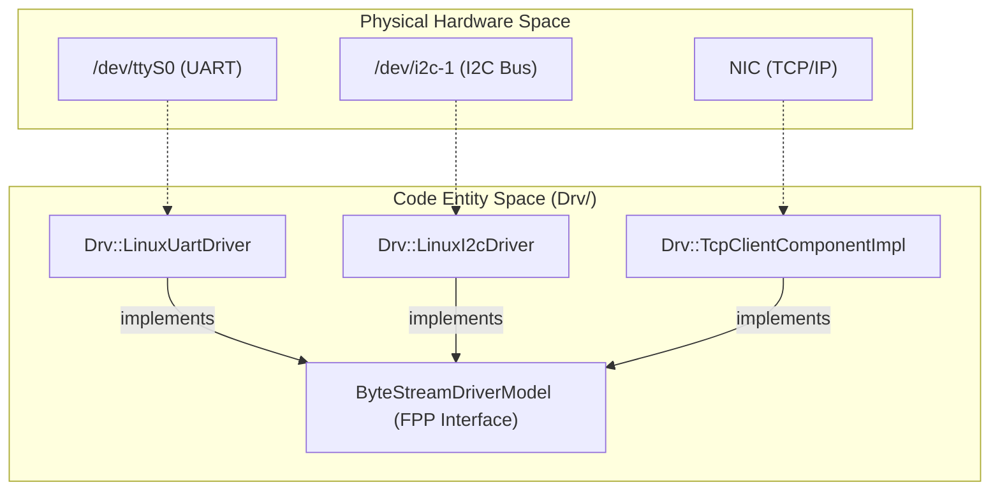
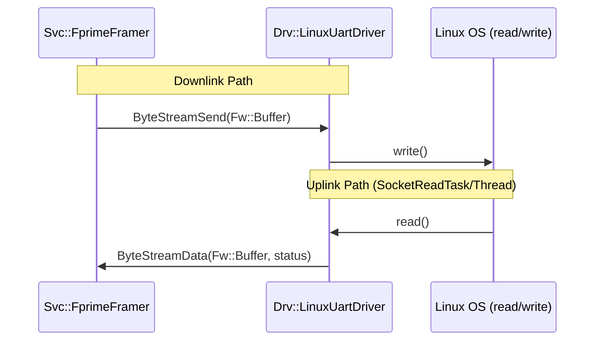

# Page: Driver Layer (Drv)

# Driver Layer (Drv)

Relevant source files

The following files were used as context for generating this wiki page:

- [CMakeLists.txt](CMakeLists.txt)
- [Drv/ByteStreamDriverModel/ByteStreamDriverModel.fpp](Drv/ByteStreamDriverModel/ByteStreamDriverModel.fpp)
- [Drv/CMakeLists.txt](Drv/CMakeLists.txt)
- [Fw/Types/Types.fpp](Fw/Types/Types.fpp)
- [Ref/CMakeLists.txt](Ref/CMakeLists.txt)
- [Svc/LinuxTimer/CMakeLists.txt](Svc/LinuxTimer/CMakeLists.txt)

The Driver Layer (`Drv/`) provides the hardware abstraction and communication interface for an F´ deployment. It separates platform-specific hardware interactions from the platform-independent application logic. Most drivers in F´ follow the **ByteStreamDriverModel**, providing a consistent interface for components to send and receive streams of bytes regardless of the underlying transport (UART, TCP, SPI, etc.).

## ByteStreamDriverModel

The `ByteStreamDriverModel` is the standard architectural pattern for drivers that implement a "stream of bytes" interface [Drv/ByteStreamDriverModel/ByteStreamDriverModel.fpp:1-27](). It defines a uniform set of ports for bidirectional communication, allowing higher-level service components like Framers and Deframers to be swapped across different hardware backends without code changes.

### Key Interfaces
The model supports both synchronous and asynchronous operations through standardized FPP port definitions:
*   **ByteStreamSend**: A synchronous port used to send data out through the byte stream. It takes an `Fw.Buffer` and returns a `ByteStreamStatus` [Drv/ByteStreamDriverModel/ByteStreamDriverModel.fpp:20-22]().
*   **ByteStreamData**: A port used for receiving data from the driver or as a callback for an asynchronous send call. it provides an `Fw.Buffer` and a `ByteStreamStatus` [Drv/ByteStreamDriverModel/ByteStreamDriverModel.fpp:14-17]().
*   **ByteStreamReady**: A signal indicating the driver is ready to send and receive data [Drv/ByteStreamDriverModel/ByteStreamDriverModel.fpp:25]().

### Status Codes
The `ByteStreamStatus` enum defines the result of driver operations:
| Status | Value | Description |
| :--- | :--- | :--- |
| `OP_OK` | 0 | Operation worked as expected [Drv/ByteStreamDriverModel/ByteStreamDriverModel.fpp:5](). |
| `SEND_RETRY` | 1 | Data send should be retried [Drv/ByteStreamDriverModel/ByteStreamDriverModel.fpp:6](). |
| `RECV_NO_DATA` | 2 | Receive worked, but there was no data [Drv/ByteStreamDriverModel/ByteStreamDriverModel.fpp:7](). |
| `OTHER_ERROR` | 3 | Error occurred, retrying may succeed [Drv/ByteStreamDriverModel/ByteStreamDriverModel.fpp:8](). |

**Sources:** [Drv/ByteStreamDriverModel/ByteStreamDriverModel.fpp:1-27](), [Drv/CMakeLists.txt:10]()

## IP and Socket Drivers

The IP driver suite provides network-based communication components. These are commonly used for ground-to-spacecraft links during development or for inter-processor communication over Ethernet.

*   **TcpClientComponentImpl**: Implements a TCP client that connects to a remote server [Drv/CMakeLists.txt:17]().
*   **TcpServerComponentImpl**: Implements a TCP server that listens for incoming connections [Drv/CMakeLists.txt:18]().
*   **UdpComponentImpl**: Implements connectionless UDP communication [Drv/CMakeLists.txt:19]().
*   **SocketReadTask**: A helper that manages the blocking read loop for socket interfaces, ensuring the component remains responsive while waiting for data.

For detailed implementation and configuration, see **[IP and Socket Drivers](#6.1)**.

**Sources:** [Drv/CMakeLists.txt:16-20]()

## Linux Hardware Drivers

F´ includes a variety of drivers for standard Linux hardware interfaces. These components wrap Linux system calls into F´ ports, often restricted to Linux-compatible platforms [Svc/LinuxTimer/CMakeLists.txt:8]().

*   **LinuxUartDriver**: Provides serial communication via Linux UART interfaces [Drv/CMakeLists.txt:14]().
*   **LinuxI2cDriver**: Provides I2C bus master capabilities [Drv/CMakeLists.txt:12]().
*   **LinuxSpiDriver**: Implements SPI bus communication [Drv/CMakeLists.txt:13]().
*   **LinuxGpioDriver**: Controls General Purpose Input/Output pins using standard logic states like `LOW` and `HIGH` [Drv/CMakeLists.txt:11](), [Fw/Types/Types.fpp:38-41]().

For details on hardware-specific configurations and threading models, see **[Linux Hardware Drivers](#6.2)**.

**Sources:** [Drv/CMakeLists.txt:11-15](), [Fw/Types/Types.fpp:38-41](), [Svc/LinuxTimer/CMakeLists.txt:8]()

## Application-Manager-Driver Pattern

Drivers in F´ are typically used within the **Application-Manager-Driver** pattern. This design splits hardware management into two distinct layers:
1.  **Bus Driver**: Handles the platform-specific bus protocol (e.g., `LinuxI2cDriver`).
2.  **Device Manager**: Implements the logic for a specific device (e.g., an IMU or Radio) using the bus driver's ports.

### Hardware-to-Code Mapping
The following diagram illustrates how physical hardware entities map to specific code entities within the Drv layer.

**Driver Layer Entity Mapping**

**Sources:** [Drv/ByteStreamDriverModel/ByteStreamDriverModel.fpp:1-27](), [Drv/CMakeLists.txt:11-19]()

## Component Interaction Overview

The Driver layer acts as the entry and exit point for all external data. It interfaces heavily with `Svc` layer components for framing and buffer management.

**Driver Data Flow**

**Sources:** [Drv/ByteStreamDriverModel/ByteStreamDriverModel.fpp:14-23](), [Drv/CMakeLists.txt:14-17]()

## Related Child Pages
*   **[IP and Socket Drivers](#6.1)**: Deep dive into `TcpClient`, `TcpServer`, and `Udp` components.
*   **[Linux Hardware Drivers](#6.2)**: Detailed documentation for `LinuxUartDriver`, `LinuxI2cDriver`, `LinuxSpiDriver`, and `LinuxGpioDriver`.
