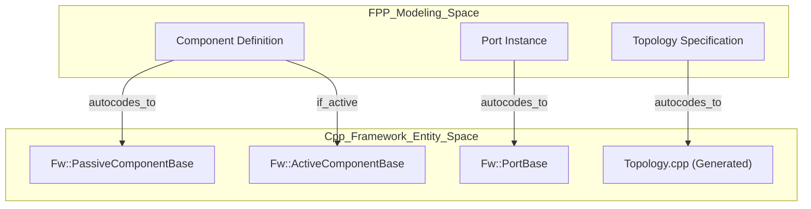
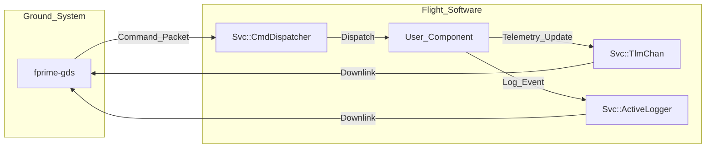

# Page: F´ (F Prime) Framework Overview

# F´ (F Prime) Framework Overview

Relevant source files

The following files were used as context for generating this wiki page:

- [.gitignore](.gitignore)
- [.nav.yml](.nav.yml)
- [.pre-commit-config.yaml](.pre-commit-config.yaml)
- [Fw/Ports/CompletionStatus/CMakeLists.txt](Fw/Ports/CompletionStatus/CMakeLists.txt)
- [Fw/Ports/CompletionStatus/CompletionStatus.fpp](Fw/Ports/CompletionStatus/CompletionStatus.fpp)
- [Fw/Ports/Signal/CMakeLists.txt](Fw/Ports/Signal/CMakeLists.txt)
- [Fw/Ports/Signal/Signal.fpp](Fw/Ports/Signal/Signal.fpp)
- [README.md](README.md)
- [Ref/README.md](Ref/README.md)
- [Svc/Ccsds/TmFramer/TmFramer.hpp](Svc/Ccsds/TmFramer/TmFramer.hpp)
- [docs/INSTALL.md](docs/INSTALL.md)
- [docs/getting-started/index.md](docs/getting-started/index.md)
- [docs/img/fprime-logo.png](docs/img/fprime-logo.png)
- [docs/img/fprime-logo.svg](docs/img/fprime-logo.svg)
- [docs/index.md](docs/index.md)
- [docs/mkdocs.yml](docs/mkdocs.yml)
- [docs/reference/fprime-translations.md](docs/reference/fprime-translations.md)
- [docs/reference/gds-plugins/communications.md](docs/reference/gds-plugins/communications.md)
- [docs/reference/gds-plugins/data-handler.md](docs/reference/gds-plugins/data-handler.md)
- [docs/reference/gds-plugins/framing.md](docs/reference/gds-plugins/framing.md)
- [docs/reference/gds-plugins/gds-app.md](docs/reference/gds-plugins/gds-app.md)
- [docs/reference/gds-plugins/gds-function.md](docs/reference/gds-plugins/gds-function.md)
- [docs/tutorials/index.md](docs/tutorials/index.md)
- [docs/user-manual/design-patterns/common-port-patterns.md](docs/user-manual/design-patterns/common-port-patterns.md)
- [docs/user-manual/design-patterns/health-checking.md](docs/user-manual/design-patterns/health-checking.md)
- [docs/user-manual/design-patterns/manager-worker.md](docs/user-manual/design-patterns/manager-worker.md)
- [docs/user-manual/framework/run-baremetal.md](docs/user-manual/framework/run-baremetal.md)
- [docs/user-manual/framework/run-multi-core.md](docs/user-manual/framework/run-multi-core.md)
- [docs/user-manual/index.md](docs/user-manual/index.md)
- [docs/user-manual/overview/01-full-intro.md](docs/user-manual/overview/01-full-intro.md)

F´ (F Prime) is a component-driven framework designed for the rapid development and deployment of spaceflight and embedded software applications. Originally developed at NASA’s Jet Propulsion Laboratory (JPL), F´ is flight-proven and tailored for systems ranging from CubeSats and SmallSats to complex robotic instruments [README.md:1-10]().

The framework provides a complete ecosystem including a C++ runtime, a modeling language (FPP) for architectural specification, a suite of reusable service components, and a ground data system (GDS) for testing and operations [README.md:12-20]().

### Key Design Goals
*   **Reusability:** Capture common embedded patterns into a reusable framework [docs/user-manual/overview/01-full-intro.md:25]().
*   **Modularity:** Decompose software into discrete components with well-defined interfaces [docs/user-manual/overview/01-full-intro.md:26]().
*   **Portability:** Easily adapt to new architectures (Linux, macOS, RTOS, Baremetal) [docs/user-manual/overview/01-full-intro.md:29-32]().
*   **Testability:** Isolate components to enable high-coverage unit and integration testing [docs/user-manual/overview/01-full-intro.md:27]().

---

### Core Concepts: Components, Ports, and Topologies

F´ architectures are defined by three primary constructs that bridge the gap between high-level design and C++ implementation.

| Concept | Description | Code Entity / Implementation |
| :--- | :--- | :--- |
| **Component** | A discrete unit of software logic. | Subclasses of `Fw::PassiveComponentBase`, `QueuedComponentBase`, or `ActiveComponentBase` [docs/user-manual/overview/01-full-intro.md:47-52](). |
| **Port** | An interface point for communication between components. | Subclasses of `Fw::InputPortBase` and `Fw::OutputPortBase` [docs/user-manual/overview/01-full-intro.md:49-50](). |
| **Topology** | The graph of interconnected components. | Generated C++ code that instantiates and connects components via `set_<port>_OutputPort` calls [docs/user-manual/overview/01-full-intro.md:50-51](). |

#### Architecture Mapping: Model to Code
The following diagram illustrates how FPP modeling concepts map to the underlying C++ framework classes.

**Diagram: Architectural Entity Mapping**

Sources: [docs/user-manual/overview/01-full-intro.md:47-64](), [README.md:14-18]()

---

### Command and Data Handling (C&DH)

While F´ can model any system, it includes built-in support for standard spacecraft C&DH patterns. These are implemented as specialized port types and service components.

*   **Commands:** Instructions sent from the ground or sequencers to components [docs/user-manual/overview/01-full-intro.md:54-55]().
*   **Telemetry (Channels):** Periodic reports of the system's current state [docs/user-manual/overview/01-full-intro.md:56-58]().
*   **Events:** Time-tagged logs of significant system occurrences [docs/user-manual/overview/01-full-intro.md:55-57]().
*   **Parameters:** Configurable values stored in a non-volatile database (`PrmDb`) [docs/user-manual/index.md:22]().

**Diagram: C&DH Data Flow**

Sources: [docs/user-manual/overview/01-full-intro.md:68-81](), [README.md:120]()

---

### Repository Organization

The F´ repository is organized to separate the core framework, reusable services, drivers, and specific project deployments.

*   **`Fw/`**: The core framework classes (Types, Ports, Components, Serialization) [docs/mkdocs.yml:40-43]().
*   **`Svc/`**: Reusable service components like `CmdDispatcher`, `TlmChan`, and `FileDownlink` [docs/mkdocs.yml:38-39]().
*   **`Drv/`**: Hardware abstraction drivers (UART, SPI, I2C, Sockets) [docs/mkdocs.yml:44-45]().
*   **`Os/`**: Operating System Abstraction Layer (OSAL) for threads, mutexes, and files [docs/user-manual/overview/01-full-intro.md:84-87]().
*   **`Ref/`**: A reference deployment used for tutorials and workstation-based testing [Ref/README.md:1-5]().
*   **`Gds/`**: The Python-based Ground Data System source code [README.md:120]().

For a detailed walkthrough of the directory structure, see [Repository Source Tree Guide](#1.3).

---

### Further Documentation

This overview is the entry point to the F´ documentation. For detailed technical information, please refer to the following child pages:

*   **[Architecture and Core Concepts](#1.1)**: Deep dive into component types (Active, Queued, Passive), port synchronization (Sync, Async, Guarded), and the FPP language.
*   **[Getting Started and Development Workflow](#1.2)**: Step-by-step guide on installation using `fprime-bootstrap`, `fprime-util` usage, and the standard model-to-test lifecycle [README.md:61-75]().
*   **[Repository Source Tree Guide](#1.3)**: Detailed breakdown of the folders and modules within this repository, including `Fw`, `Svc`, `Drv`, and `Os`.

For external resources, visit the [F´ Official Website](https://fprime.jpl.nasa.gov) or the [GitHub Discussions](https://github.com/nasa/fprime/discussions) [README.md:9-10, 81]().
