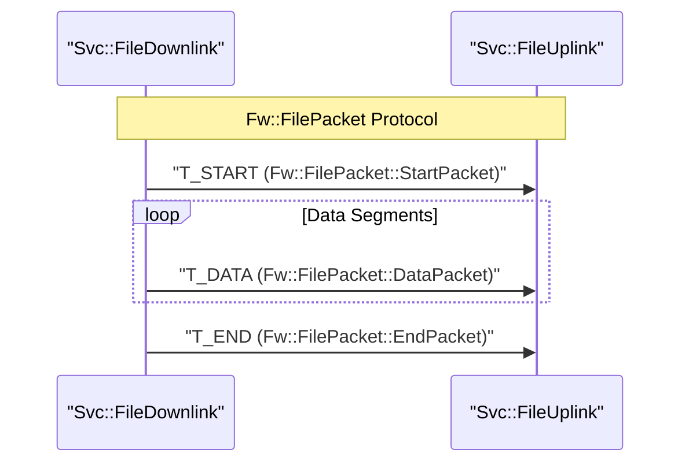
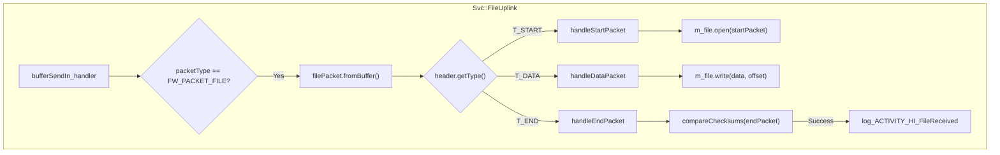

# Page: File Handling Services

# File Handling Services

Relevant source files

The following files were used as context for generating this wiki page:

- [.clang-tidy](.clang-tidy)
- [CFDP/Checksum/Checksum.cpp](CFDP/Checksum/Checksum.cpp)
- [Fw/FilePacket/CancelPacket.cpp](Fw/FilePacket/CancelPacket.cpp)
- [Fw/FilePacket/DataPacket.cpp](Fw/FilePacket/DataPacket.cpp)
- [Fw/FilePacket/EndPacket.cpp](Fw/FilePacket/EndPacket.cpp)
- [Fw/FilePacket/FilePacket.hpp](Fw/FilePacket/FilePacket.hpp)
- [Fw/FilePacket/Header.cpp](Fw/FilePacket/Header.cpp)
- [Fw/FilePacket/PathName.cpp](Fw/FilePacket/PathName.cpp)
- [Fw/FilePacket/StartPacket.cpp](Fw/FilePacket/StartPacket.cpp)
- [Fw/Types/GTest/Bytes.cpp](Fw/Types/GTest/Bytes.cpp)
- [Os/Posix/test/ut/PosixConsoleTests.cpp](Os/Posix/test/ut/PosixConsoleTests.cpp)
- [Svc/ActivePhaser/test/ut/ActivePhaserTester.cpp](Svc/ActivePhaser/test/ut/ActivePhaserTester.cpp)
- [Svc/BufferAccumulator/ArrayFIFOBuffer.cpp](Svc/BufferAccumulator/ArrayFIFOBuffer.cpp)
- [Svc/BufferAccumulator/BufferAccumulator.cpp](Svc/BufferAccumulator/BufferAccumulator.cpp)
- [Svc/BufferAccumulator/BufferAccumulator.hpp](Svc/BufferAccumulator/BufferAccumulator.hpp)
- [Svc/BufferLogger/BufferLogger.cpp](Svc/BufferLogger/BufferLogger.cpp)
- [Svc/BufferLogger/BufferLogger.hpp](Svc/BufferLogger/BufferLogger.hpp)
- [Svc/BufferLogger/BufferLoggerFile.cpp](Svc/BufferLogger/BufferLoggerFile.cpp)
- [Svc/BufferLogger/test/ut/BufferLoggerTester.cpp](Svc/BufferLogger/test/ut/BufferLoggerTester.cpp)
- [Svc/BufferLogger/test/ut/Errors.cpp](Svc/BufferLogger/test/ut/Errors.cpp)
- [Svc/BufferLogger/test/ut/Errors.hpp](Svc/BufferLogger/test/ut/Errors.hpp)
- [Svc/BufferLogger/test/ut/Logging.cpp](Svc/BufferLogger/test/ut/Logging.cpp)
- [Svc/CmdSequencer/test/ut/SequenceFiles/BadDescriptorFile.cpp](Svc/CmdSequencer/test/ut/SequenceFiles/BadDescriptorFile.cpp)
- [Svc/ComLogger/ComLogger.cpp](Svc/ComLogger/ComLogger.cpp)
- [Svc/ComLogger/ComLogger.hpp](Svc/ComLogger/ComLogger.hpp)
- [Svc/ComLogger/test/ut/ComLoggerTester.cpp](Svc/ComLogger/test/ut/ComLoggerTester.cpp)
- [Svc/ComLogger/test/ut/ComLoggerTester.hpp](Svc/ComLogger/test/ut/ComLoggerTester.hpp)
- [Svc/ComStub/test/ut/ComStubTester.cpp](Svc/ComStub/test/ut/ComStubTester.cpp)
- [Svc/FileDownlink/Events.fppi](Svc/FileDownlink/Events.fppi)
- [Svc/FileDownlink/File.cpp](Svc/FileDownlink/File.cpp)
- [Svc/FileDownlink/FileDownlink.cpp](Svc/FileDownlink/FileDownlink.cpp)
- [Svc/FileDownlink/FileDownlink.hpp](Svc/FileDownlink/FileDownlink.hpp)
- [Svc/FileDownlink/Warnings.cpp](Svc/FileDownlink/Warnings.cpp)
- [Svc/FileDownlink/docs/sdd.md](Svc/FileDownlink/docs/sdd.md)
- [Svc/FileDownlink/test/ut/FileBuffer.cpp](Svc/FileDownlink/test/ut/FileBuffer.cpp)
- [Svc/FileDownlink/test/ut/FileDownlinkMain.cpp](Svc/FileDownlink/test/ut/FileDownlinkMain.cpp)
- [Svc/FileDownlink/test/ut/FileDownlinkTester.cpp](Svc/FileDownlink/test/ut/FileDownlinkTester.cpp)
- [Svc/FileDownlink/test/ut/FileDownlinkTester.hpp](Svc/FileDownlink/test/ut/FileDownlinkTester.hpp)
- [Svc/FileManager/CMakeLists.txt](Svc/FileManager/CMakeLists.txt)
- [Svc/FileManager/Commands.fppi](Svc/FileManager/Commands.fppi)
- [Svc/FileManager/Events.fppi](Svc/FileManager/Events.fppi)
- [Svc/FileManager/FileManager.cpp](Svc/FileManager/FileManager.cpp)
- [Svc/FileManager/FileManager.fpp](Svc/FileManager/FileManager.fpp)
- [Svc/FileManager/FileManager.hpp](Svc/FileManager/FileManager.hpp)
- [Svc/FileManager/Telemetry.fppi](Svc/FileManager/Telemetry.fppi)
- [Svc/FileManager/test/ut/FileManagerMain.cpp](Svc/FileManager/test/ut/FileManagerMain.cpp)
- [Svc/FileManager/test/ut/FileManagerTester.cpp](Svc/FileManager/test/ut/FileManagerTester.cpp)
- [Svc/FileManager/test/ut/FileManagerTester.hpp](Svc/FileManager/test/ut/FileManagerTester.hpp)
- [Svc/FileUplink/Events.fppi](Svc/FileUplink/Events.fppi)
- [Svc/FileUplink/File.cpp](Svc/FileUplink/File.cpp)
- [Svc/FileUplink/FileUplink.cpp](Svc/FileUplink/FileUplink.cpp)
- [Svc/FileUplink/FileUplink.fpp](Svc/FileUplink/FileUplink.fpp)
- [Svc/FileUplink/FileUplink.hpp](Svc/FileUplink/FileUplink.hpp)
- [Svc/FileUplink/Telemetry.fppi](Svc/FileUplink/Telemetry.fppi)
- [Svc/FileUplink/Warnings.cpp](Svc/FileUplink/Warnings.cpp)
- [Svc/FileUplink/docs/img/FileUplink.drawio](Svc/FileUplink/docs/img/FileUplink.drawio)
- [Svc/FileUplink/docs/img/FileUplink.drawio.png](Svc/FileUplink/docs/img/FileUplink.drawio.png)
- [Svc/FileUplink/docs/sdd.md](Svc/FileUplink/docs/sdd.md)
- [Svc/FileUplink/test/ut/FileUplinkMain.cpp](Svc/FileUplink/test/ut/FileUplinkMain.cpp)
- [Svc/FileUplink/test/ut/FileUplinkTester.cpp](Svc/FileUplink/test/ut/FileUplinkTester.cpp)
- [Svc/FileUplink/test/ut/FileUplinkTester.hpp](Svc/FileUplink/test/ut/FileUplinkTester.hpp)
- [Utils/Hash/HashCommon.cpp](Utils/Hash/HashCommon.cpp)
- [Utils/test/ut/TokenBucketTester.cpp](Utils/test/ut/TokenBucketTester.cpp)
- [default/config/CommandDispatcherImplCfg.hpp](default/config/CommandDispatcherImplCfg.hpp)
- [release.clang-tidy](release.clang-tidy)

The File Handling Services provide a comprehensive suite of components for managing files on a spacecraft's filesystem and transferring them between the flight software and the ground system. These services include reliable file downlink (sending files to ground), file uplink (receiving files from ground), and a management interface for standard filesystem operations.

## Fw::FilePacket Protocol

All file transfers in F´ utilize the `Fw::FilePacket` protocol. This protocol decomposes files into a sequence of packets, allowing for asynchronous transfer and reconstruction. The protocol is modeled after CFDP (CCSDS File Delivery Protocol) concepts but simplified for the F´ framework.

### Packet Types
The protocol defines several packet types, each serving a specific role in the transfer lifecycle:
*   **START**: Contains metadata including the source path, destination path, and total file size [Fw/FilePacket/FilePacket.hpp:38-41]().
*   **DATA**: Contains a segment of the file data along with its byte offset [Fw/FilePacket/FilePacket.hpp:42-45]().
*   **END**: Signals the completion of the transfer and includes a final checksum [Fw/FilePacket/FilePacket.hpp:46-49]().
*   **CANCEL**: Used to abort an ongoing transfer [Fw/FilePacket/FilePacket.hpp:50-53]().

**Protocol Data Flow**

Sources: [Fw/FilePacket/FilePacket.hpp:34-55](), [Svc/FileUplink/FileUplink.cpp:69-80]()

---

## FileDownlink

The `Svc::FileDownlink` component manages the process of reading a file from the local filesystem and transmitting it to the ground system via the `Fw::FilePacket` protocol.

### Implementation Details
*   **Queuing**: Requests are placed in an internal queue (`m_fileQueue`) to handle multiple downlink requests sequentially [Svc/FileDownlink/FileDownlink.cpp:47-51]().
*   **State Machine**: The component operates through a state machine with modes: `IDLE`, `DOWNLINK`, `CANCEL`, `WAIT`, and `COOLDOWN` [Svc/FileDownlink/FileDownlink.hpp:39-39]().
*   **Flow Control**: It uses a `bufferReturn` port to throttle downlink. It only sends the next packet once the previous buffer has been returned by the communication stack, ensuring it does not overwhelm downstream components [Svc/FileDownlink/FileDownlink.cpp:143-162]().

### Key Functions
*   `Run_handler`: Triggered by a rate group to transition between states and initiate new downlinks from the queue [Svc/FileDownlink/FileDownlink.cpp:68-101]().
*   `SendFile_cmdHandler`: Handles the `SendFile` command to initiate a downlink [Svc/FileDownlink/FileDownlink.cpp:169-180]().
*   `downlinkPacket`: Orchestrates the assembly and dispatch of individual `Fw::FilePacket` buffers [Svc/FileDownlink/FileDownlink.cpp:425-455]().

Sources: [Svc/FileDownlink/FileDownlink.hpp:25-67](), [Svc/FileDownlink/FileDownlink.cpp:26-162]()

---

## FileUplink

The `Svc::FileUplink` component receives `Fw::FilePacket` sequences from the ground and reconstructs them into files on the local filesystem.

### Data Flow and Validation
1.  **START Packet**: Opens the destination file for writing and initializes a `CFDP::Checksum` [Svc/FileUplink/FileUplink.cpp:109-116]().
2.  **DATA Packet**: Seeks to the specified offset and writes the payload. It updates the running checksum calculation [Svc/FileUplink/FileUplink.cpp:118-145]().
3.  **Sequence Tracking**: It tracks the `m_lastSequenceIndex` to detect out-of-order or duplicate packets [Svc/FileUplink/FileUplink.cpp:169-184]().
4.  **END Packet**: Compares the ground-provided checksum against the locally computed `CFDP::Checksum`. If they match, the file is closed and a `FileReceived` event is emitted [Svc/FileUplink/FileUplink.cpp:147-161]().

**FileUplink Logic**

Sources: [Svc/FileUplink/FileUplink.cpp:39-161](), [Svc/FileUplink/FileUplink.hpp:140-160]()

---

## FileManager

The `Svc::FileManager` component provides a commanding interface for standard filesystem maintenance. It wraps `Os::FileSystem` and `Os::Directory` calls into F´ commands.

### Supported Operations
*   **File Ops**: `MoveFile`, `RemoveFile`, `AppendFile`, `FileSize`, and `CalculateCrc` [Svc/FileManager/FileManager.cpp:62-100, 132-160]().
*   **Directory Ops**: `CreateDirectory`, `RemoveDirectory`, and `ListDirectory` [Svc/FileManager/FileManager.cpp:46-60, 101-114]().
*   **Shell Integration**: The `ShellCommand` allows execution of system-level shell strings, logging output to a specified file [Svc/FileManager/FileManager.cpp:116-130]().

### Non-blocking Directory Listing
To prevent blocking the execution thread during large directory reads, `ListDirectory` is handled via the `schedIn` port, processing a configurable number of entries per tick [Svc/FileManager/FileManager.hpp:118-125]().

Sources: [Svc/FileManager/FileManager.hpp:22-110](), [Svc/FileManager/FileManager.cpp:46-160]()

---

## Logging Components

### BufferLogger
The `Svc::BufferLogger` component captures raw `Fw::Buffer` or `Fw::ComBuffer` data and writes it directly to files. It is often used for high-rate data capture or diagnostic logging.
*   **File Rotation**: Automatically closes and creates new files when `m_maxSize` is reached [Svc/BufferLogger/BufferLoggerFile.cpp:69-74]().
*   **Hashing**: Generates a `.hash` file (SHA-256 or CRC32) upon closing a log file to ensure data integrity [Svc/BufferLogger/BufferLoggerFile.cpp:164-172]().
*   **Commands**: Supports `BL_OpenFile`, `BL_CloseFile`, and `BL_SetLogging` (to toggle capture) [Svc/BufferLogger/BufferLogger.cpp:71-88]().

### ComLogger
Similar to `BufferLogger`, but specifically optimized for `Fw::ComBuffer` types. It includes options to store the buffer length as a prefix to each entry in the file [Svc/ComLogger/ComLogger.cpp:180-196]().

Sources: [Svc/BufferLogger/BufferLogger.hpp:48-155](), [Svc/BufferLogger/BufferLoggerFile.cpp:42-172](), [Svc/ComLogger/ComLogger.cpp:86-116]()
