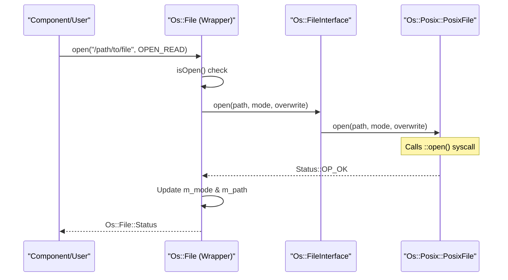
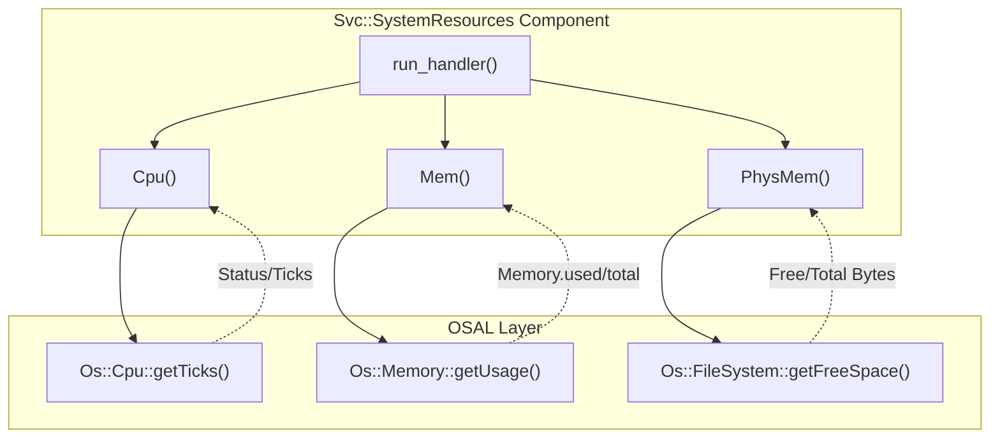

# Page: File System and System Resources

# File System and System Resources

Relevant source files

The following files were used as context for generating this wiki page:

- [Fw/DataStructures/test/ut/ExternalArrayTest.cpp](Fw/DataStructures/test/ut/ExternalArrayTest.cpp)
- [Fw/Types/BasicTypes.h](Fw/Types/BasicTypes.h)
- [Fw/Types/ConstStringBase.cpp](Fw/Types/ConstStringBase.cpp)
- [Os/Cpu.hpp](Os/Cpu.hpp)
- [Os/File.cpp](Os/File.cpp)
- [Os/File.hpp](Os/File.hpp)
- [Os/FileSystem.cpp](Os/FileSystem.cpp)
- [Os/FileSystem.hpp](Os/FileSystem.hpp)
- [Os/Generic/PriorityQueue.cpp](Os/Generic/PriorityQueue.cpp)
- [Os/Generic/PriorityQueue.hpp](Os/Generic/PriorityQueue.hpp)
- [Os/Generic/Types/MaxHeap.cpp](Os/Generic/Types/MaxHeap.cpp)
- [Os/Generic/Types/test/ut/MaxHeap/MaxHeapTest.cpp](Os/Generic/Types/test/ut/MaxHeap/MaxHeapTest.cpp)
- [Os/Memory.hpp](Os/Memory.hpp)
- [Os/Os.cpp](Os/Os.cpp)
- [Os/Os.hpp](Os/Os.hpp)
- [Os/Posix/Directory.cpp](Os/Posix/Directory.cpp)
- [Os/Posix/File.cpp](Os/Posix/File.cpp)
- [Os/Posix/File.hpp](Os/Posix/File.hpp)
- [Os/Posix/FileSystem.cpp](Os/Posix/FileSystem.cpp)
- [Os/Posix/FileSystem.hpp](Os/Posix/FileSystem.hpp)
- [Os/Posix/test/ut/PosixFileSystemTests.cpp](Os/Posix/test/ut/PosixFileSystemTests.cpp)
- [Os/Queue.cpp](Os/Queue.cpp)
- [Os/Queue.hpp](Os/Queue.hpp)
- [Os/Stub/File.cpp](Os/Stub/File.cpp)
- [Os/Stub/File.hpp](Os/Stub/File.hpp)
- [Os/Stub/FileSystem.cpp](Os/Stub/FileSystem.cpp)
- [Os/Stub/FileSystem.hpp](Os/Stub/FileSystem.hpp)
- [Os/Stub/Queue.cpp](Os/Stub/Queue.cpp)
- [Os/Stub/Queue.hpp](Os/Stub/Queue.hpp)
- [Os/Stub/test/File.cpp](Os/Stub/test/File.cpp)
- [Os/Stub/test/File.hpp](Os/Stub/test/File.hpp)
- [Os/Stub/test/FileSystem.cpp](Os/Stub/test/FileSystem.cpp)
- [Os/Stub/test/FileSystem.hpp](Os/Stub/test/FileSystem.hpp)
- [Os/Stub/test/Queue.cpp](Os/Stub/test/Queue.cpp)
- [Os/Stub/test/Queue.hpp](Os/Stub/test/Queue.hpp)
- [Os/Stub/test/ut/StubFileSystemTests.cpp](Os/Stub/test/ut/StubFileSystemTests.cpp)
- [Os/Stub/test/ut/StubQueueTests.cpp](Os/Stub/test/ut/StubQueueTests.cpp)
- [Os/test/ut/directory/DirectoryRules.cpp](Os/test/ut/directory/DirectoryRules.cpp)
- [Os/test/ut/file/FileRules.cpp](Os/test/ut/file/FileRules.cpp)
- [Os/test/ut/file/SyntheticFileSystem.cpp](Os/test/ut/file/SyntheticFileSystem.cpp)
- [Os/test/ut/queue/CommonTests.cpp](Os/test/ut/queue/CommonTests.cpp)
- [Os/test/ut/queue/RulesHeaders.hpp](Os/test/ut/queue/RulesHeaders.hpp)
- [Svc/ActiveTextLogger/LogFile.cpp](Svc/ActiveTextLogger/LogFile.cpp)
- [Svc/ActiveTextLogger/LogFile.hpp](Svc/ActiveTextLogger/LogFile.hpp)
- [Svc/ActiveTextLogger/test/ut/ActiveTextLoggerTester.cpp](Svc/ActiveTextLogger/test/ut/ActiveTextLoggerTester.cpp)
- [Svc/AssertFatalAdapter/test/ut/AssertFatalAdapterTester.cpp](Svc/AssertFatalAdapter/test/ut/AssertFatalAdapterTester.cpp)
- [Svc/CmdSplitter/test/ut/CmdSplitterTester.cpp](Svc/CmdSplitter/test/ut/CmdSplitterTester.cpp)
- [Svc/SystemResources/CMakeLists.txt](Svc/SystemResources/CMakeLists.txt)
- [Svc/SystemResources/SystemResources.cpp](Svc/SystemResources/SystemResources.cpp)
- [Svc/SystemResources/SystemResources.fpp](Svc/SystemResources/SystemResources.fpp)
- [Svc/SystemResources/SystemResources.hpp](Svc/SystemResources/SystemResources.hpp)
- [Svc/SystemResources/test/ut/SystemResourcesTestMain.cpp](Svc/SystemResources/test/ut/SystemResourcesTestMain.cpp)
- [Svc/SystemResources/test/ut/SystemResourcesTester.cpp](Svc/SystemResources/test/ut/SystemResourcesTester.cpp)
- [Svc/SystemResources/test/ut/SystemResourcesTester.hpp](Svc/SystemResources/test/ut/SystemResourcesTester.hpp)
- [Svc/Version/Version.cpp](Svc/Version/Version.cpp)
- [Svc/Version/docs/sdd.md](Svc/Version/docs/sdd.md)
- [Svc/Version/test/ut/VersionTester.cpp](Svc/Version/test/ut/VersionTester.cpp)
- [Utils/TokenBucket.cpp](Utils/TokenBucket.cpp)
- [default/config/OsCfg.fpp](default/config/OsCfg.fpp)

The F´ Operating System Abstraction Layer (OSAL) provides a unified interface for interacting with file systems, hardware resources, and system-level telemetry. This abstraction allows framework services and user components to perform I/O and resource monitoring across diverse platforms including Linux, Darwin (macOS), and Baremetal environments.

## File System Operations

F´ abstracts file system interactions through three primary classes: `Os::File`, `Os::Directory`, and `Os::FileSystem`. These classes utilize a delegate pattern where the top-level wrapper coordinates state and common logic, while platform-specific behavior is handled by backends like `Os::Posix`.

### Os::File
`Os::File` provides standard file I/O operations including opening, reading, writing, seeking, and flushing. It maintains internal state such as the current file mode and path [Os/File.cpp:14-16]().

**Key Features:**
*   **Modes:** Supports `OPEN_READ`, `OPEN_WRITE`, `OPEN_CREATE` (with optional overwrite), `OPEN_SYNC_WRITE`, and `OPEN_APPEND` [Os/File.hpp:29-37]().
*   **CRC Calculation:** Includes built-in support for calculating CRCs during read/write operations using `lib_crc` [Os/File.cpp:169-180]().
*   **Large File Support:** Implements `seek_absolute` using a multi-step relative seek strategy to handle offsets exceeding `FwSignedSizeType` limits [Os/File.cpp:130-155]().
*   **Wait Types:** Supports blocking (`WAIT`) or non-blocking (`NO_WAIT`) I/O operations [Os/File.hpp:67-71]().

### Os::FileSystem
`Os::FileSystem` provides static utility methods for manipulating the file system structure rather than individual file contents [Os/FileSystem.hpp:124-128]().

| Function | Description |
| :--- | :--- |
| `removeFile` | Deletes a file at the specified path [Os/FileSystem.hpp:151-152](). |
| `rename` | Renames or moves a file; returns `EXDEV_ERROR` if moving across devices [Os/FileSystem.hpp:164-165](). |
| `getFreeSpace` | Queries total and available bytes for a given path [Os/FileSystem.hpp:173-175](). |
| `getPathType` | Determines if a path is a `FILE`, `DIRECTORY`, `OTHER`, or `NOT_EXIST` [Os/FileSystem.hpp:43-48](). |
| `copyFile` | Copies a file using `FILE_SYSTEM_FILE_CHUNK_SIZE` chunks [Os/FileSystem.hpp:20-21](). |

### Os::Directory
`Os::Directory` handles directory lifecycle operations, including creation, deletion, and iteration through directory contents [Os/Posix/Directory.cpp:11-15]().

### Data Flow: File I/O Delegate Pattern
The following diagram illustrates how a call to `Os::File::open` is dispatched through the OSAL layers to a POSIX implementation.

Sources: [Os/File.cpp:46-69](), [Os/Posix/File.cpp:101-134](), [Os/File.hpp:91-92]()

---

## System Resources and Monitoring

F´ provides classes to query hardware-level statistics, which are typically surfaced to the ground system via the `Svc::SystemResources` component.

### CPU and Memory
*   **Os::Cpu:** Provides `getCount()` to determine the number of available cores and `getTicks()` to retrieve processor utilization metrics (used vs total ticks) [Os/Cpu.hpp:11-25]().
*   **Os::Memory:** Provides `getUsage()` to retrieve the current system memory utilization (used vs total) [Os/Memory.hpp:11-20]().

### SystemResources Component
The `Svc::SystemResources` component acts as a bridge between the `Os` resource classes and the F´ Telemetry system. It periodically samples CPU, Memory, and File System space [Svc/SystemResources/SystemResources.cpp:65-71]().

**Resource Telemetry Flow:**
1.  The `run_handler` port is triggered (usually by a `RateGroup`) [Svc/SystemResources/SystemResources.cpp:65]().
2.  The component calls `Os::Cpu::getTicks` for each core [Svc/SystemResources/SystemResources.cpp:99]().
3.  Utilization is calculated by comparing current ticks against previous samples [Svc/SystemResources/SystemResources.cpp:82-92]().
4.  Memory usage is queried via `Os::Memory::getUsage` [Svc/SystemResources/SystemResources.cpp:120]().
5.  Non-volatile storage (disk) usage is queried via `Os::FileSystem::getFreeSpace` [Svc/SystemResources/SystemResources.cpp:130]().

Sources: [Svc/SystemResources/SystemResources.cpp:94-134](), [Os/Cpu.hpp:20-25](), [Os/Memory.hpp:15-20]()

---

## OSAL Implementations

F´ supports multiple backends for file and resource management. The implementation is selected at compile-time based on the target platform.

| Implementation | Platform/Target | Characteristics |
| :--- | :--- | :--- |
| **Posix** | Linux, Darwin | Uses standard headers like `<fcntl.h>`, `<unistd.h>`, and `<sys/stat.h>` [Os/Posix/File.cpp:5-9](). |
| **Linux** | Linux-specific | Extends Posix with specific features like `CPU_SET` for core affinity. |
| **Baremetal** | Microcontrollers | Often maps to simplified internal flash drivers or NOPs if no filesystem exists. |
| **Stub** | Unit Testing | Provides injectable behaviors and `StaticData` tracking for verifying OSAL interactions in tests [Os/Stub/test/File.cpp:10-20](). |

### Posix File Implementation Detail
The `Os::Posix::PosixFile` implementation maps F´ modes to POSIX flags. For example, `OPEN_CREATE` maps to `O_WRONLY | O_CREAT | O_TRUNC`, combined with `O_EXCL` if overwrite is disabled [Os/Posix/File.cpp:116-119](). It also handles mapping F´ permission bits (e.g., `Os::FILE_MODE_IRUSR`) to system-specific constants like `S_IRUSR` or `S_IREAD` [Os/Posix/File.cpp:72-82]().

### Priority Queues (Generic Implementation)
While often considered a concurrency primitive, the `Os::Generic::PriorityQueue` is a resource-managed entity that uses `Fw::MemAllocator` for dynamic memory allocation during its `create` phase [Os/Generic/PriorityQueue.cpp:57-59](). It manages internal buffers for message data and a `Types::MaxHeap` for priority tracking [Os/Generic/PriorityQueue.cpp:116-133]().

### Testing and Validation
The OSAL layer includes a robust test suite using the `STest` framework. `Os::Test::FileTest::Tester` uses a "shadow" file system to verify that the real file system state remains consistent with expected operations [Os/test/ut/file/FileRules.cpp:140-163]().

Sources: [Os/Posix/File.cpp:101-134](), [Os/Generic/PriorityQueue.cpp:45-155](), [Os/Stub/test/File.cpp:1-50](), [Os/test/ut/file/FileRules.cpp:16-31]()
