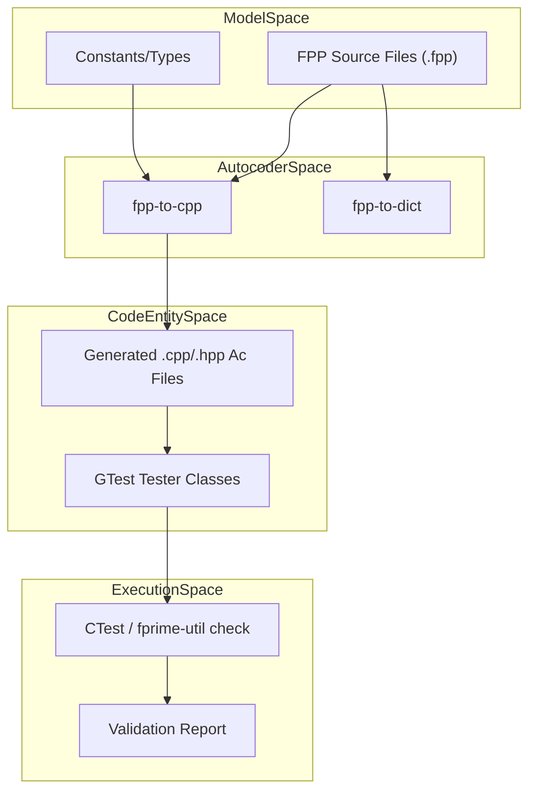
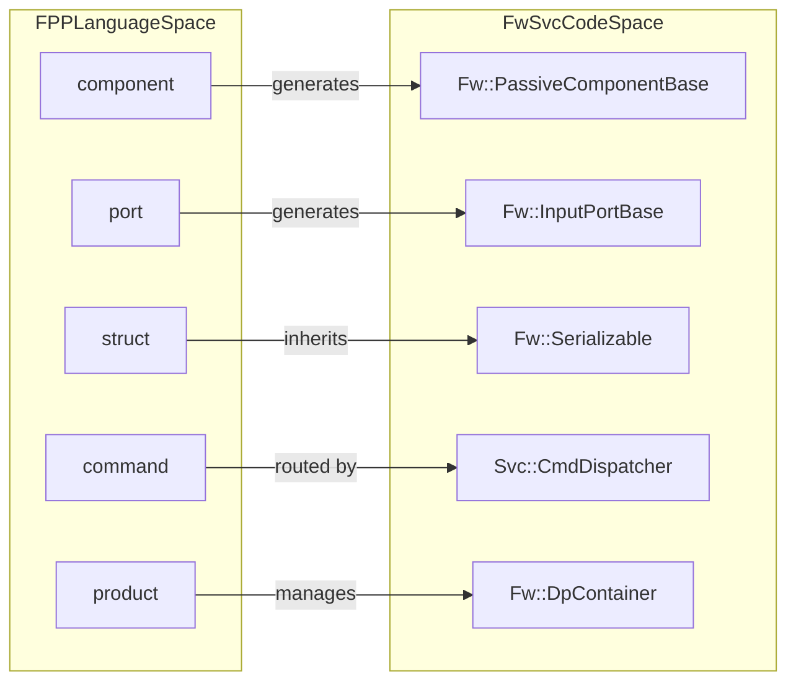

# Page: FppTestProject: FPP Autocoder Validation

# FppTestProject: FPP Autocoder Validation

<details>
<summary>Relevant source files</summary>

The following files were used as context for generating this wiki page:

- [.github/workflows/pip-check.yml](.github/workflows/pip-check.yml)
- [FppTestProject/FppTest/CMakeLists.txt](FppTestProject/FppTest/CMakeLists.txt)
- [FppTestProject/FppTest/sizeof/CMakeLists.txt](FppTestProject/FppTest/sizeof/CMakeLists.txt)
- [FppTestProject/FppTest/sizeof/main.cpp](FppTestProject/FppTest/sizeof/main.cpp)
- [FppTestProject/FppTest/sizeof/sizeof.fpp](FppTestProject/FppTest/sizeof/sizeof.fpp)
- [Fw/Types/CMakeLists.txt](Fw/Types/CMakeLists.txt)
- [Fw/Types/format.hpp](Fw/Types/format.hpp)
- [Fw/Types/scan.hpp](Fw/Types/scan.hpp)
- [Fw/Types/sscanf_scan.cpp](Fw/Types/sscanf_scan.cpp)
- [Fw/Types/test/ut/ScanfScanTest.cpp](Fw/Types/test/ut/ScanfScanTest.cpp)
- [Ref/SignalGen/SignalGen.fpp](Ref/SignalGen/SignalGen.fpp)
- [Ref/fprime-gds.yml](Ref/fprime-gds.yml)
- [cmake/config_assembler.cmake](cmake/config_assembler.cmake)
- [cmake/implementation.cmake](cmake/implementation.cmake)
- [cmake/platform/unix/Platform/CMakeLists.txt](cmake/platform/unix/Platform/CMakeLists.txt)
- [cmake/target/version.cmake](cmake/target/version.cmake)
- [cmake/test/data/TestConfigDeployment/override/project/FpConfig.fpp](cmake/test/data/TestConfigDeployment/override/project/FpConfig.fpp)
- [cmake/test/data/TestDeployment/CMakeLists.txt](cmake/test/data/TestDeployment/CMakeLists.txt)
- [cmake/test/data/cmake/target/test_recursion.cmake](cmake/test/data/cmake/target/test_recursion.cmake)
- [cmake/test/data/test-fprime-library/cmake/toolchain/generic-native.cmake](cmake/test/data/test-fprime-library/cmake/toolchain/generic-native.cmake)
- [cmake/test/data/test-implementations/Deployment/CMakeLists.txt](cmake/test/data/test-implementations/Deployment/CMakeLists.txt)
- [cmake/test/src/test_feature.py](cmake/test/src/test_feature.py)
- [cmake/test/src/test_ref_shared.py](cmake/test/src/test_ref_shared.py)
- [cmake/test/src/test_unittests.py](cmake/test/src/test_unittests.py)
- [default/config/ComCfg.fpp](default/config/ComCfg.fpp)
- [default/config/FpConfig.fpp](default/config/FpConfig.fpp)
- [default/config/FpConstants.fpp](default/config/FpConstants.fpp)
- [docs/user-manual/gds/gds-test-api-guide.md](docs/user-manual/gds/gds-test-api-guide.md)
- [requirements.txt](requirements.txt)

</details>


The `FppTestProject` serves as the primary validation suite for the **FPP Autocoder**. It contains a comprehensive set of unit tests designed to verify that the C++ code generated from FPP models is correct, performant, and adheres to the F´ framework's architectural constraints. These tests cover the full spectrum of FPP language features, including data types, component behaviors, and system topologies.

## Purpose and Scope

The validation project ensures that the `fprime-fpp` toolchain (version 3.2.0) [requirements.txt:22-22]() correctly translates FPP modeling constructs into functional C++ code. This is critical because the F´ framework relies on autocoding to handle boilerplate logic for serialization, port dispatching, and command/telemetry management.

The test suite validates the following FPP constructs:
*   **Data Types:** Arrays, Enums, and Structs (including nested types and format strings) [Ref/SignalGen/SignalGen.fpp:3-23]().
*   **Components:** Active, Queued, Passive, and Empty component base classes [FppTestProject/FppTest/CMakeLists.txt:33-36]().
*   **Communication:** Port interfaces and connection topologies [FppTestProject/FppTest/CMakeLists.txt:48-51]().
*   **State Machines:** Both internal (component-scoped) and external state machine logic, including choice and initial states [FppTestProject/FppTest/CMakeLists.txt:40-45]().
*   **Metadata:** `sizeof` checks and type-consistency validation [FppTestProject/FppTest/sizeof/sizeof.fpp:1-10]().

## Technical Implementation

The validation suite is structured as a series of F´ modules and deployments that are compiled and executed using the standard `fprime-util check` workflow. Each test case typically consists of an FPP model file, a C++ test harness (GTest-based), and a `CMakeLists.txt` for registration.

### Data Flow: From Model to Validation
The following diagram illustrates how FPP source files are processed by the autocoder and subsequently validated by the test suite.

**FPP Autocoder Validation Pipeline**

**Sources:** [requirements.txt:22-25](), [FppTestProject/FppTest/CMakeLists.txt:1-55]()

### Core Validation Categories

| Category | Description | Key FPP Constructs Validated |
| :--- | :--- | :--- |
| **Basic Types** | Verification of serialization and format strings. | `struct`, `array`, `enum` [Ref/SignalGen/SignalGen.fpp:3-23]() |
| **Ports** | Sync, Async, and Guarded port dispatch logic. | `sync input port`, `async product recv port` [Ref/SignalGen/SignalGen.fpp:32-45]() |
| **Components** | Dispatch loops and state management. | `active`, `queued`, `passive`, `empty` [FppTestProject/FppTest/CMakeLists.txt:33-36]() |
| **Data Products** | Buffer allocation and containerization. | `product record`, `product container` [Ref/SignalGen/SignalGen.fpp:54-57]() |
| **State Machines** | Internal and external state transitions. | `initial`, `state`, `choice` [FppTestProject/FppTest/CMakeLists.txt:40-45]() |

## Code Association: Natural Language to Code Entities

To bridge the gap between high-level modeling concepts and the actual generated C++ code, the following diagram maps FPP keywords to their corresponding classes in the `Fw` and `Svc` modules.

**FPP Keyword to C++ Class Mapping**

**Sources:** [Fw/Types/Serializable.cpp:1-13](), [cmake/test/data/TestDeployment/CMakeLists.txt:33-33](), [Ref/SignalGen/SignalGen.fpp:26-85]()

## Building and Running Tests

The validation suite is integrated into the CMake build system. Tests are registered using the `register_fprime_ut()` function [Fw/Types/CMakeLists.txt:48-49]() or via the `register_fprime_deployment()` macro for the aggregate project [FppTestProject/FppTest/CMakeLists.txt:57-57]().

### Prerequisites
The environment must have the `fprime-fpp` and `fprime-tools` packages installed as specified in the project requirements [requirements.txt:22-24]().

### Execution Commands
To run the full suite of autocoder validation tests, use the following commands from the project root:

1.  **Generate Build Cache:**
    ```bash
    fprime-util generate
    ```
2.  **Run All Unit Tests:**
    ```bash
    fprime-util check
    ```
    This command invokes `ctest`, which executes the test binaries (e.g., `Fw_Types_ut_exe`, `Ref_SignalGen_ut_exe`) [cmake/test/src/test_unittests.py:33-35]().

### CI/CD Integration
The `FppTestProject` is a mandatory gate in the GitHub Actions CI pipeline. It is executed across multiple Python versions (3.9 through 3.14) and platforms (Ubuntu, macOS) to ensure cross-platform compatibility of the generated code [.github/workflows/pip-check.yml:23-25]().

## Specialized Tests: Sizeof and Typed Tests
The project includes specific checks for:
1.  **Sizeof Validation:** Verifies that the FPP `sizeof` operator correctly computes sizes for arrays, structs, and enums in the generated C++ [FppTestProject/FppTest/sizeof/sizeof.fpp:1-10]().
2.  **Implementation Choice:** Validates that the build system correctly selects the intended implementation for a given platform or configuration [Fw/Types/CMakeLists.txt:26-44]().
3.  **Direct Port Calls:** Conditional logic in the build system allows testing components with or without direct port call optimizations [FppTestProject/FppTest/CMakeLists.txt:8-12]().

**Sources:** [Fw/Types/CMakeLists.txt:48-90](), [cmake/test/src/test_unittests.py:22-62](), [FppTestProject/FppTest/CMakeLists.txt:1-57](), [FppTestProject/FppTest/sizeof/CMakeLists.txt:1-10]()
