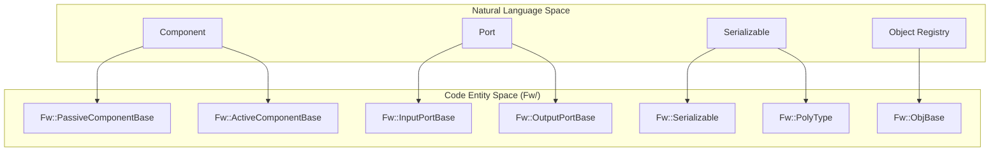
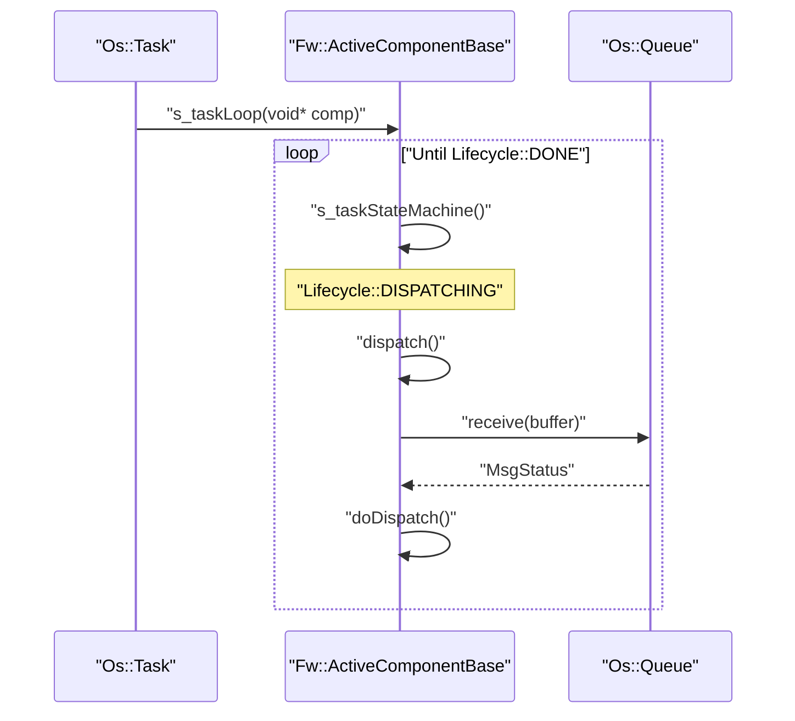

# Page: Framework Core (Fw)

# Framework Core (Fw)

Relevant source files

The following files were used as context for generating this wiki page:

- [Fpp/ToCpp.fpp](Fpp/ToCpp.fpp)
- [Fw/Comp/ActiveComponentBase.cpp](Fw/Comp/ActiveComponentBase.cpp)
- [Fw/Comp/ActiveComponentBase.hpp](Fw/Comp/ActiveComponentBase.hpp)
- [Fw/Comp/PassiveComponentBase.cpp](Fw/Comp/PassiveComponentBase.cpp)
- [Fw/Comp/PassiveComponentBase.hpp](Fw/Comp/PassiveComponentBase.hpp)
- [Fw/Comp/QueuedComponentBase.cpp](Fw/Comp/QueuedComponentBase.cpp)
- [Fw/Comp/QueuedComponentBase.hpp](Fw/Comp/QueuedComponentBase.hpp)
- [Fw/FilePacket/FilePacket.cpp](Fw/FilePacket/FilePacket.cpp)
- [Fw/Fpy/StatementArgBuffer.hpp](Fw/Fpy/StatementArgBuffer.hpp)
- [Fw/Log/test/ut/LogTest.cpp](Fw/Log/test/ut/LogTest.cpp)
- [Fw/Obj/ObjBase.cpp](Fw/Obj/ObjBase.cpp)
- [Fw/Obj/SimpleObjRegistry.cpp](Fw/Obj/SimpleObjRegistry.cpp)
- [Fw/Port/InputPortBase.cpp](Fw/Port/InputPortBase.cpp)
- [Fw/Port/InputSerializePort.cpp](Fw/Port/InputSerializePort.cpp)
- [Fw/Port/OutputPortBase.cpp](Fw/Port/OutputPortBase.cpp)
- [Fw/Port/OutputSerializePort.cpp](Fw/Port/OutputSerializePort.cpp)
- [Fw/SerializableFile/SerializableFile.cpp](Fw/SerializableFile/SerializableFile.cpp)
- [Fw/SerializableFile/SerializableFile.hpp](Fw/SerializableFile/SerializableFile.hpp)
- [Fw/Tlm/TlmBuffer.hpp](Fw/Tlm/TlmBuffer.hpp)
- [Fw/Tlm/TlmPacket.hpp](Fw/Tlm/TlmPacket.hpp)
- [Fw/Tlm/test/ut/TlmTest.cpp](Fw/Tlm/test/ut/TlmTest.cpp)
- [Fw/Types/Serializable.cpp](Fw/Types/Serializable.cpp)
- [Fw/Types/Serializable.hpp](Fw/Types/Serializable.hpp)
- [Os/ValidateFileCommon.cpp](Os/ValidateFileCommon.cpp)
- [Svc/Ccsds/SpacePacketDeframer/SpacePacketDeframer.cpp](Svc/Ccsds/SpacePacketDeframer/SpacePacketDeframer.cpp)
- [Svc/Ccsds/SpacePacketDeframer/SpacePacketDeframer.fpp](Svc/Ccsds/SpacePacketDeframer/SpacePacketDeframer.fpp)
- [Svc/Ccsds/TcDeframer/TcDeframer.cpp](Svc/Ccsds/TcDeframer/TcDeframer.cpp)
- [Svc/Ccsds/TcDeframer/TcDeframer.fpp](Svc/Ccsds/TcDeframer/TcDeframer.fpp)
- [Svc/Ccsds/Types/Types.fpp](Svc/Ccsds/Types/Types.fpp)
- [Svc/FprimeDeframer/FprimeDeframer.cpp](Svc/FprimeDeframer/FprimeDeframer.cpp)
- [Svc/FprimeDeframer/test/ut/FprimeDeframerTester.cpp](Svc/FprimeDeframer/test/ut/FprimeDeframerTester.cpp)
- [Svc/FrameAccumulator/CMakeLists.txt](Svc/FrameAccumulator/CMakeLists.txt)
- [Svc/FrameAccumulator/FrameDetector/CcsdsTcFrameDetector.cpp](Svc/FrameAccumulator/FrameDetector/CcsdsTcFrameDetector.cpp)
- [Svc/FrameAccumulator/FrameDetector/FprimeFrameDetector.cpp](Svc/FrameAccumulator/FrameDetector/FprimeFrameDetector.cpp)
- [Svc/FrameAccumulator/test/ut/detectors/FprimeFrameDetectorTestMain.cpp](Svc/FrameAccumulator/test/ut/detectors/FprimeFrameDetectorTestMain.cpp)
- [Utils/CMakeLists.txt](Utils/CMakeLists.txt)
- [Utils/CRCChecker.cpp](Utils/CRCChecker.cpp)
- [Utils/CRCChecker.hpp](Utils/CRCChecker.hpp)
- [Utils/Hash/Hash.hpp](Utils/Hash/Hash.hpp)
- [Utils/Hash/HashBuffer.hpp](Utils/Hash/HashBuffer.hpp)
- [Utils/Hash/HashBufferCommon.cpp](Utils/Hash/HashBufferCommon.cpp)
- [Utils/Hash/README.md](Utils/Hash/README.md)
- [Utils/Hash/libcrc/CRC32.cpp](Utils/Hash/libcrc/CRC32.cpp)
- [Utils/Hash/openssl/SHA256.cpp](Utils/Hash/openssl/SHA256.cpp)
- [Utils/test/ut/RateLimiterTester.cpp](Utils/test/ut/RateLimiterTester.cpp)
- [Utils/test/ut/RateLimiterTester.hpp](Utils/test/ut/RateLimiterTester.hpp)
- [default/config/CRCCheckerConfig.hpp](default/config/CRCCheckerConfig.hpp)

The `Fw/` directory contains the foundational C++ classes and types that form the F´ framework. It provides the architectural "glue" used by the autocoder and developers to build components, define ports, and manage data serialization. This core layer is designed to be platform-independent, relying on the [Operating System Abstraction Layer (Os)](./4.-Operating-System-Abstraction-Layer-(Os)) for system-level primitives.

### Core Architecture Overview

The framework is organized into several functional modules:
*   **Types**: Basic telemetry types, strings, and the serialization protocol.
*   **Comp**: Base classes for Passive, Queued, and Active components.
*   **Port**: The mechanism for synchronous and asynchronous communication between components.
*   **Obj**: An object registry for tracking framework entities.
*   **Services**: Standardized data structures for Commands, Telemetry, Logs, and Time.

#### Bridge: Framework Concepts to Code Entities

The following diagram maps high-level F´ concepts to their primary C++ implementation classes within the `Fw` namespace.

**Framework Entity Mapping**

**Sources:** [Fw/Comp/PassiveComponentBase.hpp:10-25](), [Fw/Comp/ActiveComponentBase.hpp:21-40](), [Fw/Port/InputPortBase.hpp](), [Fw/Types/Serializable.hpp:45-113](), [Fw/Obj/ObjBase.cpp:15-30]()

---

### [Types and Serialization](#3.1)

The `Fw/Types` module defines the data representation layer. Every piece of data passed between ports or sent to the ground must be serializable.

*   **Serialization Protocol**: Centered around `Fw::Serializable`, which defines the `serializeTo` and `deserializeFrom` virtual methods [Fw/Types/Serializable.hpp:60-71]().
*   **LinearBufferBase**: A foundational class for managing byte buffers, supporting serialization of primitives (U8, I32, etc.) with configurable endianness [Fw/Types/Serializable.cpp:42-187]().
*   **PolyType**: A polymorphic type capable of holding any basic C++ type, used extensively in the `PrmDb` and `PolyDb` services.
*   **Memory Management**: Includes `Fw::MemAllocator` and implementations like `MallocAllocator` for dynamic memory needs in a flight-safe manner.
*   **Data Structures**: A library of template-based structures including `Array`, `FifoQueue`, and `RedBlackTree` optimized for embedded constraints.

For details, see [Types and Serialization](#3.1).

**Sources:** [Fw/Types/Serializable.hpp:11-43](), [Fw/Types/Serializable.cpp:66-187](), [Fw/Types/Serializable.hpp:115-160]()

---

### [Component Base Classes and Ports](#3.2)

Components are the fundamental units of business logic in F´. The framework provides three base classes in `Fw/Comp` that define how a component executes.

| Component Type | Base Class | Execution Logic |
| :--- | :--- | :--- |
| **Passive** | `Fw::PassiveComponentBase` | Executes on the thread of the caller (synchronous). [Fw/Comp/PassiveComponentBase.hpp:22-22]() |
| **Queued** | `Fw::QueuedComponentBase` | Has an `Os::Queue` but no thread; requires an external trigger to process. [Fw/Comp/QueuedComponentBase.hpp:20-35]() |
| **Active** | `Fw::ActiveComponentBase` | Inherits from Queued; has a private `Os::Task` and message queue (asynchronous). [Fw/Comp/ActiveComponentBase.hpp:21-38]() |

#### Active Component Dispatch Loop
Active components utilize an internal state machine to manage their lifecycle, transitioning from `CREATED` to `DISPATCHING` (where the message loop runs) and finally `DONE` [Fw/Comp/ActiveComponentBase.cpp:77-103](). Standard multithreaded tasks use `s_taskLoop` to continuously invoke this state machine [Fw/Comp/ActiveComponentBase.cpp:106-114]().

**Active Component Thread Loop**

**Sources:** [Fw/Comp/ActiveComponentBase.cpp:69-104](), [Fw/Comp/ActiveComponentBase.cpp:106-114](), [Fw/Comp/QueuedComponentBase.hpp:35-37]()

For details, see [Component Base Classes and Ports](#3.2).

---

### [Framework Services: Time, Logging, Parameters, and Files](#3.3)

F´ provides standardized "Service" types that define the interface between flight software and the ground station. These are found in various `Fw/` subdirectories:

*   **Fw::Time**: Represents spacecraft time and intervals.
*   **Fw::Log**: Defines Event Logging (EVR) severity levels and string formats.
*   **Fw::Tlm**: Structures for telemetry packets and channels [Fw/Tlm/TlmPacket.hpp]().
*   **Fw::Cmd**: Command packet structures and registration logic.
*   **Fw::FilePacket**: Implements the protocol for CFDP-style file transfers, including `StartPacket`, `DataPacket`, and `EndPacket` types.
*   **Fw::SerializableFile**: A utility for saving/loading `Fw::Serializable` objects directly to the filesystem.
*   **Integrity Utilities**: The framework provides `Utils::Hash` for SHA-256 or CRC32 [Utils/Hash/libcrc/CRC32.cpp:17-39]() and `Utils::CRCChecker` for file-level validation [Utils/CRCChecker.cpp:24-104]().

**Sources:** [Fw/Tlm/TlmPacket.hpp](), [Utils/Hash/libcrc/CRC32.cpp:41-66](), [Utils/CRCChecker.cpp:133-205](), [Os/ValidateFileCommon.cpp:166-217]()

For details, see [Framework Services: Time, Logging, Parameters, and Files](#3.3).
