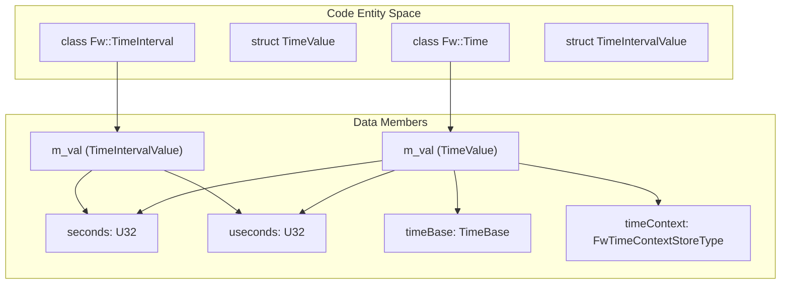
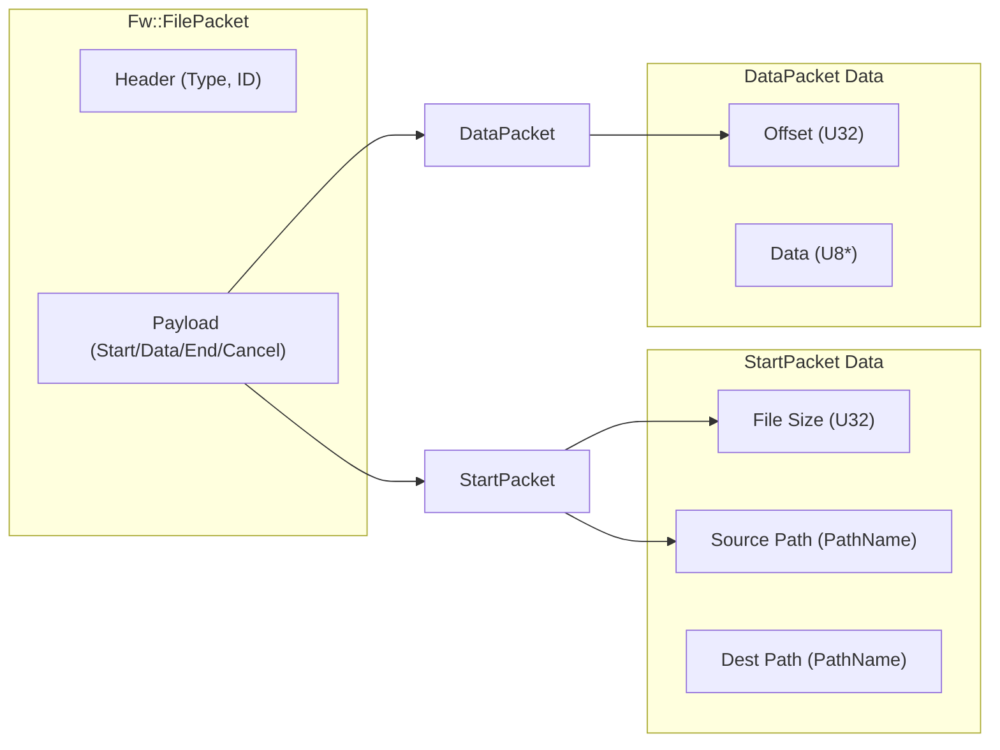
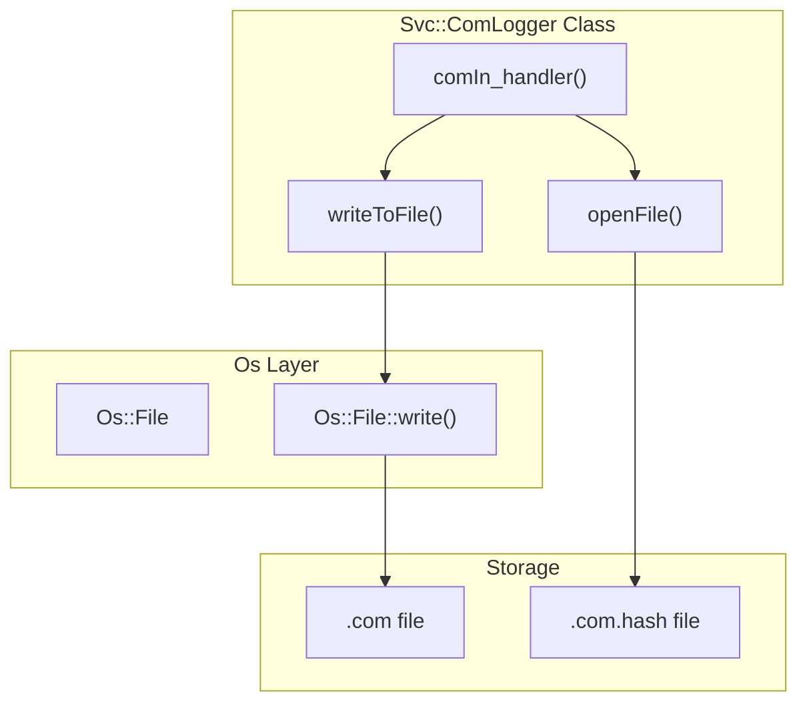

# Page: Framework Services: Time, Logging, Parameters, and Files

# Framework Services: Time, Logging, Parameters, and Files

Relevant source files

The following files were used as context for generating this wiki page:

- [CFDP/Checksum/Checksum.cpp](CFDP/Checksum/Checksum.cpp)
- [Fw/Buffer/Buffer.fpp](Fw/Buffer/Buffer.fpp)
- [Fw/FilePacket/CancelPacket.cpp](Fw/FilePacket/CancelPacket.cpp)
- [Fw/FilePacket/DataPacket.cpp](Fw/FilePacket/DataPacket.cpp)
- [Fw/FilePacket/EndPacket.cpp](Fw/FilePacket/EndPacket.cpp)
- [Fw/FilePacket/FilePacket.hpp](Fw/FilePacket/FilePacket.hpp)
- [Fw/FilePacket/Header.cpp](Fw/FilePacket/Header.cpp)
- [Fw/FilePacket/PathName.cpp](Fw/FilePacket/PathName.cpp)
- [Fw/FilePacket/StartPacket.cpp](Fw/FilePacket/StartPacket.cpp)
- [Fw/Log/Log.fpp](Fw/Log/Log.fpp)
- [Fw/Time/CMakeLists.txt](Fw/Time/CMakeLists.txt)
- [Fw/Time/Time.cpp](Fw/Time/Time.cpp)
- [Fw/Time/Time.fpp](Fw/Time/Time.fpp)
- [Fw/Time/Time.hpp](Fw/Time/Time.hpp)
- [Fw/Time/TimeInterval.cpp](Fw/Time/TimeInterval.cpp)
- [Fw/Time/TimeInterval.hpp](Fw/Time/TimeInterval.hpp)
- [Fw/Time/test/ut/TimeIntervalTester.cpp](Fw/Time/test/ut/TimeIntervalTester.cpp)
- [Fw/Time/test/ut/TimeIntervalTester.hpp](Fw/Time/test/ut/TimeIntervalTester.hpp)
- [Fw/Time/test/ut/TimeTestMain.cpp](Fw/Time/test/ut/TimeTestMain.cpp)
- [Fw/Time/test/ut/TimeTester.cpp](Fw/Time/test/ut/TimeTester.cpp)
- [Fw/Time/test/ut/TimeTester.hpp](Fw/Time/test/ut/TimeTester.hpp)
- [Svc/ComLogger/ComLogger.cpp](Svc/ComLogger/ComLogger.cpp)
- [Svc/ComLogger/ComLogger.hpp](Svc/ComLogger/ComLogger.hpp)
- [Svc/FileDownlink/File.cpp](Svc/FileDownlink/File.cpp)
- [Svc/TlmChan/TlmChan.cpp](Svc/TlmChan/TlmChan.cpp)

This section describes the core framework services provided by `Fw`. These services define the standard data structures and protocols for time representation, event logging, telemetry, and file-based data transfer.

## Time and Time Intervals

The `Fw::Time` class is the primary representation of time in F´. It consists of a time base, a context, seconds, and microseconds.

### Implementation Details
- **Fw::Time**: Represents an absolute point in time. It inherits from `Fw::Serializable`, allowing it to be passed through ports and across network boundaries [Fw/Time/Time.hpp:12]().
- **Fw::TimeInterval**: Represents the duration between two points in time. It is used for offsets and timers [Fw/Time/TimeInterval.hpp:20]().
- **TimeBase**: An enumeration (e.g., `TB_NONE`, `TB_PROC_TIME`, `TB_WORKSTATION_TIME`) that defines the source of the clock [Fw/Time/Time.hpp:9]().
- **Context**: A user-definable field (`FwTimeContextStoreType`) often used for reboot counts or node identifiers [Fw/Time/Time.fpp:6]().

### Key Functions
- `Fw::Time::compare()`: Compares two time objects. Returns `INCOMPARABLE` if the time bases do not match [Fw/Time/Time.cpp:139-142]().
- `Fw::Time::add()`/`sub()`: Performs arithmetic on time objects while maintaining the microsecond invariant ($< 1,000,000$) [Fw/Time/Time.cpp:164-212]().
- `Fw::Time::operator F64()`: Converts the time to a double-precision floating point for easy math [Fw/Time/Time.cpp:100-104]().
- `Fw::TimeInterval::sub()`: Computes the absolute difference between two intervals. It is commutative [Fw/Time/TimeInterval.cpp:109-113]().

### Time Structure Relationship
The following diagram shows how `Fw::Time` relates to its underlying serialized form and the `TimeInterval` utility.

**Time Entity Mapping**

Sources: [Fw/Time/Time.hpp:12-124](), [Fw/Time/Time.fpp:4-9](), [Fw/Time/TimeInterval.hpp:20-82](), [Fw/Time/Time.cpp:7-12]()

---

## Logging and Telemetry (Fw/Log, Fw/Tlm)

F´ uses structured logging (Events) and telemetry channels to communicate state to the ground system.

### Event Logging (Fw::Log)
Events are defined in FPP and generated as typed calls. 
- **Severity Levels**: Events have severities such as `DIAGNOSTIC`, `ACTIVITY_LO`, `ACTIVITY_HI`, `WARNING_LO`, `WARNING_HI`, `FATAL`, and `COMMAND`.
- **LogString**: A specialized string type (`Fw::LogStringArg`) used to pass string data in event arguments safely [Svc/FileDownlink/FileDownlink.hpp:79]().

### Telemetry (Fw::Tlm)
Telemetry represents the current state of a component.
- **TlmPacket**: The container used to transport telemetry data over the `com` port.
- **TlmChan**: A service component that stores and dispatches telemetry updates [Svc/TlmChan/TlmChan.cpp:15]().

Sources: [Fw/Log/Log.fpp:1-10](), [Svc/TlmChan/TlmChan.cpp:15-30]()

---

## File Transfer Protocol (Fw/FilePacket)

F´ implements a CFDP-style (CCSDS File Delivery Protocol) file transfer mechanism using `Fw::FilePacket`. This protocol decomposes files into small, manageable packets for transmission over unreliable links.

### Packet Types
The protocol defines several packet types, encapsulated in `Fw::FilePacket`:
1. **START**: Contains metadata like file size, source path, and destination path [Fw/FilePacket/FilePacket.hpp:56]().
2. **DATA**: Contains a chunk of file data and the byte offset [Fw/FilePacket/FilePacket.hpp:58]().
3. **END**: Contains the final file checksum [Fw/FilePacket/FilePacket.hpp:60]().
4. **CANCEL**: Signals the abortion of a transfer [Fw/FilePacket/FilePacket.hpp:62]().

### File Operations and Downlink
`Svc::FileDownlink` manages the reading of files and wrapping them into these packets. It interacts with the filesystem via `Os::File` [Svc/FileDownlink/File.cpp:47]().

**File Packet Structure**

Sources: [Fw/FilePacket/FilePacket.hpp:25-70](), [Fw/FilePacket/PathName.cpp:21-25](), [Svc/FileDownlink/File.cpp:20-48]()

---

## Communication and Logging Utilities

### ComLogger (Svc::ComLogger)
The `ComLogger` component intercepts `Fw::Com` packets and writes them directly to the filesystem. This is used for "store-and-forward" telemetry or capturing high-rate data for later retrieval.

- **File Naming**: Files are automatically named using a prefix and a timestamp (seconds/microseconds) [Svc/ComLogger/ComLogger.cpp:138-140]().
- **Integrity**: Every log file is accompanied by a hash file (`.com` and `.com.hash`) to ensure data integrity [Svc/ComLogger/ComLogger.cpp:142]().
- **Length Prefixing**: Can be configured to store the 16-bit length of each buffer before the data to allow parsing of variable-length packets [Svc/ComLogger/ComLogger.cpp:181-190]().

### Checksums (CFDP::Checksum)
Used primarily for file transfers, the `CFDP::Checksum` class implements the CCSDS-defined checksum algorithm to verify file contents after downlink or uplink [Svc/FileDownlink/File.cpp:43]().

**ComLogger Implementation Mapping**

Sources: [Svc/ComLogger/ComLogger.cpp:86-116](), [Svc/ComLogger/ComLogger.hpp:76-87](), [CFDP/Checksum/Checksum.cpp:1-20](), [Svc/ComLogger/ComLogger.cpp:198-201]()
