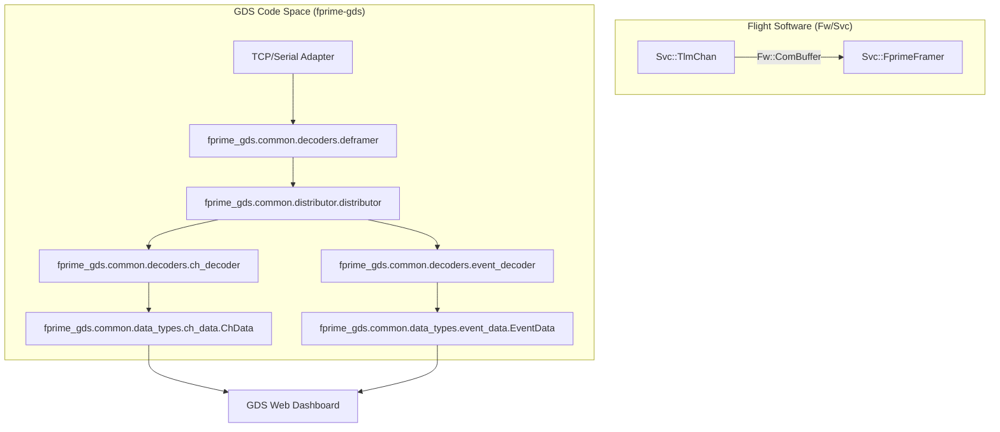
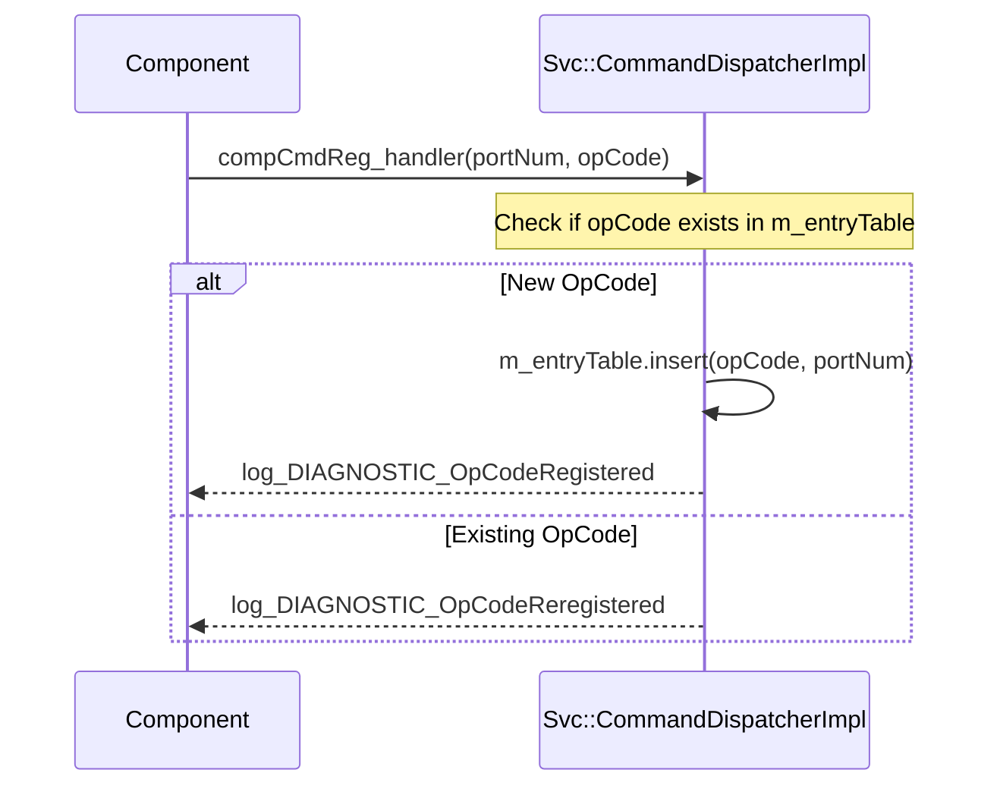

# Page: GDS Data Model and Loaders

# GDS Data Model and Loaders

Relevant source files

The following files were used as context for generating this wiki page:

- [Svc/CmdDispatcher/CmdDispatcher.fpp](Svc/CmdDispatcher/CmdDispatcher.fpp)
- [Svc/CmdDispatcher/CommandDispatcherImpl.cpp](Svc/CmdDispatcher/CommandDispatcherImpl.cpp)
- [Svc/CmdDispatcher/CommandDispatcherImpl.hpp](Svc/CmdDispatcher/CommandDispatcherImpl.hpp)
- [Svc/CmdDispatcher/docs/sdd.md](Svc/CmdDispatcher/docs/sdd.md)
- [Svc/CmdDispatcher/test/ut/CommandDispatcherTestMain.cpp](Svc/CmdDispatcher/test/ut/CommandDispatcherTestMain.cpp)
- [Svc/CmdDispatcher/test/ut/CommandDispatcherTester.cpp](Svc/CmdDispatcher/test/ut/CommandDispatcherTester.cpp)
- [Svc/CmdDispatcher/test/ut/CommandDispatcherTester.hpp](Svc/CmdDispatcher/test/ut/CommandDispatcherTester.hpp)

The F´ Ground Data System (GDS) relies on a robust data model to represent flight software (FSW) telemetry, commands, and events. This model provides the bridge between raw binary packets received from the spacecraft and the structured, human-readable data displayed in the GDS web interface or processed by the integration test API.

## GDS Data Model

The GDS data model is composed of templates (definitions) and data objects (instances). Templates are typically generated from the FPP/XML dictionaries during the build process, while data objects represent specific telemetry samples or command packets.

### Templates and Data Objects

| Data Type | Template Class | Data Class | Description |
|---|---|---|---|
| **Commands** | `cmd_template` | `cmd_data` | Represents an executable command, including its opcode and argument types. |
| **Events** | `event_template` | `event_data` | Represents a log message emitted by a component, including severity and format strings. |
| **Channels** | `ch_template` | `ch_data` | Represents a telemetry channel (point data) with a specific type and update rate. |
| **Files** | N/A | `file_data` | Represents metadata and chunks of a file being downlinked or uplinked. |

### Data Flow and Code Entities

The following diagram illustrates how raw telemetry from the flight software is transformed into structured GDS data objects using the GDS pipeline.

**GDS Telemetry Data Flow**

Sources: [Svc/CmdDispatcher/docs/sdd.md:83-95](), [Svc/CmdDispatcher/CommandDispatcherImpl.cpp:71-124]()

## Python Serialization Model

The GDS uses a Python-based serialization model that mirrors the F´ framework's C++ types. This allows the GDS to decode binary data using the same rules as the flight software.

### Core Serialization Types
*   **Numerical Types**: Handle standard integer (`U8`, `I32`, etc.) and floating-point (`F32`, `F64`) types.
*   **`time_type`**: Represents the `Fw::Time` structure (seconds and microseconds).
*   **`serializable_type`**: Handles complex structures (structs) defined in FPP.
*   **`array_type`**: Handles fixed-size arrays.
*   **`enum_type`**: Maps integer values to symbolic names.

### The File Decoder
The file decoder is a specialized component used for file downlink. It processes `Fw::FilePacket` types, including `START`, `DATA`, `CANCEL`, and `END` packets.
*   **Start Packet**: Contains the total file size and the destination path.
*   **Data Packet**: Contains a specific offset and a chunk of binary data.
*   **End Packet**: Contains the final checksum (CRC32 or CFDP) to verify integrity.

Sources: [Svc/CmdDispatcher/CommandDispatcherImpl.cpp:72-73](), [Svc/CmdDispatcher/docs/sdd.md:35-40]()

## Loaders: XML and Python Dictionary Loaders

Loaders are responsible for populating the GDS data model templates by reading the metadata generated during the flight software build process.

1.  **XML Loaders**: Parse the legacy AI-XML files to extract command opcodes, event IDs, and telemetry channel IDs.
2.  **Dictionary Loaders**: Parse the modern FPP-generated Python dictionaries. These dictionaries are often located in the `Top/` directory of a deployment (e.g., `Ref/Top/RefTopologyAppDictionary.xml`).

The loaders iterate through the dictionary and instantiate `cmd_template`, `event_template`, and `ch_template` objects, which are then stored in a searchable database within the GDS backend.

Sources: [Svc/CmdDispatcher/CommandDispatcherImpl.cpp:26-38](), [Svc/CmdDispatcher/docs/sdd.md:46-49]()

## Command Dispatcher Implementation

The `Svc::CmdDispatcher` component in the flight software is the primary interface for the GDS command model. It manages the registration and routing of commands.

### Command Registration
Components register their commands during initialization. The `CommandDispatcherImpl` maintains an `m_entryTable` (a `Fw::RedBlackTreeMap`) that maps `FwOpcodeType` to a specific output port index.

**Command Registration Logic**

Sources: [Svc/CmdDispatcher/CommandDispatcherImpl.cpp:26-38](), [Svc/CmdDispatcher/CommandDispatcherImpl.hpp:152-152]()

### Command Execution and Tracking
When a command is received via the `seqCmdBuff` port (usually from the GDS or a sequencer), the dispatcher:
1.  Deserializes the `Fw::CmdPacket` [Svc/CmdDispatcher/CommandDispatcherImpl.cpp:72-73]().
2.  Looks up the opcode in `m_entryTable` using a red-black tree search [Svc/CmdDispatcher/CommandDispatcherImpl.cpp:86-86](), [Svc/CmdDispatcher/CommandDispatcherImpl.hpp:152-152]().
3.  Assigns a sequence number and tracks the command in `m_sequenceTracker` (an `Fw::ArrayMap`) [Svc/CmdDispatcher/CommandDispatcherImpl.cpp:95-95](), [Svc/CmdDispatcher/CommandDispatcherImpl.hpp:167-167]().
4.  Dispatches the command to the target component via `compCmdSend_out` [Svc/CmdDispatcher/CommandDispatcherImpl.cpp:107-107]().

When the component finishes, it calls `compCmdStat_handler`. The dispatcher then clears the entry from the tracker and reports the final `Fw::CmdResponse` back to the GDS [Svc/CmdDispatcher/CommandDispatcherImpl.cpp:40-69]().

### Telemetry and Metrics
The `CommandDispatcher` tracks the health of the command subsystem through several telemetry channels:
*   `CommandsDispatched`: Total count of successfully routed commands [Svc/CmdDispatcher/CommandDispatcherImpl.cpp:129-129]().
*   `CommandErrors`: Count of commands that returned a non-OK status [Svc/CmdDispatcher/CommandDispatcherImpl.cpp:128-128]().
*   `CommandsDropped`: Count of commands dropped due to queue overflows [Svc/CmdDispatcher/CommandDispatcherImpl.cpp:127-127]().

Sources: [Svc/CmdDispatcher/CommandDispatcherImpl.cpp:126-130](), [Svc/CmdDispatcher/CmdDispatcher.fpp:204-207]()
