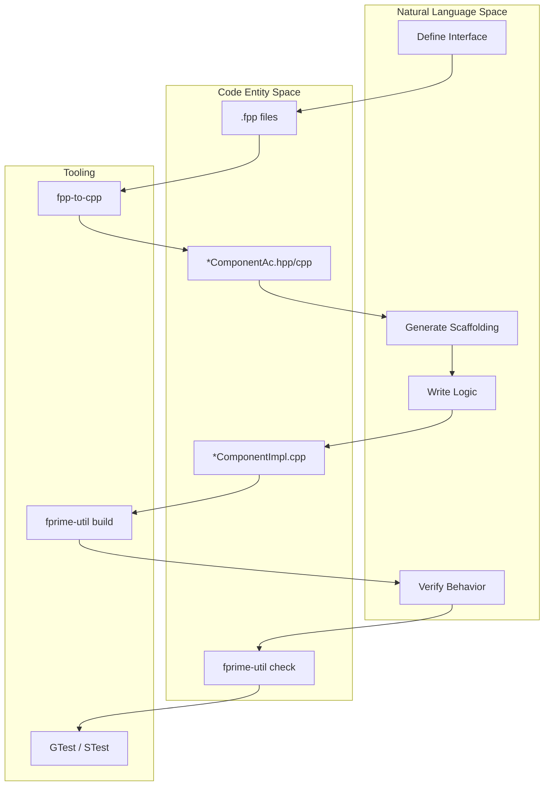
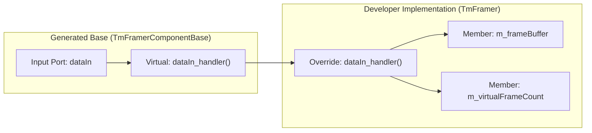

# Page: Getting Started and Development Workflow

# Getting Started and Development Workflow

Relevant source files

The following files were used as context for generating this wiki page:

- [.github/actions/spelling/README.md](.github/actions/spelling/README.md)
- [.github/workflows/pip-check.yml](.github/workflows/pip-check.yml)
- [.pre-commit-config.yaml](.pre-commit-config.yaml)
- [FppTestProject/FppTest/CMakeLists.txt](FppTestProject/FppTest/CMakeLists.txt)
- [FppTestProject/FppTest/sizeof/CMakeLists.txt](FppTestProject/FppTest/sizeof/CMakeLists.txt)
- [FppTestProject/FppTest/sizeof/main.cpp](FppTestProject/FppTest/sizeof/main.cpp)
- [FppTestProject/FppTest/sizeof/sizeof.fpp](FppTestProject/FppTest/sizeof/sizeof.fpp)
- [README.md](README.md)
- [Ref/README.md](Ref/README.md)
- [Ref/docs/TestCases.txt](Ref/docs/TestCases.txt)
- [Ref/fprime-gds.yml](Ref/fprime-gds.yml)
- [Ref/settings.ini](Ref/settings.ini)
- [Svc/Ccsds/TmFramer/TmFramer.hpp](Svc/Ccsds/TmFramer/TmFramer.hpp)
- [cmake/target/version.cmake](cmake/target/version.cmake)
- [cmake/test/data/TestConfigDeployment/override/project/FpConfig.fpp](cmake/test/data/TestConfigDeployment/override/project/FpConfig.fpp)
- [default/config/ComCfg.fpp](default/config/ComCfg.fpp)
- [default/config/FpConfig.fpp](default/config/FpConfig.fpp)
- [default/config/FpConstants.fpp](default/config/FpConstants.fpp)
- [docs/INSTALL.md](docs/INSTALL.md)
- [docs/img/fprime-logo.png](docs/img/fprime-logo.png)
- [docs/img/fprime-logo.svg](docs/img/fprime-logo.svg)
- [docs/index.md](docs/index.md)
- [docs/user-manual/gds/gds-test-api-guide.md](docs/user-manual/gds/gds-test-api-guide.md)
- [requirements.txt](requirements.txt)

This page provides a technical guide for developers to set up their environment, bootstrap new F´ projects, and navigate the standard development lifecycle. It covers the interaction between the FPP modeling language, the C++ implementation, and the `fprime-util` orchestration tool.

## Prerequisites and Installation

F´ development requires a Python-based toolchain and a C++ compiler suite. The framework uses `pip` to manage its Python dependencies, which include the FPP autocoders, the GDS (Ground Data System), and build utilities.

### System Requirements
*   **Operating System**: Linux, Windows with WSL, or macOS [README.md:27]().
*   **Compilers**: Clang or GNU C/C++ (gcc/g++) [README.md:33]().
*   **Python**: Version 3.9+ with `venv` and `pip` [README.md:31]().
*   **Version Control**: git [README.md:29]().

### Python Dependencies
The core dependencies are managed via `requirements.txt` and include:
*   **`fprime-tools`**: Provides the `fprime-util` CLI for build management [requirements.txt:24]().
*   **`fprime-fpp`**: The FPP compiler suite for generating C++ code from models [requirements.txt:22]().
*   **`fprime-gds`**: The Ground Data System for commanding and telemetry visualization [requirements.txt:23]().
*   **`cmake` & `ninja`**: The underlying build system and generator [requirements.txt:13,38]().
*   **`fprime-bootstrap`**: The tool used to initialize new projects [README.md:65]().

### Continuous Integration Environment
The framework is verified across multiple Python versions (3.9 through 3.14) and platforms (Ubuntu, macOS Intel/ARM) via GitHub Actions [.github/workflows/pip-check.yml:23-25]().

**Sources:** [README.md:23-58](), [requirements.txt:1-67](), [.github/workflows/pip-check.yml:19-35]()

---

## Bootstrapping and Project Configuration

New developers begin by installing the bootstrap tool and creating a project structure.

### Project Initialization
1.  Install the bootstrapper: `pip install fprime-bootstrap` [README.md:65]().
2.  Create a project: `fprime-bootstrap project` [README.md:70]().
3.  Initialize the build environment: `fprime-util generate` [Ref/README.md:39]().

### Configuration: settings.ini
Every F´ project or deployment requires a `settings.ini` file. This file informs `fprime-util` and the CMake system about the project structure.

Key configuration fields:
*   **`framework_path`**: Relative or absolute path to the core F´ repository [Ref/settings.ini:4]().
*   **`library_locations`**: A list of paths to external F´ libraries.
*   **`default_toolchain`**: Specifies the default CMake toolchain (e.g., `native`, `raspberrypi`).

**Sources:** [README.md:61-73](), [Ref/README.md:34-42](), [Ref/settings.ini:1-5]()

---

## The Development Lifecycle

F´ follows a "Model-First" development approach. This ensures that the architectural interface (ports, commands, telemetry) is strictly defined before implementation begins.

### 1. Modeling (FPP)
Developers define components, ports, and topologies using the FPP language. This defines the "contract" for the component.
*   **Component Definitions**: Define commands, events, and telemetry channels.
*   **Constants and Types**: Projects can override framework defaults for buffer sizes or type aliases [default/config/FpConfig.fpp:22-45](), [default/config/FpConstants.fpp:9-64]().

### 2. Autocoding
Running `fprime-util generate` and `fprime-util build` triggers the autocoder. The FPP compiler (`fpp-to-cpp`) transforms `.fpp` files into C++ base classes (e.g., `TmFramerComponentAc.hpp`).

### 3. Implementation
The developer creates an implementation class that inherits from the generated base class.
*   **Example**: `class TmFramer final : public TmFramerComponentBase` [Svc/Ccsds/TmFramer/TmFramer.hpp:20]().
*   The developer must implement the virtual "handler" functions for input ports defined in the model [Svc/Ccsds/TmFramer/TmFramer.hpp:63-86]().

### 4. Testing
F´ uses a dual-testing strategy:
*   **Unit Tests (UT)**: Using GTest and the generated `Tester` classes.
*   **System Integration Tests**: Using the GDS Integration Test API [docs/user-manual/gds/gds-test-api-guide.md:1]().

### Workflow Diagram: Natural Language to Code Entities

The following diagram maps the conceptual development steps to the specific code entities and tools used in the F´ workflow.

"Development Workflow Mapping"

**Sources:** [Svc/Ccsds/TmFramer/TmFramer.hpp:10,20,63-86](), [requirements.txt:22-24](), [README.md:7-19]()

---

## The fprime-util Workflow

`fprime-util` is the primary entry point for developers. It abstracts complex CMake commands into a simplified interface.

| Command | Purpose |
| :--- | :--- |
| `fprime-util generate` | Initializes the build directory and generates CMake build files [Ref/README.md:39](). |
| `fprime-util build` | Compiles the code and runs the autocoders [Ref/README.md:45](). |
| `fprime-util impl` | Generates template `-impl.cpp` and `-impl.hpp` files from the model. |
| `fprime-util check` | Builds and executes unit tests for the current module. |
| `fprime-util format` | Runs `clang-format` on C++ code and `black` on Python code [.pre-commit-config.yaml:15-21](). |

### Build System Integration
The build system includes a versioning target that generates metadata about the software build, including the project root and library locations [cmake/target/version.cmake:22-25](). This information is captured in `version.hpp`, `version.cpp`, and `version.json` [cmake/target/version.cmake:9-12]().

**Sources:** [.pre-commit-config.yaml:15-21](), [cmake/target/version.cmake:6-35](), [Ref/README.md:34-47]()

---

## Implementation Details: Component Handlers

When a component is defined in FPP, the autocoder generates a base class with pure virtual functions (handlers) for every synchronous or guarded input port.

### Data Flow: Port Call to Handler
1.  An external component calls an output port.
2.  The framework dispatches the call to the connected input port.
3.  The generated base class calls the `_handler` function.
4.  The developer's implementation (e.g., `TmFramer::dataIn_handler`) executes the logic [Svc/Ccsds/TmFramer/TmFramer.hpp:77-79]().

### Component Implementation Structure
The implementation class (typically suffixed with `Impl`) manages its own state and buffers. For example, `TmFramer` maintains a `m_frameBuffer` and tracks its ownership state [Svc/Ccsds/TmFramer/TmFramer.hpp:103-104]().

"Component Data Flow"

**Sources:** [Svc/Ccsds/TmFramer/TmFramer.hpp:20,63-86,103-108]()
