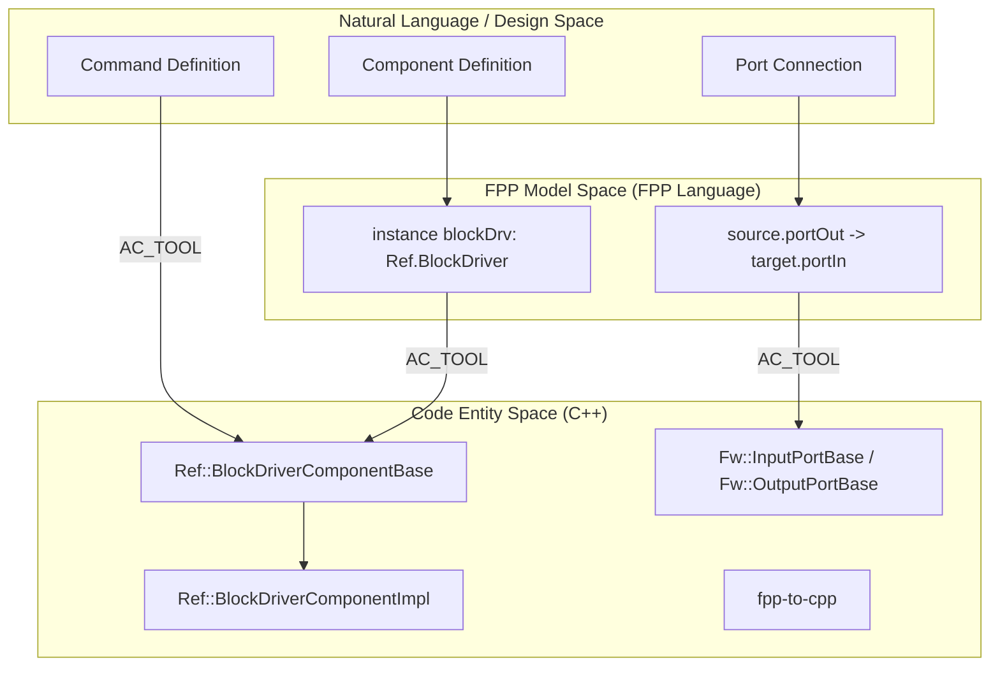
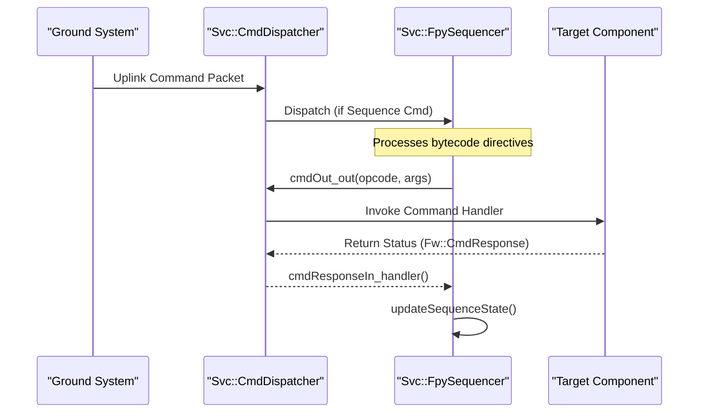

# Page: Glossary

# Glossary

Relevant source files

The following files were used as context for generating this wiki page:

- [.github/actions/spelling/expect.txt](.github/actions/spelling/expect.txt)
- [.github/workflows/pip-check.yml](.github/workflows/pip-check.yml)
- [.pre-commit-config.yaml](.pre-commit-config.yaml)
- [FppTestProject/FppTest/CMakeLists.txt](FppTestProject/FppTest/CMakeLists.txt)
- [FppTestProject/FppTest/sizeof/CMakeLists.txt](FppTestProject/FppTest/sizeof/CMakeLists.txt)
- [FppTestProject/FppTest/sizeof/main.cpp](FppTestProject/FppTest/sizeof/main.cpp)
- [FppTestProject/FppTest/sizeof/sizeof.fpp](FppTestProject/FppTest/sizeof/sizeof.fpp)
- [README.md](README.md)
- [Ref/README.md](Ref/README.md)
- [Ref/Top/CMakeLists.txt](Ref/Top/CMakeLists.txt)
- [Ref/Top/RefTopologyDefs.hpp](Ref/Top/RefTopologyDefs.hpp)
- [Ref/Top/instances.fpp](Ref/Top/instances.fpp)
- [Ref/fprime-gds.yml](Ref/fprime-gds.yml)
- [Svc/CMakeLists.txt](Svc/CMakeLists.txt)
- [Svc/Ccsds/TmFramer/TmFramer.hpp](Svc/Ccsds/TmFramer/TmFramer.hpp)
- [Svc/CmdDispatcher/CMakeLists.txt](Svc/CmdDispatcher/CMakeLists.txt)
- [Svc/Health/Health.fpp](Svc/Health/Health.fpp)
- [Svc/PassThroughRouter/CMakeLists.txt](Svc/PassThroughRouter/CMakeLists.txt)
- [Svc/PassThroughRouter/PassThroughRouter.cpp](Svc/PassThroughRouter/PassThroughRouter.cpp)
- [Svc/PassThroughRouter/PassThroughRouter.fpp](Svc/PassThroughRouter/PassThroughRouter.fpp)
- [Svc/PassThroughRouter/PassThroughRouter.hpp](Svc/PassThroughRouter/PassThroughRouter.hpp)
- [Svc/PassThroughRouter/docs/sdd.md](Svc/PassThroughRouter/docs/sdd.md)
- [Svc/PassThroughRouter/test/ut/PassThroughRouterTestMain.cpp](Svc/PassThroughRouter/test/ut/PassThroughRouterTestMain.cpp)
- [Svc/PassThroughRouter/test/ut/PassThroughRouterTester.cpp](Svc/PassThroughRouter/test/ut/PassThroughRouterTester.cpp)
- [Svc/PassThroughRouter/test/ut/PassThroughRouterTester.hpp](Svc/PassThroughRouter/test/ut/PassThroughRouterTester.hpp)
- [Svc/Ports/FilePorts/CMakeLists.txt](Svc/Ports/FilePorts/CMakeLists.txt)
- [Svc/Subtopologies/CMakeLists.txt](Svc/Subtopologies/CMakeLists.txt)
- [cmake/API.cmake](cmake/API.cmake)
- [cmake/FPrime-Code.cmake](cmake/FPrime-Code.cmake)
- [cmake/FPrime.cmake](cmake/FPrime.cmake)
- [cmake/autocoder/autocoder.cmake](cmake/autocoder/autocoder.cmake)
- [cmake/autocoder/fpp.cmake](cmake/autocoder/fpp.cmake)
- [cmake/autocoder/fpp_ut.cmake](cmake/autocoder/fpp_ut.cmake)
- [cmake/autocoder/helpers.cmake](cmake/autocoder/helpers.cmake)
- [cmake/module.cmake](cmake/module.cmake)
- [cmake/options.cmake](cmake/options.cmake)
- [cmake/platform/platform.cmake](cmake/platform/platform.cmake)
- [cmake/sanitizers.cmake](cmake/sanitizers.cmake)
- [cmake/target/build.cmake](cmake/target/build.cmake)
- [cmake/target/install.cmake](cmake/target/install.cmake)
- [cmake/target/target.cmake](cmake/target/target.cmake)
- [cmake/target/ut.cmake](cmake/target/ut.cmake)
- [cmake/target/version.cmake](cmake/target/version.cmake)
- [cmake/test/data/TestConfigDeployment/override/project/FpConfig.fpp](cmake/test/data/TestConfigDeployment/override/project/FpConfig.fpp)
- [cmake/test/data/test-fprime-library/cmake/autocoder/test.cmake](cmake/test/data/test-fprime-library/cmake/autocoder/test.cmake)
- [cmake/utilities.cmake](cmake/utilities.cmake)
- [default/config/ComCfg.fpp](default/config/ComCfg.fpp)
- [default/config/FpConfig.fpp](default/config/FpConfig.fpp)
- [default/config/FpConstants.fpp](default/config/FpConstants.fpp)
- [docs/INSTALL.md](docs/INSTALL.md)
- [docs/img/fprime-logo.png](docs/img/fprime-logo.png)
- [docs/img/fprime-logo.svg](docs/img/fprime-logo.svg)
- [docs/index.md](docs/index.md)
- [docs/user-manual/gds/gds-test-api-guide.md](docs/user-manual/gds/gds-test-api-guide.md)
- [requirements.txt](requirements.txt)

This glossary defines F´-specific terms, abbreviations, and domain concepts used throughout the framework. F´ is a component-driven framework designed for rapid development of spaceflight and embedded software applications [README.md:7-14]().

## Core Architectural Concepts

### Component
The fundamental unit of software logic in F´. Components are C++ classes that encapsulate behavior and state, communicating only through well-defined interfaces called Ports [README.md:14-15]().
*   **Active Component:** Owns an execution thread and an input message queue. It processes messages asynchronously [Ref/Top/instances.fpp:27-32]().
*   **Queued Component:** Has an input message queue but no thread. It relies on an external thread (usually from an Active component) to trigger message processing [Ref/Top/instances.fpp:67-71]().
*   **Passive Component:** Has no thread or queue. Execution happens synchronously within the thread of the caller [Ref/Top/instances.fpp:89-92]().

### Port
A typed interface that connects components. Ports facilitate communication via function calls (synchronous) or message passing (asynchronous) [cmake/API.cmake:10-11]().

### Topology
The "system-level" view where component instances are instantiated and their ports are interconnected (wired) to form a complete application [Ref/Top/instances.fpp:1-104]().

### Autocoding
The process of generating C++ boilerplate code (base classes, port connectors, and serialization logic) from high-level models, typically written in the FPP language [cmake/FPrime.cmake:4-6]().

**Sources:** [README.md:7-15](), [Ref/Top/instances.fpp:27-92](), [cmake/API.cmake:10-11](), [cmake/FPrime.cmake:4-6]()

## Framework Infrastructure

### FPP (F Prime Prime)
The modeling language used to define components, ports, constants, and topologies. The FPP autocoder transforms these models into C++ code [cmake/autocoder/fpp.cmake:4-6](). Key tools include `fpp-to-cpp`, `fpp-depend`, and `fpp-to-dict` [cmake/autocoder/fpp.cmake:22-22]().

### OSAL (Operating System Abstraction Layer)
A layer that abstracts operating system primitives (tasks, mutexes, files, queues) to allow F´ code to run on different platforms like Linux, Darwin, or Baremetal [cmake/options.cmake:88-106]().

### GDS (Ground Data System)
The suite of tools used to communicate with the flight software, providing a UI for sending commands and visualizing telemetry and events [README.md:120-120]().

**Sources:** [cmake/autocoder/fpp.cmake:4-22](), [cmake/options.cmake:88-106](), [README.md:120-120]()

## Domain Entities

| Term | Definition | Code Pointer |
| :--- | :--- | :--- |
| **Command** | An instruction sent from the ground or a sequencer to a component. | `Svc/CmdDispatcher` [Svc/CMakeLists.txt:30-30]() |
| **Telemetry** | Periodic data points (channels) reported by components to the ground. | `Svc/TlmChan` [Svc/CMakeLists.txt:59-59]() |
| **Event** | A discrete log message indicating a specific occurrence or error. | `Svc/EventManager` [Svc/CMakeLists.txt:37-37]() |
| **Parameter** | Configurable values stored in a database (`PrmDb`) that persist across reboots. | `Svc/PrmDb` [Svc/CMakeLists.txt:55-55]() |
| **Sequence** | A script of commands executed by a sequencer component. | `Svc/CmdSequencer` [Svc/CMakeLists.txt:31-31]() |
| **Data Product**| Large data sets (images, logs) managed via containers and records. | `Svc/DpManager` [Svc/CMakeLists.txt:34-34]() |

**Sources:** [Svc/CMakeLists.txt:30-59]()

## Component Interaction Model

The following diagram illustrates the relationship between FPP modeling and the generated C++ entities.

### From Model to Code

**Sources:** [Ref/Top/instances.fpp:29-32](), [cmake/autocoder/fpp.cmake:22-22](), [cmake/API.cmake:8-12]()

## Command and Data Flow

This diagram shows how a command moves through the system, specifically highlighting the `CmdDispatcher` and `FpySequencer` components.

### Command Execution Flow

**Sources:** [Svc/CMakeLists.txt:30-76](), [Ref/Top/instances.fpp:56-65](), [cmake/API.cmake:10-11]()

## Build System Terminology

*   **Deployment:** A top-level build target representing a specific instance of flight software (e.g., `Ref` or `RPI`) [Ref/Top/CMakeLists.txt:11-21]().
*   **Module:** A logical grouping of source code and models, registered via `register_fprime_module` [cmake/API.cmake:118-120]().
*   **Sub-build:** A specialized build pass used by the autocoder to resolve dependencies before the main compilation [cmake/FPrime.cmake:58-59]().
*   **Toolchain:** A configuration file defining the compilers and flags for a target platform [cmake/options.cmake:29-35]().
*   **Base ID:** A hex identifier used in topologies to ensure unique IDs for commands, telemetry, and events across components [Ref/Top/instances.fpp:7-13]().

**Sources:** [Ref/Top/CMakeLists.txt:11-21](), [cmake/API.cmake:118-120](), [cmake/FPrime.cmake:58-59](), [cmake/options.cmake:29-35](), [Ref/Top/instances.fpp:7-13]()

## Abbreviations

*   **AC:** Autocode / Autocoder [cmake/autocoder/fpp.cmake:71-73]()
*   **EVR:** Event Report (Historical term for Events) [docs/index.md:15-18]()
*   **FPP:** F Prime Prime (Modeling Language) [cmake/autocoder/fpp.cmake:1-10]()
*   **OSAL:** Operating System Abstraction Layer [cmake/options.cmake:88-106]()
*   **UT:** Unit Test [cmake/target/ut.cmake:1-5]()
*   **TLM:** Telemetry [Svc/CMakeLists.txt:59-60]()
*   **PRM:** Parameter [Svc/CMakeLists.txt:55-55]()
*   **CMD:** Command [Svc/CMakeLists.txt:30-32]()

**Sources:** [cmake/autocoder/fpp.cmake:1-73](), [cmake/options.cmake:88-106](), [Svc/CMakeLists.txt:30-60]()