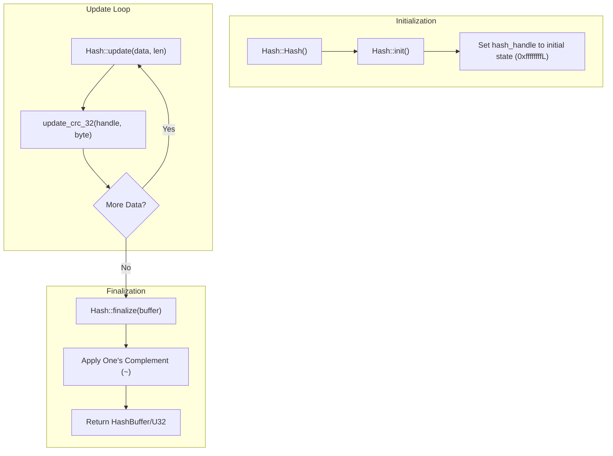
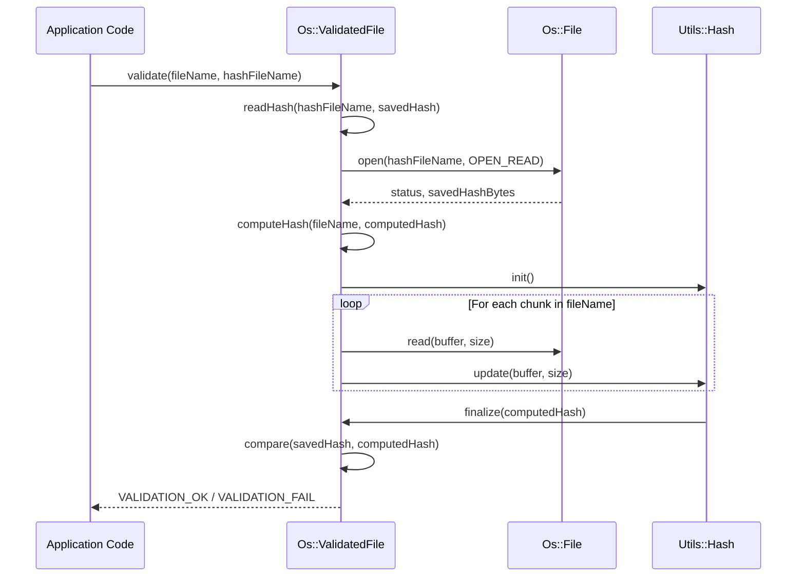
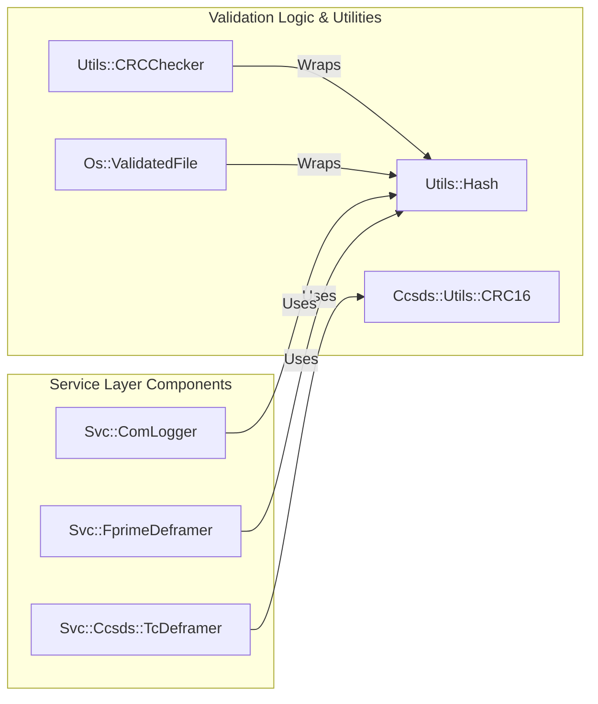

# Page: Hashing, CRC, and Validation

# Hashing, CRC, and Validation

Relevant source files

The following files were used as context for generating this wiki page:

- [CFDP/Checksum/Checksum.cpp](CFDP/Checksum/Checksum.cpp)
- [Fw/FilePacket/CancelPacket.cpp](Fw/FilePacket/CancelPacket.cpp)
- [Fw/FilePacket/DataPacket.cpp](Fw/FilePacket/DataPacket.cpp)
- [Fw/FilePacket/EndPacket.cpp](Fw/FilePacket/EndPacket.cpp)
- [Fw/FilePacket/FilePacket.cpp](Fw/FilePacket/FilePacket.cpp)
- [Fw/FilePacket/FilePacket.hpp](Fw/FilePacket/FilePacket.hpp)
- [Fw/FilePacket/Header.cpp](Fw/FilePacket/Header.cpp)
- [Fw/FilePacket/PathName.cpp](Fw/FilePacket/PathName.cpp)
- [Fw/FilePacket/StartPacket.cpp](Fw/FilePacket/StartPacket.cpp)
- [Fw/Types/Serializable.cpp](Fw/Types/Serializable.cpp)
- [Fw/Types/Serializable.hpp](Fw/Types/Serializable.hpp)
- [Os/ValidateFileCommon.cpp](Os/ValidateFileCommon.cpp)
- [Svc/Ccsds/SpacePacketDeframer/SpacePacketDeframer.cpp](Svc/Ccsds/SpacePacketDeframer/SpacePacketDeframer.cpp)
- [Svc/Ccsds/SpacePacketDeframer/SpacePacketDeframer.fpp](Svc/Ccsds/SpacePacketDeframer/SpacePacketDeframer.fpp)
- [Svc/Ccsds/TcDeframer/TcDeframer.cpp](Svc/Ccsds/TcDeframer/TcDeframer.cpp)
- [Svc/Ccsds/TcDeframer/TcDeframer.fpp](Svc/Ccsds/TcDeframer/TcDeframer.fpp)
- [Svc/Ccsds/Types/Types.fpp](Svc/Ccsds/Types/Types.fpp)
- [Svc/ComLogger/ComLogger.cpp](Svc/ComLogger/ComLogger.cpp)
- [Svc/ComLogger/ComLogger.hpp](Svc/ComLogger/ComLogger.hpp)
- [Svc/FileDownlink/File.cpp](Svc/FileDownlink/File.cpp)
- [Svc/FprimeDeframer/FprimeDeframer.cpp](Svc/FprimeDeframer/FprimeDeframer.cpp)
- [Svc/FprimeDeframer/test/ut/FprimeDeframerTester.cpp](Svc/FprimeDeframer/test/ut/FprimeDeframerTester.cpp)
- [Svc/FrameAccumulator/CMakeLists.txt](Svc/FrameAccumulator/CMakeLists.txt)
- [Svc/FrameAccumulator/FrameDetector/CcsdsTcFrameDetector.cpp](Svc/FrameAccumulator/FrameDetector/CcsdsTcFrameDetector.cpp)
- [Svc/FrameAccumulator/FrameDetector/FprimeFrameDetector.cpp](Svc/FrameAccumulator/FrameDetector/FprimeFrameDetector.cpp)
- [Svc/FrameAccumulator/test/ut/detectors/FprimeFrameDetectorTestMain.cpp](Svc/FrameAccumulator/test/ut/detectors/FprimeFrameDetectorTestMain.cpp)
- [Utils/CMakeLists.txt](Utils/CMakeLists.txt)
- [Utils/CRCChecker.cpp](Utils/CRCChecker.cpp)
- [Utils/CRCChecker.hpp](Utils/CRCChecker.hpp)
- [Utils/Hash/Hash.hpp](Utils/Hash/Hash.hpp)
- [Utils/Hash/HashBuffer.hpp](Utils/Hash/HashBuffer.hpp)
- [Utils/Hash/HashBufferCommon.cpp](Utils/Hash/HashBufferCommon.cpp)
- [Utils/Hash/README.md](Utils/Hash/README.md)
- [Utils/Hash/libcrc/CRC32.cpp](Utils/Hash/libcrc/CRC32.cpp)
- [Utils/Hash/openssl/SHA256.cpp](Utils/Hash/openssl/SHA256.cpp)
- [Utils/test/ut/RateLimiterTester.cpp](Utils/test/ut/RateLimiterTester.cpp)
- [Utils/test/ut/RateLimiterTester.hpp](Utils/test/ut/RateLimiterTester.hpp)
- [default/config/CRCCheckerConfig.hpp](default/config/CRCCheckerConfig.hpp)

This page describes the F´ framework's utilities and components for data integrity. F´ employs a multi-layered approach to validation, ranging from low-level bitwise CRC checks in communication framing to cryptographic SHA-256 hashing for file persistence and CCSDS-standard checksums for file delivery protocols.

## Utils::Hash

The `Utils::Hash` class provides a generic, platform-independent interface for computing hash values. Depending on the build configuration and the included implementation files, it typically maps to either **SHA-256** (via OpenSSL) or **CRC-32** (via a bundled libcrc implementation).

### Key Implementation Details
- **Interface**: The class supports both "all-at-once" hashing via a static method and incremental hashing for large data streams [Utils/Hash/Hash.hpp:46-77]().
- **Handle Management**: It maintains an internal `hash_handle` that holds the state of an ongoing calculation [Utils/Hash/Hash.hpp:101]().
- **CRC-32 Implementation**: When configured for CRC-32, it uses a polynomial initialized to `0xffffffffL` [Utils/Hash/libcrc/CRC32.cpp:27-42](). It processes data byte-by-byte via `update_crc_32` and returns the one's complement of the final result [Utils/Hash/libcrc/CRC32.cpp:54-66]().
- **File Extensions**: The class provides a standard way to determine the file extension for a hash file (e.g., `.sha256` or `.CRC32`) [Utils/Hash/Hash.hpp:79-92]().

### Data Flow: Incremental Hashing
The following diagram shows how `Utils::Hash` is used to process data in chunks, which is the standard pattern for validating large files or incoming telemetry frames.

**Incremental Hash Processing**

Sources: [Utils/Hash/Hash.hpp:56-77](), [Utils/Hash/libcrc/CRC32.cpp:41-66]()

---

## Utils::CRCChecker

The `Utils::CRCChecker` provides high-level utility functions specifically for file-based CRC validation. It automates the process of reading a file in blocks, computing a CRC-32, and comparing it against a stored `.CRC32` sidecar file.

- **`create_checksum_file`**: Reads a source file in blocks defined by `CRC_FILE_READ_BLOCK` (default 4KB), computes the hash using `Utils::Hash`, and writes the resulting `U32` checksum to a new file with the `.CRC32` extension [Utils/CRCChecker.cpp:24-104]().
- **`verify_checksum`**: Computes the CRC of a file and compares it against the value retrieved via `read_crc32_from_file`, returning a `crc_stat_t` result [Utils/CRCChecker.cpp:133-205]().

Sources: [Utils/CRCChecker.hpp:22-37](), [Utils/CRCChecker.cpp:147-175]()

---

## Os::ValidatedFile

The `Os::ValidatedFile` (implemented primarily in `Os/ValidateFileCommon.cpp`) provides a system-level abstraction for ensuring file integrity. It bridges the `Os::File` filesystem operations with `Utils::Hash` logic.

### Core Functions
- **`computeHash`**: Opens an `Os::File`, iterates through it using `VFILE_HASH_CHUNK_SIZE` buffers, and generates a `Utils::HashBuffer` via `Utils::Hash::update` [Os/ValidateFileCommon.cpp:8-60]().
- **`validate`**: A high-level routine that reads a saved hash from a sidecar file using `readHash`, computes the current hash of the target file via `computeHash`, and performs a comparison [Os/ValidateFileCommon.cpp:171-198]().

**File Validation Data Flow**

Sources: [Os/ValidateFileCommon.cpp:8-60](), [Os/ValidateFileCommon.cpp:171-198]()

---

## Integrity in Communication and File Transfer

F´ uses these utilities across the service layer to ensure data received from the ground or stored on disk has not been corrupted.

### Framing Integrity (Svc::FprimeDeframer)
The `FprimeDeframer` component validates every incoming frame. It deserializes an `FprimeProtocol::FrameHeader` and `FprimeProtocol::FrameTrailer`, then uses `Utils::Hash` to compute a CRC over the header and payload to compare against the `crcField` in the trailer [Svc/FprimeDeframer/FprimeDeframer.cpp:84-99]().

### CCSDS TC Framing (Svc::Ccsds::TcDeframer)
For CCSDS-compliant telecommands, the `TcDeframer` uses a specialized `Ccsds::Utils::CRC16` to compute the Frame Error Control Field (FECF). It validates the CRC over the entire frame minus the 2-byte trailer [Svc/Ccsds/TcDeframer/TcDeframer.cpp:96-110]().

### File Downlink and CFDP Checksums
The `Svc::FileDownlink` component utilizes the `CFDP::Checksum` class (based on the CCSDS File Delivery Protocol) to maintain a running checksum of a file as it is partitioned into `Fw::FilePacket` objects.

1. **Initialization**: When a file is opened for downlink, the checksum is initialized.
2. **Update**: As each chunk of the file is read to be packed into a `DataPacket`, the checksum is updated.
3. **Finalization**: The final checksum is placed into the `EndPacket` to allow the ground system to verify the entire file assembly [Fw/FilePacket/EndPacket.cpp:1-50]().

### Communication Logging (Svc::ComLogger)
`Svc::ComLogger` records raw `Fw::ComBuffer` data to disk. To ensure these logs are valid for post-processing, it generates a hash sidecar file via `writeHashFile()` whenever a log file is closed [Svc/ComLogger/ComLogger.cpp:66-79](). It uses `Utils::Hash::getFileExtensionString()` to name the sidecar [Svc/ComLogger/ComLogger.cpp:142]().

**Component and Class Mapping**

Sources: [Svc/FprimeDeframer/FprimeDeframer.cpp:85-95](), [Svc/Ccsds/TcDeframer/TcDeframer.cpp:97](), [Svc/ComLogger/ComLogger.cpp:169-172](), [Os/ValidateFileCommon.cpp:28-30]()

---

## Summary Table of Validation Types

| Utility / Component | Algorithm | Purpose | Source |
|:--- |:--- |:--- |:--- |
| `Utils::Hash` | SHA-256 / CRC-32 | Generic data hashing | [Utils/Hash/Hash.hpp]() |
| `CFDP::Checksum` | CCSDS Checksum | File delivery integrity | [CFDP/Checksum/Checksum.cpp]() |
| `Ccsds::Utils::CRC16`| CRC-16-CCITT | CCSDS Frame Error Control | [Svc/Ccsds/TcDeframer/TcDeframer.cpp:97]() |
| `Utils::CRCChecker` | CRC-32 | Sidecar-based file validation | [Utils/CRCChecker.cpp]() |
| `FprimeDeframer` | CRC-32 (via Hash) | Integrity of uplinked frames | [Svc/FprimeDeframer/FprimeDeframer.cpp]() |
| `Os::ValidatedFile` | Configurable (via Hash) | OS-level file verification | [Os/ValidateFileCommon.cpp]() |

Sources: [Utils/Hash/Hash.hpp:24](), [Svc/FprimeDeframer/FprimeDeframer.cpp:85](), [Os/ValidateFileCommon.cpp:3](), [Svc/Ccsds/TcDeframer/TcDeframer.cpp:97]()
