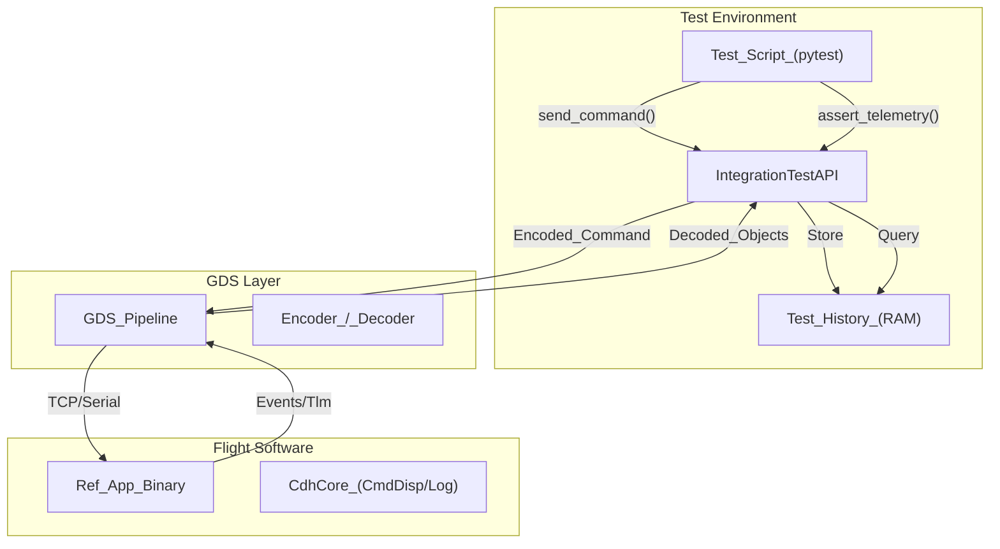
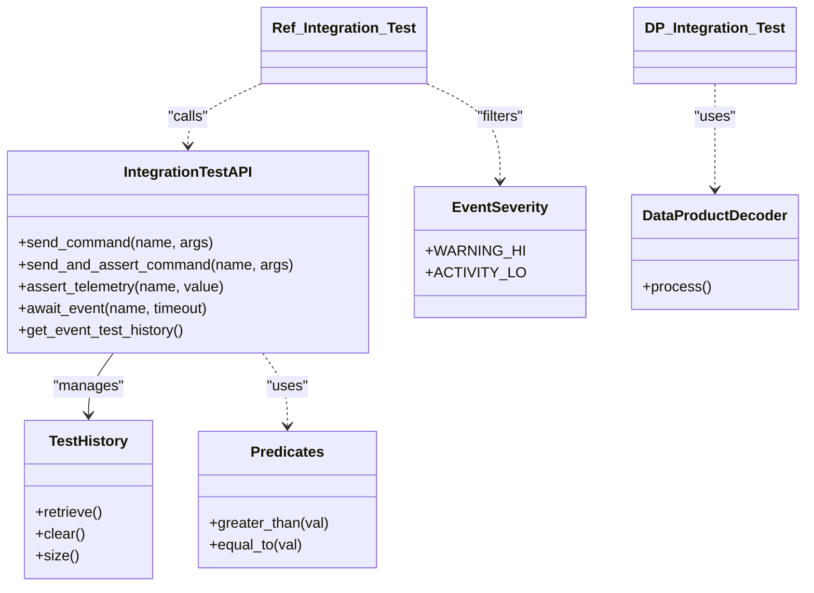

# Page: Integration Test API

# Integration Test API

<details>
<summary>Relevant source files</summary>

The following files were used as context for generating this wiki page:

- [.github/workflows/pip-check.yml](.github/workflows/pip-check.yml)
- [FppTestProject/FppTest/CMakeLists.txt](FppTestProject/FppTest/CMakeLists.txt)
- [FppTestProject/FppTest/array/main.cpp](FppTestProject/FppTest/array/main.cpp)
- [FppTestProject/FppTest/component/tests/CmdTests.hpp](FppTestProject/FppTest/component/tests/CmdTests.hpp)
- [FppTestProject/FppTest/component/tests/PortTests.hpp](FppTestProject/FppTest/component/tests/PortTests.hpp)
- [FppTestProject/FppTest/enum/EnumToStringTest.cpp](FppTestProject/FppTest/enum/EnumToStringTest.cpp)
- [FppTestProject/FppTest/enum/main.cpp](FppTestProject/FppTest/enum/main.cpp)
- [FppTestProject/FppTest/sizeof/CMakeLists.txt](FppTestProject/FppTest/sizeof/CMakeLists.txt)
- [FppTestProject/FppTest/sizeof/main.cpp](FppTestProject/FppTest/sizeof/main.cpp)
- [FppTestProject/FppTest/sizeof/sizeof.fpp](FppTestProject/FppTest/sizeof/sizeof.fpp)
- [FppTestProject/FppTest/typed_tests/ArrayTest.hpp](FppTestProject/FppTest/typed_tests/ArrayTest.hpp)
- [FppTestProject/FppTest/typed_tests/EnumTest.hpp](FppTestProject/FppTest/typed_tests/EnumTest.hpp)
- [Fw/Dp/docs/sdd.md](Fw/Dp/docs/sdd.md)
- [Ref/DpDemo/CMakeLists.txt](Ref/DpDemo/CMakeLists.txt)
- [Ref/DpDemo/DpDemo.cpp](Ref/DpDemo/DpDemo.cpp)
- [Ref/DpDemo/DpDemo.hpp](Ref/DpDemo/DpDemo.hpp)
- [Ref/DpDemo/test/int/dp_demo_integration_test.py](Ref/DpDemo/test/int/dp_demo_integration_test.py)
- [Ref/DpDemo/test/int/dp_ref_output.json](Ref/DpDemo/test/int/dp_ref_output.json)
- [Ref/RecvBuffApp/docs/sdd.md](Ref/RecvBuffApp/docs/sdd.md)
- [Ref/SendBuffApp/docs/sdd.md](Ref/SendBuffApp/docs/sdd.md)
- [Ref/SignalGen/docs/sdd.md](Ref/SignalGen/docs/sdd.md)
- [Ref/fprime-gds.yml](Ref/fprime-gds.yml)
- [Ref/test/int/ref_integration_test.py](Ref/test/int/ref_integration_test.py)
- [Ref/test/int/test_seq.seq](Ref/test/int/test_seq.seq)
- [cmake/target/version.cmake](cmake/target/version.cmake)
- [cmake/test/data/TestConfigDeployment/override/project/FpConfig.fpp](cmake/test/data/TestConfigDeployment/override/project/FpConfig.fpp)
- [default/config/ComCfg.fpp](default/config/ComCfg.fpp)
- [default/config/FpConfig.fpp](default/config/FpConfig.fpp)
- [default/config/FpConstants.fpp](default/config/FpConstants.fpp)
- [docs/user-manual/framework/data-products.md](docs/user-manual/framework/data-products.md)
- [docs/user-manual/gds/gds-test-api-guide.md](docs/user-manual/gds/gds-test-api-guide.md)
- [requirements.txt](requirements.txt)

</details>


The F´ Integration Test API provides a high-level Python framework for writing automated system-level tests against a running F´ deployment. It abstracts the complexity of the Ground Data System (GDS) communication stack into a clean, procedural API for sending commands and asserting the state of telemetry, events, and data products.

## Overview

The integration test framework is built around the `IntegrationTestAPI` class. It allows developers to interact with a flight software (FSW) binary through the same pipeline used by the GDS Web UI. Tests are typically written using `pytest` and utilize the API to perform "send-and-await" or "send-and-assert" patterns [docs/user-manual/gds/gds-test-api-guide.md:9-24]().

### Key Components

| Component | Role |
|---|---|
| **IntegrationTestAPI** | The primary interface for sending commands and querying history [docs/user-manual/gds/gds-test-api-guide.md:3-5](). |
| **Predicates** | Logic objects used to filter or validate incoming data (e.g., `greater_than`, `equal_to`) [Ref/test/int/ref_integration_test.py:11-12](). |
| **Test History** | Thread-safe storage for all received events, telemetry, and command responses [docs/user-manual/gds/gds-test-api-guide.md:30-32](). |
| **Test Logger** | Integrated logging for test results and FSW interactions [Ref/test/int/ref_integration_test.py:138-142](). |

Sources: `Ref/test/int/ref_integration_test.py`, `docs/user-manual/gds/gds-test-api-guide.md`

## Integration Test Architecture

The following diagram illustrates how the Integration Test API bridges the gap between the Python test script and the F´ flight software deployment.

### System Data Flow

Sources: [Ref/test/int/ref_integration_test.py:24-36](), [Ref/test/int/ref_integration_test.py:78-87](), [docs/user-manual/gds/gds-test-api-guide.md:1-24]()

## The IntegrationTestAPI Class

The `IntegrationTestAPI` provides methods to interact with the FSW. It maintains a history of all messages received from the FSW during the test execution.

### Command Execution
*   `send_command(cmd_name, args)`: Sends a command without waiting for completion [Ref/test/int/ref_integration_test.py:59-62]().
*   `send_and_assert_command(cmd_name, args, events, timeout)`: Sends a command and asserts that specific events (e.g. `OpCodeCompleted`) are received within a timeout [Ref/test/int/ref_integration_test.py:83-85](), [docs/user-manual/gds/gds-test-api-guide.md:48-52]().
*   `send_and_await_event(cmd_name, args, events, timeout)`: Sends a command and waits for a specific sequence of events to occur [Ref/test/int/ref_integration_test.py:127-129]().

### Telemetry and Event Assertions
*   `assert_telemetry(channel_name, value, timeout)`: Asserts a specific channel reaches a value [Ref/test/int/ref_integration_test.py:34-36](), [docs/user-manual/gds/gds-test-api-guide.md:94-105]().
*   `assert_telemetry_count(count, timeout)`: Asserts that a certain number of telemetry updates are received [Ref/test/int/ref_integration_test.py:30]().
*   `await_event(event_name, timeout)`: Blocks until a specific event is received [Ref/DpDemo/test/int/dp_demo_integration_test.py:13](), [docs/user-manual/gds/gds-test-api-guide.md:126-131]().

### History Management
The API maintains separate histories for different data types. These can be cleared between test cases to ensure isolation.
*   `get_event_test_history()`: Returns the list of received events [Ref/test/int/ref_integration_test.py:132]().
*   `get_command_test_history()`: Returns the history of command status updates [Ref/test/int/ref_integration_test.py:84]().
*   `clear_histories()`: Flushes all stored data [Ref/test/int/ref_integration_test.py:153]().

Sources: `Ref/test/int/ref_integration_test.py`, `Ref/DpDemo/test/int/dp_demo_integration_test.py`, `docs/user-manual/gds/gds-test-api-guide.md`

## Predicates and Filtering

Predicates are used to perform complex matching on telemetry and events. Instead of simple equality, developers can use functional predicates from `fprime_gds.common.testing_fw.predicates` [Ref/test/int/ref_integration_test.py:11]().

| Predicate | Description |
|---|---|
| `equal_to(val)` | Matches if the data equals `val`. |
| `greater_than(val)` | Matches if the data is numerically greater than `val`. |
| `less_than(val)` | Matches if the data is numerically less than `val`. |
| `contains(string)` | Matches if the string is present in the data. |

Example usage in telemetry counting:
```python
# count_pred matches if count is > 59
count_pred = predicates.greater_than(length - 1)
results = fprime_test_api.await_telemetry_count(
    count_pred, "Ref.blockDrv.BD_Cycles", timeout=length
)
```
Sources: [Ref/test/int/ref_integration_test.py:173-176](), [docs/user-manual/gds/gds-test-api-guide.md:56-60]()

## Worked Example: Ref Integration Test

The `Ref` application integration tests demonstrate common patterns for verifying FSW behavior.

### Command and Event Sequencing
The following test verifies that a `CMD_NO_OP` command results in the standard dispatch/receipt/completion event sequence from `CdhCore.cmdDisp` [Ref/test/int/ref_integration_test.py:119-123]():

```python
def test_send_and_assert_no_op(fprime_test_api):
    evr_seq = [
        "CdhCore.cmdDisp.OpCodeDispatched",
        "CdhCore.cmdDisp.NoOpReceived",
        "CdhCore.cmdDisp.OpCodeCompleted",
    ]
    results = fprime_test_api.send_and_await_event(
        "CdhCore.cmdDisp.CMD_NO_OP", events=evr_seq, timeout=25
    )
    assert len(results) == 3
```
Sources: [Ref/test/int/ref_integration_test.py:111-131]()

### Data Product Verification
Integration tests can also verify the end-to-end data product (DP) lifecycle [Ref/DpDemo/test/int/dp_demo_integration_test.py:7-9]():
1.  Command the producer (`Ref.dpDemo.Dp`) [Ref/DpDemo/test/int/dp_demo_integration_test.py:11]().
2.  Await the `FileWritten` event from `DataProducts.dpWriter` [Ref/DpDemo/test/int/dp_demo_integration_test.py:19-21]().
3.  Verify the file exists on disk using `Path.is_file()` [Ref/DpDemo/test/int/dp_demo_integration_test.py:25]().
4.  Decode the file using `DataProductDecoder` to verify content against a reference [Ref/DpDemo/test/int/dp_demo_integration_test.py:43-60]().

Sources: `Ref/DpDemo/test/int/dp_demo_integration_test.py`, `docs/user-manual/framework/data-products.md`

## Code Entity Map

The following diagram maps the logical test actions to the underlying GDS and Framework classes.


Sources: [Ref/test/int/ref_integration_test.py:11-12](), [Ref/test/int/ref_integration_test.py:18-21](), [Ref/DpDemo/test/int/dp_demo_integration_test.py:4-45](), [docs/user-manual/gds/gds-test-api-guide.md:3-5]()
