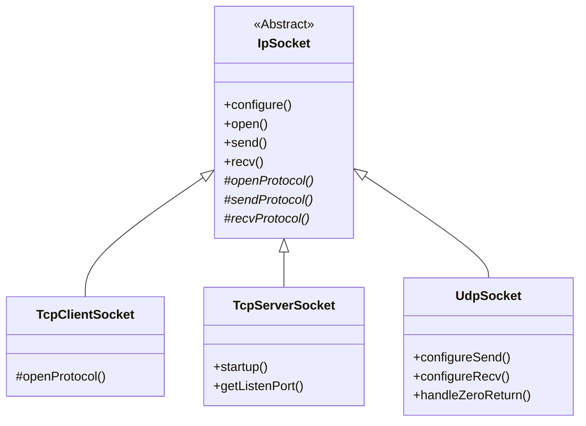
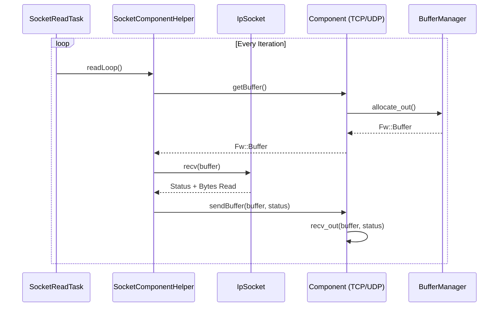
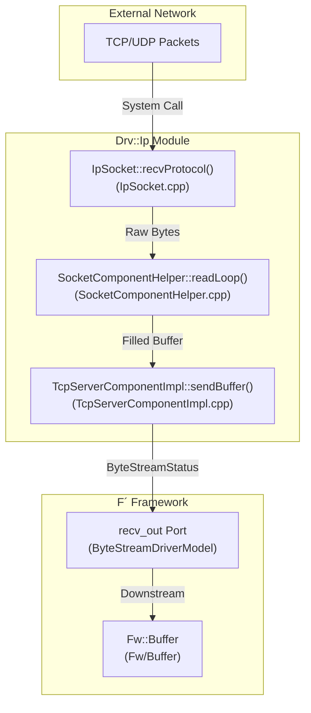

# Page: IP and Socket Drivers

# IP and Socket Drivers

Relevant source files

The following files were used as context for generating this wiki page:

- [Drv/ByteStreamDriverModel/docs/sdd.md](Drv/ByteStreamDriverModel/docs/sdd.md)
- [Drv/CMakeLists.txt](Drv/CMakeLists.txt)
- [Drv/Ip/IpSocket.cpp](Drv/Ip/IpSocket.cpp)
- [Drv/Ip/IpSocket.hpp](Drv/Ip/IpSocket.hpp)
- [Drv/Ip/SocketComponentHelper.cpp](Drv/Ip/SocketComponentHelper.cpp)
- [Drv/Ip/SocketComponentHelper.hpp](Drv/Ip/SocketComponentHelper.hpp)
- [Drv/Ip/TcpClientSocket.cpp](Drv/Ip/TcpClientSocket.cpp)
- [Drv/Ip/TcpClientSocket.hpp](Drv/Ip/TcpClientSocket.hpp)
- [Drv/Ip/TcpServerSocket.cpp](Drv/Ip/TcpServerSocket.cpp)
- [Drv/Ip/TcpServerSocket.hpp](Drv/Ip/TcpServerSocket.hpp)
- [Drv/Ip/UdpSocket.cpp](Drv/Ip/UdpSocket.cpp)
- [Drv/Ip/UdpSocket.hpp](Drv/Ip/UdpSocket.hpp)
- [Drv/Ip/docs/sdd.md](Drv/Ip/docs/sdd.md)
- [Drv/Ip/test/ut/PortSelector.cpp](Drv/Ip/test/ut/PortSelector.cpp)
- [Drv/Ip/test/ut/SocketTestHelper.cpp](Drv/Ip/test/ut/SocketTestHelper.cpp)
- [Drv/Ip/test/ut/SocketTestHelper.hpp](Drv/Ip/test/ut/SocketTestHelper.hpp)
- [Drv/Ip/test/ut/TestUdp.cpp](Drv/Ip/test/ut/TestUdp.cpp)
- [Drv/LinuxUartDriver/docs/sdd.md](Drv/LinuxUartDriver/docs/sdd.md)
- [Drv/TcpClient/TcpClientComponentImpl.cpp](Drv/TcpClient/TcpClientComponentImpl.cpp)
- [Drv/TcpClient/TcpClientComponentImpl.hpp](Drv/TcpClient/TcpClientComponentImpl.hpp)
- [Drv/TcpClient/docs/sdd.md](Drv/TcpClient/docs/sdd.md)
- [Drv/TcpClient/test/ut/TcpClientTester.cpp](Drv/TcpClient/test/ut/TcpClientTester.cpp)
- [Drv/TcpClient/test/ut/TcpClientTester.hpp](Drv/TcpClient/test/ut/TcpClientTester.hpp)
- [Drv/TcpServer/TcpServerComponentImpl.cpp](Drv/TcpServer/TcpServerComponentImpl.cpp)
- [Drv/TcpServer/TcpServerComponentImpl.hpp](Drv/TcpServer/TcpServerComponentImpl.hpp)
- [Drv/TcpServer/docs/sdd.md](Drv/TcpServer/docs/sdd.md)
- [Drv/TcpServer/test/ut/TcpServerTester.cpp](Drv/TcpServer/test/ut/TcpServerTester.cpp)
- [Drv/TcpServer/test/ut/TcpServerTester.hpp](Drv/TcpServer/test/ut/TcpServerTester.hpp)
- [Drv/Udp/UdpComponentImpl.cpp](Drv/Udp/UdpComponentImpl.cpp)
- [Drv/Udp/UdpComponentImpl.hpp](Drv/Udp/UdpComponentImpl.hpp)
- [Drv/Udp/docs/sdd.md](Drv/Udp/docs/sdd.md)
- [Drv/Udp/test/ut/UdpTestMain.cpp](Drv/Udp/test/ut/UdpTestMain.cpp)
- [Drv/Udp/test/ut/UdpTester.cpp](Drv/Udp/test/ut/UdpTester.cpp)
- [Drv/Udp/test/ut/UdpTester.hpp](Drv/Udp/test/ut/UdpTester.hpp)
- [Os/Generic/docs/sdd.md](Os/Generic/docs/sdd.md)
- [Svc/BufferManager/docs/sdd.md](Svc/BufferManager/docs/sdd.md)
- [Svc/ComStub/docs/sdd.md](Svc/ComStub/docs/sdd.md)
- [Svc/FprimeDeframer/docs/sdd.md](Svc/FprimeDeframer/docs/sdd.md)
- [Svc/FprimeProtocol/docs/sdd.md](Svc/FprimeProtocol/docs/sdd.md)
- [Svc/LinuxTimer/CMakeLists.txt](Svc/LinuxTimer/CMakeLists.txt)
- [default/config/IpCfg.hpp](default/config/IpCfg.hpp)
- [docs/how-to/custom-framing.md](docs/how-to/custom-framing.md)
- [docs/how-to/derive-channels-on-ground.md](docs/how-to/derive-channels-on-ground.md)
- [docs/how-to/develop-device-driver.md](docs/how-to/develop-device-driver.md)
- [docs/how-to/develop-gds-plugins.md](docs/how-to/develop-gds-plugins.md)
- [docs/reference/fpp-json-dict.md](docs/reference/fpp-json-dict.md)
- [docs/tutorials/cross-compilation.md](docs/tutorials/cross-compilation.md)
- [docs/user-manual/design-patterns/app-man-drv.md](docs/user-manual/design-patterns/app-man-drv.md)
- [docs/user-manual/framework/ground-interface.md](docs/user-manual/framework/ground-interface.md)
- [docs/user-manual/framework/memory-management/buffer-pool.md](docs/user-manual/framework/memory-management/buffer-pool.md)
- [docs/user-manual/gds/gds-custom-dashboards.md](docs/user-manual/gds/gds-custom-dashboards.md)
- [docs/user-manual/gds/gds-dashboard-reference.md](docs/user-manual/gds/gds-dashboard-reference.md)
- [docs/user-manual/overview/gds-introduction.md](docs/user-manual/overview/gds-introduction.md)

The `Drv/Ip` module provides a set of reusable base classes and components for IP-based communication in F´. These drivers abstract the underlying Berkeley sockets (or OS-specific equivalents) to provide TCP and UDP connectivity while adhering to the framework's component-based architecture and memory management protocols.

## Byte Stream Driver Model

Most IP drivers in F´ implement the **ByteStreamDriverModel**. This model defines a standard interface for components that handle a stream of bytes, typically consisting of an outgoing stream and an incoming stream.

*   **Send (Input Port):** A `guarded` or `async` port used by manager components to send data. In the synchronous version, the port blocks and returns status; in the asynchronous version, it calls back on a `sendReturnOut` port. [Drv/ByteStreamDriverModel/docs/sdd.md:8-15]()
*   **Recv (Output Port):** A port used by the driver to pass received data back to the system. [Drv/ByteStreamDriverModel/docs/sdd.md:27-28]()
*   **Status Codes:** Operations return `ByteStreamStatus`, including `OP_OK`, `SEND_RETRY` (for flow control), and `OTHER_ERROR`. [Drv/ByteStreamDriverModel/docs/sdd.md:19-24]()

Sources: [Drv/ByteStreamDriverModel/docs/sdd.md:1-35](), [Drv/TcpServer/TcpServerComponentImpl.cpp:118-133]()

## Core Implementation: IpSocket

The `IpSocket` class serves as the base abstraction for all socket operations. It isolates the socket interface from the `Fw::Buffer` class to prevent naming collisions (e.g., with VxWorks macros like `m_data`) and provides platform-independent wrappers for `socket`, `bind`, `send`, and `recv`. [Drv/Ip/IpSocket.cpp:19-43]()

### Key Functions
*   **`configure`**: Sets the hostname, port, and timeouts. [Drv/Ip/IpSocket.cpp:51-63]()
*   **`open`**: Invokes protocol-specific logic to initialize the socket descriptor. [Drv/Ip/IpSocket.cpp:120-130]()
*   **`send`**: Handles retries and error checking for outgoing data across multiple iterations if needed. [Drv/Ip/IpSocket.cpp:132-165]()
*   **`recv`**: Reads data into a provided buffer, handling `EINTR` and protocol-specific zero-return logic (e.g., distinguishing between a closed TCP connection and a 0-byte UDP datagram). [Drv/Ip/IpSocket.cpp:167-185]()

### Class Hierarchy

Sources: [Drv/Ip/IpSocket.hpp:25-100](), [Drv/Ip/IpSocket.cpp:45-130](), [Drv/Ip/UdpSocket.hpp:44-165](), [Drv/Ip/TcpServerSocket.hpp:26-60]()

## Socket Components

F´ provides three primary IP components that wrap the socket logic into the F´ component lifecycle.

### 1. TcpClientComponentImpl
A synchronous byte stream driver that connects to a remote TCP server. It is typically used for ground station communication or inter-processor links where the flight software acts as the client.
*   **Implementation:** Uses `TcpClientSocket` for the underlying connection. [Drv/TcpClient/TcpClientComponentImpl.hpp:144-145]()

### 2. TcpServerComponentImpl
A component that listens for an incoming TCP connection. It supports automatic reconnection and manages a single client connection at a time.
*   **`startup()`**: Configures the server to listen on a port by calling `m_socket.startup`. [Drv/TcpServer/TcpServerComponentImpl.cpp:78-86]()
*   **`readLoop()`**: Overrides the default helper loop to include server-specific `startup` and `terminate` logic, ensuring the server stays alive even if clients disconnect. [Drv/TcpServer/TcpServerComponentImpl.cpp:94-112]()

### 3. UdpComponentImpl
A component providing connectionless UDP communication. Unlike TCP components, UDP requires separate configuration for sending and receiving.
*   **`configureSend`**: Sets the destination for outgoing datagrams. [Drv/Udp/UdpComponentImpl.cpp:38-44]()
*   **`configureRecv`**: Sets the local interface and port to bind for incoming data. [Drv/Udp/UdpComponentImpl.cpp:46-49]()

Sources: [Drv/TcpServer/TcpServerComponentImpl.hpp:24-175](), [Drv/TcpClient/TcpClientComponentImpl.hpp:26-150](), [Drv/Udp/UdpComponentImpl.hpp:25-130]()

## Tasking and Helpers

### SocketComponentHelper and SocketReadTask
The `SocketComponentHelper` provides a standardized `readLoop` used by IP components. This loop is typically executed within an `Os::Task` (often referred to as the `SocketReadTask`) to ensure that blocking `recv` calls do not stall the rest of the software. [Drv/Ip/SocketComponentHelper.cpp:28-45]()

Sources: [Drv/Ip/SocketComponentHelper.cpp:15-50](), [Drv/TcpServer/TcpServerComponentImpl.cpp:51-65](), [Drv/Ip/SocketComponentHelper.hpp:24-60]()

## Data Flow: Code Entity Mapping

The following diagram maps the conceptual IP data flow to the specific classes and methods implemented in the `Drv/Ip` module.

Sources: [Drv/Ip/IpSocket.cpp:167-185](), [Drv/Ip/SocketComponentHelper.cpp:28-45](), [Drv/TcpServer/TcpServerComponentImpl.cpp:55-65]()

## Buffer Adapters

For more specialized non-blocking operations, the module includes:
*   **ByteStreamBufferAdapter**: A component that adapts a byte stream to a buffer-based interface.
*   **AsyncByteStreamBufferAdapter**: Provides an asynchronous interface for the same purpose, allowing for non-blocking send operations where status is returned via a callback. [Drv/CMakeLists.txt:8-10]()

## Legacy Support: SocketIpDriver
The `SocketIpDriver` is a legacy component that combined both TCP and UDP logic into a single entity. It is maintained for backward compatibility but has largely been superseded by the modular `TcpClient`, `TcpServer`, and `Udp` components which offer better separation of concerns and adherence to the `ByteStreamDriverModel`.

Sources: [Drv/Ip/docs/sdd.md:5-20]()
