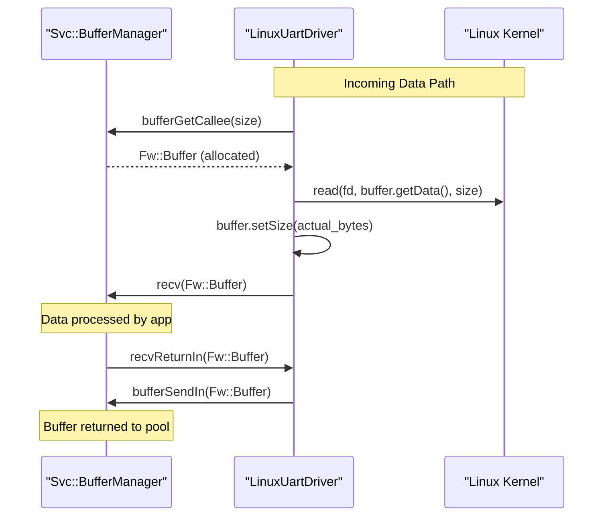

# Page: Linux Hardware Drivers

# Linux Hardware Drivers

<details>
<summary>Relevant source files</summary>

The following files were used as context for generating this wiki page:

- [Drv/Interfaces/Spi.fpp](Drv/Interfaces/Spi.fpp)
- [Drv/LinuxGpioDriver/LinuxGpioDriver.cpp](Drv/LinuxGpioDriver/LinuxGpioDriver.cpp)
- [Drv/LinuxGpioDriver/LinuxGpioDriver.hpp](Drv/LinuxGpioDriver/LinuxGpioDriver.hpp)
- [Drv/LinuxGpioDriver/LinuxGpioDriverCommon.cpp](Drv/LinuxGpioDriver/LinuxGpioDriverCommon.cpp)
- [Drv/LinuxSpiDriver/LinuxSpiDriverComponentImpl.cpp](Drv/LinuxSpiDriver/LinuxSpiDriverComponentImpl.cpp)
- [Drv/LinuxSpiDriver/LinuxSpiDriverComponentImpl.hpp](Drv/LinuxSpiDriver/LinuxSpiDriverComponentImpl.hpp)
- [Drv/LinuxSpiDriver/LinuxSpiDriverComponentImplCommon.cpp](Drv/LinuxSpiDriver/LinuxSpiDriverComponentImplCommon.cpp)
- [Drv/LinuxSpiDriver/LinuxSpiDriverComponentImplStub.cpp](Drv/LinuxSpiDriver/LinuxSpiDriverComponentImplStub.cpp)
- [Drv/LinuxSpiDriver/test/ut/main.cpp](Drv/LinuxSpiDriver/test/ut/main.cpp)
- [Drv/LinuxUartDriver/LinuxUartDriver.cpp](Drv/LinuxUartDriver/LinuxUartDriver.cpp)
- [Drv/LinuxUartDriver/LinuxUartDriver.fpp](Drv/LinuxUartDriver/LinuxUartDriver.fpp)
- [Drv/LinuxUartDriver/LinuxUartDriver.hpp](Drv/LinuxUartDriver/LinuxUartDriver.hpp)
- [Drv/LinuxUartDriver/Telemetry.fppi](Drv/LinuxUartDriver/Telemetry.fppi)
- [Drv/Ports/SpiDriverPorts.fpp](Drv/Ports/SpiDriverPorts.fpp)
- [Drv/TcpClient/TcpClient.fpp](Drv/TcpClient/TcpClient.fpp)
- [Drv/TcpServer/TcpServer.fpp](Drv/TcpServer/TcpServer.fpp)
- [Drv/Udp/Udp.fpp](Drv/Udp/Udp.fpp)
- [Fw/Buffer/Buffer.cpp](Fw/Buffer/Buffer.cpp)
- [Fw/Buffer/Buffer.hpp](Fw/Buffer/Buffer.hpp)
- [Fw/Buffer/CMakeLists.txt](Fw/Buffer/CMakeLists.txt)
- [Fw/Buffer/docs/sdd.md](Fw/Buffer/docs/sdd.md)
- [Fw/Buffer/test/ut/TestBuffer.cpp](Fw/Buffer/test/ut/TestBuffer.cpp)
- [Fw/Types/test/ut/SerializeBufferBaseTester.hpp](Fw/Types/test/ut/SerializeBufferBaseTester.hpp)
- [Ref/PingReceiver/docs/sdd.md](Ref/PingReceiver/docs/sdd.md)
- [STest/README.md](STest/README.md)
- [Svc/ActivePhaser/ActivePhaser.cpp](Svc/ActivePhaser/ActivePhaser.cpp)
- [Svc/BufferManager/BufferManagerComponentImpl.cpp](Svc/BufferManager/BufferManagerComponentImpl.cpp)
- [Svc/BufferManager/BufferManagerComponentImpl.hpp](Svc/BufferManager/BufferManagerComponentImpl.hpp)
- [Svc/BufferRepeater/BufferRepeater.cpp](Svc/BufferRepeater/BufferRepeater.cpp)
- [Svc/EventManager/EventManager.cpp](Svc/EventManager/EventManager.cpp)
- [Svc/FatalHandler/FatalHandlerComponentBaremetalImpl.cpp](Svc/FatalHandler/FatalHandlerComponentBaremetalImpl.cpp)
- [Svc/FatalHandler/FatalHandlerComponentImpl.hpp](Svc/FatalHandler/FatalHandlerComponentImpl.hpp)

</details>


The Linux hardware drivers in F´ provide standardized components for interacting with common hardware buses and peripherals on Linux-based systems (e.g., Raspberry Pi, BeagleBone, or industrial PCs). These drivers follow the **Application-Manager-Driver** pattern, where a platform-specific bus driver handles raw I/O, and a device manager component handles device-specific logic.

Most serial-based drivers implement the `ByteStreamDriverModel`, providing a uniform interface for sending and receiving streams of bytes via `Fw::Buffer` objects.

## Driver Architecture and Data Flow

The following diagram illustrates how F´ components bridge the gap between high-level application logic and Linux kernel device nodes.

### Hardware Interface Mapping
```mermaid
graph TD
    subgraph "Application Space"
        [App_Component] -->|Command/Data| [Device_Manager]
    end

    subgraph "F´ Driver Layer (Drv)"
        [Device_Manager] -->|Bus Protocol| [Linux_Bus_Driver]
        [Linux_Bus_Driver] -.->|Read Thread| [Device_Manager]
    end

    subgraph "Linux Kernel Space"
        [Linux_Bus_Driver] -->|ioctl/read/write| D1["/dev/ttyS* (UART)"]
        [Linux_Bus_Driver] -->|ioctl| D2["/dev/spidev* (SPI)"]
        [Linux_Bus_Driver] -->|ioctl/sysfs| D3["/dev/gpiochip*"]
    end

    style [Linux_Bus_Driver] stroke-width:4px
```
Sources: [Drv/LinuxUartDriver/LinuxUartDriver.cpp:57-62](), [Drv/LinuxSpiDriver/LinuxSpiDriverComponentImpl.cpp:100-104](), [Drv/LinuxGpioDriver/LinuxGpioDriver.cpp:151-153]()

## LinuxUartDriver (Serial/UART)

The `LinuxUartDriver` provides bidirectional serial communication. It utilizes a dedicated internal thread to perform blocking reads from the Linux TTY device to ensure low-latency data capture without blocking the main execution of the F´ deployment [Drv/LinuxUartDriver/LinuxUartDriver.cpp:122-125]().

### Implementation Details
- **Opening**: The driver opens the device node (e.g., `/dev/ttyS0`) using `O_RDWR | O_NOCTTY` [Drv/LinuxUartDriver/LinuxUartDriver.cpp:57]().
- **Configuration**: Uses `termios` to set baud rates (9600 to 4M), flow control, and parity [Drv/LinuxUartDriver/LinuxUartDriver.hpp:37-64]().
- **Read Thread**: The `serialReadTaskEntry` function runs in a loop, reading data into `Fw::Buffer` objects obtained from a buffer manager [Drv/LinuxUartDriver/LinuxUartDriver.hpp:123-125]().
- **Write Path**: Implements the `send_handler` which performs a synchronous `::write()` call to the file descriptor [Drv/LinuxUartDriver/LinuxUartDriver.cpp:24-25](), [Drv/LinuxUartDriver/LinuxUartDriver.hpp:108-109]().

Sources: [Drv/LinuxUartDriver/LinuxUartDriver.cpp:39-105](), [Drv/LinuxUartDriver/LinuxUartDriver.hpp:25-130]()

## LinuxSpiDriver (SPI Bus)

The `LinuxSpiDriver` facilitates Full-Duplex communication over the SPI bus using the `spidev` kernel interface [Drv/LinuxSpiDriver/LinuxSpiDriverComponentImpl.cpp:14]().

### Key Functions
- **`open(device, select, clock, mode)`**: Configures the SPI bus parameters (Mode 0-3, bits per word, and frequency) via `ioctl` calls like `SPI_IOC_WR_MODE` and `SPI_IOC_WR_MAX_SPEED_HZ` [Drv/LinuxSpiDriver/LinuxSpiDriverComponentImpl.cpp:89-196]().
- **`SpiWriteRead_handler`**: Performs a synchronous transfer using `spi_ioc_transfer`. Because SPI is inherently full-duplex, every write operation simultaneously performs a read of equal length [Drv/LinuxSpiDriver/LinuxSpiDriverComponentImpl.cpp:48-87]().
- **Buffer Requirements**: The `writeBuffer` and `readBuffer` must be of equal size [Drv/LinuxSpiDriver/LinuxSpiDriverComponentImpl.cpp:54]().

Sources: [Drv/LinuxSpiDriver/LinuxSpiDriverComponentImpl.cpp:48-196](), [Drv/LinuxSpiDriver/LinuxSpiDriverComponentImpl.hpp:27-51]()

## LinuxGpioDriver

The `LinuxGpioDriver` manages individual GPIO pins using the modern Linux character device interface (`/dev/gpiochipX`) [Drv/LinuxGpioDriver/LinuxGpioDriver.cpp:184-196]().

### Configuration and Setup
- **Line Handles**: Used for standard input/output operations [Drv/LinuxGpioDriver/LinuxGpioDriver.cpp:133-158]().
- **Line Events**: Used for interrupt-driven inputs (rising, falling, or both edges) [Drv/LinuxGpioDriver/LinuxGpioDriver.cpp:160-182]().
- **Direction**: Configured via `GpioConfiguration` enum (GPIO_INPUT, GPIO_OUTPUT, or various INTERRUPT modes) [Drv/LinuxGpioDriver/LinuxGpioDriver.cpp:86-104]().

Sources: [Drv/LinuxGpioDriver/LinuxGpioDriver.cpp:86-182](), [Drv/LinuxGpioDriver/LinuxGpioDriver.hpp:12-60]()

## Fw::Buffer and Memory Management

Hardware drivers rely on `Fw::Buffer` to pass data efficiently. `Fw::Buffer` wraps a pointer to memory, a size, and a context ID [Fw/Buffer/Buffer.hpp:38-40]().

### Buffer Interaction Sequence

Sources: [Svc/BufferManager/BufferManagerComponentImpl.cpp:66-125](), [Fw/Buffer/Buffer.cpp:52-63](), [Drv/LinuxUartDriver/LinuxUartDriver.hpp:112-116]()

### Buffer Serialization
Users can obtain a serialization interface from a buffer using `getSerializer()` or `getDeserializer()` [Fw/Buffer/Buffer.cpp:95-114](). This allows for direct serialization of types into the hardware-bound memory without intermediate copies [Fw/Buffer/docs/sdd.md:71-95]().

## Implementing a Custom Driver

To implement a custom hardware driver following the F´ pattern:

1.  **Define Ports**: Use standard interfaces like `Drv::ByteStreamSend` or `Drv::SpiWriteRead` to ensure compatibility [Drv/Interfaces/Spi.fpp:1-10]().
2.  **Resource Management**: Use `Fw::Buffer` for data passing. If your driver allocates memory, it should ideally request it from a `BufferManager` [Svc/BufferManager/BufferManagerComponentImpl.cpp:102-105]().
3.  **Threading**: For asynchronous input, implement an internal `Os::Task` to handle blocking system calls [Drv/LinuxUartDriver/LinuxUartDriver.hpp:125]().
4.  **Safety**: Always check buffer validity with `isValid()` before performing I/O [Fw/Buffer/Buffer.cpp:52-54]().

Sources: [Fw/Buffer/Buffer.cpp:23-54](), [Drv/LinuxUartDriver/LinuxUartDriver.cpp:39-105](), [Fw/Buffer/docs/sdd.md:58-64]()
