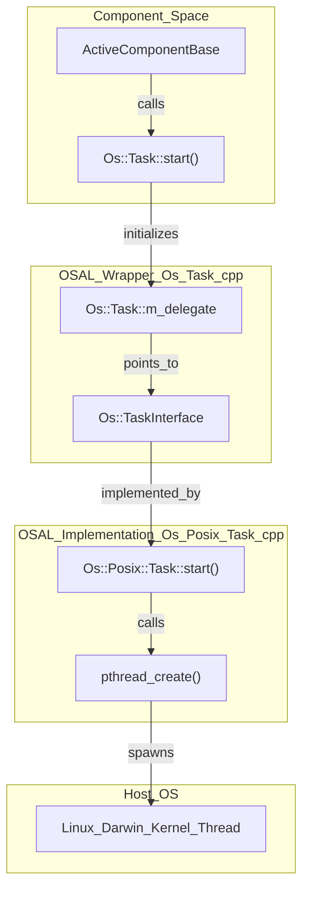
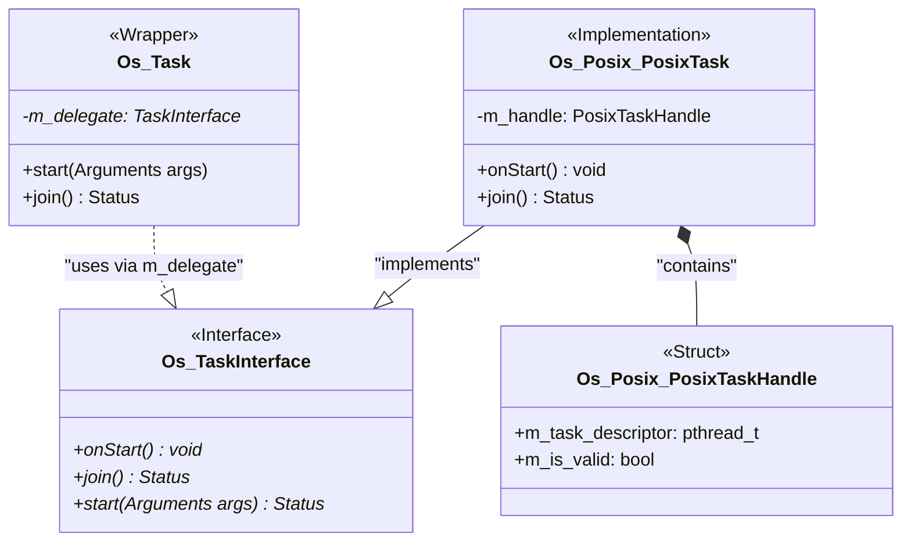

# Page: Operating System Abstraction Layer (OSAL)

# Operating System Abstraction Layer (OSAL)

Relevant source files

The following files were used as context for generating this wiki page:

- [Drv/LinuxGpioDriver/CMakeLists.txt](Drv/LinuxGpioDriver/CMakeLists.txt)
- [Drv/LinuxI2cDriver/CMakeLists.txt](Drv/LinuxI2cDriver/CMakeLists.txt)
- [Drv/LinuxSpiDriver/CMakeLists.txt](Drv/LinuxSpiDriver/CMakeLists.txt)
- [Os/CMakeLists.txt](Os/CMakeLists.txt)
- [Os/Darwin/CMakeLists.txt](Os/Darwin/CMakeLists.txt)
- [Os/Generic/CMakeLists.txt](Os/Generic/CMakeLists.txt)
- [Os/Linux/CMakeLists.txt](Os/Linux/CMakeLists.txt)
- [Os/Posix/CMakeLists.txt](Os/Posix/CMakeLists.txt)
- [Os/Posix/DefaultTask.cpp](Os/Posix/DefaultTask.cpp)
- [Os/Posix/Task.cpp](Os/Posix/Task.cpp)
- [Os/Posix/Task.hpp](Os/Posix/Task.hpp)
- [Os/Stub/CMakeLists.txt](Os/Stub/CMakeLists.txt)
- [Os/Stub/DefaultTask.cpp](Os/Stub/DefaultTask.cpp)
- [Os/Stub/Task.cpp](Os/Stub/Task.cpp)
- [Os/Stub/Task.hpp](Os/Stub/Task.hpp)
- [Os/Stub/test/CMakeLists.txt](Os/Stub/test/CMakeLists.txt)
- [Os/Stub/test/DefaultTask.cpp](Os/Stub/test/DefaultTask.cpp)
- [Os/Stub/test/Task.cpp](Os/Stub/test/Task.cpp)
- [Os/Stub/test/Task.hpp](Os/Stub/test/Task.hpp)
- [Os/Task.cpp](Os/Task.cpp)
- [Os/Task.hpp](Os/Task.hpp)
- [Svc/FileUplink/CMakeLists.txt](Svc/FileUplink/CMakeLists.txt)
- [cmake/platform/Darwin.cmake](cmake/platform/Darwin.cmake)
- [cmake/platform/Linux.cmake](cmake/platform/Linux.cmake)
- [cmake/platform/platform.cmake.template](cmake/platform/platform.cmake.template)

The Operating System Abstraction Layer (OSAL), located in the `Os/` directory, provides a consistent interface for flight software components to interact with underlying operating system services. By abstracting concurrency, file systems, and hardware resources, the OSAL enables F´ applications to be ported across diverse platforms—from embedded RTOS and baremetal environments to POSIX-compliant systems like Linux and macOS—without modifying component logic. [Os/Os.hpp:1-20]()

## Architecture and the Delegate Pattern

The OSAL follows a three-layer architecture designed to decouple the framework's interface from specific platform implementations. This is achieved using a **Delegate Pattern**, where a common wrapper class manages a platform-specific implementation (the delegate) via a handle.

1.  **Interface Layer**: Defines the pure virtual methods that any backend must implement (e.g., `Os::TaskInterface`, `Os::FileInterface`). [Os/Task.hpp:35-140]()
2.  **Wrapper Layer**: Provides the public-facing API used by the rest of the framework (e.g., `Os::Task`, `Os::File`). These classes hold a `TaskHandleStorage` or `FileHandleStorage` buffer to house the implementation object via placement new. [Os/Task.cpp:62-70](), [Os/Task.hpp:139-140]()
3.  **Implementation Layer**: Platform-specific code (e.g., `Os::Posix::Task`, `Os::Stub::Task`) that performs the actual system calls. [Os/Posix/Task.cpp:143-160]()

### OSAL Structural Flow

The following diagram illustrates how a call from a Component moves through the OSAL layers to the OS, specifically highlighting the `Os::Task` lifecycle.

**Diagram: OSAL Layer Interaction**

**Sources:** [Os/Task.hpp:35-139](), [Os/Task.cpp:62-114](), [Os/Posix/Task.cpp:143-160]()

## Module Organization and Backends

The OSAL is organized into sub-modules that are registered via CMake using specialized macros like `add_named_os_module` and `add_fprime_supplied_os_module`. [Os/CMakeLists.txt:18-108]() The build system selects the appropriate implementation based on the target platform.

| Module | Core Interface | Description |
| :--- | :--- | :--- |
| **Task** | `Os::TaskInterface` | Thread management, priorities, and affinity. [Os/Task.hpp:35-140]() |
| **Queue** | `Os::QueueInterface` | Inter-task communication (IPC). [Os/CMakeLists.txt:138]() |
| **Mutex** | `Os::MutexInterface` | Mutual exclusion and synchronization. [Os/CMakeLists.txt:137]() |
| **File** | `Os::FileInterface` | Basic file I/O (open, read, write, seek). [Os/CMakeLists.txt:135]() |
| **FileSystem** | `Os::FileSystemInterface` | Directory operations and space queries. [Os/CMakeLists.txt:135]() |
| **RawTime** | `Os::RawTimeInterface` | High-resolution system time access. [Os/CMakeLists.txt:141]() |

### Available Backends
*   **Posix**: Standard implementation for Linux and macOS using `pthreads` and POSIX file descriptors. [Os/Posix/CMakeLists.txt:1-10](), [cmake/platform/Linux.cmake:7]()
*   **Linux/Darwin**: Specific overrides for Linux and macOS for features like CPU affinity or memory statistics. [cmake/platform/Linux.cmake:12-19](), [cmake/platform/Darwin.cmake:17-25]()
*   **Baremetal**: Implementations for systems without an OS, often utilizing a cooperative `TaskRunner`. [Os/Generic/CMakeLists.txt:1-10](), [cmake/platform/platform.cmake.template:64-68]()
*   **Stub**: Minimal or no-op implementations used for unit testing or when a feature is unavailable. [Os/Stub/CMakeLists.txt:10-18]()

**Sources:** [Os/CMakeLists.txt:134-141](), [Os/Task.hpp:35-40](), [cmake/platform/Linux.cmake:1-21]()

## Concurrency Primitives

F´ relies heavily on multi-threading for its `ActiveComponent` model. The OSAL provides the necessary primitives to manage execution flow and resource protection.

*   **Tasks**: Managed via `Os::Task`. It supports setting stack sizes, priorities, and CPU affinity through `Os::Task::Arguments`. [Os/Task.hpp:72-102]() On POSIX systems, these map to `pthread` attributes like `pthread_attr_setstacksize` and `pthread_attr_setschedparam`. [Os/Posix/Task.cpp:43-106]()
*   **Queues**: Managed via `Os::Queue`. These are used for message passing between active components. [Os/CMakeLists.txt:138]()
*   **Synchronization**: `Os::Mutex` provides mutual exclusion, while `Os::ConditionVariable` allows for signaling between threads. [Os/CMakeLists.txt:137]()

For a deep dive into thread lifecycles, blocking modes, and the baremetal scheduler, see **[Concurrency Primitives: Tasks, Queues, and Mutexes](#4.1)**.

**Sources:** [Os/Task.hpp:72-102](), [Os/Posix/Task.cpp:76-106](), [Os/Task.cpp:84-130]()

## File System and System Resources

The OSAL abstracts the complexities of different file systems and provides access to hardware-level telemetry.

*   **File I/O**: `Os::File` provides a standard interface for file operations. It is used extensively by service components like `Svc::FileUplink`. [Os/CMakeLists.txt:135]()
*   **FileSystem**: `Os::FileSystem` handles directory creation, file deletion, and reporting available disk space. [Os/CMakeLists.txt:135]()
*   **System Telemetry**: Modules like `Os::Cpu` and `Os::Memory` provide platform-specific ways to monitor resource utilization. [Os/CMakeLists.txt:139-140]()
*   **Validated Files**: `Os::ValidatedFile` provides higher-level abstractions for files that require integrity checks (e.g., CRC). [Os/CMakeLists.txt:122-123]()

For details on file operations, CRC validation, and system timers, see **[File System and System Resources](#4.2)**.

**Sources:** [Os/CMakeLists.txt:122-141](), [Os/Task.hpp:35-140]()

## Implementation Mapping

The following diagram maps high-level OSAL wrapper classes to their specific implementation entities in the POSIX backend.

**Diagram: OSAL Entity Mapping**

**Sources:** [Os/Task.hpp:35-140](), [Os/Posix/Task.hpp:24-50](), [Os/Task.cpp:62-114](), [Os/Posix/Task.cpp:143-160]()
