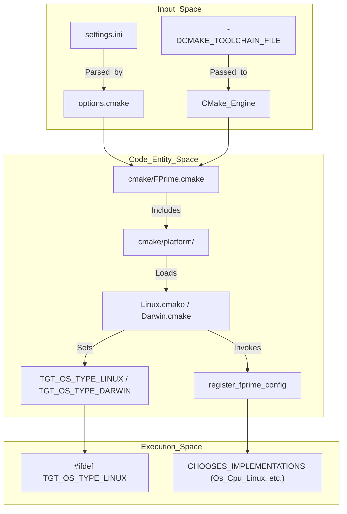
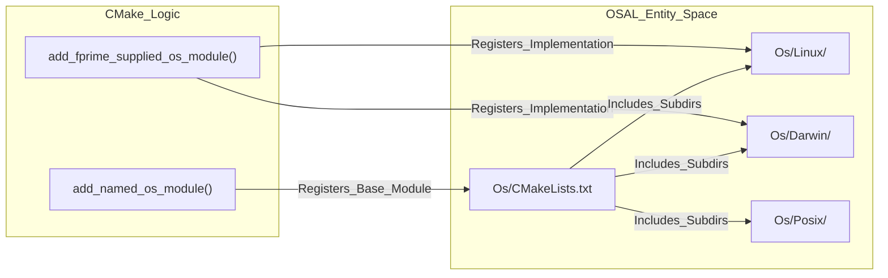

# Page: Platforms, Toolchains, and Configuration

# Platforms, Toolchains, and Configuration

Relevant source files

The following files were used as context for generating this wiki page:

- [.github/workflows/pip-check.yml](.github/workflows/pip-check.yml)
- [Drv/LinuxGpioDriver/CMakeLists.txt](Drv/LinuxGpioDriver/CMakeLists.txt)
- [Drv/LinuxI2cDriver/CMakeLists.txt](Drv/LinuxI2cDriver/CMakeLists.txt)
- [Drv/LinuxSpiDriver/CMakeLists.txt](Drv/LinuxSpiDriver/CMakeLists.txt)
- [FppTestProject/FppTest/CMakeLists.txt](FppTestProject/FppTest/CMakeLists.txt)
- [FppTestProject/FppTest/sizeof/CMakeLists.txt](FppTestProject/FppTest/sizeof/CMakeLists.txt)
- [FppTestProject/FppTest/sizeof/main.cpp](FppTestProject/FppTest/sizeof/main.cpp)
- [FppTestProject/FppTest/sizeof/sizeof.fpp](FppTestProject/FppTest/sizeof/sizeof.fpp)
- [Fw/Com/Com.fpp](Fw/Com/Com.fpp)
- [Fw/FPrimeBasicTypes.h](Fw/FPrimeBasicTypes.h)
- [Fw/FPrimeBasicTypes.hpp](Fw/FPrimeBasicTypes.hpp)
- [Os/CMakeLists.txt](Os/CMakeLists.txt)
- [Os/Darwin/CMakeLists.txt](Os/Darwin/CMakeLists.txt)
- [Os/Generic/CMakeLists.txt](Os/Generic/CMakeLists.txt)
- [Os/Linux/CMakeLists.txt](Os/Linux/CMakeLists.txt)
- [Os/Posix/CMakeLists.txt](Os/Posix/CMakeLists.txt)
- [Os/Stub/CMakeLists.txt](Os/Stub/CMakeLists.txt)
- [Os/Stub/test/CMakeLists.txt](Os/Stub/test/CMakeLists.txt)
- [Ref/Top/.gitignore](Ref/Top/.gitignore)
- [Ref/fprime-gds.yml](Ref/fprime-gds.yml)
- [Svc/FileUplink/CMakeLists.txt](Svc/FileUplink/CMakeLists.txt)
- [Utils/Hash/libcrc/CRC32.hpp](Utils/Hash/libcrc/CRC32.hpp)
- [Utils/Hash/libcrc/lib_crc.c](Utils/Hash/libcrc/lib_crc.c)
- [Utils/Hash/libcrc/lib_crc.h](Utils/Hash/libcrc/lib_crc.h)
- [cmake/platform/Darwin.cmake](cmake/platform/Darwin.cmake)
- [cmake/platform/Linux.cmake](cmake/platform/Linux.cmake)
- [cmake/platform/platform.cmake.template](cmake/platform/platform.cmake.template)
- [cmake/target/version.cmake](cmake/target/version.cmake)
- [cmake/test/data/TestConfigDeployment/override/project/DpCfg.hpp](cmake/test/data/TestConfigDeployment/override/project/DpCfg.hpp)
- [cmake/test/data/TestConfigDeployment/override/project/FpConfig.fpp](cmake/test/data/TestConfigDeployment/override/project/FpConfig.fpp)
- [default/config/ComCfg.fpp](default/config/ComCfg.fpp)
- [default/config/DpCfg.hpp](default/config/DpCfg.hpp)
- [default/config/FPrimeNumericalConfig.h](default/config/FPrimeNumericalConfig.h)
- [default/config/FpConfig.fpp](default/config/FpConfig.fpp)
- [default/config/FpConfig.h](default/config/FpConfig.h)
- [default/config/FpConstants.fpp](default/config/FpConstants.fpp)
- [default/config/PlatformCfg.fpp](default/config/PlatformCfg.fpp)
- [docs/user-manual/gds/gds-test-api-guide.md](docs/user-manual/gds/gds-test-api-guide.md)
- [requirements.txt](requirements.txt)

F´ provides a robust abstraction layer within its CMake build system to handle diverse hardware platforms, cross-compilation toolchains, and framework-level configurations. This system ensures that the core framework remains portable while allowing deployments to specify hardware-specific logic and resource constraints.

## Platform and Toolchain Abstraction

The F´ build system distinguishes between a **Platform** (the operating environment, e.g., Linux, Darwin, FreeRTOS) and a **Toolchain** (the compiler suite used to build for that environment).

### Platform Files
Platform files define the characteristics of the target execution environment. They are located in `cmake/platform/` and are loaded during the initialization phase.

Key responsibilities of a platform file include:
*   Setting default compiler flags for the platform.
*   Configuring OS-specific library dependencies (e.g., `Threads` package) [cmake/platform/Linux.cmake:6-6]().
*   Defining platform-specific features using `FPRIME_USE_POSIX` or `FPRIME_HAS_SOCKETS` flags [cmake/platform/Darwin.cmake:9-10]().
*   Mapping OSAL implementations using `register_fprime_config` and `CHOOSES_IMPLEMENTATIONS` [cmake/platform/Linux.cmake:12-19]().

Standard platforms provided:
*   **Linux**: Standard settings for Linux-based systems [cmake/platform/Linux.cmake:1-21]().
*   **Darwin**: Settings for macOS development environments, which often set `FPRIME_USE_STUBBED_DRIVERS` to `ON` by default for workstation testing [cmake/platform/Darwin.cmake:1-28]().

### Toolchain Files
Toolchains are specified via the standard CMake variable `CMAKE_TOOLCHAIN_FILE`. These files define the specific compilers (e.g., `arm-linux-gnueabihf-gcc`) and the target architecture. When cross-compiling, the toolchain file typically sets `CMAKE_SYSTEM_NAME`, which CMake uses to find the corresponding `${CMAKE_SYSTEM_NAME}.cmake` platform file [cmake/platform/platform.cmake.template:20-22]().

### Platform and Toolchain Logic Flow

The following diagram illustrates how CMake resolves platform and toolchain settings during the build initialization.

**Build Initialization Data Flow**
| Component | Role | Entity in Code |
| :--- | :--- | :--- |
| **Platform File** | Defines OS-specific constants | `Linux.cmake`, `Darwin.cmake` |
| **Toolchain File** | Defines Compiler/Linker paths | `CMAKE_TOOLCHAIN_FILE` |
| **Template** | Guide for new platforms | `platform.cmake.template` |

**Sources:** [cmake/platform/Linux.cmake:12-20](), [cmake/platform/Darwin.cmake:18-27](), [cmake/platform/platform.cmake.template:1-75]()

---

## Restricting Platform Support

To prevent components with hardware-specific dependencies from being compiled on incompatible platforms, F´ provides the `restrict_platforms` macro.

### Usage and Implementation
This macro is placed at the top of a `CMakeLists.txt` file. For example, the `LinuxI2cDriver` uses it to ensure it is only built for Linux targets when not in stubbed mode [Drv/LinuxI2cDriver/CMakeLists.txt:8-10]().

If the current build environment does not meet the criteria (e.g., `CMAKE_SYSTEM_NAME` does not match the allowed list), the module registration is skipped. This is also common in other Linux-specific drivers like GPIO and SPI [Drv/LinuxGpioDriver/CMakeLists.txt:1-10](), [Drv/LinuxSpiDriver/CMakeLists.txt:1-10]().

**Sources:** [Drv/LinuxI2cDriver/CMakeLists.txt:8-25](), [Drv/LinuxGpioDriver/CMakeLists.txt:1-10](), [Drv/LinuxSpiDriver/CMakeLists.txt:1-10]()

---

## Framework Configuration

F´ uses a set of configuration files to define framework-level constants, such as maximum string sizes, telemetry packet sizes, and assertion behavior.

### Configuration Headers and FPP
Configuration is managed through two primary mechanisms:
1.  **C++ Headers**: Files like `FpConfig.h` provide C-compatible macros for framework behavior, such as enabling object names or port tracing [default/config/FpConfig.h:30-78]().
2.  **FPP Configuration**: FPP files define constants and types used by the autocoder to ensure consistency between C++ and modeled components.

| File | Purpose | Key Symbols / Types |
| :--- | :--- | :--- |
| `FpConfig.h` | Core framework switches | `FW_OBJECT_NAMES`, `FW_ASSERT_LEVEL`, `FW_ENABLE_TEXT_LOGGING` [default/config/FpConfig.h:30-151]() |
| `FpConfig.fpp` | Autocoder type aliases | `FwSizeType`, `FwChanIdType`, `FwOpcodeType`, `TimeBase` [default/config/FpConfig.fpp:22-96]() |
| `ComCfg.fpp` | Communication stack config | `SpacecraftId`, `TmFrameFixedSize`, `Apid` [default/config/ComCfg.fpp:11-37]() |
| `FPrimeNumericalConfig.h` | Numeric limits | Framework-wide integer limits |

### Assertion Levels
The framework supports multiple assertion levels configured via `FW_ASSERT_LEVEL` [default/config/FpConfig.h:115-117]():
*   **FW_NO_ASSERT**: Assertions are compiled out, but side effects are kept [default/config/FpConfig.h:109-109]().
*   **FW_FILEID_ASSERT**: Reports a file CRC and line number to save space [default/config/FpConfig.h:110-110]().
*   **FW_FILENAME_ASSERT**: Reports full `__FILE__` and line number [default/config/FpConfig.h:111-111]().
*   **FW_RELATIVE_PATH_ASSERT**: Reports a relative path within the repository [default/config/FpConfig.h:112-112]().

**Sources:** [default/config/FpConfig.h:1-177](), [default/config/FpConfig.fpp:1-97](), [default/config/ComCfg.fpp:1-55]()

---

## Sanitizer Support

F´ integrates LLVM/GCC sanitizers to detect memory errors and undefined behavior during development and testing.

### Supported Sanitizers
*   **ASAN (AddressSanitizer)**: Detects use-after-free and buffer overflows.
*   **UBSAN (UndefinedBehaviorSanitizer)**: Detects signed integer overflow and null pointer dereferences.
*   **LSAN (LeakSanitizer)**: Detects memory leaks.
*   **TSAN (ThreadSanitizer)**: Detects data races.

The build system allows enabling these via CMake flags, which are typically used during unit testing and CI pipelines to ensure code quality across different Python and OS versions [.github/workflows/pip-check.yml:18-35]().

**Sources:** [.github/workflows/pip-check.yml:1-35](), [requirements.txt:1-66]()

---

## Implementation Detail: OSAL Platform Mapping

The Operating System Abstraction Layer (OSAL) uses the platform system to select appropriate implementations for primitives.

**OSAL Implementation Selection**

The `Os/CMakeLists.txt` uses `add_named_os_module` to define interfaces for `Console`, `Task`, `Mutex`, and `Queue` [Os/CMakeLists.txt:134-138](). It then includes platform-specific subdirectories like `Linux/` or `Darwin/` [Os/CMakeLists.txt:114-115](). The `add_fprime_supplied_os_module` function handles the registration of specific implementations (e.g., `Os_Cpu_Linux`) that satisfy the requirements of the base OS modules [Os/CMakeLists.txt:56-108]().

**Sources:** [Os/CMakeLists.txt:18-44](), [Os/CMakeLists.txt:56-108](), [Os/CMakeLists.txt:110-142]()
