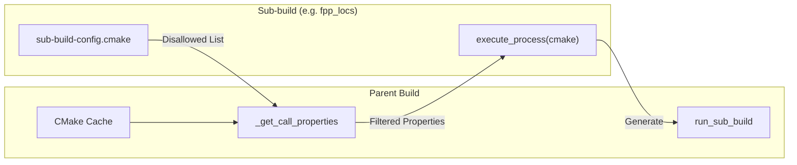

# Page: Project Settings and fprime-util Configuration

# Project Settings and fprime-util Configuration

<details>
<summary>Relevant source files</summary>

The following files were used as context for generating this wiki page:

- [Ref/settings.ini](Ref/settings.ini)
- [cmake/required.cmake](cmake/required.cmake)
- [cmake/settings/ini-to-stdio.py](cmake/settings/ini-to-stdio.py)
- [cmake/settings/ini.cmake](cmake/settings/ini.cmake)
- [cmake/sub-build/sub-build-config.cmake](cmake/sub-build/sub-build-config.cmake)
- [cmake/sub-build/sub-build.cmake](cmake/sub-build/sub-build.cmake)
- [cmake/target/sbom.cmake](cmake/target/sbom.cmake)
- [cmake/test/data/TestDeployment/settings.ini](cmake/test/data/TestDeployment/settings.ini)
- [cmake/test/src/test_symlink.py](cmake/test/src/test_symlink.py)
- [cmake/toolchain/helpers/arm-linux-base.cmake](cmake/toolchain/helpers/arm-linux-base.cmake)

</details>


Project configuration in F´ is managed through a combination of the `settings.ini` file, environment variables, and the `fprime-util` CLI tool. This system ensures that the CMake build system is correctly initialized with project-specific paths, library locations, and toolchain selections without requiring manual modification of CMake files.

## The settings.ini Configuration File

The `settings.ini` file is the primary configuration entry point for an F´ project or deployment [Ref/settings.ini:1-5](). It is typically located at the root of a project or deployment directory. The file uses the standard INI format, with a primary `[fprime]` section containing key-value pairs that define the build environment.

### Key Configuration Keys

| Key | Description |
| :--- | :--- |
| `framework_path` | Relative or absolute path to the F´ framework core (the directory containing `Fw`, `Svc`, etc.) [Ref/settings.ini:4-4](). |
| `project_root` | The root directory of the current project, used for resolving relative paths and SBOM generation [cmake/test/data/TestDeployment/settings.ini:4-4](). |
| `library_locations` | A colon-separated list of paths to external F´ libraries that should be included in the build [cmake/test/data/TestDeployment/settings.ini:3-3](). |
| `default_toolchain` | The name of the default toolchain file to use if none is specified (e.g., `native`, `raspberrypi`). |
| `install_destination` | The path where build artifacts (binaries, dictionaries) should be installed [cmake/settings/ini-to-stdio.py:51-51](). |
| `default_cmake_options` | A newline-separated list of CMake variables to be set during generation [cmake/settings/ini-to-stdio.py:49-49](). |

**Sources:** [Ref/settings.ini:1-5](), [cmake/test/data/TestDeployment/settings.ini:1-5](), [cmake/settings/ini-to-stdio.py:43-52]()

## Configuration Resolution Flow

The configuration flow bridges the gap between the user-facing `settings.ini` and the internal CMake cache variables. This process involves a Python-based parser that feeds data back into the CMake environment.

### Data Flow: INI to CMake Cache

1.  **CMake Initialization**: During the `fprime-util generate` phase, CMake invokes `ini_to_cache` [cmake/settings/ini.cmake:33-33]().
2.  **Python Parsing**: The `ini_to_cache` function executes `ini-to-stdio.py` using the system Python interpreter [cmake/settings/ini.cmake:41-48]().
3.  **Settings Loading**: `ini-to-stdio.py` uses the `fprime.fbuild.settings.IniSettings` class to load and resolve the INI file [cmake/settings/ini-to-stdio.py:67-72]().
4.  **Remapping and Output**: The script maps INI keys to CMake variables (e.g., `framework_path` becomes `FPRIME_FRAMEWORK_PATH`) and prints them to stdout in a `KEY=VALUE` format [cmake/settings/ini-to-stdio.py:43-52]().
5.  **Cache Injection**: The `ini_to_cache` function iterates over the output and sets the corresponding variables in the CMake `INTERNAL` cache [cmake/settings/ini.cmake:59-85]().

### Configuration Resolution Diagram

The following diagram illustrates the interaction between the filesystem, the Python parser, and the CMake build state.

**INI Resolution Data Flow**
```mermaid
graph TD
    subgraph "Filesystem Space"
        INI["settings.ini"]
    end

    subgraph "Python Execution Space (ini-to-stdio.py)"
        IniSettings["IniSettings.load()"]
        Remap["CMAKE_NEEDED_SETTINGS Mapping"]
    end

    subgraph "CMake Entity Space (ini.cmake)"
        Func_ITC["function(ini_to_cache)"]
        Cache["CMake INTERNAL Cache"]
        Var_FW["FPRIME_FRAMEWORK_PATH"]
        Var_LIB["FPRIME_LIBRARY_LOCATIONS"]
    end

    INI -->|Read Path| IniSettings
    IniSettings --> Remap
    Remap -->|Stdout: KEY=VALUE| Func_ITC
    Func_ITC -->|set(... CACHE INTERNAL)| Cache
    Cache --> Var_FW
    Cache --> Var_LIB
```
**Sources:** [cmake/settings/ini.cmake:33-109](), [cmake/settings/ini-to-stdio.py:43-98]()

## Environment Variable Overrides

F´ supports overriding configuration via environment variables. This is particularly useful for CI/CD environments or cross-compilation setups.

-   **Toolchain Selection**: The `CMAKE_TOOLCHAIN_FILE` variable can be passed to override the `default_toolchain` from `settings.ini`.
-   **ARM Tools**: For cross-compilation, variables like `ARM_TOOLS_PATH` are used by toolchain files (e.g., `arm-linux-base.cmake`) to locate compilers [cmake/toolchain/helpers/arm-linux-base.cmake:15-24]().
-   **System Root**: `CMAKE_SYSROOT` can be set to point to a target filesystem for cross-compilation headers and libraries [cmake/toolchain/helpers/arm-linux-base.cmake:34-37]().

**Sources:** [cmake/toolchain/helpers/arm-linux-base.cmake:15-43]()

## Consistency Checking and Validation

To prevent build errors caused by stale configuration, the CMake system performs validation between the values provided via the CLI (from `fprime-util`) and those found in `settings.ini`.

### Critical Settings Validation
The variable `FPRIME_UTIL_CRITICAL_LIST` contains settings that, if changed, require a full regeneration of the build cache [cmake/settings/ini.cmake:20-26](). These include:
- `FPRIME_FRAMEWORK_PATH`
- `FPRIME_LIBRARY_LOCATIONS`
- `FPRIME_PROJECT_ROOT`

### Resolution Logic
When a setting is processed:
1.  If it is undefined, it is loaded from the INI and cached [cmake/settings/ini.cmake:81-85]().
2.  If it was previously loaded from the INI and has changed, a `FATAL_ERROR` is issued [cmake/settings/ini.cmake:87-93]().
3.  If it was passed via the CLI and the INI value differs, a warning is issued to notify the user to run `fprime-util generate` [cmake/settings/ini.cmake:95-101]().

**Sources:** [cmake/settings/ini.cmake:20-108]()

## Sub-build Configuration

Certain F´ features, such as FPP location discovery, require "sub-builds"—miniature CMake executions that run during the generation phase [cmake/sub-build/sub-build.cmake:4-10]().

The `run_sub_build` function manages these by:
1.  Creating a separate build directory (`sub-build-<name>`) [cmake/sub-build/sub-build.cmake:44-44]().
2.  Filtering the parent CMake cache to remove disallowed variables (defined in `FPRIME_SUB_BUILD_TYPES_DISALLOWED_LIST` and `FPRIME_SUB_BUILD_EXCLUDED_CACHE_VARIABLES`) [cmake/sub-build/sub-build-config.cmake:10-49]().
3.  Passing the remaining properties to the sub-build via `-D` flags [cmake/sub-build/sub-build.cmake:111-114]().

**Sub-build Configuration Interaction**

**Sources:** [cmake/sub-build/sub-build.cmake:38-86](), [cmake/sub-build/sub-build-config.cmake:1-51]()
