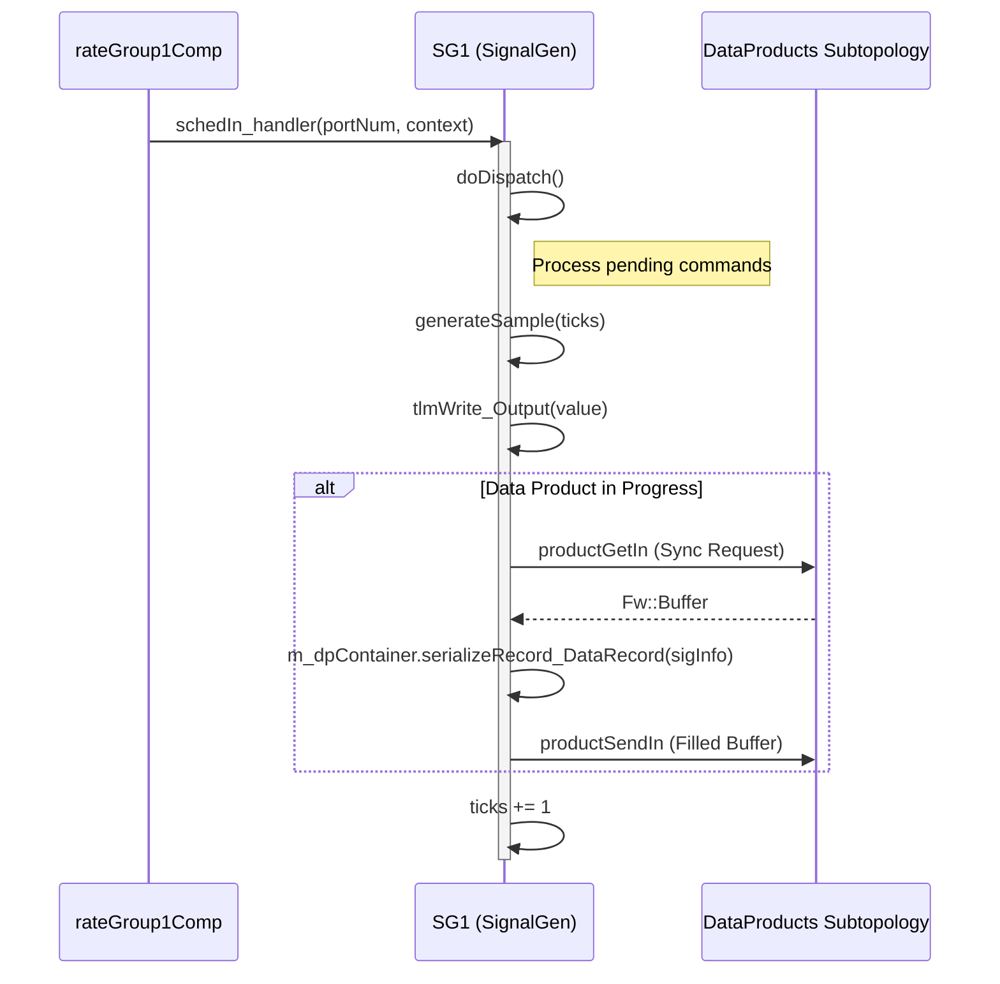

# Page: Ref Deployment

# Ref Deployment

<details>
<summary>Relevant source files</summary>

The following files were used as context for generating this wiki page:

- [Ref/.gitignore](Ref/.gitignore)
- [Ref/SignalGen/CMakeLists.txt](Ref/SignalGen/CMakeLists.txt)
- [Ref/SignalGen/Commands.fppi](Ref/SignalGen/Commands.fppi)
- [Ref/SignalGen/Events.fppi](Ref/SignalGen/Events.fppi)
- [Ref/SignalGen/SignalGen.cpp](Ref/SignalGen/SignalGen.cpp)
- [Ref/SignalGen/SignalGen.hpp](Ref/SignalGen/SignalGen.hpp)
- [Ref/SignalGen/Telemetry.fppi](Ref/SignalGen/Telemetry.fppi)
- [Ref/Top/CMakeLists.txt](Ref/Top/CMakeLists.txt)
- [Ref/Top/RefTopologyDefs.hpp](Ref/Top/RefTopologyDefs.hpp)
- [Ref/Top/instances.fpp](Ref/Top/instances.fpp)
- [Ref/Top/topology.fpp](Ref/Top/topology.fpp)
- [Svc/Health/Health.fpp](Svc/Health/Health.fpp)
- [Svc/Subtopologies/CMakeLists.txt](Svc/Subtopologies/CMakeLists.txt)
- [Svc/Subtopologies/CdhCore/CdhCore.fpp](Svc/Subtopologies/CdhCore/CdhCore.fpp)
- [Svc/Subtopologies/CdhCore/docs/sdd.md](Svc/Subtopologies/CdhCore/docs/sdd.md)
- [Svc/Subtopologies/ComCcsds/ComCcsds.fpp](Svc/Subtopologies/ComCcsds/ComCcsds.fpp)
- [Svc/Subtopologies/ComCcsds/docs/sdd.md](Svc/Subtopologies/ComCcsds/docs/sdd.md)
- [Svc/Subtopologies/ComFprime/ComFprime.fpp](Svc/Subtopologies/ComFprime/ComFprime.fpp)
- [Svc/Subtopologies/ComFprime/docs/sdd.md](Svc/Subtopologies/ComFprime/docs/sdd.md)
- [Svc/Subtopologies/ComLoggerTee/subtopology-template.fppi](Svc/Subtopologies/ComLoggerTee/subtopology-template.fppi)
- [Svc/Subtopologies/DataProducts/DataProducts.fpp](Svc/Subtopologies/DataProducts/DataProducts.fpp)
- [Svc/Subtopologies/FileHandling/FileHandling.fpp](Svc/Subtopologies/FileHandling/FileHandling.fpp)
- [Svc/Subtopologies/FileHandling/docs/sdd.md](Svc/Subtopologies/FileHandling/docs/sdd.md)

</details>


The **Ref** deployment is the primary reference application for the F´ framework. It serves as a functional demonstration of a complete flight software system, including commanding, telemetry, file management, and hardware-independent drivers. It is designed to run on workstation environments (Linux and macOS) and provides a template for building custom deployments.

## Component Instances and Base IDs

Ref utilizes a structured 8-digit hex base ID convention: `0xDSSCCxxx`.
*   **D**: Deployment digit (1 for Ref).
*   **SS**: Subtopology digit (00 for main, 01-FF for others).
*   **CC**: Component digit.
*   **xxx**: Reserved for internal component items (commands, events, telemetry).

[Ref/Top/instances.fpp:7-14]()

### Active Component Instances
Active components in Ref run in their own execution threads.

| Instance | Class | Base ID | Priority | Description |
|---|---|---|---|---|
| `blockDrv` | `Ref.BlockDriver` | `0x10000000` | 47 | Simulates a block-based hardware driver. |
| `rateGroup1Comp`| `Svc.ActiveRateGroup`| `0x10001000` | 43 | High-frequency (1Hz) rate group. |
| `rateGroup2Comp`| `Svc.ActiveRateGroup`| `0x10002000` | 42 | Medium-frequency (0.5Hz) rate group. |
| `pingRcvr` | `Ref.PingReceiver` | `0x10004000` | 23 | Reference component for health ping testing. |
| `cmdSeq` | `Svc.CmdSequencer` | `0x10006000` | 20 | Executes command sequences from files. |
| `dpDemo` | `Ref.DpDemo` | `0x0A10` | 19 | Demonstration of Data Product system. |

[Ref/Top/instances.fpp:29-64]()

### Queued and Passive Instances
Queued components (like `SignalGen`) handle logic on a specific thread (usually a Rate Group) but have message queues. Passive components (like `posixTime`) execute logic synchronously on the caller's thread.

*   **SignalGen (`SG1` to `SG5`)**: Generates periodic signal data (Sine, Triangle, Square, Noise) [Ref/SignalGen/SignalGen.cpp:61-84]().
*   **comDriver (`Drv.TcpClient`)**: Provides the TCP socket interface to the Ground Data System [Ref/Top/instances.fpp:102]().
*   **linuxTimer (`Svc.LinuxTimer`)**: The fundamental clock source driving the system cycles [Ref/Top/instances.fpp:100]().
*   **systemResources (`Svc.SystemResources`)**: Collects CPU and memory telemetry [Ref/Top/instances.fpp:98]().

## Topology and Wiring

The topology is defined in `topology.fpp`, which wires components together and integrates subtopologies.

### Rate Group Driving Logic
The `linuxTimer` drives the `rateGroupDriverComp`, which divides the fundamental frequency into three distinct rate groups.

**Diagram: Scheduling and Rate Group Distribution**
```mermaid
graph TD
    subgraph "Scheduling_Logic"
    "linuxTimer [Svc.LinuxTimer]" -- "CycleOut" --> "rateGroupDriverComp [Svc.RateGroupDriver]"
    "rateGroupDriverComp" -- "CycleOut[rateGroup1]" --> "rateGroup1Comp [Svc.ActiveRateGroup]"
    "rateGroupDriverComp" -- "CycleOut[rateGroup2]" --> "rateGroup2Comp [Svc.ActiveRateGroup]"
    "rateGroupDriverComp" -- "CycleOut[rateGroup3]" --> "rateGroup3Comp [Svc.ActiveRateGroup]"
    end

    subgraph "Rate_Group_1_High_Freq"
    "rateGroup1Comp" -- "RateGroupMemberOut[0]" --> "SG1 [Ref.SignalGen]"
    "rateGroup1Comp" -- "RateGroupMemberOut[4]" --> "systemResources [Svc.SystemResources]"
    "rateGroup1Comp" -- "RateGroupMemberOut[2]" --> "CdhCore.tlmSendRun"
    end

    subgraph "Rate_Group_3_Low_Freq"
    "rateGroup3Comp" -- "RateGroupMemberOut[2]" --> "blockDrv [Ref.BlockDriver]"
    "rateGroup3Comp" -- "RateGroupMemberOut[0]" --> "CdhCore.healthRun"
    end
```
Sources: [Ref/Top/topology.fpp:77-112](), [Ref/Top/instances.fpp:34-47]()

### Data Flow: Buffers and Communication
Ref demonstrates a simple data loop where `sendBuffComp` sends data to `blockDrv`, which then passes it to `recvBuffComp` [Ref/Top/topology.fpp:128-130](). Communication with the GDS is handled via the `ComCcsds` subtopology and the `comDriver` TCP client [Ref/Top/topology.fpp:114-126]().

## Subtopology Integration

Ref leverages pre-wired subtopologies from `Svc/Subtopologies` to provide standard services:

1.  **CdhCore**: Command dispatch, event logging, and health monitoring [Svc/Subtopologies/CdhCore/CdhCore.fpp]().
2.  **ComCcsds**: CCSDS-compliant framing, deframing, and priority queuing for communication [Svc/Subtopologies/ComCcsds/ComCcsds.fpp]().
3.  **FileHandling**: Uplink, Downlink, and FileManager services [Svc/Subtopologies/FileHandling/FileHandling.fpp]().
4.  **DataProducts**: Management and writing of F´ Data Products [Svc/Subtopologies/DataProducts/DataProducts.fpp]().

### Health Monitoring
The `Health` component (within `CdhCore`) pings active components to ensure they haven't hung. Missed ping thresholds are defined in `RefTopologyDefs.hpp`.

| Component Instance | Warn Threshold | Fatal Threshold |
|---|---|---|
| `Ref_blockDrv` | 3 | 5 |
| `Ref_pingRcvr` | 3 | 5 |
| `Ref_rateGroup1Comp` | 3 | 5 |
| `Ref_rateGroup2Comp` | 3 | 5 |
| `Ref_rateGroup3Comp` | 3 | 5 |
| `Ref_cmdSeq` | 3 | 5 |

Sources: [Ref/Top/RefTopologyDefs.hpp:52-71](), [Svc/Health/Health.fpp:83-98]()

## Implementation Details

### SignalGen: A Worked Example
`SignalGen` is a queued component that generates waveforms. It demonstrates the use of commands, telemetry, and data products.

**Diagram: SignalGen Logic and Data Product Flow**

Sources: [Ref/SignalGen/SignalGen.cpp:88-147](), [Ref/Top/topology.fpp:134-147](), [Ref/SignalGen/SignalGen.hpp:27-53]()

#### Key Functions
*   **`generateSample(U32 ticks)`**: Calculates the waveform value based on `sigType` (SINE, TRIANGLE, SQUARE, NOISE) [Ref/SignalGen/SignalGen.cpp:52-86]().
*   **`Settings_cmdHandler(...)`**: Updates signal parameters (Frequency, Amplitude, Phase) and resets history [Ref/SignalGen/SignalGen.cpp:149-172]().
*   **`schedIn_handler(...)`**: The main execution entry point. It dispatches commands via `doDispatch()`, generates the sample, writes telemetry, and manages Data Product serialization [Ref/SignalGen/SignalGen.cpp:88-147]().

### Communication Stack Configuration
The `ComCcsds` subtopology is configured in `Ref` to handle telemetry, events, and file traffic with specific priorities.

| Queue Type | Depth | Priority |
|---|---|---|
| `EVENTS` | `ComCcsdsConfig::QueueDepths::events` | `ComCcsdsConfig::QueuePriorities::events` |
| `TELEMETRY` | `ComCcsdsConfig::QueueDepths::tlm` | `ComCcsdsConfig::QueuePriorities::tlm` |
| `FILE` | `ComCcsdsConfig::QueueDepths::file` | `ComCcsdsConfig::QueuePriorities::file` |

Sources: [Svc/Subtopologies/ComCcsds/ComCcsds.fpp:21-39](), [Ref/Top/topology.fpp:149-169]()

## Building and Running Ref

### Build System Integration
Ref is registered as an F´ module in `Ref/Top/CMakeLists.txt`. It includes `instances.fpp` and `topology.fpp` as autocoder inputs [Ref/Top/CMakeLists.txt:11-21]().

To build the Ref deployment:
```bash
fprime-util generate
fprime-util build
```

### Running with GDS
The Ref application is typically run with the GDS:
```bash
fprime-gds
```
The GDS initializes the `comDriver` (TcpClient) which connects to the ground server. The `linuxTimer` then begins driving the `rateGroupDriverComp` to start software execution [Ref/Top/topology.fpp:80-83]().

Sources: [Ref/Top/CMakeLists.txt:11-21](), [Ref/Top/instances.fpp:100-102](), [Ref/Top/topology.fpp:77-80]()
