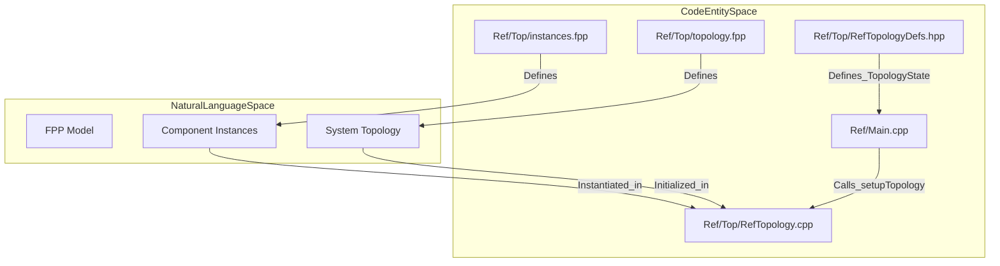
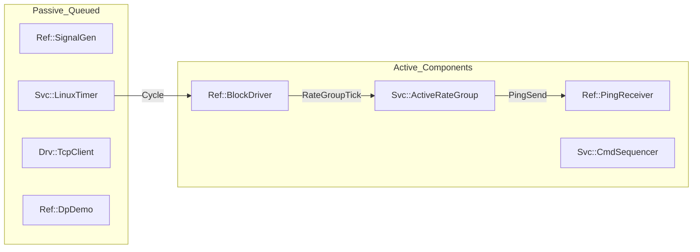

# Page: Reference Deployments

# Reference Deployments

Relevant source files

The following files were used as context for generating this wiki page:

- [Ref/Main.cpp](Ref/Main.cpp)
- [Ref/Top/CMakeLists.txt](Ref/Top/CMakeLists.txt)
- [Ref/Top/RefTopologyDefs.hpp](Ref/Top/RefTopologyDefs.hpp)
- [Ref/Top/instances.fpp](Ref/Top/instances.fpp)
- [Svc/Health/Health.fpp](Svc/Health/Health.fpp)
- [Svc/Subtopologies/CMakeLists.txt](Svc/Subtopologies/CMakeLists.txt)

Reference deployments in F´ serve as fully functional examples of how to compose components into a complete flight software system. They demonstrate topology wiring, ID allocation strategies, and platform-specific integration. The repository includes two primary reference applications: **Ref**, designed for workstation environments (Linux/macOS), and **RPI**, designed for embedded hardware (Raspberry Pi).

### Deployment Architecture Overview

F´ deployments are defined using the FPP modeling language, which specifies component instances and their interconnections. The following diagram illustrates the relationship between the deployment models and the resulting executable.

**Deployment Modeling to Code Entity Mapping**

Sources: [Ref/Top/instances.fpp:1-104](), [Ref/Top/CMakeLists.txt:11-21](), [Ref/Main.cpp:93-95](), [Ref/Top/RefTopologyDefs.hpp:84-91]()

---

## 8.1 Ref Deployment

The **Ref** deployment is the standard reference application for workstation development. It includes a variety of components that demonstrate core framework features, including periodic execution via rate groups, command sequencing, and data product generation.

### Key Characteristics
*   **Base ID Convention:** Ref uses a structured 32-bit hex format `0xDSSCCxxx` where `D` is the deployment digit, `SS` is the subtopology, and `CC` is the component [Ref/Top/instances.fpp:7-13]().
*   **Subtopology Integration:** It integrates several reusable subtopologies from `Svc/Subtopologies`, such as `CdhCore`, `ComCcsds`, `DataProducts`, and `FileHandling` [Ref/Top/RefTopologyDefs.hpp:18-27](), [Svc/Subtopologies/CMakeLists.txt:1-6]().
*   **Health Monitoring:** The deployment configures `Svc::Health` with specific `WARN` and `FATAL` thresholds for active components like `Ref_blockDrv`, `Ref_pingRcvr`, and `Ref_rateGroup1Comp` [Ref/Top/RefTopologyDefs.hpp:52-71]().
*   **Execution:** The `main` function in `Ref/Main.cpp` initializes the OSAL via `Os::init()`, parses command-line arguments for networking (`-a` for hostname, `-p` for port), and starts the rate group driver at a 1Hz cycle [Ref/Main.cpp:55-98]().

For detailed component listings, wiring diagrams, and build instructions, see [Ref Deployment](#8.1).

**Ref Component Instance Map**

Sources: [Ref/Top/instances.fpp:29-102](), [Ref/Main.cpp:94](), [Ref/Top/RefTopologyDefs.hpp:53-67]()

---

## 8.2 RPI (Raspberry Pi) Deployment

The **RPI** deployment extends the framework to actual embedded hardware. It focuses on demonstrating how F´ interacts with physical peripherals using Linux-based drivers.

### Key Characteristics
*   **Hardware Interaction:** Includes the `RpiDemo` component, which utilizes `Drv::LinuxGpioDriver`, `Drv::LinuxSpiDriver`, and `Drv::LinuxUartDriver` to toggle LEDs and communicate with external sensors.
*   **Cross-Compilation:** Designed to be built using an ARM-specific toolchain (e.g., `arm-linux-gnueabihf`).
*   **Ground Communication:** Typically configured to communicate with the F´ GDS over a TCP network connection provided by the Raspberry Pi's Ethernet or Wi-Fi interface.

For details on cross-compilation setup and hardware wiring, see [RPI (Raspberry Pi) Deployment](#8.2).

---

## Summary of Reference Components

The following table lists common components found across reference deployments and their roles:

| Component | Namespace | Role |
| :--- | :--- | :--- |
| `BlockDriver` | `Ref` | Simulates a hardware interrupt/tick source for the system [Ref/Top/instances.fpp:29](). |
| `ActiveRateGroup` | `Svc` | Dispatches synchronous calls to other components at a fixed frequency [Ref/Top/instances.fpp:34](). |
| `Health` | `Svc` | Monitors responsiveness of active components via `PingSend` and `PingReturn` ports [Svc/Health/Health.fpp:11-14](). |
| `TcpClient` | `Drv` | Provides the communication bridge between the deployment and the GDS [Ref/Top/instances.fpp:102](). |
| `PosixTime` | `Svc` | Provides system time using standard POSIX calls [Ref/Top/instances.fpp:92](). |
| `DpDemo` | `Ref` | Demonstrates the Data Product (DP) system for managing science data [Ref/Top/instances.fpp:61](). |

Sources: [Ref/Top/instances.fpp:20-104](), [Svc/Health/Health.fpp:1-161]()
