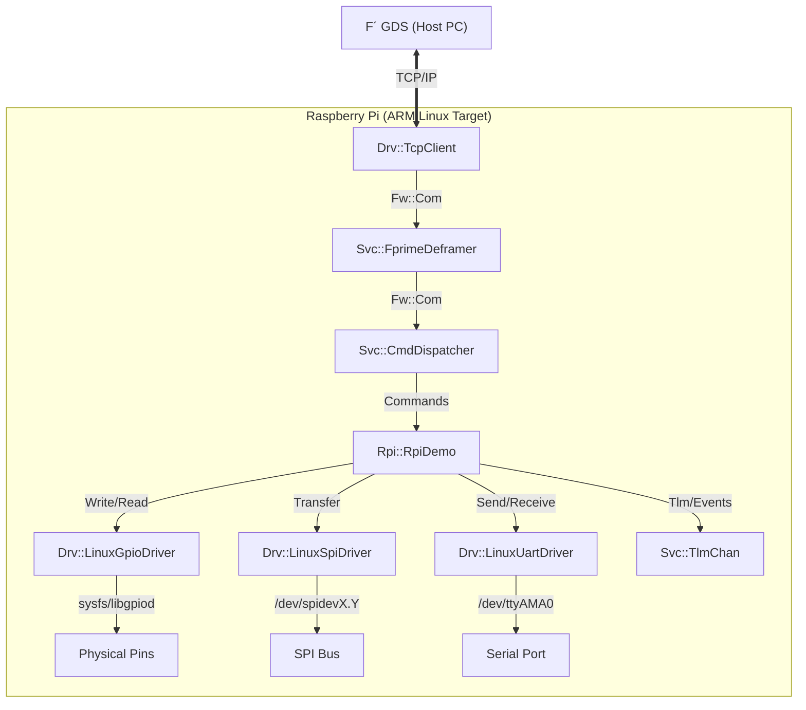

# Page: RPI (Raspberry Pi) Deployment

# RPI (Raspberry Pi) Deployment

<details>
<summary>Relevant source files</summary>

The following files were used as context for generating this wiki page:

- [.github/workflows/cmake-test.yml](.github/workflows/cmake-test.yml)
- [Ref/Main.cpp](Ref/Main.cpp)
- [Ref/PingReceiver/PingReceiverComponentImpl.cpp](Ref/PingReceiver/PingReceiverComponentImpl.cpp)
- [Ref/PingReceiver/PingReceiverComponentImpl.hpp](Ref/PingReceiver/PingReceiverComponentImpl.hpp)
- [Ref/TypeDemo/TypeDemo.cpp](Ref/TypeDemo/TypeDemo.cpp)
- [Ref/TypeDemo/TypeDemo.fpp](Ref/TypeDemo/TypeDemo.fpp)
- [Ref/TypeDemo/TypeDemo.hpp](Ref/TypeDemo/TypeDemo.hpp)

</details>


The RPI deployment is a specialized F´ project designed to demonstrate hardware interaction on Raspberry Pi boards running Linux. It serves as a reference for using Linux-based hardware drivers (GPIO, SPI, UART) and provides a template for cross-compiling F´ software from an x86 host to an ARM target.

## RPI Deployment Overview

The RPI deployment extends the standard F´ architectural patterns to physical hardware. Unlike the `Ref` deployment, which primarily uses internal simulation components, the RPI deployment instantiates drivers that interface with the Raspberry Pi's Broadcom SoC peripherals via the Linux kernel.

### Data Flow and Hardware Interaction

The deployment utilizes a coordinate interaction between standard services and hardware drivers. Data flows from the Ground Data System (GDS) through a TCP-based communication stack, which then routes commands to hardware-specific drivers.

**Hardware Interaction Diagram**



**Sources:**
- [Ref/Main.cpp:55-98]() (Reference for deployment entry points and CLI arguments)
- [Ref/TypeDemo/TypeDemo.fpp:56-129]() (Example of component command/telemetry modeling)

---

## Cross-Compilation for ARM Linux

Building for the Raspberry Pi requires a cross-compiler that targets the ARM architecture. F´ manages this through CMake toolchain files.

### Toolchain Configuration

The build system utilizes toolchain files to define the target environment. These files set the compiler paths and system-specific flags required for the ARM architecture.

| Target Architecture | Floating Point | Toolchain File Context |
| :--- | :--- | :--- |
| ARMv7/ARMv8 (32-bit) | Hard Float (`gnueabihf`) | `raspberrypi.cmake` |
| Generic ARM 32-bit | Hard Float | `arm-hf-linux.cmake` |
| Generic ARM 32-bit | Software Float | `arm-sf-linux.cmake` |
| ARM 64-bit (ARMv8+) | Hard Float | `aarch64-linux.cmake` |

### Build Setup

To build the RPI deployment, the host system must have the appropriate cross-compiler installed (typically `gcc-arm-linux-gnueabihf`).

1. **Generate Build Cache**:
   ```bash
   fprime-util generate raspberrypi
   ```
2. **Build Binary**:
   ```bash
   fprime-util build
   ```

The build process is validated in CI environments by setting up the repository and executing the `cmake` and `pytest` suites to ensure cross-compilation integrity [[.github/workflows/cmake-test.yml:26-39]()].

**Sources:**
- [.github/workflows/cmake-test.yml:23-40]()
- [Ref/Main.cpp:55-81]()

---

## Hardware Driver Components

The RPI deployment leverages the `Drv` (Driver) layer to abstract Linux system calls into F´ ports. These drivers follow the F´ component pattern, allowing them to be swapped or simulated.

### Drv::LinuxGpioDriver
Interfaces with the Linux GPIO character device or sysfs. It provides ports to set pin direction, write values (High/Low), and read input states.

### Drv::LinuxSpiDriver
Wraps the `/dev/spidev` interface. It handles synchronous SPI transfers where a buffer is sent and received simultaneously over the bus.

### Drv::LinuxUartDriver
Interfaces with serial devices (e.g., `/dev/ttyS0`). It typically utilizes an internal thread to perform non-blocking reads from the serial port, pushing received data to an output port.

**Code Entity Mapping**

```mermaid
classDiagram
    class LinuxGpioDriver {
        <<PassiveComponent>>
        +open(pin, direction)
        +gpio_read(state)
        +gpio_write(state)
    }
    class LinuxSpiDriver {
        <<PassiveComponent>>
        +open(device, mode, speed)
        +transfer(writeBuf, readBuf)
    }
    class LinuxUartDriver {
        <<ActiveComponent>>
        +open(device, baud)
        +read_task()
        +write(buffer)
    }
    
    LinuxGpioDriver --|> "Fw::PassiveComponentBase"
    LinuxSpiDriver --|> "Fw::PassiveComponentBase"
    LinuxUartDriver --|> "Fw::ActiveComponentBase"
```

**Sources:**
- [Ref/TypeDemo/TypeDemo.fpp:56-129]() (Modeling reference for sync commands and telemetry)
- [Ref/PingReceiver/PingReceiverComponentImpl.cpp:31-37]() (Example of port handler implementation)

---

## Running the Deployment with GDS

Once compiled, the RPI binary must be transferred to the Raspberry Pi. The connection to the Ground Data System (GDS) is established over TCP using command-line arguments.

### Execution Steps

1. **Launch GDS**: On the host PC, start the GDS without launching a local binary:
   ```bash
   fprime-gds -n --ip-address <RPI_IP_ADDRESS>
   ```
2. **Run RPI App**: On the Raspberry Pi, execute the binary using the `-a` (address) and `-p` (port) flags [[Ref/Main.cpp:64-71]()]:
   ```bash
   ./RPI -a <HOST_IP_ADDRESS> -p 50000
   ```

### Communication Pipeline

The deployment uses `Os::init()` to initialize the operating system abstraction layer [[Ref/Main.cpp:56-56]()] and processes command line arguments via `getopt` [[Ref/Main.cpp:62-81]()]. It then sets up the topology with the provided hostname and port [[Ref/Main.cpp:83-85]()] and enters a execution loop [[Ref/Main.cpp:94-94]()].

**Sources:**
- [Ref/Main.cpp:55-98]()
- [Ref/Main.cpp:29-31]() (Usage and help output)

---

## Continuous Integration (CI)

The RPI deployment is validated through GitHub Actions to ensure that changes to the framework do not break cross-compilation for ARM targets.

The CI workflow performs the following:
1. **Checkout**: Retrieves the F´ repository and submodules [[.github/workflows/cmake-test.yml:26-30]()].
2. **Setup**: Configures the environment [[.github/workflows/cmake-test.yml:31-31]()].
3. **Build/Test**: Executes CMake tests and pytest to verify the build system and deployment integrity [[.github/workflows/cmake-test.yml:32-39]()].

**Sources:**
- [.github/workflows/cmake-test.yml:1-40]()
