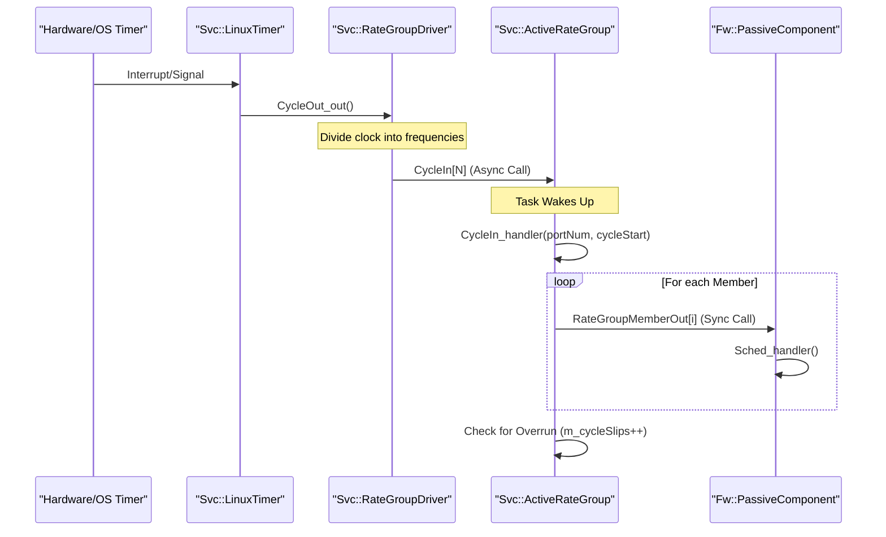
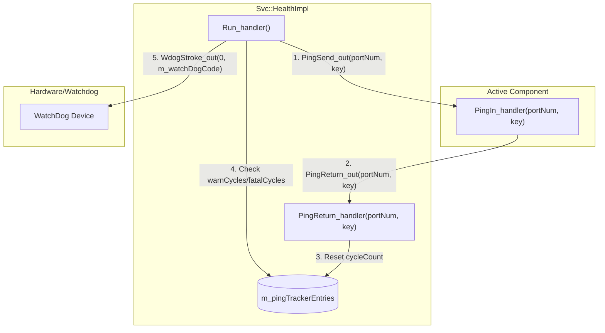

# Page: Scheduling, Health, and System Resources

# Scheduling, Health, and System Resources

Relevant source files

The following files were used as context for generating this wiki page:

- [Drv/LinuxSpiDriver/LinuxSpiDriverComponentImplCommon.cpp](Drv/LinuxSpiDriver/LinuxSpiDriverComponentImplCommon.cpp)
- [Svc/ActiveRateGroup/ActiveRateGroup.cpp](Svc/ActiveRateGroup/ActiveRateGroup.cpp)
- [Svc/ActiveRateGroup/ActiveRateGroup.hpp](Svc/ActiveRateGroup/ActiveRateGroup.hpp)
- [Svc/ActiveRateGroup/CMakeLists.txt](Svc/ActiveRateGroup/CMakeLists.txt)
- [Svc/ActiveRateGroup/docs/sdd.md](Svc/ActiveRateGroup/docs/sdd.md)
- [Svc/ActiveRateGroup/test/ut/ActiveRateGroupTestMain.cpp](Svc/ActiveRateGroup/test/ut/ActiveRateGroupTestMain.cpp)
- [Svc/ActiveRateGroup/test/ut/ActiveRateGroupTester.cpp](Svc/ActiveRateGroup/test/ut/ActiveRateGroupTester.cpp)
- [Svc/ActiveRateGroup/test/ut/ActiveRateGroupTester.hpp](Svc/ActiveRateGroup/test/ut/ActiveRateGroupTester.hpp)
- [Svc/AssertFatalAdapter/AssertFatalAdapterComponentImpl.cpp](Svc/AssertFatalAdapter/AssertFatalAdapterComponentImpl.cpp)
- [Svc/AssertFatalAdapter/AssertFatalAdapterComponentImpl.hpp](Svc/AssertFatalAdapter/AssertFatalAdapterComponentImpl.hpp)
- [Svc/AssertFatalAdapter/CMakeLists.txt](Svc/AssertFatalAdapter/CMakeLists.txt)
- [Svc/BufferManager/BufferManagerComponentImpl.hpp](Svc/BufferManager/BufferManagerComponentImpl.hpp)
- [Svc/CmdSequencer/docs/sdd.md](Svc/CmdSequencer/docs/sdd.md)
- [Svc/ComLogger/CMakeLists.txt](Svc/ComLogger/CMakeLists.txt)
- [Svc/FatalHandler/FatalHandlerComponentBaremetalImpl.cpp](Svc/FatalHandler/FatalHandlerComponentBaremetalImpl.cpp)
- [Svc/FatalHandler/FatalHandlerComponentImpl.hpp](Svc/FatalHandler/FatalHandlerComponentImpl.hpp)
- [Svc/FileDownlink/CMakeLists.txt](Svc/FileDownlink/CMakeLists.txt)
- [Svc/Health/CMakeLists.txt](Svc/Health/CMakeLists.txt)
- [Svc/Health/HealthComponentImpl.cpp](Svc/Health/HealthComponentImpl.cpp)
- [Svc/Health/HealthComponentImpl.hpp](Svc/Health/HealthComponentImpl.hpp)
- [Svc/Health/docs/sdd.md](Svc/Health/docs/sdd.md)
- [Svc/Health/test/ut/HealthTestMain.cpp](Svc/Health/test/ut/HealthTestMain.cpp)
- [Svc/Health/test/ut/HealthTester.cpp](Svc/Health/test/ut/HealthTester.cpp)
- [Svc/Health/test/ut/HealthTester.hpp](Svc/Health/test/ut/HealthTester.hpp)
- [Svc/PolyDb/docs/sdd.md](Svc/PolyDb/docs/sdd.md)
- [Svc/PrmDb/docs/sdd.md](Svc/PrmDb/docs/sdd.md)
- [Svc/RateGroupDriver/CMakeLists.txt](Svc/RateGroupDriver/CMakeLists.txt)
- [Svc/RateGroupDriver/docs/sdd.md](Svc/RateGroupDriver/docs/sdd.md)
- [Svc/SystemResources/CMakeLists.txt](Svc/SystemResources/CMakeLists.txt)
- [Svc/SystemResources/SystemResources.cpp](Svc/SystemResources/SystemResources.cpp)
- [Svc/SystemResources/SystemResources.fpp](Svc/SystemResources/SystemResources.fpp)
- [Svc/SystemResources/SystemResources.hpp](Svc/SystemResources/SystemResources.hpp)
- [Svc/SystemResources/test/ut/SystemResourcesTestMain.cpp](Svc/SystemResources/test/ut/SystemResourcesTestMain.cpp)
- [Svc/SystemResources/test/ut/SystemResourcesTester.cpp](Svc/SystemResources/test/ut/SystemResourcesTester.cpp)
- [Svc/SystemResources/test/ut/SystemResourcesTester.hpp](Svc/SystemResources/test/ut/SystemResourcesTester.hpp)
- [Svc/TlmChan/TlmChan.hpp](Svc/TlmChan/TlmChan.hpp)
- [Svc/TlmChan/docs/sdd.md](Svc/TlmChan/docs/sdd.md)
- [Svc/Version/Version.cpp](Svc/Version/Version.cpp)
- [Svc/Version/docs/sdd.md](Svc/Version/docs/sdd.md)
- [Svc/Version/test/ut/VersionTester.cpp](Svc/Version/test/ut/VersionTester.cpp)

The F´ framework provides a suite of service components to manage periodic execution, monitor system liveness, and report resource utilization. These services ensure that the flight software operates within its timing constraints and provides telemetry regarding the physical health of the hardware and the logical health of the software tasks.

## Periodic Scheduling

F´ uses a "Rate Group" architecture to manage periodic execution. Instead of every component having its own timer or thread, a single tick source drives a driver which then fans out to multiple rate groups.

### RateGroupDriver
The `Svc::RateGroupDriver` component is the primary dispatcher for periodic execution. It receives a "tick" (usually from a hardware interrupt or a timer task) and divides that clock into different frequencies (e.g., 1Hz, 10Hz, 100Hz) to drive various rate groups [Svc/RateGroupDriver/docs/sdd.md]().

### Active and Passive Rate Groups
Rate groups are the components that actually invoke the periodic logic of other components.
*   **ActiveRateGroup**: An active component with its own execution thread. It receives an asynchronous `CycleIn` signal via its `CycleIn_handler`, wakes up, and synchronously calls all members of its group [Svc/ActiveRateGroup/docs/sdd.md:5-7](). It tracks execution time using `Os::RawTime` and detects "cycle slips" (overruns) by checking a `m_cycleStarted` flag in the `CycleIn_preMsgHook` [Svc/ActiveRateGroup/ActiveRateGroup.hpp:73-84]().
*   **PassiveRateGroup**: Performs the same dispatching logic but executes on the thread of the caller (typically the `RateGroupDriver`).

### LinuxTimer
The `Svc::LinuxTimer` component provides the "heartbeat" for the scheduling system on POSIX-based systems. It can be implemented using two different mechanisms:
1.  **TimerFd**: Uses the Linux `timerfd` API for high-precision timing.
2.  **Task Delay**: Uses `Os::Task::delay` for simpler, less precise timing, often used on macOS (Darwin) or systems where `timerfd` is unavailable.

### Scheduling Data Flow

The following diagram shows how a hardware tick propagates through the system to execute component logic.

**Figure 1: Periodic Scheduling Data Flow**

Sources: [Svc/ActiveRateGroup/docs/sdd.md:64-78](), [Svc/ActiveRateGroup/ActiveRateGroup.hpp:73-109](), [Svc/ActiveRateGroup/ActiveRateGroup.cpp]()

---

## Health Monitoring

The `Svc::Health` component provides liveness monitoring for the software system. It uses a "ping-pong" mechanism to ensure that active components are still processing their message queues.

### Ping Mechanism
1.  **PingSend**: The `Svc::Health` component periodically sends a `PingSend` signal with a unique `m_key` to every registered active component [Svc/Health/HealthComponentImpl.cpp:104-106]().
2.  **PingReturn**: The receiving component must respond with a `PingReturn` call using the same `key` via `PingReturn_handler` [Svc/Health/HealthComponentImpl.cpp:72-82]().
3.  **Thresholds**: If a component fails to respond within a configured number of cycles (`warnCycles`), a `WARNING_HI` event is issued. If it exceeds `fatalCycles`, a `FATAL` event is triggered [Svc/Health/HealthComponentImpl.hpp:46-50](), [Svc/Health/HealthComponentImpl.cpp:113-125]().

### Watchdog Strobe
The `Svc::Health` component is also responsible for stroking a hardware watchdog. In its `Run_handler`, it calls the `WdogStroke_out` port with a configured `m_watchDogCode` [Svc/Health/HealthComponentImpl.cpp:134-136]().

**Figure 2: Health Monitoring and Watchdog**

Sources: [Svc/Health/HealthComponentImpl.cpp:72-137](), [Svc/Health/HealthComponentImpl.hpp:138-143]()

---

## System Resources and Versioning

### SystemResources Component
The `Svc::SystemResources` component collects telemetry regarding the physical state of the system. It utilizes the `Os` layer to abstract platform-specific calls [Svc/SystemResources/CMakeLists.txt:14-16]().
*   **CPU Utilization**: Tracks ticks (used vs. total) for each CPU core using `Os::Cpu::getTicks` and calculates a percentage [Svc/SystemResources/SystemResources.cpp:82-117]().
*   **Memory**: Reports total and used system memory via `Os::Memory::getUsage` [Svc/SystemResources/SystemResources.cpp:119-124]().
*   **Non-Volatile Storage**: Reports free and total space for the filesystem using `Os::FileSystem::getFreeSpace` [Svc/SystemResources/SystemResources.cpp:126-134]().

### Version Component
The `Svc::Version` component provides a standardized way to downlink the software version. It typically reads from a generated header containing the git hash and build timestamp [Svc/Version/Version.cpp:1-5]().

---

## Fault Handling

### AssertFatalAdapter
The `Svc::AssertFatalAdapter` component bridges the framework's `FW_ASSERT` macro to the F´ event system. When an assertion fails in the code, this component catches the report via a registered hook and issues a `FATAL` event (e.g., `log_FATAL_AF_ASSERT_0` through `log_FATAL_AF_ASSERT_6`), allowing the ground system to see the file and line number of the failure [Svc/AssertFatalAdapter/AssertFatalAdapterComponentImpl.cpp:91-148]().

### FatalHandler
The `Svc::FatalHandler` component is a passive component that receives `FatalReceive` calls. On baremetal systems, it may enter an infinite loop to prevent further execution [Svc/FatalHandler/FatalHandlerComponentBaremetalImpl.cpp:18-22](). On Linux systems, it might trigger a process exit or a system reboot.

### Component Summary

| Component | Role | Primary Source |
| :--- | :--- | :--- |
| `Svc::Health` | Ping-based liveness monitoring and watchdog stroking | [Svc/Health/HealthComponentImpl.cpp:17-40]() |
| `Svc::SystemResources` | CPU, Memory, and Disk utilization telemetry | [Svc/SystemResources/SystemResources.cpp:23-57]() |
| `Svc::AssertFatalAdapter` | Converts code-level asserts to system-level FATAL events | [Svc/AssertFatalAdapter/AssertFatalAdapterComponentImpl.cpp:41-49]() |
| `Svc::ActiveRateGroup` | Threaded periodic task execution with overrun detection | [Svc/ActiveRateGroup/ActiveRateGroup.hpp:31-61]() |
| `Svc::FatalHandler` | Final handler for system FATAL events | [Svc/FatalHandler/FatalHandlerComponentBaremetalImpl.cpp:18-24]() |
| `Svc::Version` | Exposes build version information | [Svc/Version/Version.cpp]() |

Sources: [Svc/AssertFatalAdapter/AssertFatalAdapterComponentImpl.cpp](), [Svc/SystemResources/SystemResources.cpp](), [Svc/Health/HealthComponentImpl.cpp](), [Svc/ActiveRateGroup/ActiveRateGroup.cpp](), [Svc/FatalHandler/FatalHandlerComponentBaremetalImpl.cpp]()
