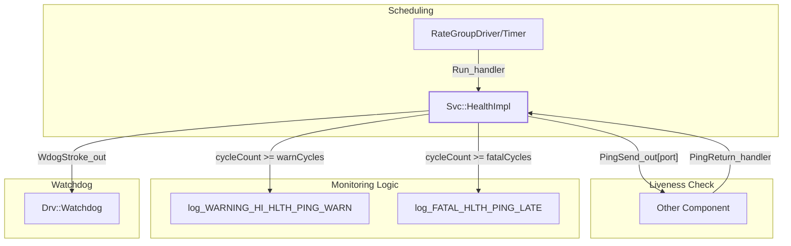

# Page: Service Components (Svc)

# Service Components (Svc)

<details>
<summary>Relevant source files</summary>

The following files were used as context for generating this wiki page:

- [.github/actions/spelling/expect.txt](.github/actions/spelling/expect.txt)
- [Svc/ActiveRateGroup/docs/sdd.md](Svc/ActiveRateGroup/docs/sdd.md)
- [Svc/CMakeLists.txt](Svc/CMakeLists.txt)
- [Svc/CmdSequencer/docs/sdd.md](Svc/CmdSequencer/docs/sdd.md)
- [Svc/Health/CMakeLists.txt](Svc/Health/CMakeLists.txt)
- [Svc/Health/HealthComponentImpl.cpp](Svc/Health/HealthComponentImpl.cpp)
- [Svc/Health/HealthComponentImpl.hpp](Svc/Health/HealthComponentImpl.hpp)
- [Svc/Health/docs/sdd.md](Svc/Health/docs/sdd.md)
- [Svc/Health/test/ut/HealthTestMain.cpp](Svc/Health/test/ut/HealthTestMain.cpp)
- [Svc/Health/test/ut/HealthTester.cpp](Svc/Health/test/ut/HealthTester.cpp)
- [Svc/Health/test/ut/HealthTester.hpp](Svc/Health/test/ut/HealthTester.hpp)
- [Svc/PassThroughRouter/CMakeLists.txt](Svc/PassThroughRouter/CMakeLists.txt)
- [Svc/PassThroughRouter/PassThroughRouter.cpp](Svc/PassThroughRouter/PassThroughRouter.cpp)
- [Svc/PassThroughRouter/PassThroughRouter.fpp](Svc/PassThroughRouter/PassThroughRouter.fpp)
- [Svc/PassThroughRouter/PassThroughRouter.hpp](Svc/PassThroughRouter/PassThroughRouter.hpp)
- [Svc/PassThroughRouter/docs/sdd.md](Svc/PassThroughRouter/docs/sdd.md)
- [Svc/PassThroughRouter/test/ut/PassThroughRouterTestMain.cpp](Svc/PassThroughRouter/test/ut/PassThroughRouterTestMain.cpp)
- [Svc/PassThroughRouter/test/ut/PassThroughRouterTester.cpp](Svc/PassThroughRouter/test/ut/PassThroughRouterTester.cpp)
- [Svc/PassThroughRouter/test/ut/PassThroughRouterTester.hpp](Svc/PassThroughRouter/test/ut/PassThroughRouterTester.hpp)
- [Svc/PolyDb/docs/sdd.md](Svc/PolyDb/docs/sdd.md)
- [Svc/Ports/FilePorts/CMakeLists.txt](Svc/Ports/FilePorts/CMakeLists.txt)
- [Svc/PrmDb/docs/sdd.md](Svc/PrmDb/docs/sdd.md)
- [Svc/RateGroupDriver/docs/sdd.md](Svc/RateGroupDriver/docs/sdd.md)
- [Svc/TlmChan/TlmChan.hpp](Svc/TlmChan/TlmChan.hpp)
- [Svc/TlmChan/docs/sdd.md](Svc/TlmChan/docs/sdd.md)

</details>


The `Svc/` directory contains a library of reusable flight software service components. These components provide the "middle-ware" of an F´ application, handling essential functions such as command dispatching, telemetry management, file transfers, and system health monitoring. By providing these services as standard components, F´ allows developers to focus on mission-specific logic while relying on a robust, tested foundation for spacecraft operations.

The services are organized into functional groups that interact to form the standard F´ flight software stack.

### Service Architecture Overview
The following diagram illustrates the relationship between key service components and the flow of data from ground to flight software.

**Service Data Flow**
```mermaid
graph TD
    subgraph "Uplink & Command"
        "GndInterface" --> "FprimeDeframer"
        "FprimeDeframer" --> "CmdDispatcher[Svc::CmdDispatcher]"
        "CmdDispatcher[Svc::CmdDispatcher]" -- "Opcode" --> "TargetComponent"
        "CmdSequencer[Svc::CmdSequencer]" -- "FprimeSequence" --> "CmdDispatcher[Svc::CmdDispatcher]"
    end

    subgraph "Downlink & Telemetry"
        "TargetComponent" -- "TlmRecv" --> "TlmChan[Svc::TlmChan]"
        "TlmChan[Svc::TlmChan]" -- "TlmGet" --> "TlmPacketizer"
        "TlmPacketizer" --> "FprimeFramer"
        "FprimeFramer" --> "GndInterface"
    end

    subgraph "Configuration"
        "PrmDb[Svc::PrmDb]" -- "getPrm" --> "TargetComponent"
    end
```
**Sources:** [Svc/CMakeLists.txt:30-31](), [Svc/CMakeLists.txt:45-46](), [Svc/TlmChan/TlmChan.hpp:35-37](), [Svc/PrmDb/docs/sdd.md:32-36]()

## Commanding and Sequencing
The commanding system is responsible for receiving, validating, and routing ground commands to the appropriate destination components. It also supports autonomous execution via sequences.

*   **CmdDispatcher**: The central hub for command routing. It maintains a registry of opcodes and dispatches commands to components. [Svc/CMakeLists.txt:30]()
*   **CmdSequencer**: Loads and executes command sequences from files (supporting `.seq` and AMPCS formats). [Svc/CmdSequencer/docs/sdd.md:1-10]()
*   **FpySequencer**: A more advanced sequencer supporting a bytecode-based format with arithmetic, branching, and telemetry-based execution. [Svc/CMakeLists.txt:76]()
*   **CmdSplitter**: Allows commands to be broadcast or routed to multiple dispatchers. [Svc/CMakeLists.txt:32]()

For details, see [Commanding and Sequencing](#5.1).

## Telemetry, Events, and Parameters
These components manage the data flowing out of the system and the configuration state within it.

*   **TlmChan**: A database that stores telemetry channel values received from components across the system. It uses a hash-table implementation for efficient lookups. [Svc/TlmChan/TlmChan.hpp:22-61]()
*   **TlmPacketizer**: Groups individual telemetry channels into packets for efficient downlink. [Svc/CMakeLists.txt:60]()
*   **EventManager**: (ActiveLogger) Collects and filters event logs based on severity (DIAGNOSTIC, ACTIVITY, WARNING, FATAL). [Svc/CMakeLists.txt:37]()
*   **PrmDb**: Manages the parameter database, allowing components to retrieve configuration at startup and update it via ground commands. It supports loading from and saving to the filesystem. [Svc/PrmDb/docs/sdd.md:1-53]()

For details, see [Telemetry, Events, and Parameters](#5.2).

## Communication and Framing
This functional group handles the transformation of F´ packets into byte streams for hardware transport and vice-versa.

*   **FprimeFramer/Deframer**: Implements the standard F´ framing protocol (header, packet, CRC). [Svc/CMakeLists.txt:45-46]()
*   **FprimeRouter & PassThroughRouter**: Routes framed data between communication adapters and the service stack. [Svc/PassThroughRouter/test/ut/PassThroughRouterTester.cpp:30-34]()
*   **ComQueue**: Provides priority-based queuing for outgoing communication packets. [Svc/CMakeLists.txt:27]()
*   **CCSDS Stack**: Components like `TmFramer` and `TcDeframer` provide compatibility with CCSDS space data link protocols. [Svc/CMakeLists.txt:77]()

For details, see [Communication and Framing](#5.3).

## File Handling Services
F´ uses a dedicated protocol (based on `Fw::FilePacket`) to reliably move files between the ground and the spacecraft.

*   **FileUplink**: Receives file packets and reconstructs them into files on the local filesystem. [Svc/CMakeLists.txt:43]()
*   **FileDownlink**: Reads files from the filesystem and sends them as packets to the ground. [Svc/CMakeLists.txt:41]()
*   **FileManager**: Provides shell-like filesystem operations (move, remove, directory listing) via commands. [Svc/CMakeLists.txt:42]()
*   **BufferLogger**: Logs raw data buffers directly to files for later retrieval. [Svc/CMakeLists.txt:23]()

For details, see [File Handling Services](#5.4).

## Scheduling, Health, and System Resources
These services ensure the software executes at the correct rates and remains healthy.

*   **RateGroupDriver**: Distributes a master "tick" to various rate groups. [Svc/RateGroupDriver/docs/sdd.md:1-10]()
*   **ActiveRateGroup**: An active component that invokes a list of passive components at a specific frequency, tracking execution time and overruns. [Svc/ActiveRateGroup/docs/sdd.md:5-18]()
*   **Health**: Monitors system liveness by "pinging" other components. If a component fails to respond within `warnCycles` or `fatalCycles`, it issues events or triggers recovery. It also strokes the hardware watchdog. [Svc/Health/HealthComponentImpl.cpp:94-137]()
*   **SystemResources**: Collects telemetry regarding CPU and memory usage from the operating system. [Svc/CMakeLists.txt:61]()

For details, see [Scheduling, Health, and System Resources](#5.5).

### Health Monitoring Logic
The following diagram illustrates how the `Svc::HealthImpl` component interacts with the system to monitor component liveness and stroke the hardware watchdog.

**Health Service Flow**

**Sources:** [Svc/Health/HealthComponentImpl.cpp:72-137](), [Svc/Health/HealthComponentImpl.hpp:138-143]()

## Data Products
The Data Product system provides a structured way to manage large scientific or engineering data sets that are too large for standard telemetry.

*   **DpManager**: Manages the allocation of data product containers and routes requests. [Svc/CMakeLists.txt:34]()
*   **DpWriter**: Handles the serialization of data products to persistent storage. [Svc/CMakeLists.txt:36]()
*   **DpCatalog**: Maintains a list of stored data products available for downlink. [Svc/CMakeLists.txt:33]()

For details, see [Data Products](#5.6).

## Buffer and Memory Management
These components provide standardized ways to manage memory and data buffers to prevent leaks and fragmentation.

*   **BufferManager**: Provides a pool-based allocation of `Fw::Buffer` objects. [Svc/CMakeLists.txt:22]()
*   **BufferAccumulator**: A FIFO queue for buffers, useful for rate-matching between producers and consumers. [Svc/CMakeLists.txt:21]()
*   **StaticMemory**: Provides fixed-size memory regions for components requiring persistent buffers without dynamic allocation. [Svc/CMakeLists.txt:58]()

For details, see [Buffer and Memory Management](#5.7).

## Reusable Subtopologies
To simplify system integration, `Svc/Subtopologies` provides pre-wired groups of components that implement common patterns (e.g., a standard command/telemetry stack). [Svc/CMakeLists.txt:64]()

For details, see [Reusable Subtopologies](#5.8).

### Service Directory Structure
The `Svc` directory is organized into subdirectories for each component and port definition.

| Directory | Description |
|-----------|-------------|
| `CmdDispatcher/` | Command routing and opcode registration |
| `TlmChan/` | Telemetry database |
| `PrmDb/` | Parameter database |
| `Health/` | System liveness and watchdog management |
| `FprimeFramer/` | Standard F´ framing implementation |
| `FileDownlink/` | File transmission service |
| `Subtopologies/` | Pre-wired component bundles |

**Sources:** [Svc/CMakeLists.txt:1-81]()
