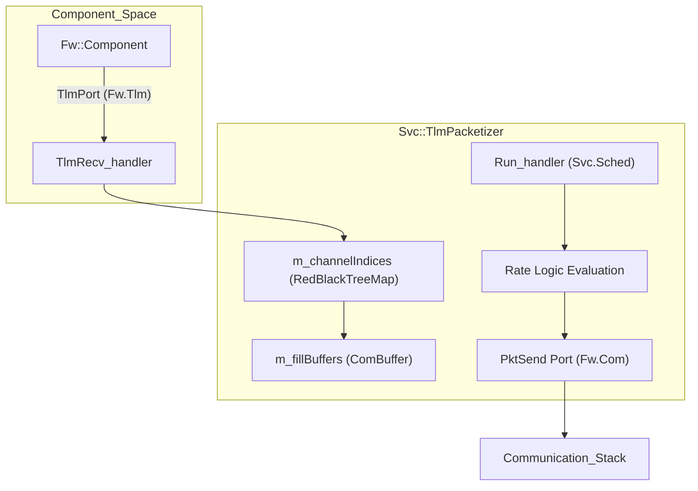
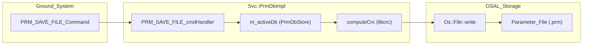

# Page: Telemetry, Events, and Parameters

# Telemetry, Events, and Parameters

Relevant source files

The following files were used as context for generating this wiki page:

- [Svc/BufferLogger/changed-symbols.txt](Svc/BufferLogger/changed-symbols.txt)
- [Svc/CmdSequencer/test/ut/SequenceFiles/TooLargeFile.cpp](Svc/CmdSequencer/test/ut/SequenceFiles/TooLargeFile.cpp)
- [Svc/Ports/TlmPacketizerPorts/CMakeLists.txt](Svc/Ports/TlmPacketizerPorts/CMakeLists.txt)
- [Svc/Ports/TlmPacketizerPorts/TlmPacketizerPorts.fpp](Svc/Ports/TlmPacketizerPorts/TlmPacketizerPorts.fpp)
- [Svc/PrmDb/CMakeLists.txt](Svc/PrmDb/CMakeLists.txt)
- [Svc/PrmDb/PrmDb.fpp](Svc/PrmDb/PrmDb.fpp)
- [Svc/PrmDb/PrmDbCmdDict.fppi](Svc/PrmDb/PrmDbCmdDict.fppi)
- [Svc/PrmDb/PrmDbEventDict.fppi](Svc/PrmDb/PrmDbEventDict.fppi)
- [Svc/PrmDb/PrmDbImpl.cpp](Svc/PrmDb/PrmDbImpl.cpp)
- [Svc/PrmDb/PrmDbImpl.hpp](Svc/PrmDb/PrmDbImpl.hpp)
- [Svc/PrmDb/changed-symbols.txt](Svc/PrmDb/changed-symbols.txt)
- [Svc/PrmDb/test/ut/PrmDbTestMain.cpp](Svc/PrmDb/test/ut/PrmDbTestMain.cpp)
- [Svc/PrmDb/test/ut/PrmDbTester.cpp](Svc/PrmDb/test/ut/PrmDbTester.cpp)
- [Svc/PrmDb/test/ut/PrmDbTester.hpp](Svc/PrmDb/test/ut/PrmDbTester.hpp)
- [Svc/TlmPacketizer/TlmPacketizer.cpp](Svc/TlmPacketizer/TlmPacketizer.cpp)
- [Svc/TlmPacketizer/TlmPacketizer.fpp](Svc/TlmPacketizer/TlmPacketizer.fpp)
- [Svc/TlmPacketizer/TlmPacketizer.hpp](Svc/TlmPacketizer/TlmPacketizer.hpp)
- [Svc/TlmPacketizer/docs/sdd.md](Svc/TlmPacketizer/docs/sdd.md)
- [Svc/TlmPacketizer/test/ut/TlmPacketizerTester.cpp](Svc/TlmPacketizer/test/ut/TlmPacketizerTester.cpp)
- [Svc/TlmPacketizer/test/ut/TlmPacketizerTester.hpp](Svc/TlmPacketizer/test/ut/TlmPacketizerTester.hpp)
- [Svc/TlmPacketizer/test/ut/main.cpp](Svc/TlmPacketizer/test/ut/main.cpp)
- [ci/tests/25-fputil-comp.bash](ci/tests/25-fputil-comp.bash)
- [default/config/CMakeLists.txt](default/config/CMakeLists.txt)

This section covers the core F´ service components responsible for managing the state and health of the flight software. This includes telemetry collection and packetization, event logging and filtering, and the management of non-volatile parameters.

## Telemetry Management

F´ provides two primary methods for managing telemetry: `Svc::TlmChan` (a simple channel database) and `Svc::TlmPacketizer` (a grouping mechanism for bandwidth-efficient downlink).

### TlmPacketizer
The `Svc::TlmPacketizer` component stores telemetry values written by other components in serialized form [Svc/TlmPacketizer/docs/sdd.md:5-5](). Unlike `TlmChan`, which streams updates as they occur, `TlmPacketizer` groups channels into predefined packets to optimize downlink bandwidth [Svc/TlmPacketizer/docs/sdd.md:5-10]().

**Key Features:**
*   **Packet Definitions:** Packets are defined via a table passed to `setPacketList()` [Svc/TlmPacketizer/TlmPacketizer.cpp:48-51]().
*   **Resampling Logic:** Supports `ON_CHANGE`, `EVERY_MAX`, and `ON_CHANGE_MIN` logic to control how often packets are sent based on schedule ticks [Svc/TlmPacketizer/docs/sdd.md:9-10]().
*   **Telemetry Sections:** Supports multiple sections (e.g., Real-time vs. Recorded) with independent rates and enable/disable control via the `controlIn` port [Svc/TlmPacketizer/TlmPacketizer.fpp:28-28](), [Svc/TlmPacketizer/docs/sdd.md:7-7]().
*   **Level Filtering:** Each packet has a numerical group (level), and the component can filter packets based on a global send level set via the `SET_LEVEL` command [Svc/TlmPacketizer/TlmPacketizer.hpp:104-109](), [Svc/TlmPacketizer/docs/sdd.md:7-7]().

**TlmPacketizer Data Flow**
The diagram below shows how telemetry flows from a component into the packetizer and out to the communication stack.

Sources: [Svc/TlmPacketizer/TlmPacketizer.cpp:59-63](), [Svc/TlmPacketizer/TlmPacketizer.hpp:15-18](), [Svc/TlmPacketizer/docs/sdd.md:63-67]()

## Parameter Management (PrmDb)

The `Svc::PrmDb` component manages a database of serialized parameters [Svc/PrmDb/PrmDb.fpp:4-5](). It allows components to retrieve configuration values at runtime and provides commands to update and persist these values to non-volatile storage [Svc/PrmDb/PrmDbImpl.cpp:142-145]().

### Database Implementation
`PrmDb` uses a dual-database approach with an **Active** and a **Staging** database, both implemented as `Fw::ArrayMap` [Svc/PrmDb/PrmDbImpl.hpp:42-45]().
*   **Active DB:** The primary store used for `getPrm` requests from components [Svc/PrmDb/PrmDbImpl.hpp:101-102]().
*   **Staging DB:** Used to load and verify parameters from a file before committing them to the active store [Svc/PrmDb/PrmDbImpl.hpp:102-103]().

### Key Functions
*   `getPrm_handler`: Retrieves a parameter by `FwPrmIdType`. If not found, it logs a `PrmIdNotFound` warning [Svc/PrmDb/PrmDbImpl.cpp:78-93]().
*   `setPrm_handler`: Updates a parameter in RAM. Updates are rejected if a file load is currently in progress (state is not `IDLE`) [Svc/PrmDb/PrmDbImpl.cpp:95-113]().
*   `PRM_SAVE_FILE_cmdHandler`: Serializes the Active DB, computes a CRC32, and writes the data to a file [Svc/PrmDb/PrmDbImpl.cpp:142-171]().

**Parameter Persistence Flow**
This diagram bridges the command interface to the internal storage and file system.

Sources: [Svc/PrmDb/PrmDbImpl.cpp:142-165](), [Svc/PrmDb/PrmDbImpl.hpp:42-42](), [Svc/PrmDb/PrmDb.fpp:65-69]()

## Event Logging

The F´ framework provides several components for handling events (logs). 

*   **ActiveLogger:** Receives events from components and sends them to the ground system. It supports severity filtering (Activity High/Low, Warning High/Low, Fatal, Diagnostic) at runtime via commands.
*   **ActiveTextLogger:** A specialized logger that formats events into human-readable text strings for console output or local logging [default/config/CMakeLists.txt:25-25]().
*   **EventManager:** Provides centralized management of event streams and dictionary lookups.

## Polymorphic Database (PolyDb)

The `Svc::PolyDb` component provides a simple, polymorphic value store. Unlike `PrmDb`, which stores serialized buffers for persistence, `PolyDb` typically holds `Fw::PolyType` values in RAM for cross-component data sharing without the overhead of formal ports or telemetry channels. It is configured via `PolyDbCfg.fpp` [default/config/CMakeLists.txt:20-20]().

## Component Configuration Summary

The behavior of these services is often governed by project-specific configuration headers located in `default/config/`.

| Config File | Purpose | Source |
| :--- | :--- | :--- |
| `TlmPacketizerCfg.hpp` | Defines maximum packets and packetizer limits. | [Svc/TlmPacketizer/TlmPacketizer.hpp:23-23]() |
| `PrmDbImplCfg.hpp` | Sets `PRMDB_NUM_DB_ENTRIES` and delimiter values. | [Svc/PrmDb/PrmDbImpl.hpp:22-22](), [Svc/PrmDb/PrmDbImpl.cpp:19-20]() |
| `EventManagerCfg.hpp` | Configures event queue depths and filtering defaults. | [default/config/CMakeLists.txt:23-23]() |
| `AcConstants.fpp` | Contains system-wide constants like `FW_PARAM_BUFFER_MAX_SIZE`. | [default/config/CMakeLists.txt:8-8]() |

Sources: [default/config/CMakeLists.txt:6-45](), [Svc/PrmDb/PrmDbImpl.cpp:19-20]()
