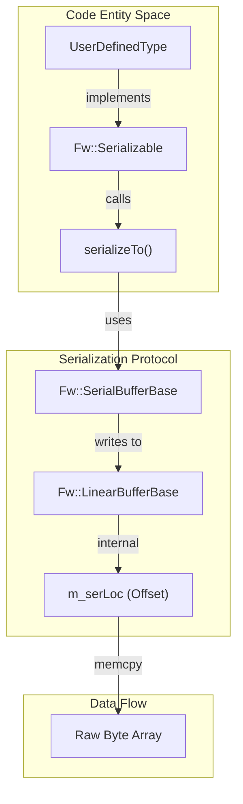
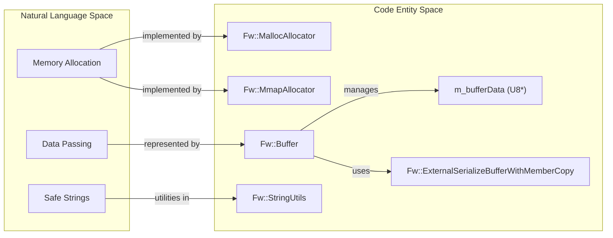

# Page: Types and Serialization

# Types and Serialization

Relevant source files

The following files were used as context for generating this wiki page:

- [CFDP/Checksum/Checksum.hpp](CFDP/Checksum/Checksum.hpp)
- [CONTRIBUTING.md](CONTRIBUTING.md)
- [Fw/Buffer/Buffer.cpp](Fw/Buffer/Buffer.cpp)
- [Fw/Buffer/Buffer.hpp](Fw/Buffer/Buffer.hpp)
- [Fw/Buffer/CMakeLists.txt](Fw/Buffer/CMakeLists.txt)
- [Fw/Buffer/docs/sdd.md](Fw/Buffer/docs/sdd.md)
- [Fw/Buffer/test/ut/TestBuffer.cpp](Fw/Buffer/test/ut/TestBuffer.cpp)
- [Fw/FilePacket/FilePacket.cpp](Fw/FilePacket/FilePacket.cpp)
- [Fw/Test/UnitTestAssert.cpp](Fw/Test/UnitTestAssert.cpp)
- [Fw/Test/UnitTestAssert.hpp](Fw/Test/UnitTestAssert.hpp)
- [Fw/Types/Assert.cpp](Fw/Types/Assert.cpp)
- [Fw/Types/Assert.hpp](Fw/Types/Assert.hpp)
- [Fw/Types/BasicTypes.hpp](Fw/Types/BasicTypes.hpp)
- [Fw/Types/MallocAllocator.cpp](Fw/Types/MallocAllocator.cpp)
- [Fw/Types/MallocAllocator.hpp](Fw/Types/MallocAllocator.hpp)
- [Fw/Types/MemAllocator.cpp](Fw/Types/MemAllocator.cpp)
- [Fw/Types/MemAllocator.hpp](Fw/Types/MemAllocator.hpp)
- [Fw/Types/MmapAllocator.hpp](Fw/Types/MmapAllocator.hpp)
- [Fw/Types/PolyType.cpp](Fw/Types/PolyType.cpp)
- [Fw/Types/PolyType.hpp](Fw/Types/PolyType.hpp)
- [Fw/Types/Serializable.cpp](Fw/Types/Serializable.cpp)
- [Fw/Types/Serializable.hpp](Fw/Types/Serializable.hpp)
- [Fw/Types/StringBase.cpp](Fw/Types/StringBase.cpp)
- [Fw/Types/StringBase.hpp](Fw/Types/StringBase.hpp)
- [Fw/Types/StringType.hpp](Fw/Types/StringType.hpp)
- [Fw/Types/StringUtils.cpp](Fw/Types/StringUtils.cpp)
- [Fw/Types/StringUtils.hpp](Fw/Types/StringUtils.hpp)
- [Fw/Types/test/ut/AssertTypesTest.cpp](Fw/Types/test/ut/AssertTypesTest.cpp)
- [Fw/Types/test/ut/MmapAllocatorTest.cpp](Fw/Types/test/ut/MmapAllocatorTest.cpp)
- [Fw/Types/test/ut/SerializeBufferBaseTester.hpp](Fw/Types/test/ut/SerializeBufferBaseTester.hpp)
- [Fw/Types/test/ut/TypesTest.cpp](Fw/Types/test/ut/TypesTest.cpp)
- [Os/ValidateFileCommon.cpp](Os/ValidateFileCommon.cpp)
- [STest/README.md](STest/README.md)
- [Svc/BufferManager/test/ut/BufferManagerTester.cpp](Svc/BufferManager/test/ut/BufferManagerTester.cpp)
- [Svc/Ccsds/SpacePacketDeframer/SpacePacketDeframer.cpp](Svc/Ccsds/SpacePacketDeframer/SpacePacketDeframer.cpp)
- [Svc/Ccsds/SpacePacketDeframer/SpacePacketDeframer.fpp](Svc/Ccsds/SpacePacketDeframer/SpacePacketDeframer.fpp)
- [Svc/Ccsds/TcDeframer/TcDeframer.cpp](Svc/Ccsds/TcDeframer/TcDeframer.cpp)
- [Svc/Ccsds/TcDeframer/TcDeframer.fpp](Svc/Ccsds/TcDeframer/TcDeframer.fpp)
- [Svc/Ccsds/Types/Types.fpp](Svc/Ccsds/Types/Types.fpp)
- [Svc/ChronoTime/CMakeLists.txt](Svc/ChronoTime/CMakeLists.txt)
- [Svc/CmdSequencer/Sequence.cpp](Svc/CmdSequencer/Sequence.cpp)
- [Svc/DpCatalog/.gitignore](Svc/DpCatalog/.gitignore)
- [Svc/DpCatalog/CMakeLists.txt](Svc/DpCatalog/CMakeLists.txt)
- [Svc/DpCatalog/DpCatalog.cpp](Svc/DpCatalog/DpCatalog.cpp)
- [Svc/DpCatalog/DpCatalog.fpp](Svc/DpCatalog/DpCatalog.fpp)
- [Svc/DpCatalog/DpCatalog.hpp](Svc/DpCatalog/DpCatalog.hpp)
- [Svc/DpCatalog/docs/sdd.md](Svc/DpCatalog/docs/sdd.md)
- [Svc/DpCatalog/test/ut/DpCatalogTestMain.cpp](Svc/DpCatalog/test/ut/DpCatalogTestMain.cpp)
- [Svc/DpCatalog/test/ut/DpCatalogTester.cpp](Svc/DpCatalog/test/ut/DpCatalogTester.cpp)
- [Svc/DpCatalog/test/ut/DpCatalogTester.hpp](Svc/DpCatalog/test/ut/DpCatalogTester.hpp)
- [Svc/FprimeDeframer/FprimeDeframer.cpp](Svc/FprimeDeframer/FprimeDeframer.cpp)
- [Svc/FprimeDeframer/test/ut/FprimeDeframerTester.cpp](Svc/FprimeDeframer/test/ut/FprimeDeframerTester.cpp)
- [Svc/FrameAccumulator/CMakeLists.txt](Svc/FrameAccumulator/CMakeLists.txt)
- [Svc/FrameAccumulator/FrameDetector/CcsdsTcFrameDetector.cpp](Svc/FrameAccumulator/FrameDetector/CcsdsTcFrameDetector.cpp)
- [Svc/FrameAccumulator/FrameDetector/FprimeFrameDetector.cpp](Svc/FrameAccumulator/FrameDetector/FprimeFrameDetector.cpp)
- [Svc/FrameAccumulator/test/ut/detectors/FprimeFrameDetectorTestMain.cpp](Svc/FrameAccumulator/test/ut/detectors/FprimeFrameDetectorTestMain.cpp)
- [Utils/CMakeLists.txt](Utils/CMakeLists.txt)
- [Utils/CRCChecker.cpp](Utils/CRCChecker.cpp)
- [Utils/CRCChecker.hpp](Utils/CRCChecker.hpp)
- [Utils/Hash/Hash.hpp](Utils/Hash/Hash.hpp)
- [Utils/Hash/HashBuffer.hpp](Utils/Hash/HashBuffer.hpp)
- [Utils/Hash/HashBufferCommon.cpp](Utils/Hash/HashBufferCommon.cpp)
- [Utils/Hash/README.md](Utils/Hash/README.md)
- [Utils/Hash/libcrc/CRC32.cpp](Utils/Hash/libcrc/CRC32.cpp)
- [Utils/Hash/openssl/SHA256.cpp](Utils/Hash/openssl/SHA256.cpp)
- [Utils/test/ut/RateLimiterTester.cpp](Utils/test/ut/RateLimiterTester.cpp)
- [Utils/test/ut/RateLimiterTester.hpp](Utils/test/ut/RateLimiterTester.hpp)
- [default/config/CRCCheckerConfig.hpp](default/config/CRCCheckerConfig.hpp)
- [default/config/MemoryAllocation.fpp](default/config/MemoryAllocation.fpp)
- [docs/how-to/develop-subtopologies.md](docs/how-to/develop-subtopologies.md)

The `Fw/Types` module provides the foundational type system for the F´ framework. It includes platform-independent basic types, string abstractions, polymorphic types, and a robust serialization protocol that allows data to be passed between components, across address spaces, and down to ground systems.

## Basic Types and Configuration

F´ uses fixed-width integer and floating-point types to ensure predictability across different hardware architectures. These are defined in `Fw/Types/BasicTypes.h` and wrapped for C++ in `Fw/Types/BasicTypes.hpp` [Fw/Types/BasicTypes.hpp:1-30]().

### Standard Type Definitions
| F´ Type | Description | C Standard Equivalent |
| :--- | :--- | :--- |
| `U8`, `U16`, `U32`, `U64` | Unsigned Integers | `uint8_t`, `uint16_t`, etc. |
| `I8`, `I16`, `I32`, `I64` | Signed Integers | `int8_t`, `int16_t`, etc. |
| `F32`, `F64` | Floating Point | `float`, `double` (IEEE-754) |
| `CHAR` | Character Type | `char` |

The framework performs static assertions to ensure that `F32` and `F64` conform to IEEE-754 standards for 32-bit and 64-bit floats respectively [Fw/Types/BasicTypes.hpp:22-29]().

### Framework Configuration
Global switches affect the memory footprint and capabilities of types:
*   **`FW_SERIALIZABLE_TO_STRING`**: Controls whether serializables include a `toString()` method for human-readable output [Fw/Types/Serializable.hpp:87-97]().
*   **`FW_ASSERT_LEVEL`**: Configures the behavior of `FW_ASSERT`, ranging from no-op to reporting file names or numeric IDs [Fw/Types/Assert.hpp:11-45]().
*   **`FW_HAS_nn_BIT`**: Macros (e.g., `FW_HAS_64_BIT`) guard code for architectures that may not support certain widths [Fw/Types/Serializable.cpp:147-148]().

Sources: [Fw/Types/BasicTypes.hpp:1-30](), [Fw/Types/Serializable.hpp:87-97](), [Fw/Types/Assert.hpp:11-45]()

## Serialization Protocol

Serialization is the process of converting complex data structures into a stream of bytes. In F´, this is centered around the `Fw::Serializable` base class and the `Fw::SerialBufferBase` interface.

### The Serialization Interface
Every class that needs to be sent over a port must implement the `Fw::Serializable` interface:
*   `serializeTo(SerialBufferBase& buffer)`: Writes the object's state into the buffer [Fw/Types/Serializable.hpp:60]().
*   `deserializeFrom(SerialBufferBase& buffer)`: Reconstructs the object's state from the buffer [Fw/Types/Serializable.hpp:71]().

### Buffer Types
F´ provides several buffer implementations:
1.  **`LinearBufferBase`**: The primary implementation for contiguous memory serialization [Fw/Types/Serializable.cpp:42-44]().
2.  **`ExternalSerializeBufferWithMemberCopy`**: Allows treating an existing raw memory pointer as a serialization target, used by `Fw::Buffer` [Fw/Buffer/Buffer.cpp:95-103]().

### Endianness Support
The protocol supports both `BIG` and `LITTLE` endian modes, though `BIG` is the framework default [Fw/Types/Serializable.hpp:40-43](). Integer serialization logic handles byte-swapping as needed [Fw/Types/Serializable.cpp:88-102]().

### Serialization Logic Flow
This diagram shows how a code entity (a `Serializable` object) interacts with the buffer protocol.

"Serialization Logic Flow"

Sources: [Fw/Types/Serializable.hpp:45-113](), [Fw/Types/Serializable.cpp:66-76](), [Fw/Types/Serializable.cpp:46-55]()

## Polymorphic and String Types

### PolyType
`Fw::PolyType` is a container that can hold any basic type (`U8`, `F32`, `bool`, `void*`, etc.) [Fw/Types/PolyType.hpp:11-88](). It stores a type discriminator (`m_dataType`) alongside a union of the possible values [Fw/Types/PolyType.hpp:112-155]().
*   It implements `Fw::Serializable`, allowing polymorphic values to be passed across ports [Fw/Types/PolyType.cpp:453-487]().
*   It supports comparison operators (`==`, `!=`, `<`, etc.) for use in data structures [Fw/Types/PolyType.hpp:99-104]().

### String Abstractions
F´ provides a hierarchy of string classes to avoid dynamic memory allocation:
*   **`Fw::StringBase`**: The abstract base class for all strings [Fw/Types/StringBase.hpp:22]().
*   **`Fw::StringUtils`**: Provides safe string operations like `string_copy` and `string_length` that respect buffer boundaries [Fw/Types/StringUtils.cpp:7-33]().
*   **`Fw::ExternalString`**: Wraps an existing character buffer for use with the F´ string API [Fw/Types/test/ut/TypesTest.cpp:4]().

Sources: [Fw/Types/PolyType.hpp:11-162](), [Fw/Types/StringUtils.cpp:1-128](), [Fw/Types/StringBase.hpp:1-30]()

## Memory Management and Buffers

### Fw::Buffer
`Fw::Buffer` is the standard type for passing data blobs between components. It represents a pointer to a data region, a size, and a context ID [Fw/Buffer/Buffer.cpp:23]().
*   It includes a `getSerializer()` method to wrap the internal data for immediate serialization [Fw/Buffer/Buffer.cpp:95-103]().
*   It tracks ownership via a `m_context` field, allowing components to identify the allocator that should free the memory [Fw/Buffer/Buffer.hpp:38-40]().

### Allocators
The `Fw::MemAllocator` interface defines the protocol for memory allocation [Fw/Types/MemAllocator.hpp:17]().
*   **`MallocAllocator`**: Wraps standard `malloc`/`free` [Fw/Types/MallocAllocator.cpp:17-27]().
*   **`MmapAllocator`**: Uses memory-mapped files for allocation, useful for shared memory [Fw/Types/MmapAllocator.hpp:17]().

### Memory and Buffer Entity Mapping
This diagram bridges the natural language concepts of "Buffers" and "Memory" to the specific classes in the `Fw` namespace.

"Memory and Buffer Entity Mapping"

Sources: [Fw/Types/MemAllocator.hpp:17](), [Fw/Buffer/Buffer.cpp:23](), [Fw/Types/StringUtils.hpp:14](), [Fw/Buffer/Buffer.cpp:95-103]()

## Assertions and Utilities

### FW_ASSERT
The `FW_ASSERT` macro is the primary mechanism for detecting software contract violations.
*   It calls `Fw::SwAssert` which, by default, prints the file and line number to `stderr` and terminates the program [Fw/Types/Assert.cpp:113-136]().
*   **`AssertHook`**: Developers can register a custom `AssertHook` to intercept assertions, allowing for custom logging or recovery actions [Fw/Types/Assert.hpp:137-170]().
*   **`CAssert`**: Provides C-compatible assertion functions for use in C source files [Fw/Types/Assert.cpp:186-187]().

### Data Structures
The `Fw/DataStructures` library provides template-based collections:
*   **`Array`**: Fixed-size array wrapper.
*   **`FifoQueue`**: First-in-first-out queue.
*   **`RedBlackTree`**: Balanced binary search tree for map and set implementations.

Sources: [Fw/Types/Assert.hpp:1-173](), [Fw/Types/Assert.cpp:1-187](), [Fw/Types/StringUtils.cpp:35-75]()
