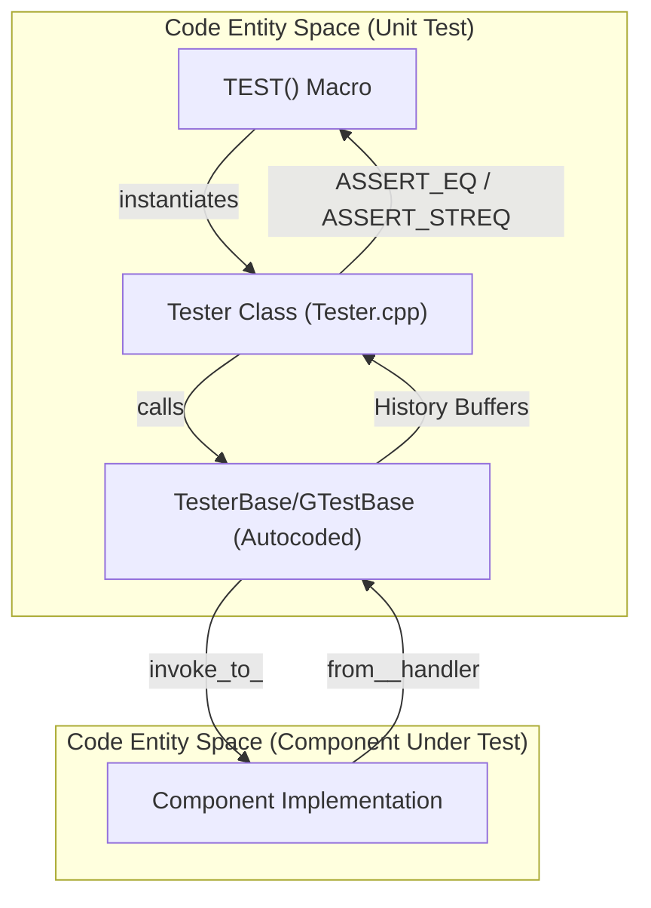
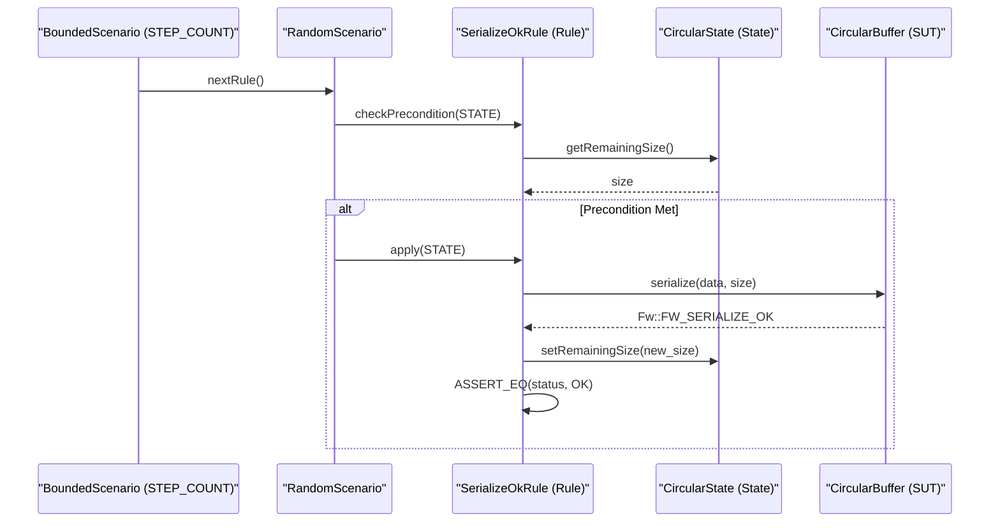

# Page: Unit Testing with GTest and STest

# Unit Testing with GTest and STest

<details>
<summary>Relevant source files</summary>

The following files were used as context for generating this wiki page:

- [STest/STest/Scenario/RandomScenario.hpp](STest/STest/Scenario/RandomScenario.hpp)
- [Svc/CmdSequencer/test/ut/SequenceFiles/TooLargeFile.cpp](Svc/CmdSequencer/test/ut/SequenceFiles/TooLargeFile.cpp)
- [Utils/Types/CMakeLists.txt](Utils/Types/CMakeLists.txt)
- [Utils/Types/CircularBuffer.cpp](Utils/Types/CircularBuffer.cpp)
- [Utils/Types/CircularBuffer.hpp](Utils/Types/CircularBuffer.hpp)
- [Utils/Types/Queue.cpp](Utils/Types/Queue.cpp)
- [Utils/Types/Queue.hpp](Utils/Types/Queue.hpp)
- [Utils/Types/test/ut/CircularBuffer/CircularRules.cpp](Utils/Types/test/ut/CircularBuffer/CircularRules.cpp)
- [Utils/Types/test/ut/CircularBuffer/CircularRules.hpp](Utils/Types/test/ut/CircularBuffer/CircularRules.hpp)
- [Utils/Types/test/ut/CircularBuffer/CircularState.cpp](Utils/Types/test/ut/CircularBuffer/CircularState.cpp)
- [Utils/Types/test/ut/CircularBuffer/CircularState.hpp](Utils/Types/test/ut/CircularBuffer/CircularState.hpp)
- [Utils/Types/test/ut/CircularBuffer/Main.cpp](Utils/Types/test/ut/CircularBuffer/Main.cpp)
- [ci/tests/25-fputil-comp.bash](ci/tests/25-fputil-comp.bash)

</details>


Unit testing in F´ is supported by a dual-layered infrastructure. The first layer is the **GTest-based harness**, which is automatically generated by the FPP/AI-XML autocoders to provide a component-specific testing environment. The second layer is the **STest (Smart Test)** framework, which enables model-based testing through state-driven rules and scenarios.

## The Generated GTest Harness

When a component is defined in FPP, the build system generates a unit test harness that abstracts the complexities of port connections and message dispatching. This allows developers to focus on the component's internal logic rather than the boilerplate required to drive it.

### Harness Architecture

The generated harness consists of two primary classes:
1.  **GTestBase**: A generated base class that contains all the low-level logic for port registration, history management, and `invoke_to_*` / `from_*` helper functions. This file should never be modified manually.
2.  **Tester**: A developer-implemented class (inheriting from `TesterBase`, which inherits from `GTestBase`) where the actual test logic and assertions reside.

### Key Data Structures and Functions

*   **Port Helpers**:
    *   `invoke_to_<PortName>(...)`: Used by the `Tester` to send data into the component's input ports.
    *   `from_<PortName>_handler(...)`: A virtual function in the base class that is called when the component sends data out of an output port. Developers override this in `Tester` to verify output.
*   **History Management**:
    *   The harness maintains a history of all events, telemetry, and port calls emitted by the component.
    *   **Assertions**: Functions like `assertEvents_SIZE()`, `assert_from_<PortName>_size()`, and `assertTlm_<ChannelName>_SIZE()` allow for verifying the number of outputs.
    *   **Clearance**: `clearHistory()` resets all recorded outputs between test steps.

### Tester Component Lifecycle Diagram

This diagram illustrates the relationship between the developer's test code and the generated framework entities.

"Tester Component Lifecycle"


**Sources:** `Utils/Types/test/ut/CircularBuffer/CircularBufferTester.cpp` (Conceptual similarity), `Ref/docs/TestCases.txt`.

---

## The STest Framework

STest is a framework designed for randomized, rule-based testing. It is particularly effective for testing data structures (like `CircularBuffer` or `Queue`) and complex stateful components.

### Core Concepts

*   **State**: A "truth" model that tracks the expected state of the system under test (SUT). In the `CircularBuffer` tests, this is implemented by `CircularState` [Utils/Types/test/ut/CircularBuffer/CircularState.hpp:20]().
*   **Rule**: A discrete action that can be performed on the SUT. Each rule consists of:
    *   `precondition(State)`: A boolean check to see if the rule is valid for the current state [Utils/Types/test/ut/CircularBuffer/CircularRules.hpp:40]().
    *   `action(State)`: The actual execution of the test step, which performs an operation on the SUT and updates the "truth" state [Utils/Types/test/ut/CircularBuffer/CircularRules.cpp:26-28]().
*   **Scenario**: A strategy for applying rules.

### STest Scenario Types

| Scenario Type | Description | File Reference |
| :--- | :--- | :--- |
| **RandomScenario** | Selects rules randomly from an array of available rules. | [STest/STest/Scenario/RandomScenario.hpp:21-23]() |
| **BoundedScenario** | Wraps another scenario and limits it to a fixed number of steps. | [Utils/Types/test/ut/CircularBuffer/Main.cpp:52]() |
| **InterleavedScenario** | Combines multiple scenarios by interleaving their rule applications. | [STest/STest/Scenario/RandomScenario.hpp:22]() |

### STest Rule-Based Data Flow

This diagram maps the STest abstractions to the implementation of the `CircularBuffer` tests.

"STest Rule Execution Flow"


**Sources:** [Utils/Types/test/ut/CircularBuffer/CircularRules.cpp:30-43](), [Utils/Types/test/ut/CircularBuffer/Main.cpp:46-56](), [STest/STest/Scenario/RandomScenario.hpp:32-45]().

---

## Implementation Example: CircularBuffer Testing

The `CircularBuffer` unit tests provide a canonical example of using STest with GTest.

### 1. Defining the State
The `CircularState` class maintains a "shadow" of the `CircularBuffer`'s internal variables and an "infinite store" (a large memory buffer) to verify data integrity. It tracks variables such as `m_remaining_size`, `m_infinite_read`, and `m_infinite_write` [Utils/Types/test/ut/CircularBuffer/CircularState.hpp:103-113]().

### 2. Implementing Rules
Rules define the logic for valid and invalid operations. For example, the `PeekOkRule` verifies that the `CircularBuffer::peek` function returns the correct data without advancing the head index [Utils/Types/test/ut/CircularBuffer/CircularRules.cpp:72-109]().
*   **Precondition**: Ensures the requested peek size and offset are within the bounds of the allocated data [Utils/Types/test/ut/CircularBuffer/CircularRules.cpp:58-70]().
*   **Action**: Calls `CircularBuffer::peek()` and compares the result against the "infinite store" in `CircularState` [Utils/Types/test/ut/CircularBuffer/CircularRules.cpp:80-108]().

### 3. Running the Scenario
The main test entry point constructs the rules (e.g., `SerializeOkRule`, `RotateOkRule`, `TrimOkRule`), adds them to a `RandomScenario`, and executes it via a `BoundedScenario` for a fixed number of steps (e.g., `STEP_COUNT = 1000`) [Utils/Types/test/ut/CircularBuffer/Main.cpp:35-56]().

**Sources:** [Utils/Types/test/ut/CircularBuffer/CircularRules.cpp:1-176](), [Utils/Types/test/ut/CircularBuffer/Main.cpp:20-56](), [Utils/Types/CircularBuffer.hpp:25-164]().

---

## Running Unit Tests

F´ provides standardized `fprime-util` commands to manage the unit testing lifecycle.

### Command Reference

| Command | Action |
| :--- | :--- |
| `fprime-util generate --ut` | Generates the build cache for unit tests, including the autocoded GTest harness. |
| `fprime-util build --ut` | Compiles the component and its unit test executable. |
| `fprime-util check` | Builds and executes the unit tests, reporting pass/fail status. |
| `fprime-util impl --ut` | Generates a template `Tester.cpp` and `Tester.hpp` for the developer to fill in. |

### Build System Integration
Unit tests are registered in `CMakeLists.txt` using the `register_fprime_ut` macro. This macro links the necessary dependencies, such as `STest` and `Fw_Types`, and creates a target that can be discovered by `ctest` [Utils/Types/CMakeLists.txt:15-24]().

```cmake
register_fprime_ut(
    "Utils_Types_Circular_Buffer_ut_exe"
    SOURCES
        "${CMAKE_CURRENT_LIST_DIR}/test/ut/CircularBuffer/CircularState.cpp"
        "${CMAKE_CURRENT_LIST_DIR}/test/ut/CircularBuffer/CircularRules.cpp"
        "${CMAKE_CURRENT_LIST_DIR}/test/ut/CircularBuffer/CircularBufferTester.cpp"
        "${CMAKE_CURRENT_LIST_DIR}/test/ut/CircularBuffer/Main.cpp"
    DEPENDS
        STest
        Fw_Types
)
```

**Sources:** [Utils/Types/CMakeLists.txt:15-24](), [ci/tests/25-fputil-comp.bash:16-27]().
