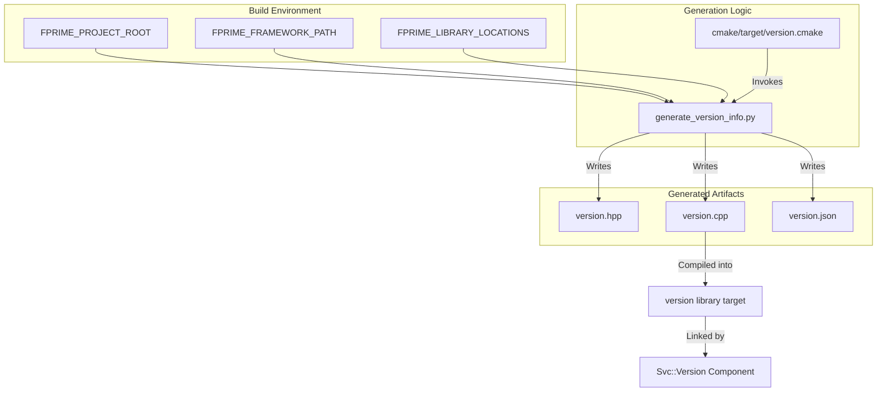
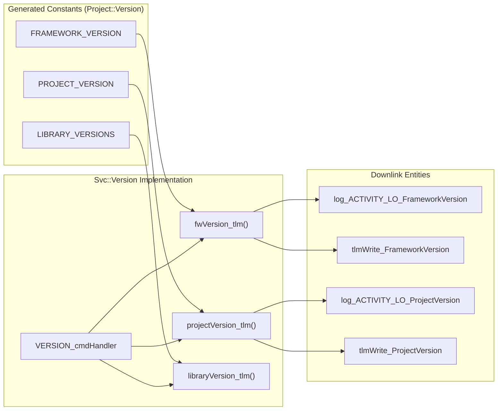

# Page: Version Generation and Svc::Version Component

# Version Generation and Svc::Version Component

Relevant source files

The following files were used as context for generating this wiki page:

- [.github/workflows/pip-check.yml](.github/workflows/pip-check.yml)
- [FppTestProject/FppTest/CMakeLists.txt](FppTestProject/FppTest/CMakeLists.txt)
- [FppTestProject/FppTest/sizeof/CMakeLists.txt](FppTestProject/FppTest/sizeof/CMakeLists.txt)
- [FppTestProject/FppTest/sizeof/main.cpp](FppTestProject/FppTest/sizeof/main.cpp)
- [FppTestProject/FppTest/sizeof/sizeof.fpp](FppTestProject/FppTest/sizeof/sizeof.fpp)
- [Ref/fprime-gds.yml](Ref/fprime-gds.yml)
- [Svc/SystemResources/CMakeLists.txt](Svc/SystemResources/CMakeLists.txt)
- [Svc/SystemResources/SystemResources.cpp](Svc/SystemResources/SystemResources.cpp)
- [Svc/SystemResources/SystemResources.fpp](Svc/SystemResources/SystemResources.fpp)
- [Svc/SystemResources/SystemResources.hpp](Svc/SystemResources/SystemResources.hpp)
- [Svc/SystemResources/test/ut/SystemResourcesTestMain.cpp](Svc/SystemResources/test/ut/SystemResourcesTestMain.cpp)
- [Svc/SystemResources/test/ut/SystemResourcesTester.cpp](Svc/SystemResources/test/ut/SystemResourcesTester.cpp)
- [Svc/SystemResources/test/ut/SystemResourcesTester.hpp](Svc/SystemResources/test/ut/SystemResourcesTester.hpp)
- [Svc/Version/Version.cpp](Svc/Version/Version.cpp)
- [Svc/Version/docs/sdd.md](Svc/Version/docs/sdd.md)
- [Svc/Version/test/ut/VersionTester.cpp](Svc/Version/test/ut/VersionTester.cpp)
- [cmake/target/version.cmake](cmake/target/version.cmake)
- [cmake/test/data/TestConfigDeployment/override/project/FpConfig.fpp](cmake/test/data/TestConfigDeployment/override/project/FpConfig.fpp)
- [default/config/ComCfg.fpp](default/config/ComCfg.fpp)
- [default/config/FpConfig.fpp](default/config/FpConfig.fpp)
- [default/config/FpConstants.fpp](default/config/FpConstants.fpp)
- [docs/user-manual/gds/gds-test-api-guide.md](docs/user-manual/gds/gds-test-api-guide.md)
- [requirements.txt](requirements.txt)

The versioning subsystem in F´ provides a standardized mechanism for capturing, generating, and exposing software version information. This system ensures that every build is uniquely identified by its project version, framework version, and library versions, which are then accessible to the flight software and ground systems.

## Build-Time Version Generation

Version information is collected and generated during the CMake configuration and build process. The system uses Python scripts to probe the environment (typically Git) and generate C++ source files that are compiled into the deployment.

### Generation Pipeline

The generation process is orchestrated by `cmake/target/version.cmake`.

1.  **Target Definition**: The `version_add_global_target` function defines the versioning target for a deployment [cmake/target/version.cmake:8-35]().
2.  **Information Gathering**: A Python script, `generate_version_info.py` (referenced as `FPRIME__INTERNAL_VERSION_INFO_SCRIPT`), is executed to gather version strings [cmake/target/version.cmake:6-7]().
3.  **Environment Context**: The script receives the `FPRIME_PROJECT_ROOT`, `FPRIME_FRAMEWORK_PATH`, and `FPRIME_LIBRARY_LOCATIONS` via environment variables to identify the different software layers being versioned [cmake/target/version.cmake:22-25]().
4.  **Artifact Creation**: The script produces three primary artifacts in the `${CMAKE_BINARY_DIR}/versions` directory [cmake/target/version.cmake:9-12]():
    *   `version.hpp`: C++ header containing `extern const char*` declarations for version strings.
    *   `version.cpp`: C++ implementation containing the actual version string literals.
    *   `version.json`: A machine-readable JSON representation of the version information.

### Version Generation Data Flow

The following diagram illustrates how build-time metadata is transformed into compiled C++ code.

**Version Generation Flow**

Sources: [cmake/target/version.cmake:6-35](), [Svc/Version/Version.cpp:10-10]()

## Svc::Version Component

The `Svc::Version` component is a service-level component responsible for exposing the generated version information to the rest of the system via ports, telemetry, and events.

### Implementation Details

The component includes the autogenerated `versions/version.hpp` header to access the `Project::Version` namespace constants [Svc/Version/Version.cpp:10-10]().

*   **Initialization**: During `config()`, the component can be enabled and immediately emits startup telemetry for the framework, project, and library versions [Svc/Version/Version.cpp:31-39]().
*   **Version Storage**: The component maintains a database `verId_db` of custom version entries, allowing other components to register their own version strings at runtime via the `setVersion` port [Svc/Version/Version.cpp:22-26](), [Svc/Version/Version.cpp:54-65]().
*   **Telemetry and Events**: Version information is downlinked using `Fw::TlmString` for telemetry channels and `Fw::LogStringArg` for events [Svc/Version/Version.cpp:115-120]().

### Command Handlers

The component provides two primary commands:
1.  **ENABLE**: Enables or disables version reporting [Svc/Version/Version.cpp:71-75]().
2.  **VERSION**: Triggers the manual emission of version information. Users can request `PROJECT`, `FRAMEWORK`, `LIBRARY`, `CUSTOM`, or `ALL` versions [Svc/Version/Version.cpp:78-110]().

### Version Component Logic Space

This diagram maps the natural language requirements of version reporting to the specific C++ functions and generated constants.

**Svc::Version Logic Mapping**

Sources: [Svc/Version/Version.cpp:78-110](), [Svc/Version/Version.cpp:115-131]()

## Custom Version Support

In addition to the build-time static versions, `Svc::Version` supports a dynamic "Custom Version" database. 

*   **Registration**: Components can call the `setVersion` input port to store a version string associated with a specific `VersionEnum` identifier [Svc/Version/Version.cpp:54-65]().
*   **Retrieval**: Components can query stored versions using the `getVersion` port [Svc/Version/Version.cpp:44-52]().
*   **Capacity**: The component supports up to 10 library version telemetry channels by default (`VER_SLOT_00` through `VER_SLOT_09`), though more can be captured via events [Svc/Version/Version.cpp:137-168]().

## Integration with Ground System

The generated `version.json` file is used by the F´ Ground Data System (GDS) and other tools to verify that the ground dictionary matches the binary running on the hardware. This prevents command/telemetry mismatches that could occur if a deployment is updated without updating the GDS.

Sources:
*   [cmake/target/version.cmake:1-42]()
*   [Svc/Version/Version.cpp:1-170]()
*   [Svc/Version/Version.hpp:1-10]() (referenced via Svc/Version/Version.cpp)
*   [default/config/FpConfig.fpp:1-97]() (context for types like `FwIndexType`)
