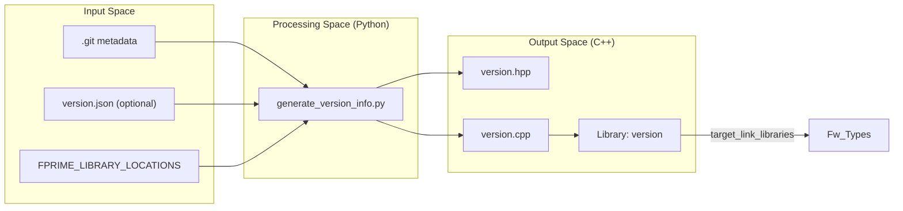

# Page: Versioning and Project Configuration

# Versioning and Project Configuration

<details>
<summary>Relevant source files</summary>

The following files were used as context for generating this wiki page:

- [.github/workflows/pip-check.yml](.github/workflows/pip-check.yml)
- [FppTestProject/FppTest/CMakeLists.txt](FppTestProject/FppTest/CMakeLists.txt)
- [FppTestProject/FppTest/sizeof/CMakeLists.txt](FppTestProject/FppTest/sizeof/CMakeLists.txt)
- [FppTestProject/FppTest/sizeof/main.cpp](FppTestProject/FppTest/sizeof/main.cpp)
- [FppTestProject/FppTest/sizeof/sizeof.fpp](FppTestProject/FppTest/sizeof/sizeof.fpp)
- [Ref/fprime-gds.yml](Ref/fprime-gds.yml)
- [Ref/settings.ini](Ref/settings.ini)
- [cmake/required.cmake](cmake/required.cmake)
- [cmake/settings/ini-to-stdio.py](cmake/settings/ini-to-stdio.py)
- [cmake/settings/ini.cmake](cmake/settings/ini.cmake)
- [cmake/sub-build/sub-build-config.cmake](cmake/sub-build/sub-build-config.cmake)
- [cmake/sub-build/sub-build.cmake](cmake/sub-build/sub-build.cmake)
- [cmake/target/sbom.cmake](cmake/target/sbom.cmake)
- [cmake/target/version.cmake](cmake/target/version.cmake)
- [cmake/test/data/TestConfigDeployment/override/project/FpConfig.fpp](cmake/test/data/TestConfigDeployment/override/project/FpConfig.fpp)
- [cmake/test/data/TestDeployment/settings.ini](cmake/test/data/TestDeployment/settings.ini)
- [cmake/test/src/test_symlink.py](cmake/test/src/test_symlink.py)
- [cmake/toolchain/helpers/arm-linux-base.cmake](cmake/toolchain/helpers/arm-linux-base.cmake)
- [default/config/ComCfg.fpp](default/config/ComCfg.fpp)
- [default/config/FpConfig.fpp](default/config/FpConfig.fpp)
- [default/config/FpConstants.fpp](default/config/FpConstants.fpp)
- [docs/user-manual/gds/gds-test-api-guide.md](docs/user-manual/gds/gds-test-api-guide.md)
- [requirements.txt](requirements.txt)

</details>


The versioning and configuration subsystem provides the mechanisms for managing project-level settings and injecting software version information into the F´ build. This is accomplished through a combination of `settings.ini` for build-time configuration and a dedicated CMake target for generating C++ version headers from project metadata.

## Project Configuration: settings.ini

The `settings.ini` file is the central configuration point for an F´ project. It is used by `fprime-util` and the CMake build system to resolve critical paths and environment settings.

### Resolution and Loading
The CMake system uses a Python helper script, `cmake/settings/ini-to-stdio.py`, to parse the INI file and output settings in a format CMake can ingest [cmake/settings/ini.cmake:11-12](). The function `ini_to_cache` in `cmake/settings/ini.cmake` then loads these values into the CMake cache [cmake/settings/ini.cmake:33-109]().

### Key Configuration Fields
| Setting | CMake Variable | Description |
|---|---|---|
| `framework_path` | `FPRIME_FRAMEWORK_PATH` | Path to the F´ framework repository [Ref/settings.ini:4](). |
| `project_root` | `FPRIME_PROJECT_ROOT` | The root directory of the current project [cmake/settings/ini.cmake:23](). |
| `library_locations` | `FPRIME_LIBRARY_LOCATIONS` | A list of external library paths to include in the build [cmake/settings/ini.cmake:22](). |
| `environment_file` | `FPRIME_ENVIRONMENT_FILE` | Path to a script to set up the build environment [cmake/settings/ini.cmake:24](). |
| `install_dest` | `FPRIME_INSTALL_DEST` | Where build artifacts are installed [cmake/settings/ini.cmake:25](). |

### Integrity Checks
To prevent configuration drift, the build system tracks whether a setting originated from the CLI or the INI file using `_INI_` and `_CLI_` suffixes [cmake/settings/ini.cmake:76-80](). If a critical setting (defined in `FPRIME_UTIL_CRITICAL_LIST`) changes in the INI file without a corresponding regeneration of the build cache via `fprime-util generate`, the system issues a warning or fatal error [cmake/settings/ini.cmake:15-26, 92-100]().

**Project Configuration Data Flow**
```mermaid
graph TD
    INI["settings.ini"] --> PY_LOAD["ini-to-stdio.py"]
    PY_LOAD -->|Stdout: SETTING=VALUE| CMAKE_INI["ini_to_cache (ini.cmake)"]
    CMAKE_INI -->|set(... CACHE)| CACHE["CMakeCache.txt"]
    
    subgraph "Integrity Check"
        CACHE --> CHECK{Compare _INI_ vs _CLI_}
        CHECK -->|Mismatch| ERR["Fatal Error: Please Regenerate"]
    end
```
Sources: [cmake/settings/ini.cmake:1-109](), [Ref/settings.ini:1-5]()

For details, see [Project Settings and fprime-util Configuration](#11.2).

---

## Versioning Subsystem

The versioning subsystem automatically generates C++ source code containing version strings, git hashes, and library information. This information is typically used by the `Svc::Version` component to provide telemetry regarding the software build.

### Implementation: version.cmake
The `version_add_global_target` function defines the generation logic [cmake/target/version.cmake:8-35](). It creates a custom command that executes `generate_version_info.py` to produce three files in the build directory:
1.  `version.hpp`: Header declaring version constants [cmake/target/version.cmake:10]().
2.  `version.cpp`: Implementation containing the actual version strings [cmake/target/version.cmake:11]().
3.  `version.json`: A machine-readable representation of the version metadata [cmake/target/version.cmake:12]().

### Data Flow and Generation
The generation script `generate_version_info.py` consumes environment variables passed by CMake, including `FPRIME_PROJECT_ROOT`, `FPRIME_FRAMEWORK_PATH`, and `FPRIME_LIBRARY_LOCATIONS` [cmake/target/version.cmake:22-25]().

**Versioning Code Entity Association**

Sources: [cmake/target/version.cmake:1-42]()

### Integration with Components
The generated `version` library is linked against `Fw_Types` [cmake/target/version.cmake:34](). In a standard deployment, the `Svc::Version` component includes `version.hpp` to expose these strings via telemetry channels or events.

For details, see [Version Generation and Svc::Version Component](#11.1).

---

## Tool Requirements and Environment

The build system enforces the presence of specific tools to ensure the configuration and versioning systems function correctly.

### Required Tools
The file `cmake/required.cmake` performs a pre-check of the environment [cmake/required.cmake:1-7](). It strictly requires:
*   **Python 3**: Used for `ini-to-stdio.py` and `generate_version_info.py` [cmake/required.cmake:12]().
*   **fprime-util**: The CLI entry point for project management [cmake/required.cmake:13]().
*   **fpp-tools**: The FPP autocoder suite (`fpp-depend`, `fpp-to-cpp`, `fpp-to-dict`, `fpp-locate-defs`) [cmake/required.cmake:34-37]().

If these tools are missing, the build system provides a fatal error message suggesting the use of `pip install -r requirements.txt` [cmake/required.cmake:17-31]().

### Python Dependencies
The `requirements.txt` file specifies the exact versions of Python packages required for the configuration and versioning tools, including `fprime-tools`, `fprime-fpp`, and `fprime-gds` [requirements.txt:22-24]().

Sources: [cmake/required.cmake:1-37](), [requirements.txt:1-67]()

---

## Sub-Build Mechanics

In complex configurations, CMake may need to run "sub-builds" to extract information (like FPP locations) before the main build generation completes.

### Implementation: sub-build.cmake
The function `run_sub_build` handles the execution of a nested CMake process [cmake/sub-build/sub-build.cmake:38-86](). It creates a separate build directory (e.g., `sub-build-<name>`) and re-runs CMake with a restricted set of targets passed via `FPRIME_SUB_BUILD_TARGETS` [cmake/sub-build/sub-build.cmake:44, 54]().

To ensure the sub-build matches the parent build's environment, `_get_call_properties` iterates through the CMake cache and passes relevant variables (like toolchain settings) to the sub-process, while filtering out internal or disallowed variables [cmake/sub-build/sub-build.cmake:94-117]().

Sources: [cmake/sub-build/sub-build.cmake:1-117]()
