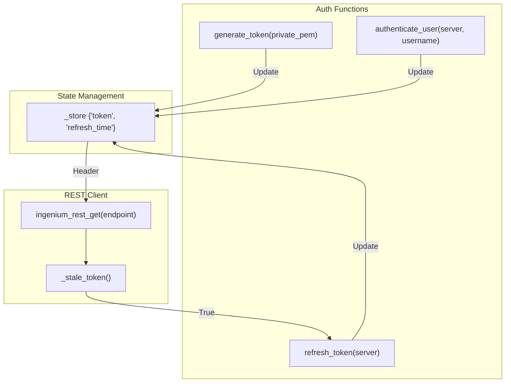
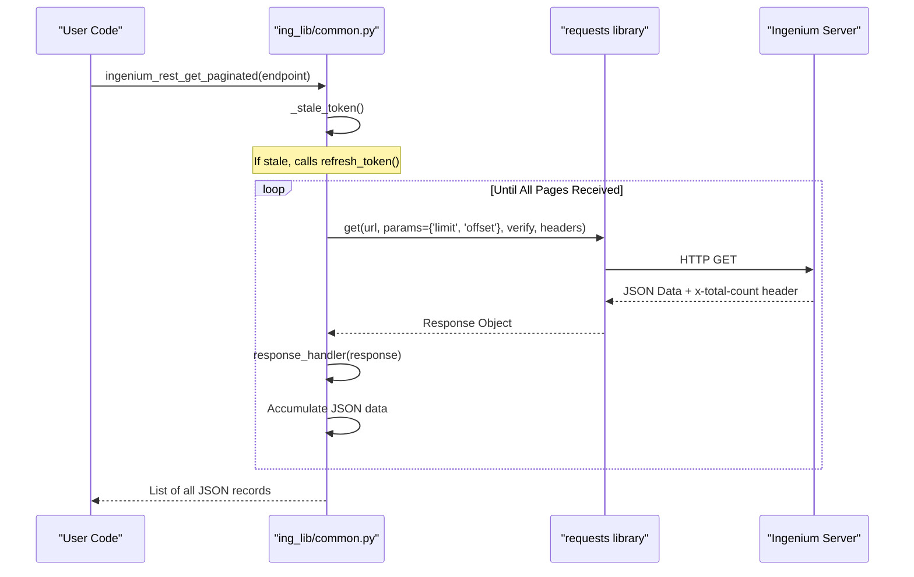

# Page: Authentication and REST Client (common.py)

# Authentication and REST Client (common.py)

Relevant source files

The following files were used as context for generating this wiki page:

- [ing_lib/common.py](ing_lib/common.py)
- [ing_lib/tests/test_common.py](ing_lib/tests/test_common.py)

The `ing_lib/common.py` module serves as the foundational communication layer for the Ingenium Library. It manages global state, implements robust authentication flows (JWT, LDAP, and RSA), and provides a standardized REST client for interacting with Ingenium server endpoints.

### Core State and Exception Handling

The module maintains internal state using a singleton-style dictionary named `_store` [ing_lib/common.py:28-30](). This structure tracks the active JWT token, the time the token was last refreshed, and SSL verification settings.

To ensure consistent error reporting across the library, the module defines the `IngeniumLibError` exception class [ing_lib/common.py:39-44](). This exception is raised when REST calls fail or authentication requirements are not met, providing a clear signal to calling applications that the library must abort its current operation [ing_lib/common.py:109-158]().

#### REST Response Handling
The `response_handler` function provides a centralized logic for interpreting HTTP status codes [ing_lib/common.py:47-79]().
*   **Success (200-299):** Returns `True` and logs the success at the DEBUG level [ing_lib/common.py:65-68]().
*   **Failure:** Returns `False` and logs the full request context (URL, Method, Status Code, and Response Text) at the ERROR level [ing_lib/common.py:70-72]().
*   **Bad Requests (400):** Specifically logs the problem details provided by the server [ing_lib/common.py:75-77]().

**Sources:** [ing_lib/common.py:28-79](), [ing_lib/tests/test_common.py:21-84]()

---

### Authentication and JWT Lifecycle

Ingenium uses JSON Web Tokens (JWT) for authorization. The library automates the acquisition and renewal of these tokens to prevent session expiration during long-running tasks like project backups.

#### Token Refresh Strategy
Tokens have a defined duration of 3600 seconds (1 hour) [ing_lib/common.py:34](), but the library attempts a refresh if the token is older than 3000 seconds [ing_lib/common.py:33](). The `_stale_token()` helper checks the current `_store['refresh_time']` against these constants [ing_lib/common.py:97-132]().

#### Authentication Flows
The library supports three primary methods for obtaining a token:

| Method | Function | Description |
| :--- | :--- | :--- |
| **RSA/PEM** | `generate_token` | Generates a JWT locally using a private PEM key and the `jwt` library. Used for service accounts/scripts [ing_lib/common.py:172-238](). |
| **LDAP** | `authenticate_user` | Authenticates via username/password against the Ingenium Auth Server's LDAP integration [ing_lib/common.py:340-370](). |
| **Refresh** | `refresh_token` | Uses an existing valid token to request a new one from the `/auth_server/api/v2/refresh_token` endpoint [ing_lib/common.py:21-330](). |

#### Code Entity Map: Authentication Flow
The following diagram illustrates how the code entities interact to manage the token lifecycle.

"Code Entity Space: Authentication Flow"

**Sources:** [ing_lib/common.py:28-35](), [ing_lib/common.py:172-238](), [ing_lib/common.py:340-370]()

---

### REST Client Implementation

The library provides two primary functions for data retrieval: `ingenium_rest_get` and `ingenium_rest_get_paginated`. Both functions automatically handle token headers and SSL verification.

#### Standard GET
`ingenium_rest_get(endpoint)` performs a simple GET request. It includes the `Authorization` header generated by `_auth_header()` and respects the `ssl_verify` setting [ing_lib/common.py:82-112]().

#### Paginated GET
For endpoints returning large datasets (e.g., thousands of telemetry channels), `ingenium_rest_get_paginated` manages the `limit` and `offset` logic [ing_lib/common.py:114-169]().

1.  **Initial Request:** Starts with `limit=1000` and `offset=0` [ing_lib/common.py:135-141]().
2.  **Header Inspection:** Reads the `x-total-count` header from the response to determine the total number of records [ing_lib/common.py:160]().
3.  **Accumulation:** Continues requesting pages and extending the `return_data` list until `total <= limit + offset` [ing_lib/common.py:162-167]().

#### System Interaction: REST Data Flow
This diagram maps the natural language "GET request" to the specific code functions and server interactions.

"Natural Language to Code: REST Request Flow"

**Sources:** [ing_lib/common.py:82-169](), [ing_lib/tests/test_common.py:86-167]()

---

### Endpoint Configuration

The module defines the standard paths for the Ingenium microservices architecture. These are appended to the server base URL during runtime.

| Constant | Path | Purpose |
| :--- | :--- | :--- |
| `auth_endpoint` | `/auth_server/api/v2/login` | LDAP Authentication [ing_lib/common.py:20]() |
| `refresh_endpoint` | `/auth_server/api/v2/refresh_token` | JWT Token Renewal [ing_lib/common.py:21]() |
| `venue_endpoint` | `/core_server/api/v5/venues` | Venue Management [ing_lib/common.py:22]() |
| `dictionary_endpoint` | `/dict_server/api/` | Command/Telemetry Dictionaries [ing_lib/common.py:26]() |

**Sources:** [ing_lib/common.py:18-26]()
