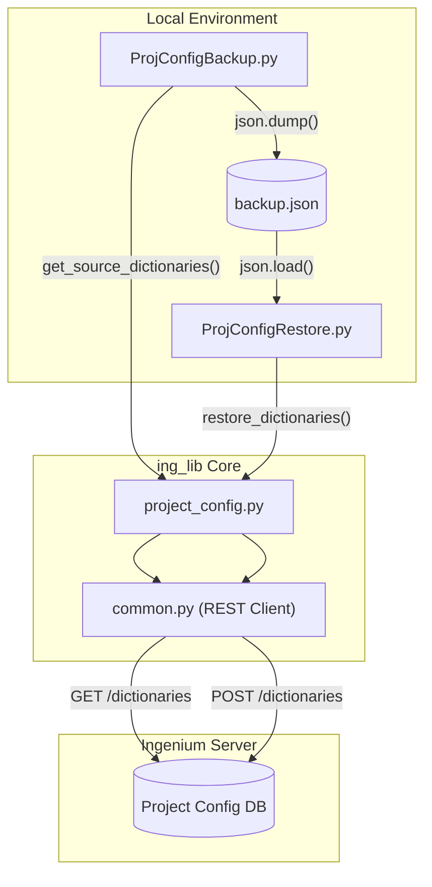
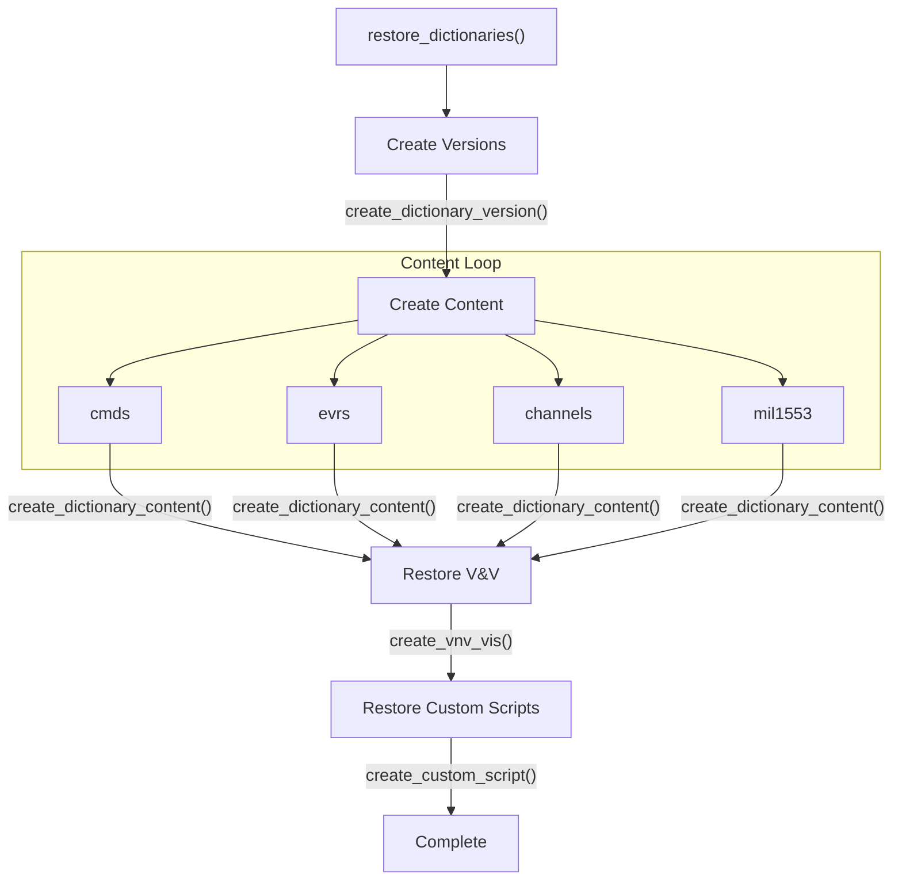

# Page: Backup and Restore (ProjConfigBackup.py / ProjConfigRestore.py)

# Backup and Restore (ProjConfigBackup.py / ProjConfigRestore.py)

Relevant source files

The following files were used as context for generating this wiki page:

- [ing_lib/apps/ProjConfigBackup.py](ing_lib/apps/ProjConfigBackup.py)
- [ing_lib/apps/ProjConfigRestore.py](ing_lib/apps/ProjConfigRestore.py)
- [ing_lib/tests/test_proj_config_backup.py](ing_lib/tests/test_proj_config_backup.py)
- [ing_lib/tests/test_proj_config_restore.py](ing_lib/tests/test_proj_config_restore.py)

The Backup and Restore tools provide a mechanism to export a complete Ingenium project configuration into a portable JSON format and subsequently restore that configuration to the same or a different Ingenium server. These tools facilitate environment synchronization, disaster recovery, and version control of project metadata.

## Overview

The backup and restore process covers four primary categories of data:
1.  **Dictionary Versions**: Metadata for Flight and SSE (System Simulation Environment) dictionaries [ing_lib/apps/ProjConfigBackup.py:113-115]().
2.  **Dictionary Content**: Commands, Telemetry Channels, EVRs, and MIL-1553 definitions [ing_lib/apps/ProjConfigBackup.py:143-144]().
3.  **V&V Verification Items (VIs)**: Verification and Validation requirements [ing_lib/apps/ProjConfigBackup.py:68-69]().
4.  **Custom Scripts**: Definitions and metadata for user-defined steps [ing_lib/apps/ProjConfigBackup.py:70-71]().

### Data Flow Architecture

The following diagram illustrates how the backup and restore scripts interact with the `project_config.py` API and the Ingenium Server.

**Project Configuration Synchronization Flow**

Sources: [ing_lib/apps/ProjConfigBackup.py:88-109](), [ing_lib/apps/ProjConfigRestore.py:71-86](), [ing_lib/apps/ProjConfigRestore.py:174-179]()

---

## ProjConfigBackup.py

The backup script extracts project data by iterating through dictionary versions and sub-dictionaries. It supports both v3 and v4 of the Ingenium Project Configuration API.

### Key Implementation Details
*   **v3 vs. v4 Strategy**: In v3, the script must first query a master list of dictionary elements using `get_dictionary` and then perform individual `get_dictionary_element` calls for every single item to retrieve full details [ing_lib/apps/ProjConfigBackup.py:150-168](). In v4, the API is optimized to return full content more efficiently.
*   **Token Refresh**: Because backing up large projects (especially in v3) can take several hours, the script relies on the `common.py` REST client to automatically refresh JWT tokens during the long-running GET operations [ing_lib/apps/ProjConfigBackup.py:92-93]().
*   **Filtering**: Users can limit the backup scope to avoid bloated files or long execution times.

### Command-Line Flags
| Flag | Description |
| :--- | :--- |
| `api_version` | Required. Either `v3` or `v4`. Influences the retrieval algorithm [ing_lib/apps/ProjConfigBackup.py:50-51](). |
| `--filter_retired` | If set, ignores dictionaries with the `RETIRED` state [ing_lib/apps/ProjConfigBackup.py:62-63](). |
| `--flight_sse` | Limits backup to only `flight` or `sse` dictionary types [ing_lib/apps/ProjConfigBackup.py:64-65](). |
| `--specific_versions` | A comma-separated list of versions to include [ing_lib/apps/ProjConfigBackup.py:66-67](). |
| `--include_vis` | Includes V&V Verification Items in the JSON output [ing_lib/apps/ProjConfigBackup.py:68-69](). |
| `--include_cs` | Includes Custom Script definitions in the JSON output [ing_lib/apps/ProjConfigBackup.py:70-71](). |

Sources: [ing_lib/apps/ProjConfigBackup.py:44-72](), [ing_lib/apps/ProjConfigBackup.py:136-138](), [ing_lib/apps/ProjConfigBackup.py:150-154]()

---

## ProjConfigRestore.py

The restore script reads a JSON file produced by the backup script and pushes the content to a target Ingenium server using `POST` and `PUT` requests.

### Restore Logic Entity Mapping
The `restore_dictionaries` function iterates through the JSON structure and calls specific `project_config.py` functions to recreate the environment.

**Entity Restoration Logic**

Sources: [ing_lib/apps/ProjConfigRestore.py:71-119](), [ing_lib/apps/ProjConfigRestore.py:14-15]()

### Execution Steps
1.  **Authentication**: Authenticates with the target server using LDAP or RSA [ing_lib/apps/ProjConfigRestore.py:165-166]().
2.  **File Loading**: Loads the entire JSON backup into memory [ing_lib/apps/ProjConfigRestore.py:174-175]().
3.  **Version Creation**: Re-registers dictionary versions (e.g., v1.0, v2.1) [ing_lib/apps/ProjConfigRestore.py:93]().
4.  **Content Upload**: Iterates through sub-dictionaries (`cmds`, `evrs`, `channels`, `mil1553`) and uploads the bulk content [ing_lib/apps/ProjConfigRestore.py:95-98]().
5.  **Metadata Restoration**: If present in the file, restores VIs and Custom Scripts [ing_lib/apps/ProjConfigRestore.py:103-116]().

Sources: [ing_lib/apps/ProjConfigRestore.py:125-179]()

---

## Data Structure

The backup JSON file uses a nested structure to organize versions and their respective content.

| Key | Description |
| :--- | :--- |
| `versions` | Contains metadata for `flight` and `sse` dictionary versions (description, state) [ing_lib/apps/ProjConfigBackup.py:113](). |
| `flight` / `sse` | Keyed by version string, containing lists of `cmds`, `channels`, `evrs`, and `mil1553` [ing_lib/apps/ProjConfigBackup.py:143-144](). |
| `vis` | List of Verification Item objects [ing_lib/apps/ProjConfigBackup.py:116](). |
| `custom_scripts` | List of Custom Script definition objects [ing_lib/apps/ProjConfigBackup.py:117](). |

Sources: [ing_lib/apps/ProjConfigBackup.py:111-117](), [ing_lib/apps/ProjConfigRestore.py:89-98]()

## Error Handling

Both scripts utilize a global `try-except` block in their `main()` functions to catch `common.IngeniumLibError`. 
*   **Backup**: If a specific dictionary element fails to download in v3, a warning is logged, and the script continues to the next element to ensure a partial backup is still possible [ing_lib/apps/ProjConfigBackup.py:155-157]().
*   **Restore**: Errors during the restoration of a specific version or script are logged as errors, but the script attempts to proceed with the remaining items in the backup file [ing_lib/apps/ProjConfigRestore.py:99-100](), [ing_lib/apps/ProjConfigRestore.py:107-108]().

Sources: [ing_lib/apps/ProjConfigBackup.py:152-157](), [ing_lib/apps/ProjConfigRestore.py:91-116](), [ing_lib/apps/ProjConfigRestore.py:182-187]()
