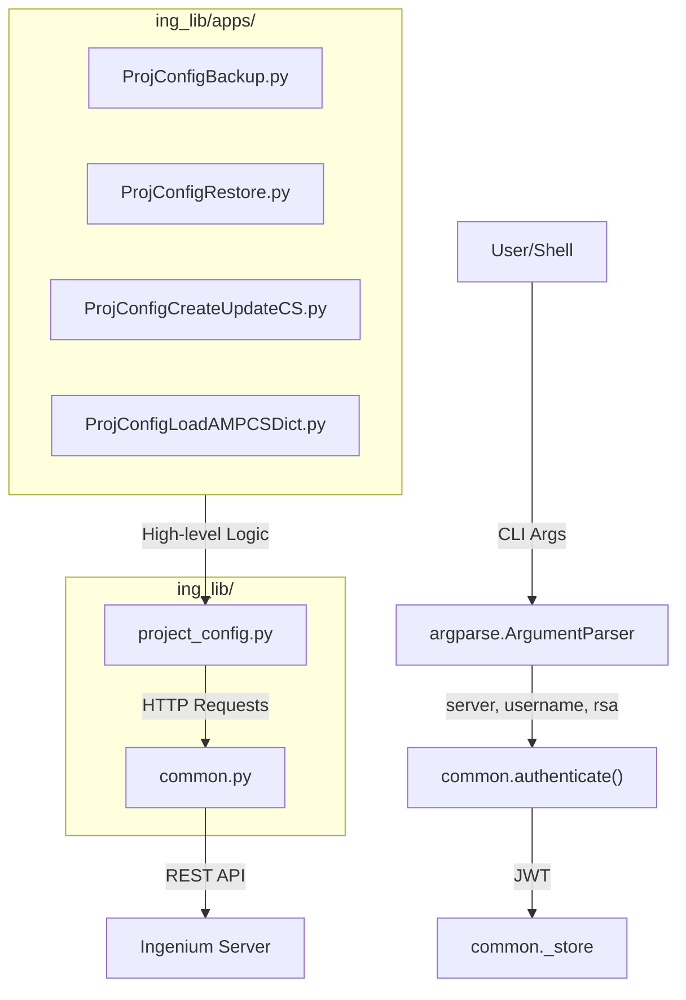
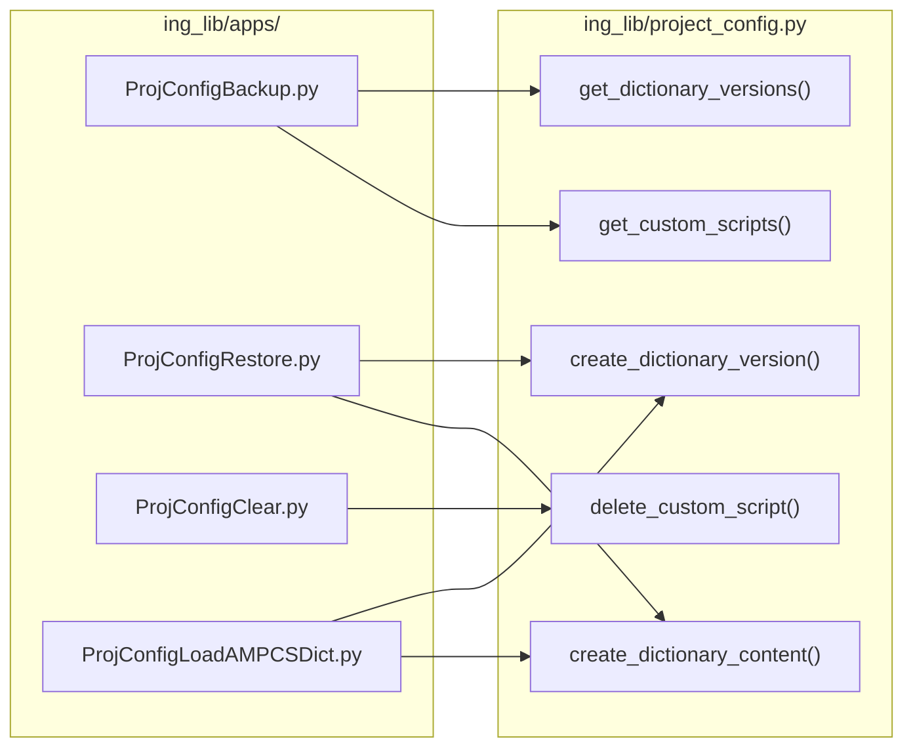

# Page: Command-Line Applications (ing_lib/apps)

# Command-Line Applications (ing_lib/apps)

Relevant source files

The following files were used as context for generating this wiki page:

- [ing_lib/apps/ProjConfigBackup.py](ing_lib/apps/ProjConfigBackup.py)
- [ing_lib/apps/ProjConfigClear.py](ing_lib/apps/ProjConfigClear.py)
- [ing_lib/apps/ProjConfigCreateUpdateCS.py](ing_lib/apps/ProjConfigCreateUpdateCS.py)
- [ing_lib/apps/ProjConfigLoadAMPCSDict.py](ing_lib/apps/ProjConfigLoadAMPCSDict.py)
- [ing_lib/apps/ProjConfigRestore.py](ing_lib/apps/ProjConfigRestore.py)

The `ing_lib/apps/` directory contains five standalone Python command-line interface (CLI) tools designed for managing Ingenium project configurations. These tools leverage the core `ing_lib` modules to perform high-level operations such as synchronizing dictionaries, managing custom script definitions, and performing full project backups.

## Common CLI Patterns

All tools in this package follow a consistent implementation pattern to ensure ease of use and reliability:

*   **Argparse Integration**: Each tool uses `argparse` to handle command-line arguments, providing a standard help interface (`--help`). [ing_lib/apps/ProjConfigCreateUpdateCS.py:82-113]().
*   **Authentication**: Tools utilize `common.authenticate` to manage JWT lifecycles, supporting both standard LDAP and RSA Two-Factor Authentication. [ing_lib/apps/ProjConfigBackup.py:165-166]().
*   **SSL Configuration**: Users can provide custom CA bundles via `--ssl_ca_bundle` or bypass verification with `--ignore_ssl_error`. [ing_lib/apps/ProjConfigRestore.py:142-145]().
*   **Logging**: Integrated with `ing_lib/logs.py`, the tools support a `--debug` flag to increase verbosity during complex synchronization tasks. [ing_lib/apps/ProjConfigClear.py:66-70]().

### Application Logic Flow
The following diagram illustrates how the CLI applications bridge user input to the Ingenium Server via the core library.

**CLI to Library Mapping**

Sources: [ing_lib/apps/ProjConfigBackup.py:126-166](), [ing_lib/apps/ProjConfigCreateUpdateCS.py:82-113](), [ing_lib/apps/ProjConfigRestore.py:165-179]()

---

## Tool Overview

### Backup and Restore
These tools allow for the portability of entire project configurations. `ProjConfigBackup.py` extracts dictionary versions, V&V Verification Items (VIs), and Custom Script definitions into a single JSON file. Conversely, `ProjConfigRestore.py` can recreate these entities on a new or cleared server.
*   **Key Features**: Supports filtering retired dictionaries and handles token refreshes during long-running backup operations.
*   **For details, see [Backup and Restore (ProjConfigBackup.py / ProjConfigRestore.py)](#3.1)**.

Sources: [ing_lib/apps/ProjConfigBackup.py:1-6](), [ing_lib/apps/ProjConfigRestore.py:1-6]()

### Custom Script Management
`ProjConfigCreateUpdateCS.py` is the primary tool for developers to register Python-based test steps. It automates the generation of `script_id` (Base64 path encoding) and SHA256 hashes of the local script file to ensure server-side integrity.
*   **Key Features**: Layout validation for the 12-column grid system and automated dependency checking.
*   **For details, see [Custom Script Management (ProjConfigCreateUpdateCS.py)](#3.2)**.

Sources: [ing_lib/apps/ProjConfigCreateUpdateCS.py:12-27](), [ing_lib/apps/ProjConfigCreateUpdateCS.py:158-185]()

### Dictionary Loading and Utilities
This suite includes tools for ingesting external telemetry and command definitions. `ProjConfigLoadAMPCSDict.py` parses AMPCS-formatted XML (commands, channels, EVRs, and 1553) and converts them to the Ingenium OpenAPI format.
*   **Key Features**: `ProjConfigClear.py` provides a "factory reset" capability for projects, while `ProjConfigV3toV4Convert.py` facilitates migrations between major API versions.
*   **For details, see [Dictionary Loading and Configuration Utilities](#3.3)**.

Sources: [ing_lib/apps/ProjConfigLoadAMPCSDict.py:1-10](), [ing_lib/apps/ProjConfigClear.py:1-6]()

---

## Application Interaction Map

The diagram below maps specific CLI scripts to the functions they invoke within the `project_config.py` module.

**Script to Function Mapping**

Sources: [ing_lib/apps/ProjConfigBackup.py:14](), [ing_lib/apps/ProjConfigRestore.py:14](), [ing_lib/apps/ProjConfigClear.py:14-15](), [ing_lib/apps/ProjConfigLoadAMPCSDict.py:32]()
