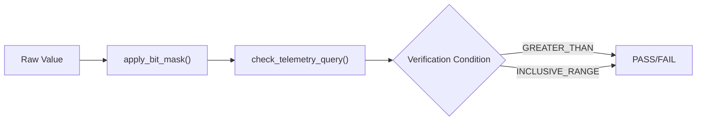

# Page: Core Library (ing_lib)

# Core Library (ing_lib)

<details>
<summary>Relevant source files</summary>

The following files were used as context for generating this wiki page:

- [ing_lib/common.py](ing_lib/common.py)
- [ing_lib/logs.py](ing_lib/logs.py)
- [ing_lib/project_config.py](ing_lib/project_config.py)
- [ing_lib/steps.py](ing_lib/steps.py)
- [ing_lib/venue.py](ing_lib/venue.py)

</details>


The `ing_lib` package is the foundational Python library for interacting with the Ingenium spacecraft test procedure platform. It provides a layered architecture that abstracts low-level REST API communication into high-level functional modules for authentication, project configuration management, telemetry verification, and venue orchestration.

### Architectural Layers

The library is structured into several functional domains:

1.  **Communication & Auth**: Handles JWT lifecycles, SSL, and paginated REST requests.
2.  **Configuration**: Manages the Ingenium "Dictionary" (Commands, Telemetry, EVRs) and Custom Script definitions.
3.  **Execution**: Provides logic for telemetry verification, bitmasking, and I/O for custom scripts.
4.  **Infrastructure**: Manages Venues (test environments) and provides standardized logging.

### Component Relationship

The following diagram illustrates how the core modules interact to facilitate communication between a Python script and the Ingenium Server.

**Module Interaction Map**
```mermaid
graph TD
    subgraph "ing_lib Package"
        [steps.py] --> [logs.py]
        [project_config.py] --> [common.py]
        [venue.py] --> [common.py]
        [common.py] --> [logs.py]
    end

    [Script/App] --> [steps.py]
    [Script/App] --> [project_config.py]
    [Script/App] --> [venue.py]

    [common.py] -- "REST API" --> [Ingenium Server]
```
Sources: [ing_lib/common.py:1-20](), [ing_lib/project_config.py:10-15](), [ing_lib/steps.py:18-19](), [ing_lib/venue.py:9-11]()

---

### Authentication and REST Client (`common.py`)
The `common.py` module is the central gateway for all network traffic. It maintains a singleton state in `_store` to manage JWT tokens and SSL verification settings [ing_lib/common.py:28-30](). It handles the complexities of Ingenium's authentication flows (LDAP and RSA) and automatically manages token refreshing via `_stale_token()` [ing_lib/common.py:97-98]().

Key features include:
*   **Paginated Requests**: `ingenium_rest_get_paginated` automatically handles the `x-total-count` header and offset logic [ing_lib/common.py:114-169]().
*   **Error Handling**: Defines `IngeniumLibError` for library-specific failures [ing_lib/common.py:39-44]().

For details, see [Authentication and REST Client (common.py)](#2.1).

---

### Project Configuration API (`project_config.py`)
This module provides wrappers for the Ingenium Dictionary Server. It allows developers to query and manipulate the environment's configuration, supporting both legacy `v3` and current `v4` API versions [ing_lib/project_config.py:20-41]().

Capabilities include:
*   **Dictionary Access**: Retrieval of commands (`cmds`), telemetry (`channels`), and events (`evrs`) [ing_lib/project_config.py:126-134]().
*   **Custom Scripts**: CRUD operations for script definitions used in test procedures [ing_lib/project_config.py:187-213]().
*   **V&V Management**: Interfacing with Verification Items (VIs) [ing_lib/project_config.py:216-233]().

For details, see [Project Configuration API (project_config.py)](#2.2).

---

### Step Execution Utilities (`steps.py`)
`steps.py` contains the business logic required for running test steps. It bridges the gap between raw telemetry data and pass/fail criteria.

**Telemetry Verification Flow**


Key utilities:
*   **Bit Manipulation**: `apply_bit_mask` supports `AND`/`OR` operations on Hex, Binary, and Decimal strings [ing_lib/steps.py:45-112]().
*   **Validation**: `check_telemetry_query` ensures that verification conditions (e.g., `EQUAL`, `WITHIN_RANGE`) match the provided value counts [ing_lib/steps.py:115-161]().

For details, see [Step Execution Utilities (steps.py)](#2.3).

---

### Venue Management and Logging
The library provides standardized ways to manage the test environment and record execution details.

*   **Venue Management (`venue.py`)**: Handles the creation and querying of `venues` and `venue_groups`, which represent the physical or simulated hardware targets for tests [ing_lib/venue.py:17-33](), [ing_lib/venue.py:228-250]().
*   **Standardized Logging (`logs.py`)**: Implements a `Rich`-based logging system. It supports environment-based level configuration via `ING_LOG_LEVEL` and provides both console and file handlers [ing_lib/logs.py:28-70]().

For details, see [Venue Management (venue.py) and Logging (logs.py)](#2.4).

Sources: [ing_lib/common.py:1-170](), [ing_lib/project_config.py:1-233](), [ing_lib/steps.py:1-185](), [ing_lib/venue.py:1-255](), [ing_lib/logs.py:1-107]()
