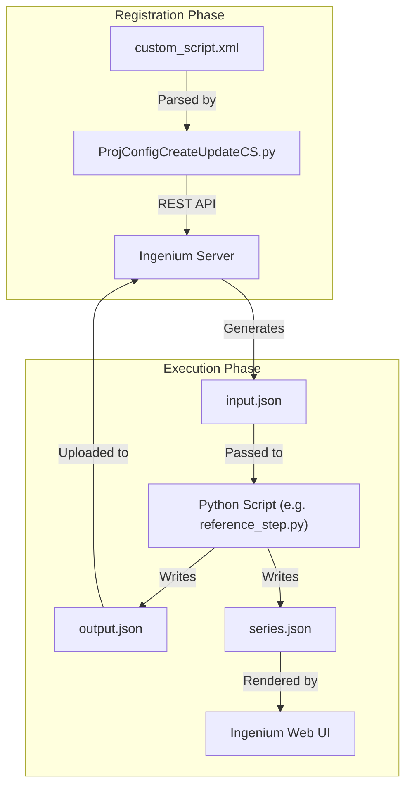
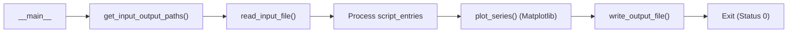

# Page: Custom Script Framework

# Custom Script Framework

Relevant source files

The following files were used as context for generating this wiki page:

- [reference/custom_script_schema.rnc](reference/custom_script_schema.rnc)
- [steps/reference_step/custom_script.xml](steps/reference_step/custom_script.xml)
- [steps/reference_step/reference_step.py](steps/reference_step/reference_step.py)

The Custom Script Framework (also referred to as the **Step System**) is the mechanism by which Ingenium executes arbitrary Python logic to perform spacecraft commanding, telemetry verification, and data analysis. It provides a structured bridge between the Ingenium web UI and the execution environment on a client agent.

### System Overview

A Custom Script is defined by three main components working in orchestration:
1.  **XML Definition**: A `custom_script.xml` file that defines the inputs (e.g., commands, channels), outputs (e.g., files, plots), and the UI layout [steps/reference_step/custom_script.xml:10-11]().
2.  **Python Script**: The actual execution logic (e.g., `reference_step.py`) that reads inputs, performs work, and writes results [steps/reference_step/reference_step.py:1-11]().
3.  **JSON Data Contract**: A set of standardized files (`input.json`, `output.json`, `series.json`) used to pass data between the Ingenium platform and the Python process [steps/reference_step/reference_step.py:196-203]().

### High-Level Workflow

The following diagram illustrates the lifecycle of a custom script from registration to execution:

**Custom Script Lifecycle**

**Sources:** [reference/custom_script_schema.rnc:8-9](), [steps/reference_step/reference_step.py:196-203]().

---

### 4.1 Custom Script XML Schema and Advanced Layout
The XML definition is the "blueprint" for the script. It uses a Relax-NG schema (`custom_script_schema.rnc`) to enforce structure [reference/custom_script_schema.rnc:1-3](). 

Key features include:
*   **Input Types**: Specialized types like `FLIGHT_COMMAND`, `SIM_TELEM`, and `VERIFICATION_COND` which trigger custom UI components like command builders or telemetry pickers [reference/custom_script_schema.rnc:25-31]().
*   **Script Entries**: Repeating sections that allow a single script to process multiple items (e.g., checking ten different telemetry channels) with individual pass/fail statuses [steps/reference_step/custom_script.xml:41-46]().
*   **Advanced Layout**: A 12-column grid system that allows developers to define exactly where inputs and outputs appear in the Ingenium UI using `section_header`, `content`, and `results` tags [steps/reference_step/custom_script.xml:135-150]().

For details, see [Custom Script XML Schema and Advanced Layout](#4.1).

**Sources:** [steps/reference_step/custom_script.xml:1-150](), [reference/custom_script_schema.rnc:18-38]().

---

### 4.2 Reference Step Implementation
The `reference_step.py` file serves as the gold-standard template for creating new scripts. It demonstrates the standard execution pattern required by the platform.

**Execution Logic Flow**

The reference implementation highlights:
*   **Status Lifecycle**: Moving from `PENDING` to `PASS`, `FAIL`, or `ERROR` [steps/reference_step/reference_step.py:210-220]().
*   **Telemetry Plotting**: Using `matplotlib` to generate PNG images for the `IMAGE` output type [steps/reference_step/reference_step.py:40-57]().
*   **Library Integration**: Heavy use of `ing_lib.steps` for I/O and verification logic [steps/reference_step/reference_step.py:27-28]().

For details, see [Reference Step Implementation (reference_step.py)](#4.2).

**Sources:** [steps/reference_step/reference_step.py:14-33](), [steps/reference_step/reference_step.py:192-205]().

---

### 4.3 Step I/O Data Formats
Data exchange is handled via strictly formatted JSON files. This ensures that any language (though Python is standard) can implement a Step as long as it adheres to the JSON contract.

| File | Purpose | Key Fields |
| :--- | :--- | :--- |
| `input.json` | Provided by Ingenium to the script. | `inputs`, `variables`, `entries` |
| `output.json` | Produced by the script for Ingenium. | `custom_script_status`, `output_summary`, `output_array` |
| `series.json` | Data for interactive UI graphs. | `timetype`, `series_type` (HORIZONTAL/VERTICAL), `data` |

The `series.json` format is particularly important for telemetry, supporting both continuous `HORIZONTAL` line plots and discrete `VERTICAL` event markers [steps/reference_step/reference_step.py:45-55]().

For details, see [Step I/O Data Formats (input.json, output.json, series.json)](#4.3).

**Sources:** [steps/reference_step/reference_step.py:45-55](), [steps/reference_step/reference_step.py:196-205](), [reference/custom_script_schema.rnc:33-38]().
