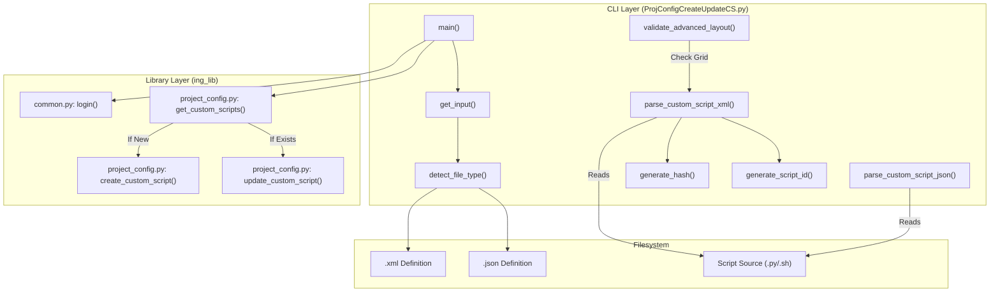
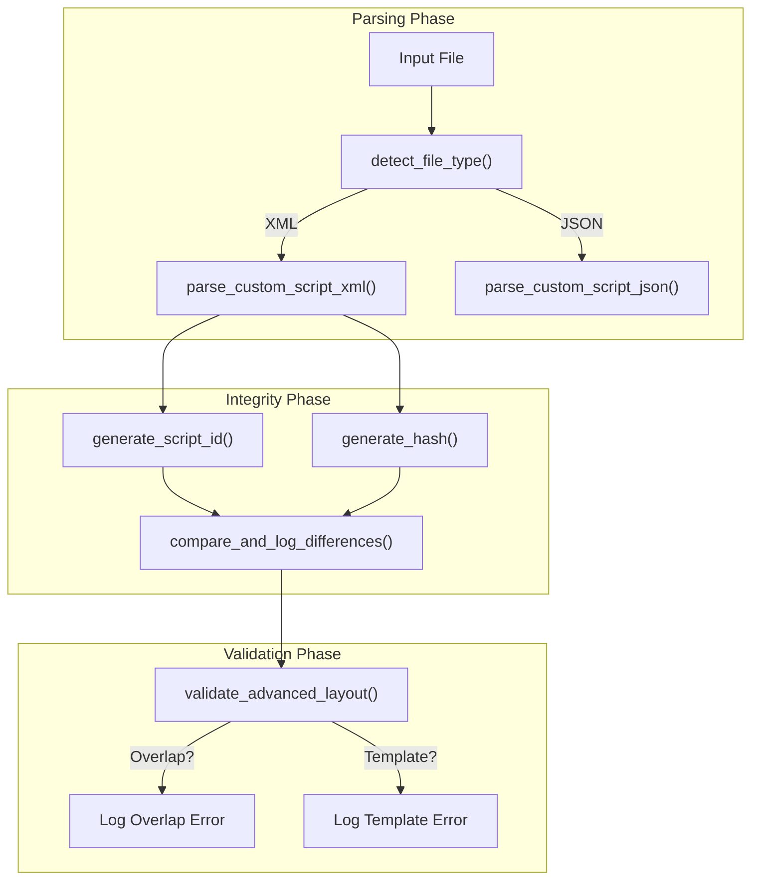

# Page: Custom Script Management (ProjConfigCreateUpdateCS.py)

# Custom Script Management (ProjConfigCreateUpdateCS.py)

Relevant source files

The following files were used as context for generating this wiki page:

- [ing_lib/apps/ProjConfigCreateUpdateCS.py](ing_lib/apps/ProjConfigCreateUpdateCS.py)
- [ing_lib/tests/test_advanced_layout_parsing.py](ing_lib/tests/test_advanced_layout_parsing.py)
- [ing_lib/tests/test_proj_config_create_update_cs.py](ing_lib/tests/test_proj_config_create_update_cs.py)
- [reference/custom_script_schema.rnc](reference/custom_script_schema.rnc)

The `ProjConfigCreateUpdateCS.py` application is a command-line utility used to register, update, and validate Custom Script definitions on an Ingenium server. It acts as the bridge between local script development (XML/JSON definitions and Python/Shell source code) and the Ingenium Project Configuration.

## Overview and Purpose
The primary purpose of this tool is to automate the synchronization of Custom Script metadata and source code integrity hashes with the Ingenium server [ing_lib/apps/ProjConfigCreateUpdateCS.py:1-43](). It ensures that the server's definition of a "Step" (inputs, outputs, and UI layout) matches the actual script file residing on the filesystem.

Key capabilities include:
*   **Multi-format Parsing**: Supports both XML (based on Relax-NG schema) and JSON (OpenAPI v4 compatible) input files [ing_lib/apps/ProjConfigCreateUpdateCS.py:6-10]().
*   **Integrity Enforcement**: Automatically computes SHA256 hashes of the script source code and generates Base64-encoded `script_id` values based on server-relative paths [ing_lib/apps/ProjConfigCreateUpdateCS.py:158-185]().
*   **Layout Validation**: Performs advanced checks on the 12-column grid layout, detecting overlaps and verifying template string syntax [ing_lib/apps/ProjConfigCreateUpdateCS.py:107-108]().
*   **Server Synchronization**: Queries the server to determine if a script should be created (POST) or updated (PUT) based on the `script_name` [ing_lib/apps/ProjConfigCreateUpdateCS.py:51]().

---

## Data Flow and Architecture

The application follows a linear processing flow: input gathering, local file parsing/hashing, optional layout validation, and finally server communication.

### System Entity Map
This diagram maps the CLI logic to the underlying library functions and external files.

**Diagram: ProjConfigCreateUpdateCS Entity Relationship**

**Sources:** [ing_lib/apps/ProjConfigCreateUpdateCS.py:67-121](), [ing_lib/apps/ProjConfigCreateUpdateCS.py:124-155](), [ing_lib/apps/ProjConfigCreateUpdateCS.py:175-185](), [ing_lib/project_config.py:51]()

---

## Script Identification and Integrity

The tool enforces a strict relationship between the script's location on the server and its content.

### Script ID Generation
The `script_id` is a unique identifier generated by Base64 encoding the relative path of the script source file [ing_lib/apps/ProjConfigCreateUpdateCS.py:158-172]().
1.  The user provides a `--base_path` (or `ING_CS_BASE_PATH` environment variable) [ing_lib/apps/ProjConfigCreateUpdateCS.py:101-102]().
2.  The tool resolves the absolute path of the script source relative to the input XML/JSON file [ing_lib/apps/ProjConfigCreateUpdateCS.py:18-26]().
3.  The path is relativized against the `base_path` and encoded [ing_lib/apps/ProjConfigCreateUpdateCS.py:158-172]().

### SHA256 Hashing
To ensure the Ingenium server executes the correct version of a script, the tool computes a SHA256 hash of the script source file [ing_lib/apps/ProjConfigCreateUpdateCS.py:175-185](). If a hash is provided in the XML/JSON input, the tool logs any discrepancies but **always** uses the freshly generated hash for the server update [ing_lib/apps/ProjConfigCreateUpdateCS.py:23-25]().

**Sources:** [ing_lib/apps/ProjConfigCreateUpdateCS.py:158-185](), [ing_lib/tests/test_proj_config_create_update_cs.py:91-118]()

---

## Advanced Layout Validation

When the `--validate_layout` flag is used, the tool performs a series of checks on the `advanced_layout` section of the script definition [ing_lib/apps/ProjConfigCreateUpdateCS.py:107-108]().

### Layout Validation Rules
The function `validate_advanced_layout` (referenced in tests) ensures the following:
1.  **Grid Overlap Detection**: Since Ingenium uses a 12-column grid, the tool checks that no two UI elements (input fields, headers, results) occupy the same coordinates.
2.  **Template String Checking**: Validates that any template strings (e.g., `{{variable_name}}`) used in display labels refer to valid input or output field names.
3.  **Table Column Limits**: For `output_array` definitions, it verifies that column widths do not exceed the 12-column total.

**Sources:** [ing_lib/apps/ProjConfigCreateUpdateCS.py:107-108](), [ing_lib/tests/test_advanced_layout_parsing.py:57-80](), [reference/custom_script_schema.rnc:79-81]()

---

## Implementation Details

### File Type Detection
The function `detect_file_type` determines the format of the input definition. It first checks the file extension (`.xml` or `.json`). If the extension is missing or ambiguous, it inspects the first character of the file (`<` for XML, `{` or `[` for JSON) [ing_lib/apps/ProjConfigCreateUpdateCS.py:124-155]().

### XML vs JSON Parsing Logic
*   **XML Parsing**: Uses `xml.etree.ElementTree`. It maps attributes like `script_name`, `is_command`, and `description` directly to the JSON payload required by the server [ing_lib/apps/ProjConfigCreateUpdateCS.py:56](), [reference/custom_script_schema.rnc:54-68]().
*   **JSON Parsing**: Directly loads the file using `json.load()`. It is expected to follow the Ingenium v4 OpenAPI schema for Custom Scripts [ing_lib/apps/ProjConfigCreateUpdateCS.py:55]().

### Comparison and Logging
The `compare_and_log_differences` function is used during the parsing phase to notify the user if the `hash` or `script_id` inside their definition file differs from what was calculated from the actual source file [ing_lib/tests/test_proj_config_create_update_cs.py:119-132]().

**Diagram: Parsing and Validation Logic**

**Sources:** [ing_lib/apps/ProjConfigCreateUpdateCS.py:124-155](), [ing_lib/tests/test_proj_config_create_update_cs.py:119-132](), [ing_lib/tests/test_advanced_layout_parsing.py:57-80]()

---

## Command Line Arguments

| Argument | Description |
| :--- | :--- |
| `server` | Full URL to the Ingenium Server. |
| `input_file` | Path to the XML or JSON script definition. |
| `--base_path` | Base directory for script files (overrides `ING_CS_BASE_PATH`). |
| `--verify_update` | Re-queries the server after upload to ensure the remote object matches the local one [ing_lib/apps/ProjConfigCreateUpdateCS.py:105-106](). |
| `--validate_layout` | Runs layout validation without performing an upload [ing_lib/apps/ProjConfigCreateUpdateCS.py:107-108](). |
| `--output_json_file` | Saves the final generated JSON object to a file for inspection [ing_lib/apps/ProjConfigCreateUpdateCS.py:103-104](). |

**Sources:** [ing_lib/apps/ProjConfigCreateUpdateCS.py:87-109]()
