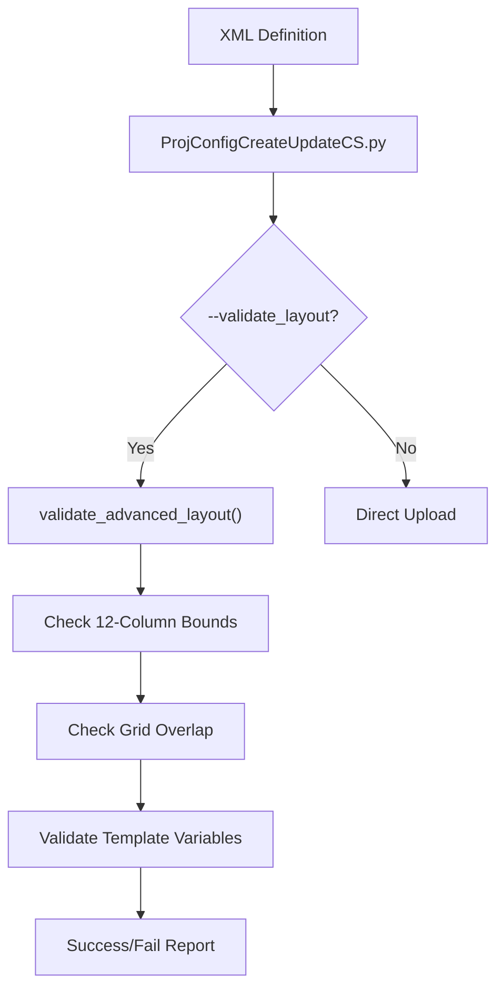

# Page: Custom Script XML Schema and Advanced Layout

# Custom Script XML Schema and Advanced Layout

<details>
<summary>Relevant source files</summary>

The following files were used as context for generating this wiki page:

- [ing_lib/apps/ProjConfigCreateUpdateCS.py](ing_lib/apps/ProjConfigCreateUpdateCS.py)
- [reference/custom_script_schema.rnc](reference/custom_script_schema.rnc)
- [steps/reference_step/custom_script.xml](steps/reference_step/custom_script.xml)

</details>


This page provides a technical deep dive into the definition format for Ingenium Custom Scripts. It covers the Relax-NG schema used for validation, the specialized input and output types that enable integration with spacecraft dictionaries, and the 12-column grid system used for advanced UI layouts.

## Overview of Custom Script Definitions

Custom scripts in Ingenium are defined using an XML format that specifies the script's metadata, its interface (inputs and outputs), and its visual representation in the Ingenium web interface. These definitions are validated against a Relax-NG Compact (`.rnc`) schema located at `reference/custom_script_schema.rnc`.

### Data Flow and Registration

The registration process transforms the human-readable XML into a JSON format compatible with the Ingenium v4 API.

| Step | Action | Entity |
| :--- | :--- | :--- |
| **1** | Author defines script interface in XML | `custom_script.xml` |
| **2** | `ProjConfigCreateUpdateCS.py` parses XML | `ElementTree` |
| **3** | Script ID generated via Base64 encoding of path | `generate_script_id()` |
| **4** | SHA256 hash generated from `.py` file content | `generate_hash()` |
| **5** | Layout validation (if `--validate_layout` is set) | `validate_advanced_layout()` |
| **6** | JSON payload POSTed to Ingenium Server | `create_custom_script()` |

**Sources:** [ing_lib/apps/ProjConfigCreateUpdateCS.py:1-43](), [ing_lib/apps/ProjConfigCreateUpdateCS.py:158-185](), [reference/custom_script_schema.rnc:1-11]()

---

## XML Schema Definition

The root element `<custom-scripts>` contains a `<header>` and one or more `<custom_script>` definitions.

### The `custom_script` Element
The core element defines the script's identity and behavior.

| Attribute | Description |
| :--- | :--- |
| `script_name` | Unique, POSIX-compliant name. |
| `is_command` | Boolean. If "true", the script is flagged as commanding the vehicle/sim. |
| `script_path` | Relative path to the Python implementation file. |
| `hash` | SHA256 hash of the script file (auto-populated by tooling). |
| `script_id` | Base64 encoded path (auto-populated by tooling). |

**Sources:** [reference/custom_script_schema.rnc:54-81](), [steps/reference_step/custom_script.xml:10-11]()

### Input Field Types (`input_field`)
Ingenim provides specialized UI components for different input types, particularly those interacting with spacecraft dictionaries.

| Type | UI Behavior / Data Format |
| :--- | :--- |
| `FLIGHT_COMMAND` | Autocomplete and Command Builder for flight software commands. |
| `SIM_COMMAND` | Autocomplete for simulation-specific commands. |
| `FLIGHT_TELEM` | Lookup for flight telemetry channel IDs and names. |
| `SIM_TELEM` | Lookup for simulation telemetry channels. |
| `VERIFICATION_COND` | Captures an operator (e.g., `GREATER_THAN`) and 0-2 values. |
| `TIME` | List of procedure-relative times; passed as DOY strings. |
| `ENUM` | Restricted to a list of `<enumeration>` values defined in the XML. |

**Sources:** [reference/custom_script_schema.rnc:18-31](), [steps/reference_step/custom_script.xml:24-31](), [steps/reference_step/custom_script.xml:48-54](), [steps/reference_step/custom_script.xml:77-79]()

### Output Field Types (`output_field`)
Outputs define how data returned by the script is rendered in the results section.

| Type | Rendering Behavior |
| :--- | :--- |
| `FILE` | Provides a download link to an uploaded file. |
| `IMAGE` | Renders the image directly within the step results. |
| `SERIES` | Generates an interactive matplotlib-style graph. |
| `INT/FLOAT/STRING` | Standard text rendering. |

**Sources:** [reference/custom_script_schema.rnc:33-38](), [steps/reference_step/custom_script.xml:138-142]()

---

## Repeating Sections: `script_entry`

A `script_entry` represents a repeating structure within a single step. This is used when the same logic must be applied to multiple items (e.g., checking five different temperature sensors).

*   **Repeating Status:** Each entry has its own independent `pass/fail` status.
*   **Structure:** Entries can contain their own `input_field`, `output_field`, and `output_array`.
*   **Requirement:** If a `script_entry` is defined, at least one must be populated in the procedure.

**Sources:** [reference/custom_script_schema.rnc:158-163](), [steps/reference_step/custom_script.xml:41-46]()

---

## Advanced Layout System

The `advanced_layout` system allows authors to override the default linear list of inputs and outputs with a custom 12-column grid.

### Grid System Logic
The layout is divided into three logical vertical sections:
1.  **Section Header:** Top-level information.
2.  **Content:** Main body (usually inputs).
3.  **Results:** Bottom section (usually outputs).

Each `layout_item` specifies its position using `row`, `column` (1-12), and `width` (1-12).

### UI Components and Templates
*   **Templates:** Strings can include placeholders like `{{variable_name}}` to dynamically inject values into labels or headers.
*   **Mouseover:** The `mouseover` attribute provides tooltips for UI elements.
*   **Entry Table:** The `entry_table` element allows rendering repeating `script_entry` data in a tabular format rather than a list.

### Layout Validation Workflow



**Sources:** [reference/custom_script_schema.rnc:180-220](), [ing_lib/apps/ProjConfigCreateUpdateCS.py:107-108](), [steps/reference_step/custom_script.xml:161-190]()

---

## Mapping XML to Code Entities

The following diagram bridges the XML schema definitions to the internal processing logic within the `ing_lib` applications.

```mermaid
classDiagram
    class CustomScriptXML {
        +input_field
        +output_field
        +script_entry
        +advanced_layout
    }
    class ProjConfigCreateUpdateCS {
        +detect_file_type()
        +generate_hash()
        +generate_script_id()
        +validate_advanced_layout()
    }
    class ProjectConfigAPI {
        +create_custom_script()
        +update_custom_script()
        +get_custom_scripts()
    }

    CustomScriptXML --> ProjConfigCreateUpdateCS : "Parsed by ElementTree"
    ProjConfigCreateUpdateCS --> ProjectConfigAPI : "POST/PUT JSON"
    ProjectConfigAPI --> "Ingenium Server" : "REST Request"
```

**Sources:** [ing_lib/apps/ProjConfigCreateUpdateCS.py:51-61](), [ing_lib/apps/ProjConfigCreateUpdateCS.py:124-185](), [reference/custom_script_schema.rnc:41-81]()
