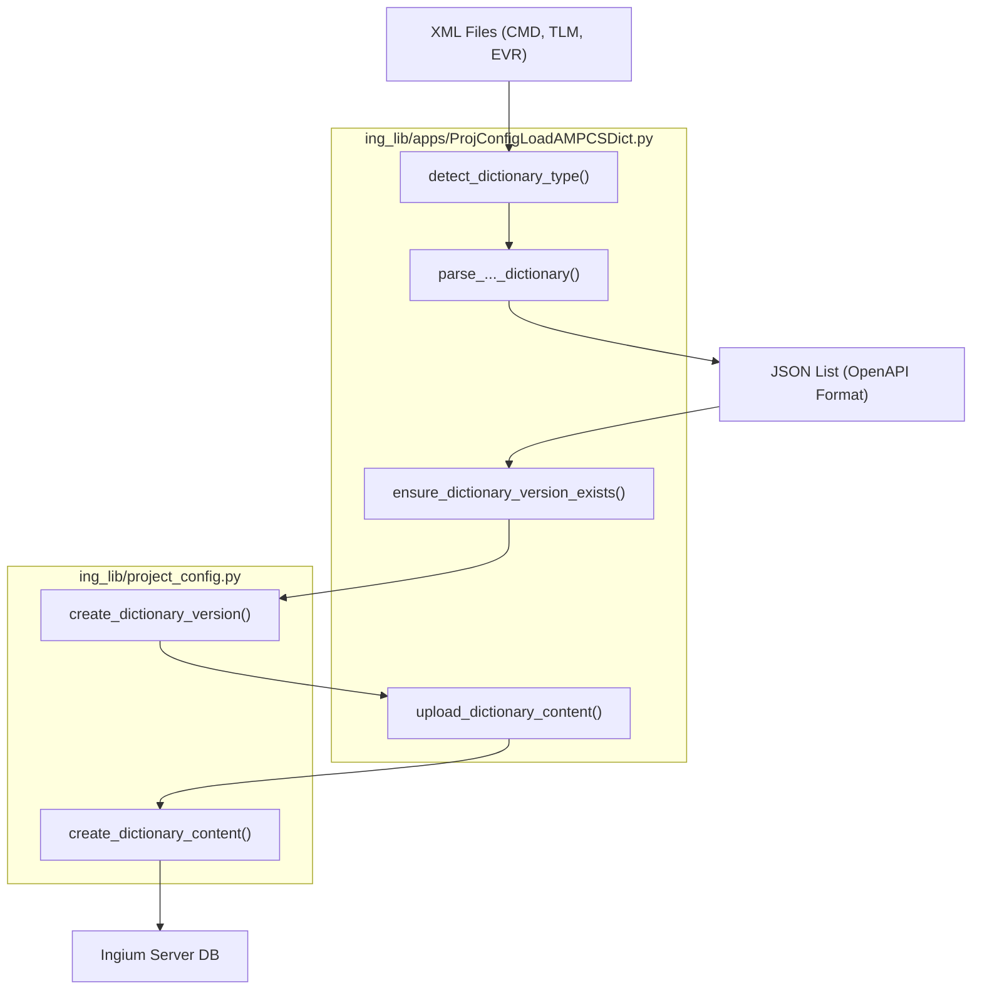
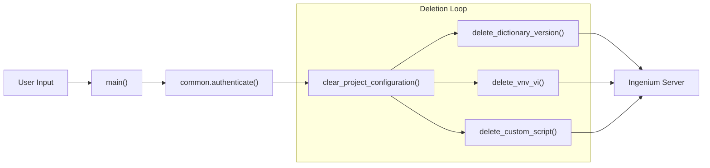

# Page: Dictionary Loading and Configuration Utilities

# Dictionary Loading and Configuration Utilities

<details>
<summary>Relevant source files</summary>

The following files were used as context for generating this wiki page:

- [ing_lib/apps/ProjConfigClear.py](ing_lib/apps/ProjConfigClear.py)
- [ing_lib/apps/ProjConfigLoadAMPCSDict.py](ing_lib/apps/ProjConfigLoadAMPCSDict.py)
- [ing_lib/tests/test_proj_config_clear.py](ing_lib/tests/test_proj_config_clear.py)
- [ing_lib/tests/test_proj_config_load_ampcs_dict.py](ing_lib/tests/test_proj_config_load_ampcs_dict.py)
- [ing_lib/utils/ProjConfigV3toV4Convert.py](ing_lib/utils/ProjConfigV3toV4Convert.py)

</details>


This page describes the command-line utilities provided by `ingenium-lib` for managing project configurations on an Ingenium server. These tools facilitate the ingestion of AMPCS-formatted XML dictionaries, the conversion of legacy configuration data, and the clearing of existing project states.

## Overview of Utilities

The library provides three primary scripts for these tasks:
1.  **`ProjConfigLoadAMPCSDict.py`**: Automates the parsing and uploading of Command, Channel (Telemetry), EVR, and MIL-STD-1553 dictionaries.
2.  **`ProjConfigClear.py`**: Provides a safe, authenticated method to delete specific or all configuration components from a project.
3.  **`ProjConfigV3toV4Convert.py`**: A migration utility to transform legacy Ingenium v3 JSON exports into the schema required by the v4 API.

---

## Dictionary Loading (ProjConfigLoadAMPCSDict.py)

`ProjConfigLoadAMPCSDict.py` is used to populate an Ingenium project with spacecraft definitions. It supports the AMPCS XML format and automatically detects the dictionary type by inspecting the root element of the provided XML files [ing_lib/apps/ProjConfigLoadAMPCSDict.py:48-60]().

### Supported Dictionary Types
The script maps AMPCS XML structures to Ingenium OpenAPI-compliant JSON objects:

| Dictionary Type | XML Root Element | Key Parsing Logic |
| :--- | :--- | :--- |
| **Commands** | `command_dictionary` | Extracts `fsw_command` stems, descriptions, and maps argument types (e.g., `int_argument` to `INT`) [ing_lib/apps/ProjConfigLoadAMPCSDict.py:105-152](). |
| **Channels** | `telemetry_dictionary` | Extracts name, abbreviation, type, and bit size (calculated from `byte_length`) [ing_lib/apps/ProjConfigLoadAMPCSDict.py:228-258](). |
| **EVRs** | `evr_dictionary` | Processes event message text, IDs, and severity levels [ing_lib/apps/ProjConfigLoadAMPCSDict.py:304-330](). |
| **MIL-1553** | `mil1553_dictionary` | Parses bus signals, message names, and Transmit/Receive (T/R) status [ing_lib/apps/ProjConfigLoadAMPCSDict.py:349-385](). |

### Data Flow: XML to Server
The following diagram illustrates the transformation and upload process within `ProjConfigLoadAMPCSDict.py`.

**Dictionary Ingestion Process**

Sources: [ing_lib/apps/ProjConfigLoadAMPCSDict.py:48-80](), [ing_lib/apps/ProjConfigLoadAMPCSDict.py:434-458](), [ing_lib/apps/ProjConfigLoadAMPCSDict.py:461-487](), [ing_lib/project_config.py:32-32]()

---

## Configuration Clearing (ProjConfigClear.py)

`ProjConfigClear.py` allows administrators to reset a project configuration. It supports selective deletion of four categories: `flight` dictionaries, `sse` (Simulation Support Equipment) dictionaries, `vis` (Verification Items), and `custom-scripts` [ing_lib/apps/ProjConfigClear.py:47-50]().

### Implementation Details
*   **Authentication**: Requires LDAP or RSA authentication via `common.authenticate` [ing_lib/apps/ProjConfigClear.py:160-161]().
*   **Safety Mechanism**: Prompts the user for a "yes" confirmation before executing any deletions [ing_lib/apps/ProjConfigClear.py:171-180]().
*   **Batching**: When deleting Verification Items (VIs), the script logs progress every 1000 items to handle large configurations [ing_lib/apps/ProjConfigClear.py:103-109]().

**Clear Configuration Logic**

Sources: [ing_lib/apps/ProjConfigClear.py:73-117](), [ing_lib/apps/ProjConfigClear.py:122-186](), [ing_lib/project_config.py:14-15]()

---

## Migration Utilities (ProjConfigV3toV4Convert.py)

This utility script transforms JSON data exported from Ingenium v3 into the v4 schema. This is necessary because v4 introduced stricter validation and structural changes for Verification Items (VIs) and Dictionaries.

### Key Transformations
1.  **Script Name Normalization**: Strips `.py` extensions and validates names against the regex `^[a-zA-Z0-9_-]{1,64}$` [ing_lib/utils/ProjConfigV3toV4Convert.py:25-26](), [ing_lib/utils/ProjConfigV3toV4Convert.py:89-93]().
2.  **Type Mapping**: Converts lowercase or legacy argument types to uppercase standard types (e.g., `unsigned` → `UINT`, `var_string` → `STRING`) [ing_lib/utils/ProjConfigV3toV4Convert.py:29-41]().
3.  **MIL-1553 Normalization**: Converts `T` to `TRANSMIT` and `R` to `RECEIVE` [ing_lib/utils/ProjConfigV3toV4Convert.py:15-15]().
4.  **VI State Correction**: Updates status strings like "NOT PUBLISHED" to "NOT_PUBLISHED" to match v4 Enum requirements [ing_lib/utils/ProjConfigV3toV4Convert.py:10-10]().

### Code Mapping: Type Conversion
The `convert_argument_type` function handles the transition of spacecraft command parameters:

```python
# [ing_lib/utils/ProjConfigV3toV4Convert.py:138-180]
def convert_argument_type(v3_type: str, argument: Dict[str, Any] = None) -> str:
    # Logic to handle "unknown" types by checking for enumerations
    if v3_type_lower == "unknown":
        return "ENUM" if has_enums else "UINT"
    # Mapping via ARGUMENT_TYPE_MAPPING dictionary
    return ARGUMENT_TYPE_MAPPING.get(v3_type_lower, v3_type)
```
Sources: [ing_lib/utils/ProjConfigV3toV4Convert.py:29-41](), [ing_lib/utils/ProjConfigV3toV4Convert.py:138-180]()

---

## Usage Summary

| Tool | Primary Command | Key Arguments |
| :--- | :--- | :--- |
| **Load Dict** | `python ProjConfigLoadAMPCSDict.py <server> <version> <flight/sse> <files...>` | `--rsa`, `--debug` |
| **Clear Config** | `python ProjConfigClear.py <server>` | `--types flight sse vis custom-scripts` |
| **Migrate V3** | `python ProjConfigV3toV4Convert.py <input_v3.json> <output_v4.json>` | N/A |

Sources: [ing_lib/apps/ProjConfigLoadAMPCSDict.py:12-21](), [ing_lib/apps/ProjConfigClear.py:41-59](), [ing_lib/utils/ProjConfigV3toV4Convert.py:5-16]()
