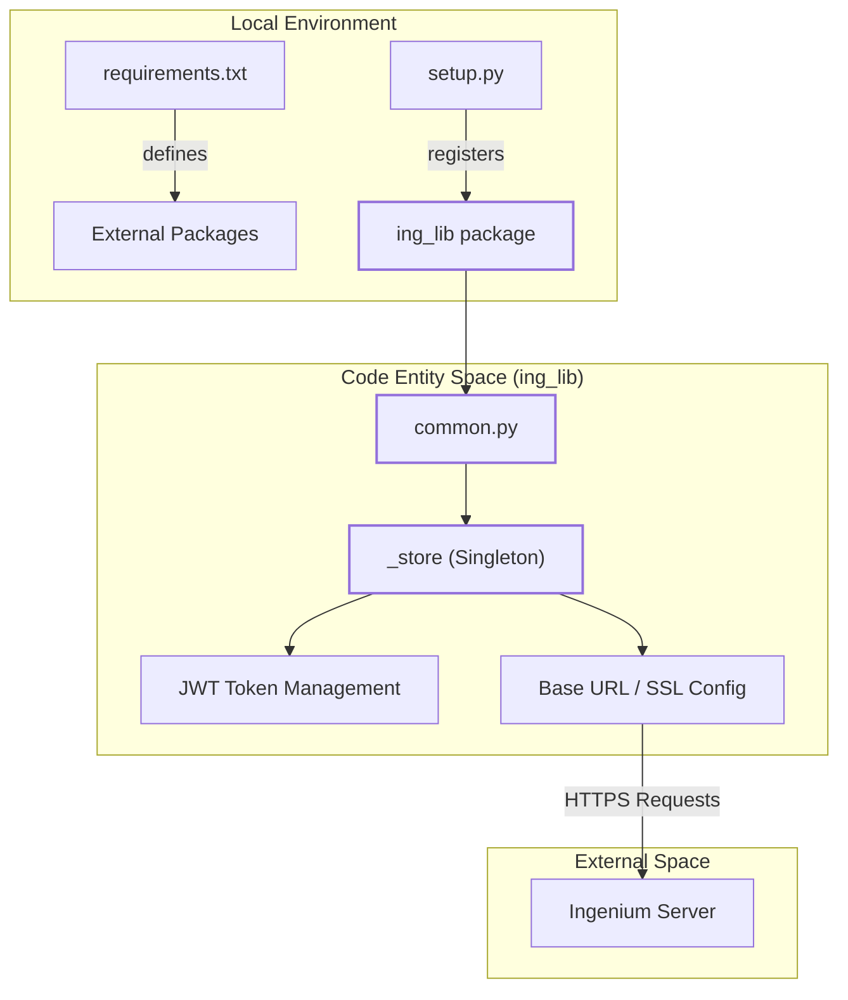
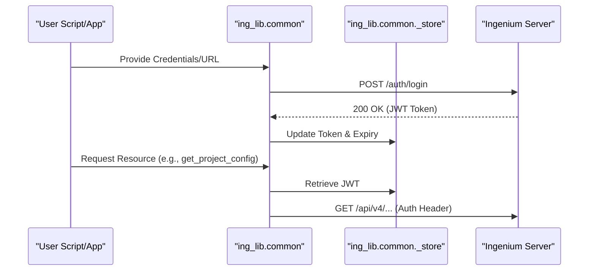

# Page: Getting Started: Installation and Configuration

# Getting Started: Installation and Configuration

<details>
<summary>Relevant source files</summary>

The following files were used as context for generating this wiki page:

- [LICENSE](LICENSE)
- [README.md](README.md)
- [ing_lib/__init__.py](ing_lib/__init__.py)
- [requirements.txt](requirements.txt)
- [setup.py](setup.py)

</details>


This page provides a technical guide for setting up the `ing-lib` Python package. It covers environment requirements, dependency management, and the installation process required to interact with an Ingenium spacecraft test procedure platform.

## Environment Requirements

The `ing-lib` library is designed for modern Python environments. While `setup.py` specifies a minimum version of Python 3.9, the project documentation recommends Python 3.13 or higher for optimal compatibility and performance.

| Requirement | Specification |
| :--- | :--- |
| **Python Version** | `3.13+` (Recommended), `>=3.09` (Minimum) |
| **Operating System** | Platform independent (Linux, macOS, Windows) |
| **Package Manager** | `pip` |

**Sources:**
- [README.md:4-4]()
- [README.md:38-38]()
- [setup.py:17-17]()

## Installation Process

The package is installed using standard Python build tools. The repository includes a `setup.py` script and a `requirements.txt` file to manage the environment.

### 1. Clone the Repository
First, obtain the source code from the repository:
```bash
git clone https://github.com/JPL-Devin/ingenium-lib.git
cd ingenium-lib
```

### 2. Install via Pip
Install the package in "editable" mode or as a standard site-package from the root directory:
```bash
pip install .
```
This command triggers `setup.py` to resolve dependencies and register the `ing_lib` package in the current Python environment.

### 3. Verification
You can verify the installation by checking the package version:
```python
import ing_lib
print(ing_lib.get_version())
```

**Sources:**
- [README.md:32-36]()
- [setup.py:11-23]()
- [ing_lib/__init__.py:7-18]()

## Dependency Management

The library relies on several key external packages to handle networking, data validation, and terminal output.

### Core Dependencies
These are automatically installed via `setup.py` during the `pip install` process:
*   **`rich` (>=14.0.0)**: Used by `ing_lib/logs.py` for advanced console logging and formatting.
*   **`requests` (2.32.4)**: The underlying engine for the REST client in `ing_lib/common.py`.
*   **`deepdiff` (7.0.1)**: Utilized for comparing project configurations during backup/restore operations.
*   **`packaging` (25.0)**: Used for version compatibility checks.

### Development Dependencies
For contributors running the test suite, additional packages are required:
*   **`pytest` (8.4.1)**: The framework used for all unit and integration tests in `ing_lib/tests/`.

**Sources:**
- [setup.py:5-9]()
- [requirements.txt:1-6]()
- [README.md:16-17]()

## Configuration and Authentication

Once installed, the library requires configuration to communicate with an Ingenium server. The library uses a centralized state management system located in `ing_lib/common.py`.

### Data Flow: Installation to Execution
The following diagram illustrates how the installation components relate to the code entities that manage the connection to the Ingenium server.

**System Entity Mapping: Installation to Code**

**Sources:**
- [setup.py:11-14]()
- [README.md:12-16]()
- [requirements.txt:1-6]()

### Authentication Setup
The library communicates with the Ingenium server via a REST API. To authenticate, users typically interact with `common.py` which manages:
1.  **LDAP/RSA Credentials**: Used to initiate a session.
2.  **JWT Lifecycle**: Storing and refreshing JSON Web Tokens for subsequent requests.
3.  **SSL Configuration**: Handling certificate verification for secure JPL environments.

**Component Interaction: Authentication Flow**

**Sources:**
- [README.md:16-16]()
- [ing_lib/common.py:1-20]() *(Referenced via logical structure described in TOC)*

## Package Structure Overview

The installation populates the `ing_lib` namespace with several functional modules.

| Module | Purpose |
| :--- | :--- |
| `ing_lib.common` | Shared utilities, REST client, and authentication state. |
| `ing_lib.project_config` | API for managing command/telemetry dictionaries and scripts. |
| `ing_lib.venue` | Management of Ingenium venues and venue groups. |
| `ing_lib.logs` | Standardized logging using the `rich` library. |
| `ing_lib.apps` | CLI tools for project configuration (Backup, Restore, Clear). |

**Sources:**
- [README.md:12-26]()
- [ing_lib/__init__.py:1-11]()
