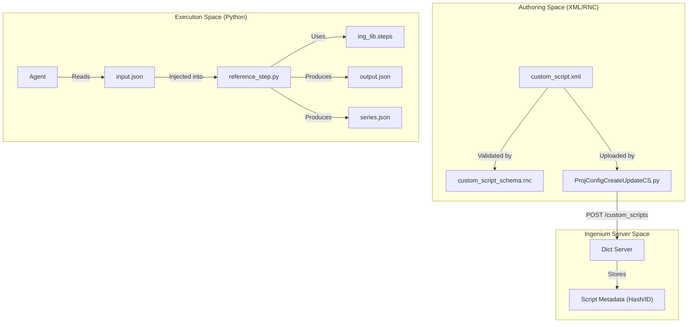
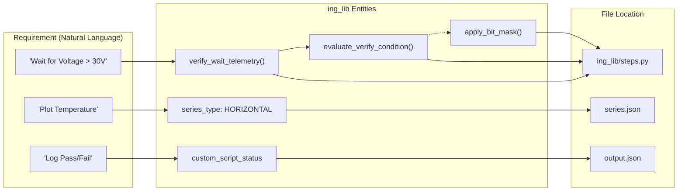

# Page: Glossary

# Glossary

Relevant source files

The following files were used as context for generating this wiki page:

- [ing_lib/apps/ProjConfigLoadAMPCSDict.py](ing_lib/apps/ProjConfigLoadAMPCSDict.py)
- [ing_lib/common.py](ing_lib/common.py)
- [ing_lib/project_config.py](ing_lib/project_config.py)
- [ing_lib/steps.py](ing_lib/steps.py)
- [ing_lib/utils/ProjConfigV3toV4Convert.py](ing_lib/utils/ProjConfigV3toV4Convert.py)
- [reference/custom_script_schema.rnc](reference/custom_script_schema.rnc)
- [steps/reference_step/custom_script.xml](steps/reference_step/custom_script.xml)
- [steps/reference_step/output.json](steps/reference_step/output.json)
- [steps/reference_step/series.json](steps/reference_step/series.json)

This page provides a comprehensive technical glossary of terms, abbreviations, and domain-specific concepts used within the `ingenium-lib` codebase. It serves as a reference for onboarding engineers to understand how high-level spacecraft testing concepts map to specific Python classes, REST endpoints, and data structures.

## Core System Concepts

### Ingenium Server
The central web platform that manages spacecraft test procedures, telemetry dictionaries, and execution logs. The library interacts with this server primarily through a set of REST APIs defined in `ing_lib/common.py`.

*   **Auth Server**: Handles JWT-based authentication and token refreshing [ing_lib/common.py:20-21]().
*   **Core Server**: Manages venues, procedures, and execution results [ing_lib/common.py:22-25]().
*   **Dict Server**: Manages project configurations, including command/telemetry dictionaries and custom scripts [ing_lib/common.py:26]().

### Project Configuration
A collection of data that defines the capabilities of a specific spacecraft mission or test environment within Ingenium. This includes:
*   **Dictionaries**: Definitions of Commands, Channels (Telemetry), EVRs, and MIL-1553 traffic [ing_lib/project_config.py:93-113]().
*   **Custom Scripts (Steps)**: Python-based automation units [ing_lib/project_config.py:187-213]().
*   **V&V Verification Items (VIs)**: Requirements and verification criteria [ing_lib/project_config.py:216-233]().

### Flight vs. SSE (Sim)
The codebase distinguishes between two primary data sources:
*   **Flight**: Data originating from the actual spacecraft flight software or hardware [ing_lib/project_config.py:29-30]().
*   **SSE (Simulation Support Equipment)**: Data originating from simulation environments or testbed support hardware [ing_lib/project_config.py:30]().

**Sources:** `ing_lib/common.py`, `ing_lib/project_config.py`

---

## Domain Terms and Implementation

| Term | Definition | Implementation Detail |
| :--- | :--- | :--- |
| **AMPCS** | Advanced Multi-Mission Operations System Project Control System. | XML dictionaries from AMPCS are parsed and uploaded via `ProjConfigLoadAMPCSDict.py` [ing_lib/apps/ProjConfigLoadAMPCSDict.py:1-10](). |
| **Channel** | A single telemetry point (also referred to as an "EHA" in legacy v3 systems). | Queried via `get_dictionary` with `dict_type='channels'` [ing_lib/project_config.py:131-134](). |
| **EVR** | Event Report. A discrete message emitted by flight software. | Handled as a dictionary type in `project_config.py` [ing_lib/project_config.py:112](). |
| **MIL-1553** | A military standard serial data bus used in spacecraft. | Managed via the `mil1553` dictionary type [ing_lib/project_config.py:126](). |
| **VI** | Verification Item. Represents a requirement to be verified during testing. | Managed via `get_vnv_vis` and `create_vnv_vi` [ing_lib/project_config.py:216-258](). |
| **SCLK / SCET** | Spacecraft Clock vs. Spacecraft Event Time. | Used in `series.json` to define the time axis for telemetry plots [steps/reference_step/series.json:3, 181](). |

**Sources:** `ing_lib/project_config.py`, `ing_lib/apps/ProjConfigLoadAMPCSDict.py`, `steps/reference_step/series.json`

---

## Custom Script Framework (Steps)

The "Step" is the fundamental unit of automation in Ingenium. It consists of a definition (XML) and an execution script (Python).

### Script Data Flow Diagram
The following diagram illustrates how a Custom Script transitions from the definition phase to execution.

Title: Custom Script Life Cycle

**Sources:** `reference/custom_script_schema.rnc`, `ing_lib/apps/ProjConfigCreateUpdateCS.py`, `steps/reference_step/reference_step.py`

### Key Step Entities

*   **`input_field`**: Defines a parameter passed to the script. Types include `FLIGHT_COMMAND`, `SIM_TELEM`, `TIME`, etc [reference/custom_script_schema.rnc:18-31]().
*   **`script_entry`**: A repeating section within a step, allowing the same logic to be applied to multiple telemetry channels in one execution [reference/custom_script_schema.rnc:158-160]().
*   **`verification_cond`**: A special input type that captures operators (e.g., `GREATER_THAN`, `EQUAL`) and values for telemetry validation [ing_lib/steps.py:147-157]().
*   **`output_summary`**: A string field in `output.json` providing a human-readable result of the script execution [steps/reference_step/output.json:107]().
*   **`series`**: Interactive time-series data used for plotting. Can be `HORIZONTAL` (continuous) or `VERTICAL` (discrete events) [steps/reference_step/series.json:7, 165]().

**Sources:** `reference/custom_script_schema.rnc`, `ing_lib/steps.py`, `steps/reference_step/output.json`, `steps/reference_step/series.json`

---

## Technical Mapping: Logic to Code

This diagram bridges the gap between natural language requirements for a test step and the specific code entities in `ing_lib`.

Title: Logic to Code Mapping

**Sources:** `ing_lib/steps.py`, `steps/reference_step/output.json`, `steps/reference_step/series.json`

---

## Authentication and State

*   **`_store`**: A private dictionary in `common.py` that acts as a singleton to store the current JWT, refresh time, and SSL configuration [ing_lib/common.py:28-30]().
*   **`IngeniumLibError`**: The standard exception raised by the library when REST calls fail or inputs are invalid [ing_lib/common.py:39-44]().
*   **JWT Lifecycle**: Tokens are refreshed automatically if they exceed `_TOKEN_REFRESH_DURATION` (3000s) [ing_lib/common.py:33, 206]().
*   **Pagination**: The `ingenium_rest_get_paginated` function handles the `x-total-count` header and offset logic to retrieve large datasets from the server [ing_lib/common.py:114-169]().

**Sources:** `ing_lib/common.py`